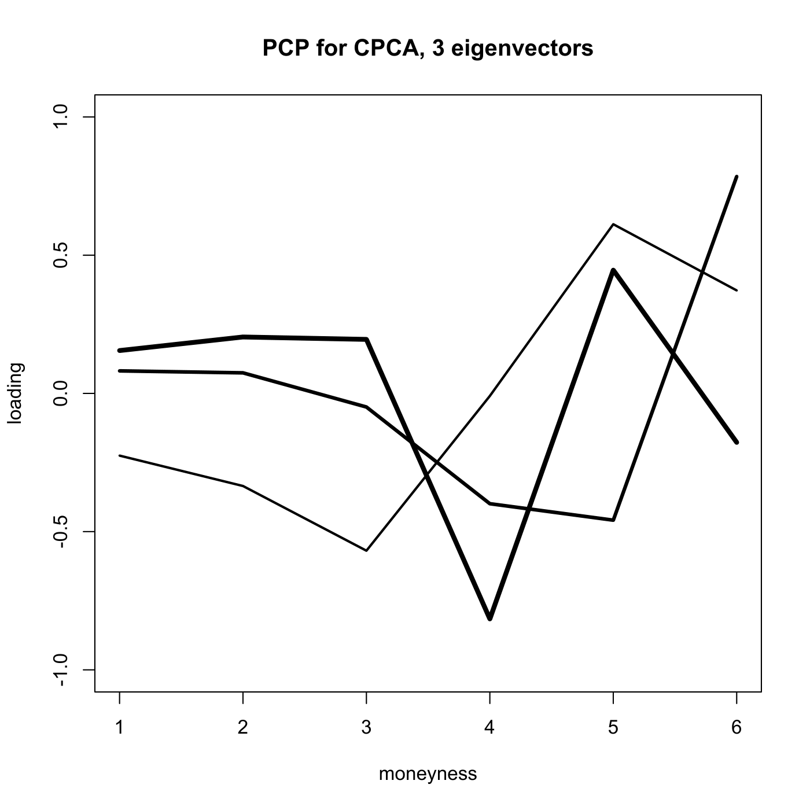
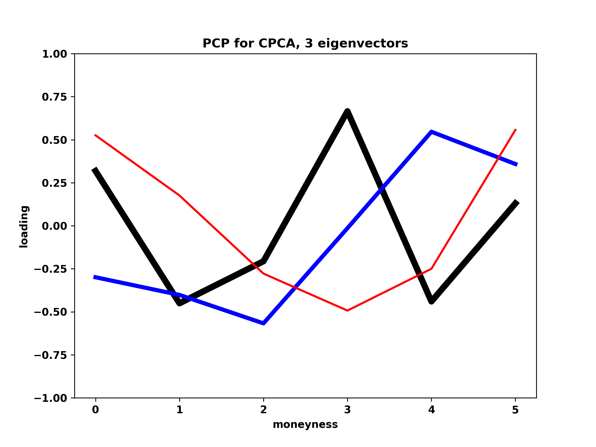

[](http://quantlet.de/)

## [](http://quantlet.de/) **MVAcpcaiv** [](http://quantlet.de/)

```yaml

Name of QuantLet: MVAcpcaiv

Published in: Applied Multivariate Statistical Analysis

Description: Estimates a common principal components model for the implied volatility data and computes a likelihood ratio test.

Keywords: principal-components, pca, eigenvalues, plot, graphical representation, data visualization, common-principal-component, cpc, volatility, implied-volatility, likelihood-ratio-test

See also: MVAnpcabanki, MVAnpcabank, MVAnpcahousi,, MVAnpcatime, MVAnpcafood, MVAnpcausco, MVAnpcausco2, MVAnpcausco2i, MVApcabank, MVAnpcahous, MVApcabanki, MVApcabankr, MVApcasimu

Author: Zografia Anastasiadou, Awdesch Melzer
Author[Python]: Matthias Fengler, Tim Dass

Submitted: Wed, June 04 2014 by Felix Jung
Submitted[Python]: Tue, April 23 2024 by Tim Dass

Datafile: XFGvolsurf01.dat, XFGvolsurf02.dat, XFGvolsurf03.dat

Example: Factor loadings of the first (thick), the second (medium) and the third (thin) PC.

```





### PYTHON Code
```python

#works on pandas 2.1.1, numpy 1.25.2, matplotlib 3.8.0 and scipy 1.11.2
import pandas as pd
import numpy as np
import numpy.linalg as la
import matplotlib.pyplot as plt
from scipy.stats import chi2

data1 = pd.read_table("XFGvolsurf01.dat", header=None)
data2 = pd.read_table("XFGvolsurf02.dat", header=None)
data3 = pd.read_table("XFGvolsurf03.dat", header=None)
data1 = data1.iloc[:,0:6]
data2 = data2.iloc[:,0:6]
data3 = data3.iloc[:,0:6]

S1 = np.cov(data1, rowvar=False) * 1e+05
S2 = np.cov(data2, rowvar=False) * 1e+05
S3 = np.cov(data3, rowvar=False) * 1e+05

S = np.vstack((S1, S2, S3))

A = S.reshape(3, 6, 6)
n = np.array([253, 253, 253])
N = n - 1

preB = 1e-10
maxit = 15
preQ = 1e-10
maxiter = 10
p = A.shape[2]
k = A.shape[0]
B = np.eye(p)
f = 0
zeroes = np.zeros(3)

while True:
    f += 1
    Bold = np.copy(B)
    j = 0
    while j < p:
        m = 0
        while m < j:
            Bmj = np.column_stack((B[:, m], B[:, j]))
            T = np.zeros((k,2,2))
            T[0, :, :] = np.dot(Bmj.T, np.dot(A[0, :, :], Bmj))
            T[1, :, :] = np.dot(Bmj.T, np.dot(A[1, :, :], Bmj))
            T[2, :, :] = np.dot(Bmj.T, np.dot(A[2, :, :], Bmj))
            Q = np.array([[1,0], [0,1]])
            g = 0
            while True:
                g += 1
                Qold = np.copy(Q)
                Delta1 = np.multiply(np.tile(Q, (3,1,1)) , np.multiply(T,  np.tile(Q, (3,1,1))))
                Delta = np.zeros((3, 2, 1))
                Delta[0, :, :] = np.diag(Delta1[0, :, :]).reshape(2, 1)
                Delta[1, :, :] = np.diag(Delta1[1, :, :]).reshape(2, 1)
                Delta[2, :, :] = np.diag(Delta1[2, :, :]).reshape(2, 1)
                a = Delta[0, :, :]
                b = Delta[1, :, :]
                c = Delta[2, :, :]
                abc = np.column_stack((a, b, c))
                abcd = abc.T
                d = N * (abcd[:, 0] - abcd[:, 1]) / (abcd[:, 0] * abcd[:, 1])
                Tsum1 = np.zeros((k, 2, 2))
                Tsum1[0, :, :] = d[0] * T[0, :, :]
                Tsum1[1, :, :] = d[1] * T[1, :, :]
                Tsum1[2, :, :] = d[2] * T[2, :, :]
                f_val = np.sum(Tsum1[:, 0, :].T[0, :])
                g_val = np.sum(Tsum1[:, 0, :].T[1, :])
                h_val = np.sum(Tsum1[:, 1, :].T[0, :])
                y_val = np.sum(Tsum1[:, 1, :].T[1, :])
                Tsum = np.array([[f_val, g_val], [h_val, y_val]])
                e = la.eig(Tsum)
                Q = e[1]
                maxim = np.max(np.abs(Q - Qold))
                if maxim < preQ or g > maxiter:
                    break
            J = np.eye(p)
            J[m, m] = Q[0, 0]
            J[m, j] = Q[0, 1]
            J[j, m] = Q[1, 0]
            J[j, j] = Q[1, 1]
            B = np.dot(B, J)
            m += 1
            print(m)
        j += 1
    maximum = np.max(np.abs(B - Bold))
    if maximum < preB or f > maxit:
        break

lambda1 = np.multiply(np.tile(B.T,(3,1,1)), np.multiply(A,  np.tile(B, (3,1,1))))
lambda_ = np.zeros((3, p, 1))
lambda_[0, :, :] = np.diag(lambda1[0, :, :]).reshape(p, 1)
lambda_[1, :, :] = np.diag(lambda1[1, :, :]).reshape(p, 1)
lambda_[2, :, :] = np.diag(lambda1[2, :, :]).reshape(p, 1)
a1b1c1 = np.column_stack((lambda_[0, :, :], lambda_[1, :, :], lambda_[2, :, :]))

u = np.vstack((a1b1c1.T, B))
us = u.T
us = us[np.argsort(us[:,0]),:]
uss = us[::-1,:]
B = uss[:, (k):(k + p)].T
BB = B[:, 0:k].T

fig, ax = plt.subplots(figsize=(8,6))
ax.plot(BB[0,:], c='black', lw=6)
ax.plot(BB[1,:], c='blue', lw=4)
ax.plot(BB[2,:], c='red', lw=2)

ax.set_xlabel('moneyness')
ax.set_ylabel('loading')
ax.set_title('PCP for CPCA, 3 eigenvectors')
ax.set_ylim([-1, 1])
plt.show()

V = np.zeros((k,p,p))
V[0,:,:] = uss[:,0] * np.eye(p)
V[1,:,:] = uss[:,1] * np.eye(p)
V[2,:,:] = uss[:,2] * np.eye(p)
psi = np.zeros((k,p,p))
psi[0,:,:] = np.dot(B, np.dot(V[0,:,:], B.T))
psi[1,:,:] = np.dot(B, np.dot(V[1,:,:], B.T))
psi[2,:,:] = np.dot(B, np.dot(V[2,:,:], B.T))

de = np.array([la.det(psi[0,:,:]), la.det(psi[1,:,:]), la.det(psi[2,:,:])])
det = np.array([la.det(A[0,:,:]), la.det(A[1,:,:]), la.det(A[2,:,:])])
test = 2 * np.log(np.dot(N, (de/det)))

df = 1/2 * (k - 1) * p * (p - 1)
t = 1 - chi2.cdf(test, df)
print('p-value:',t)

```

automatically created on 2024-04-25

### R Code
```r


# clear all variables
rm(list = ls(all = TRUE))
graphics.off()

# install and load packages
libraries = c("gRapHD")
lapply(libraries, function(x) if (!(x %in% installed.packages())) {
    install.packages(x)
})
lapply(libraries, library, quietly = TRUE, character.only = TRUE)

# load data
data1 = read.table("XFGvolsurf01.dat")  # 1 month maturity data
data2 = read.table("XFGvolsurf02.dat")  # 2 months maturity data
data3 = read.table("XFGvolsurf03.dat")  # 3 months maturity data

S1 = cov(data1) * 1e+05  # Sample covariance*10^5 of 1 month maturity data
S2 = cov(data2) * 1e+05  # Sample covariance*10^5 of 2 months maturity data
S3 = cov(data3) * 1e+05  # Sample covariance*10^5 of 3 months maturity data

S = rbind(S1, S2, S3)    # Combine data by rows
A = array(t(S), c(ncol(S1), ncol(S2), 3))  # Create a 3d array
n = c(253, 253, 253)     # Number of trading days in 1999
N = n - 1

preB    = 1e-10          # Precision for maximum deviation of an element of matrix B
maxit   = 15             # Maximal number of iteration
preQ    = 1e-10          # Precision for maximum deviation of an element of matrix Q
maxiter = 10             # Maximal number of iteration
p       = dim(A)[1]      # Covariances are pxp
k       = dim(A)[3]      # Number of groups
B       = diag(p)        # Initial value for B, the unit matrix
f = 0

repeat {
    f = f + 1
    Bold = B
    j = 1
    while (j <= p) {
        m = 1
        while (m < j) {
            Bmj = cbind(B[, m], B[, j])
            (T = array(0, c(2, 2, k)))
            T[, , 1] = t(Bmj) %*% A[, , 1] %*% Bmj
            T[, , 2] = t(Bmj) %*% A[, , 2] %*% Bmj
            T[, , 3] = t(Bmj) %*% A[, , 3] %*% Bmj
            Q = cbind(c(1, 0), c(0, 1))  # orthogonal matrix to start with
            g = 0
            repeat {
                g = g + 1
                Qold = Q
                Delta1 = array(Q, c(2, 2, k)) * T * (array(Q, c(2, 2, k)))
                diag(Delta1[, , 1])
                Delta = array(c(diag(Delta1[, , 1])), c(2, 1, 3))
                Delta[, , 1] = c(diag(Delta1[, , 1]))
                Delta[, , 2] = c(diag(Delta1[, , 2]))
                Delta[, , 3] = c(diag(Delta1[, , 3]))
                a = t(Delta[, , 1])
                b = t(Delta[, , 2])
                c = t(Delta[, , 3])
                abc = matrix(cbind(a, b, c), 2, 3)
                abcd = t(abc)
                d = N * (abcd[, 1] - abcd[, 2])/(abcd[, 1] * abcd[, 2])
                Tsum1 = array(0, c(2, 2, k))
                Tsum1[, , 1] = d[1] * T[, , 1]
                Tsum1[, , 2] = d[2] * T[, , 2]
                Tsum1[, , 3] = d[3] * T[, , 3]
                f = sum(Tsum1[, 1, ][1, ])
                g = sum(Tsum1[, 1, ][2, ])
                h = sum(Tsum1[, 2, ][1, ])
                y = sum(Tsum1[, 2, ][2, ])
                Tsum = matrix(rbind(f, g, h, y), 2, 2)
                e = eigen(Tsum)
                Q = e$vectors  # find eigenvectors of Tsum
                maxim = max(abs(Q - Qold))
                if ((maxim < preQ) | (g > maxiter)) 
                  break
            }
            J = diag(p)
            J[m, m] = Q[1, 1]
            J[m, j] = Q[1, 2]
            J[j, m] = Q[2, 1]
            J[j, j] = Q[2, 2]
            B = B %*% J
            m = m + 1
            print(m)
        }
        j = j + 1
    }
    maximum = max(abs(B - Bold))
    if ((maximum < preB) | (f > maxit)) 
        break
}

lambda1 = array(t(B), c(p, p, k)) * A * (array(B, c(p, p, k)))
lambda  = array(c(diag(lambda1[, , 1])), c(p, 1, 3))
lambda[, , 1] = c(diag(lambda1[, , 1]))
lambda[, , 2] = c(diag(lambda1[, , 2]))
lambda[, , 3] = c(diag(lambda1[, , 3]))
a1b1c1 = matrix(cbind(t(lambda[, , 1]), t(lambda[, , 2]), t(lambda[, , 3])), p, k)

# Sort eigenvectors according to size of its corresponding eigenvalues
u   = rbind(t(a1b1c1), B)
us  = t(u)
us  = us[order(us[, 1]), ]
uss = us[p:1, ]
B   = t(uss[, (k + 1):(k + p)])
BB  = t(B[, 1:k])

# plot
plot(BB[1, ], type = "l", lwd = 4, ylim = c(-1, 1), xlab = "moneyness", ylab = "loading", 
    main = "PCP for CPCA, 3 eigenvectors")
lines(BB[2, ], type = "l", lwd = 3)
lines(BB[3, ], type = "l", lwd = 2)

# estimated population covariances
V          = array(0, c(p, p, k))
V[, , 1]   = uss[, 1] * diag(p)
V[, , 2]   = uss[, 2] * diag(p)
V[, , 3]   = uss[, 3] * diag(p)
psi = array(0, c(p, p, k))
psi[, , 1] = B %*% V[, , 1] %*% t(B)
psi[, , 2] = B %*% V[, , 2] %*% t(B)
psi[, , 3] = B %*% V[, , 3] %*% t(B)

# Test statistic
de   = c(det(psi[, , 1]), det(psi[, , 2]), det(psi[, , 3]))
det  = c(det(A[, , 1]), det(A[, , 2]), det(A[, , 3]))
test = 2 * log(t(n - 1) %*% (de/det))

# P-value
df = 1/2 * (k - 1) * p * (p - 1)
t  = 1 - pchisq(test, df) 

```

automatically created on 2024-04-25