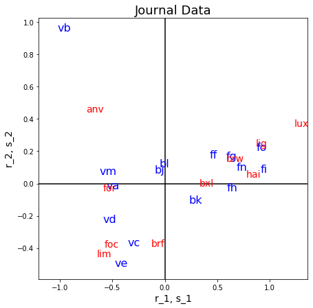

[](http://quantlet.de/)

## [](http://quantlet.de/) **MVAcorrjourn** [](http://quantlet.de/)

```yaml

Name of QuantLet: MVAcorrjourn

Published in: Applied Multivariate Statistical Analysis

Description: Performs a correspondence analysis for the Belgian journal data, shows the eigenvalues of the singular value decomposition of the chi-matrix and displays graphically its factorial decomposition.

Keywords: correspondence-analysis, svd, decomposition, factorial-decomposition, eigenvalues, factorial, plot, graphical representation, data visualization, sas

See also: MVAcorrCar, MVAcorrEyeHair, MVAcorrbac, MVAcorrcrime, SMScorrcrime, SMScorrcarm, SMScorrfood, SMScorrhealth

Author: Zografia Anastasiadou
Author[SAS]: Svetlana Bykovskaya
Author[Python]: Matthias Fengler, Liudmila Gorkun-Voevoda

Submitted: Tue, May 10 2011 by Zografia Anastasiadou
Submitted[SAS]: Tue, April 5 2016 by Svetlana Bykovskaya
Submitted[Python]: Wed, January 6 2021 by Liudmila Gorkun-Voevoda

Datafile: journaux.dat

```




### PYTHON Code
```python

import pandas as pd
import numpy as np
import matplotlib.pyplot as plt


x = pd.read_csv("journaux.dat", sep = "\s+", header=None)
a = x.sum(axis = 1)
b = x.sum(axis = 0)
e = np.reshape(np.array(a), (len(a), -1)) @ (np.reshape(np.array(b), (-1, len(b)))/sum(a))
# chi-matrix
cc = (x - e)/np.sqrt(e)

g, l, d = np.linalg.svd(cc, full_matrices = False)
ll = l**2 #eigenvalues
aux = np.cumsum(ll)/sum(ll)
perc = np.vstack((ll, aux))
r1 = np.multiply(np.tile(l, (g.shape[0], 1)), g)
r = r1/np.tile(np.reshape(np.array(np.sqrt(a)), (len(a), -1)), (1, g.shape[1]))
s1 = np.multiply(np.tile(l, (d.shape[0], 1)), d.T)
s = s1/np.tile(np.reshape(np.array(np.sqrt(b)), (len(b), -1)), (1, d.shape[1]))


# contribution in r
car = np.tile(np.reshape(np.array(a), (len(a), -1)), (1, r.shape[1])) \
    * r**2/np.tile(np.reshape(np.array(ll), (len(ll), -1)), (1, r.shape[0])).T

# contribution in s
cas = np.tile(np.reshape(np.array(b), (len(b), -1)), (1, s.shape[1])) \
    * s**2/np.tile(np.reshape(np.array(ll), (len(ll), -1)), (1, s.shape[0])).T
    
types    = ["va", "vb", "vc", "vd", "ve", "ff", "fg", "fh", "fi", "bj", "bk", 
            "bl", "vm", "fn", "fo"]
regions  = ["brw", "bxl", "anv", "brf", "foc", "for", "hai", "lig", "lim", "lux"]


fig, ax = plt.subplots(figsize = (7, 7))
ax.scatter(r[:, 0], r[:, 1], c = "w")
ax.scatter(s[:, 0], s[:, 1], c = "w")
for i in range(0, len(types)):
    ax.text(r[i, 0], r[i, 1], types[i], c = "b", fontsize = 16)
for i in range(0, len(regions)):
    ax.text(s[i, 0], s[i, 1], regions[i], c = "r", fontsize = 14)

ax.set_xlim(-1.2, )
ax.axvline(0, c = "k")
ax.axhline(0, c = "k")
ax.set_xlabel("r_1, s_1", fontsize = 14)
ax.set_ylabel("r_2, s_2", fontsize = 14)
plt.title("Journal Data", fontsize = 18)

plt.show()


```

automatically created on 2021-01-08

### R Code
```r


# clear all variables
rm(list = ls(all = TRUE))
graphics.off()

# load data
x  = read.table("journaux.dat")
a  = rowSums(x)
b  = colSums(x)
e  = matrix(a) %*% b/sum(a)

# chi-matrix
cc = (x - e)/sqrt(e)

# singular value decomposition
sv = svd(cc)
g  = sv$u
l  = sv$d
d  = sv$v

# eigenvalues
ll = l * l

# cumulated percentage of the variance
aux  = cumsum(ll)/sum(ll)
perc = cbind(ll, aux)
r1   = matrix(l, nrow = nrow(g), ncol = ncol(g), byrow = T) * g
r    = r1/matrix(sqrt(a), nrow = nrow(g), ncol = ncol(g), byrow = F) 
s1   = matrix(l, nrow = nrow(d), ncol = ncol(d), byrow = T) * d
s    = s1/matrix(sqrt(b), nrow = nrow(d), ncol = ncol(d), byrow = F) 

car  = matrix(matrix(a), nrow = nrow(r), ncol = ncol(r), byrow = F) * r^2/matrix(l^2, 
    nrow = nrow(r), ncol = ncol(r), byrow = T)                   # contribution in r

cas  = matrix(matrix(b), nrow = nrow(s), ncol = ncol(s), byrow = F) * s^2/matrix(l^2, 
    nrow = nrow(s), ncol = ncol(s), byrow = T)                   # contribution in s

rr   = r[, 1:2]
ss   = s[, 1:2]

# labels for journals
types    = c("va", "vb", "vc", "vd", "ve", "ff", "fg", "fh", "fi", "bj", "bk", "bl", 
    "vm", "fn", "fo")

# labels for regions
regions  = c("brw", "bxl", "anv", "brf", "foc", "for", "hai", "lig", "lim", "lux")

# plot
plot(rr, type = "n", xlim = c(-1.1, 1.5), ylim = c(-1.1, 0.6), xlab = "r_1,s_1", 
    ylab = "r_2,s_2", main = "Journal Data", cex.axis = 1.2, cex.lab = 1.2, cex.main = 1.6)
points(ss, type = "n")
text(rr, types, cex = 1.5, col = "blue")
text(ss, regions, col = "red")
abline(h = 0, v = 0, lwd = 2)

```

automatically created on 2021-01-08

### SAS Code
```sas


* Import the data;
data journaux;
  infile '/folders/myfolders/data/journaux.dat';
  input temp1-temp10;
run;

proc iml;
  * Read data into a matrix;
  use journaux;
    read all var _ALL_ into x; 
  close journaux;
  
  a = x[,+];
  b = x[+,];
  e = a * b / sum(a);
  
  * chi-matrix;
  cc = (x - e)/sqrt(e);
  
  * singular value decomposition;
  call svd(u,q,v,cc);
  
  * eigenvalues;
  qq = q # q;
  
  * cumulated percentage of the variance;
  aux  = cusum(qq)/sum(qq);
  perc = qq || aux;
  r1   = repeat(q`, nrow(u), 1) # u;
  r    = r1 / repeat(sqrt(a), 1, ncol(u));
  s1   = repeat(q`, nrow(v), 1) # v;
  s    = s1 / repeat(sqrt(b)`, 1, ncol(v));
  
  * contribution in r;
  car = repeat(a, 1, ncol(r)) # (r ## 2) / repeat((q ## 2)`, nrow(r), 1);
  
  * contribution in s;
  cas = repeat(b`, 1, ncol(s)) # (s ## 2) / repeat((q ## 2)`, nrow(s), 1);
  
  rr = r[, 1:2];
  ss = s[, 1:2];
  
  types = {"va", "vb", "vc", "vd", "ve", "ff", "fg", "fh", 
    "fi", "bj", "bk", "bl", "vm", "fn", "fo"};   * labels for journals;
  regions = {"brw", "bxl", "anv", "brf", "foc", "for", 
    "hai", "lig", "lim", "lux"};                 * labels for regions;
  
  x1  = rr[,1];
  x2  = -rr[,2]; 
  x3  = ss[,1];
  x4  = -ss[,2]; 
      
  create plot var {"x1" "x2" "x3" "x4" "types" "regions"};
    append;
  close plot;
quit;

proc sgplot data = plot
    noautolegend;
  title 'Journal Data';
  scatter x = x1 y = x2 / markerattrs = (color = blue symbol = circlefilled)
    datalabel = types;
  scatter x = x3 y = x4 / markerattrs = (color = red symbol = circlefilled)
    datalabel = regions;
  refline 0 / lineattrs = (color = black);
  refline 0 / axis = x lineattrs = (color = black);
  xaxis label = 'r_1,s_1';
  yaxis label = 'r_2,s_2';
run;
```

automatically created on 2021-01-08