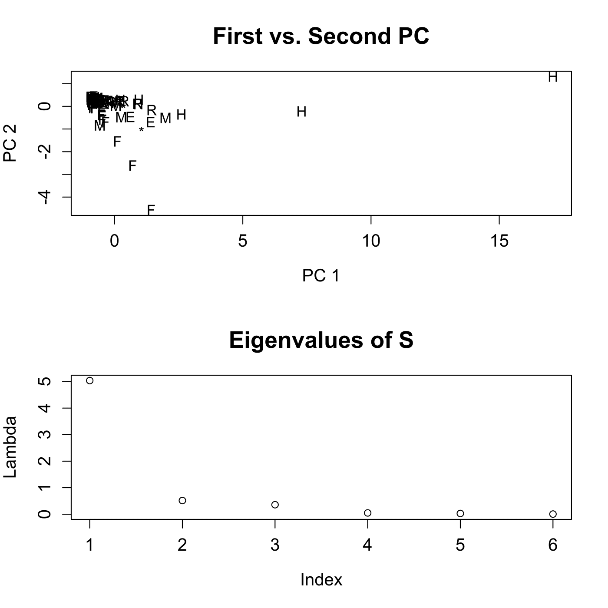
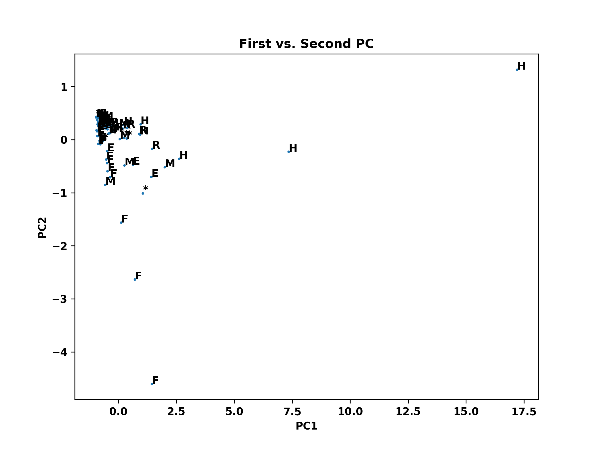
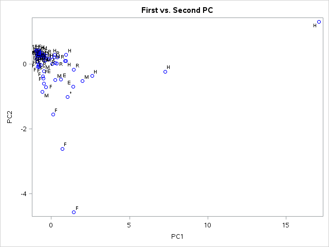
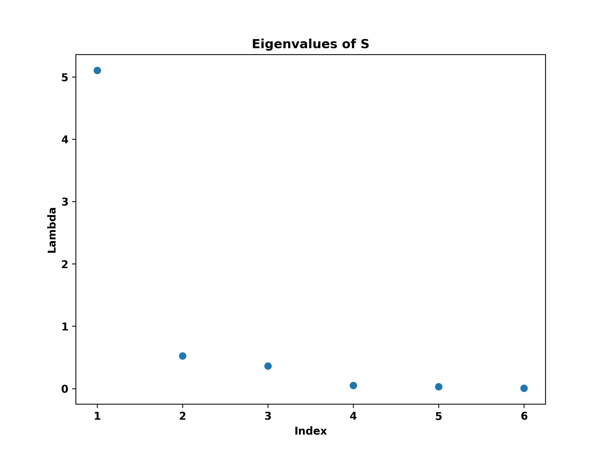
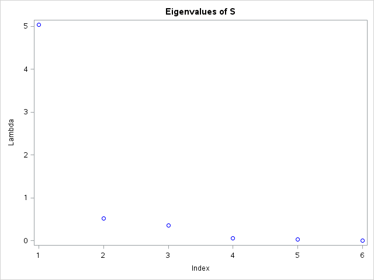

[](http://quantlet.de/)

## [](http://quantlet.de/) **MVAnpcausco** [](http://quantlet.de/)

```yaml

Name of QuantLet : MVAnpcausco

Published in: Applied Multivariate Statistical Analysis

Description: Performs a PCA for the standardized US company data, shows the first two principal components and screeplot of the eigenvalues.

Keywords: principal-components, pca, npca, eigenvalues, standardization, spectral-decomposition, screeplot, plot, graphical representation, data visualization, sas

See also: MVAnpcabanki, MVAnpcabank, MVAnpcahousi, MVAnpcatime, MVAnpcafood, MVAnpcahous, MVAnpcausco2, MVAnpcausco2i, MVAcpcaiv, MVApcabank, MVApcabanki, MVApcabankr, MVApcasimu

Author: Zografia Anastasiadou, Awdesch Melzer
Author[SAS]: Svetlana Bykovskaya
Author[Python]: Matthias Fengler, Tim Dass

Submitted: Wed, April 02 2014 by Awdesch Melzer
Submitted[SAS]: Wen, April 6 2016 by Svetlana Bykovskaya
Submitted[Python]: Tue, April 23 2024 by Tim Dass

Datafile: uscomp2.dat

```











### PYTHON Code
```python

#works on numpy 1.25.2, pandas 2.1.1 and matplotlib 3.8.0
import pandas as pd
import numpy as np
import matplotlib.pyplot as plt


x = pd.read_table("uscomp2.dat", sep="\s+", header = None)
x.columns = ["Company", "A", "S", "MV", "P", "CF", "E", "Sector"]
sector = x['Sector'].astype(str)
sector.iloc[0:2] = "H"
sector.iloc[2:17] = "E"
sector.iloc[17:34] = "F"
sector.iloc[34:42] = "H"
sector.iloc[42:52] = "M"
sector.iloc[52:63] = "*"
sector.iloc[63:73] = "R"
sector.iloc[73:79] = "*"

x = x.iloc[:,1:7]
n1, n2 = x.shape
x = (x-x.mean())/(np.sqrt((n1-1) * np.var(x, axis=0)/n1))

cov_matrix = np.cov(x, rowvar=False)
e, v = np.linalg.eig((n1-1) * cov_matrix/n1)
xv = np.dot(x, v)
xv[:,0] = xv[:,0] * (-1)

fig, ax = plt.subplots(figsize=(8,6))
ax.scatter(xv[:, 0], xv[:, 1], s = 2)
[ax.annotate(sector[i], (xv[i, 0], xv[i, 1])) for i in range(n1)]
ax.set_title('First vs. Second PC')
ax.set_xlabel('PC1')
ax.set_ylabel('PC2')
plt.show()

fig, ax = plt.subplots(figsize=(8, 6))
ax.scatter(np.arange(1,7,1), e)
ax.set_title('Eigenvalues of S')
ax.set_xlabel('Index')
ax.set_ylabel('Lambda')
plt.show()

```

automatically created on 2024-04-25

### R Code
```r


# clear all variables
rm(list = ls(all = TRUE))
graphics.off()

# load data
x = read.table("uscomp2.dat")
colnames(x) = c("Company", "A", "S", "MV", "P", "CF", "E", "Sector")
attach(x)
Sector = as.character(Sector)
Sector[1:2]   = "H"
Sector[3:17]  = "E"
Sector[18:34] = "F"
Sector[35:42] = "H"
Sector[43:52] = "M"
Sector[53:63] = "*"
Sector[64:73] = "R"
Sector[74:79] = "*"

x = as.matrix(x[, 2:7])
n = nrow(x)  # number of rows
x = (x - matrix(apply(x, 2, mean), n, 6, byrow = T))/matrix(sqrt((n - 1) * apply(x, 
    2, var)/n), n, 6, byrow = T)  # standardizes the data
eig = eigen((n - 1) * cov(x)/n)   # spectral decomposition
e   = eig$values
v   = eig$vectors
x   = as.matrix(x) %*% v          # principal components

# plot
par(mfrow = c(2, 1))
plot(cbind(-x[, 1], -x[, 2]), type = "n", xlab = "PC 1", ylab = "PC 2", main = "First vs. Second PC", 
    cex.lab = 1.2, cex.axis = 1.2, cex.main = 1.6)
text(cbind(-x[, 1], -x[, 2]), Sector)
plot(e, xlab = "Index", ylab = "Lambda", main = "Eigenvalues of S", cex.lab = 1.2, 
    cex.axis = 1.2, cex.main = 1.6) 

```

automatically created on 2024-04-25

### SAS Code
```sas


* Import the data;
data uscomp2;
  infile '/folders/myfolders/data/uscomp2.dat';
  input Company $ A $ S $ MV $ P $ CF $ E $ Sector $;
run;

proc iml;
  * Read data into a matrix;
  use uscomp2;
    read all var _ALL_ into x[colname = varNames]; 
  close uscomp2;
  
  x[1:2,   "Sector"] = "H";
  x[3:17,  "Sector"] = "E";
  x[18:34, "Sector"] = "F";
  x[35:42, "Sector"] = "H";
  x[43:52, "Sector"] = "M";
  x[53:63, "Sector"] = "*";
  x[64:73, "Sector"] = "R";
  x[74:79, "Sector"] = "*";
  
  y  = num(x[, 2:7]);
  n  = nrow(y); 
  y  = (y - repeat(y(|:,|), n, 1)) / sqrt((n - 1) * var(y) / n); * standardizes the data;
  e  = (n - 1) * cov(y) / n; * spectral decomposition;
  e1 = 1:6;
  e2 = eigval(e);
  v  = eigvec(e); 
  y  = y * v;                * principal components;
  
  x1 = y[,1];
  x2 = y[,2];
  sector = x[,"Sector"];
  create plot var {"x1" "x2" "sector" "e1" "e2"};
    append;
  close plot;
quit;

proc sgplot data = plot
    noautolegend;
  title 'First vs. Second PC';
  scatter x = x1 y = x2 / datalabel = sector 
    markerattrs = (color = blue);
  xaxis label = 'PC1';
  yaxis label = 'PC2';
run;

proc sgplot data = plot
    noautolegend;
  title 'Eigenvalues of S';
  scatter x = e1 y = e2 / markerattrs = (color = blue);
  xaxis label = 'Index';
  yaxis label = 'Lambda';
run;


```

automatically created on 2024-04-25