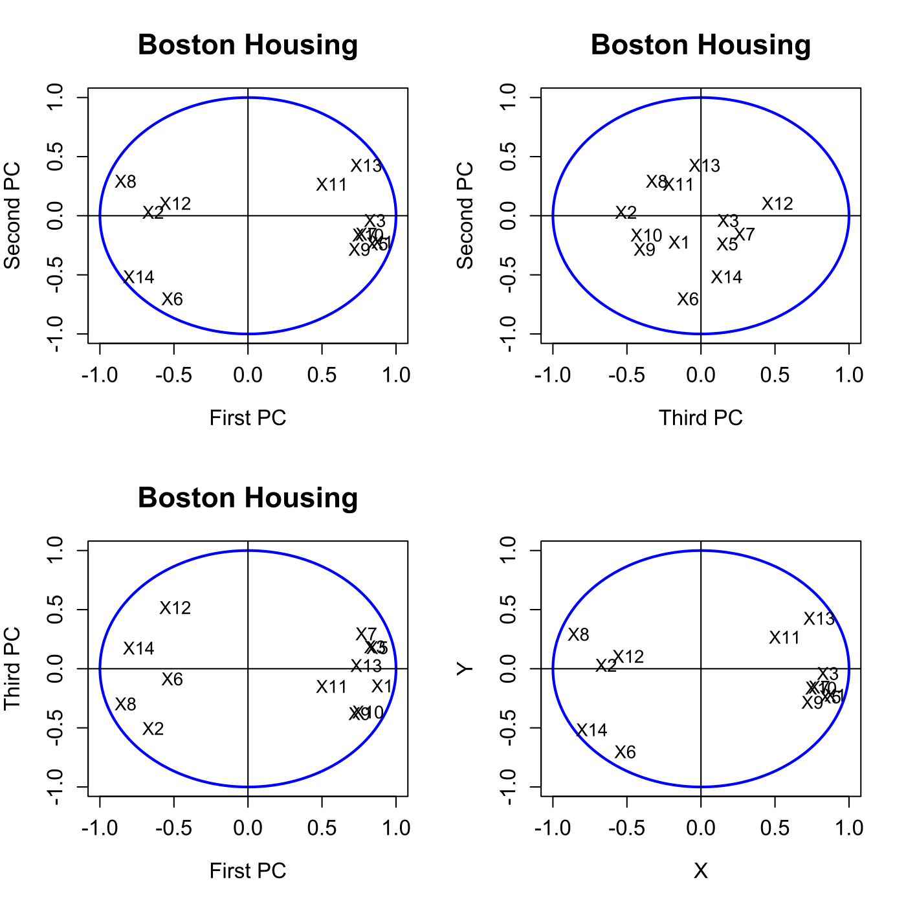
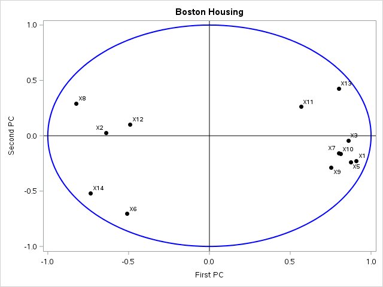
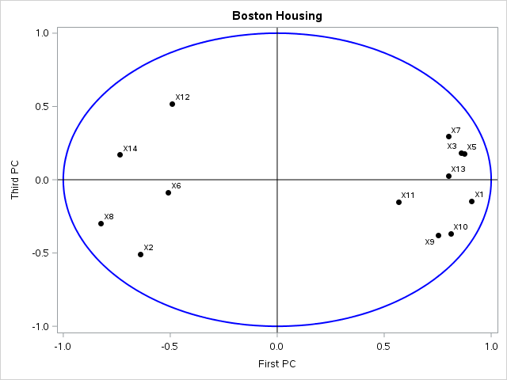
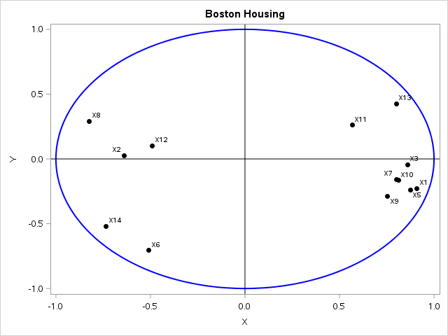
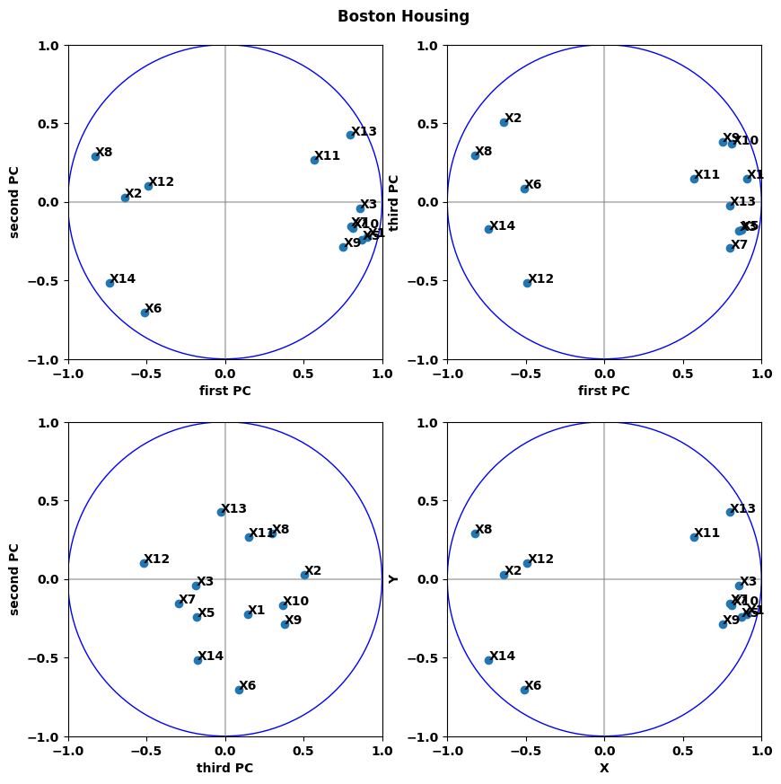

[](http://quantlet.de/)

## [](http://quantlet.de/) **MVAnpcahousi** [](http://quantlet.de/)

```yaml

Name of QuantLet: MVAnpcahousi

Published in: Applied Multivariate Statistical Analysis

Description: Calculates and plots the correlations of the first three PCs with the original variables for the standardized Boston housing data.

Keywords: principal-components, pca, npca, eigenvalues, standardization, spectral-decomposition, correlation, plot, graphical representation, data visualization, sas

See also: MVAnpcabanki, MVAnpcabank, MVAnpcahous, MVAnpcatime, MVAnpcafood, MVAnpcausco, MVAnpcausco2, MVAnpcausco2i, MVAcpcaiv, MVApcabank, MVApcabanki, MVApcabankr, MVApcasimu

Author: Zografia Anastasiadou
Author[SAS]: Svetlana Bykovskaya
Author[Python]: Matthias Fengler, Tim Dass

Submitted: Tue, March 11 2014 by Awdesch Melzer
Submitted[SAS]: Wen, April 6 2016 by Svetlana Bykovskaya
Submitted[Python]: Tue, April 23 2024 by Tim Dass

Datafile: bostonh.dat

```












### PYTHON Code
```python

#works on numpy 1.25.2, pandas 2.1.1 and matplotlib 3.8.0
import numpy as np
import pandas as pd
import matplotlib.pyplot as plt
from matplotlib.patches import Circle

df = pd.read_csv('bostonh.dat', sep='\s+', header=None, names=np.arange(1,15,1))

df2 = pd.DataFrame()
df2[[1,3,5,6,8,9,10,14]] = np.log(df[[1,3,5,6,8,9,10,14]])
df2[4] = df[4]
df2.loc[:,2] = df.loc[:,2]/10
df2.loc[:,7] = (pow(df.loc[:,7],2.5))/10000
df2.loc[:,11] = (np.exp(0.4*df.loc[:,11]))/1000
df2.loc[:,12] = df.loc[:,12]/100
df2.loc[:,13] = pow(df.loc[:,13],0.5)
df2 = df2[np.arange(1,15,1)]
df2.drop(columns=[4], inplace=True)

n1, n2 = df2.shape

x = (df2-df2.stack().mean())/(np.sqrt((n1-1) * np.var(df2, axis=0)/n1))

cov_matrix = np.cov(x, rowvar=False)
e, v = np.linalg.eig((n1-1) * cov_matrix/n1)
x1 = x - x.stack().mean()
r1 = np.dot(x1, v)
r = np.corrcoef(r1, x, rowvar=False)
r = r[n2:, :n2]
r12 = r[:,[0,1]]
r13 = r[:,[0,2]]
r32 = r[:,[2,1]]
r123 = r[:,[0,1,2]]

fig, ax = plt.subplots(2,2,figsize=(10,10))

names = [f'X{i}' for i in range(1, 15) if i != 4]

ax = ax.ravel()
for i in range(4):
    ax[i].plot([0,0],[-1,1], color='grey', alpha=0.5)
    ax[i].plot([-1,1],[0,0], color='grey', alpha=0.5)
    ax[i].set_ylim(-1,1)
    ax[i].set_xlim(-1,1)
    circle = Circle((0,0), 1, color='b', fill=False)
    ax[i].add_patch(circle)
    ax[i].set_xticks([-1,-0.5,0,0.5,1])
    ax[i].set_yticks([-1,-0.5,0,0.5,1]) 
    ax[i].set_aspect('equal')

ax[0].scatter(r12[:,0], r12[:,1])
for i, name in enumerate(names):
    ax[0].annotate(name, (r12[i,0], r12[i,1]))
ax[0].set_xlabel('first PC')
ax[0].set_ylabel('second PC')

ax[1].scatter(r13[:,0], r13[:,1])
for i, name in enumerate(names):
    ax[1].annotate(name, (r13[i,0], r13[i,1]))
ax[1].set_xlabel('first PC')
ax[1].set_ylabel('third PC')

ax[2].scatter(r32[:,0], r32[:,1])
for i, name in enumerate(names):
    ax[2].annotate(name, (r32[i,0], r32[i,1]))
ax[2].set_xlabel('third PC')
ax[2].set_ylabel('second PC')

ax[3].scatter(r123[:,0], r123[:,1])
for i, name in enumerate(names):
    ax[3].annotate(name, (r123[i,0], r123[i,1]))
ax[3].set_xlabel('X')
ax[3].set_ylabel('Y')

fig.suptitle('Boston Housing', y = 0.92)
plt.show()
```

automatically created on 2024-04-25

### R Code
```r


# clear all variables
rm(list = ls(all = TRUE))
graphics.off()

# load data
data = read.table("bostonh.dat")

# transform data
xt       = data
xt[, 1]  = log(data[, 1])
xt[, 2]  = data[, 2]/10
xt[, 3]  = log(data[, 3])
xt[, 5]  = log(data[, 5])
xt[, 6]  = log(data[, 6])
xt[, 7]  = (data[, 7]^(2.5))/10000
xt[, 8]  = log(data[, 8])
xt[, 9]  = log(data[, 9])
xt[, 10] = log(data[, 10])
xt[, 11] = exp(0.4 * data[, 11])/1000
xt[, 12] = data[, 12]/100
xt[, 13] = sqrt(data[, 13])
xt[, 14] = log(as.numeric(data[, 14]))
data     = xt[, -4]

n1  = nrow(data)
n2  = ncol(data)
x   = (data - matrix(mean(as.matrix(data)), n1, n2, byrow = T))/matrix(sqrt((n1 - 1) * 
    apply(data, 2, var)/n1), n1, n2, byrow = T)  # standardizes the data
eig = eigen((n1 - 1) * cov(x)/n1)  # spectral decomposition
e   = eig$values
v   = eig$vectors
x1  = as.matrix(x - matrix(mean(as.matrix(x)), nrow(x), ncol(x), byrow = T))
r1  = x1 %*% v
r   = cor(cbind(r1, x))

# correlations between variables and pc's
r12  = r[14:26, 1:2]
r13  = cbind(r[14:26, 1], r[14:26, 3])
r32  = cbind(r[14:26, 3], r[14:26, 2])
r123 = r[14:26, 1:3]

# plot
par(mfrow = c(2, 2))
ucircle = cbind(cos((0:360)/180 * pi), sin((0:360)/180 * pi))
plot(ucircle, type = "l", lty = "solid", col = "blue", xlab = "First PC", ylab = "Second PC", 
    main = "Boston Housing", cex.lab = 1.2, cex.axis = 1.2, cex.main = 1.6, lwd = 2)
abline(h = 0, v = 0)
label = c("X1", "X2", "X3", "X5", "X6", "X7", "X8", "X9", "X10", "X11", "X12", "X13", 
    "X14")
text(r12, label)

ucircle = cbind(cos((0:360)/180 * pi), sin((0:360)/180 * pi))
plot(ucircle, type = "l", lty = "solid", col = "blue", xlab = "Third PC", ylab = "Second PC", 
    main = "Boston Housing", cex.lab = 1.2, cex.axis = 1.2, cex.main = 1.6, lwd = 2)
abline(h = 0, v = 0)
label = c("X1", "X2", "X3", "X5", "X6", "X7", "X8", "X9", "X10", "X11", "X12", "X13", 
    "X14")
text(r32, label)

ucircle = cbind(cos((0:360)/180 * pi), sin((0:360)/180 * pi))
plot(ucircle, type = "l", lty = "solid", col = "blue", xlab = "First PC", ylab = "Third PC", 
    main = "Boston Housing", cex.lab = 1.2, cex.axis = 1.2, cex.main = 1.6, lwd = 2)
abline(h = 0, v = 0)
label = c("X1", "X2", "X3", "X5", "X6", "X7", "X8", "X9", "X10", "X11", "X12", "X13", 
    "X14")
text(r13, label)

ucircle = cbind(cos((0:360)/180 * pi), sin((0:360)/180 * pi))
plot(ucircle, type = "l", lty = "solid", col = "blue", xlab = "X", ylab = "Y", cex.lab = 1.2, 
    cex.axis = 1.2, lwd = 2)
abline(h = 0, v = 0)
label = c("X1", "X2", "X3", "X5", "X6", "X7", "X8", "X9", "X10", "X11", "X12", "X13", 
    "X14")
text(r123, label) 

```

automatically created on 2024-04-25

### SAS Code
```sas

* Import the data;
data bostonh;
  infile '/folders/myfolders/data/bostonh.dat';
  input temp1-temp14;
run;

proc iml;
  * Read data into a matrix;
  use bostonh;
    read all var _ALL_ into datax; 
  close bostonh;
  
  xt = datax;
  xt[, 1]  = log(datax[, 1]);
  xt[, 2]  = datax[, 2]/10;
  xt[, 3]  = log(datax[, 3]);
  xt[, 5]  = log(datax[, 5]);
  xt[, 6]  = log(datax[, 6]);
  xt[, 7]  = (datax[, 7] ## (2.5))/10000;
  xt[, 8]  = log(datax[, 8]);
  xt[, 9]  = log(datax[, 9]);
  xt[, 10] = log(datax[, 10]);
  xt[, 11] = exp(0.4 * datax[, 11])/1000;
  xt[, 12] = datax[, 12]/100;
  xt[, 13] = sqrt(datax[, 13]);
  xt[, 14] = log(datax[, 14]);
  datax = xt[,1:3] || xt[,5:14];
  
  n1  = nrow(datax);
  n2  = ncol(datax);
  x   = (datax - repeat(datax[:], n1, n2)) / sqrt((n1 - 1) * var(datax) / n1); * standardizes the data;
  eig = (n1 - 1) * cov(x)/n1; * spectral decomposition;
  e   = eigval(eig);
  v   = eigvec(eig);
  x1  = x - repeat(x[:], nrow(x), ncol(x));
  r1  = x1 * v;
  r   = corr(r1 || x);
  
  * correlations between variables and pc's;
  r12  = r[14:26, 1:2];
  r13  = r[14:26, 1] || r[14:26, 3];
  r32  = r[14:26, 3] || r[14:26, 2];
  r123 = r[14:26, 1:2];
  
  pi = constant("pi");
  uc = (cos((0:360)/180 * pi) // sin((0:360)/180 * pi))`;
  u1 = uc[,1];
  u2 = uc[,2];
  names = {"X1", "X2", "X3", "X5", "X6", "X7", 
    "X8", "X9", "X10", "X11", "X12", "X13", "X14"};
  
  x11  = -r12[,1];
  x12  = r12[,2]; 
  x21  = -r32[,1];
  x22  = r32[,2];
  x31  = -r13[,1];
  x32  = -r13[,2];
  x41  = -r123[,1];
  x42  = r123[,2]; 
   
  create plot var {"x11" "x12" "x21" "x22" "x31" "x32" "x41" "x42" "u1" "u2" "names"};
    append;
  close plot;
quit;
  
proc sgplot data = plot
    noautolegend;
  title 'Boston Housing';
  series  x = u1 y = u2 / lineattrs = (color = blue THICKNESS = 2);
  scatter x = x11 y = x12 / markerattrs = (color = black symbol = circlefilled)
    datalabel = names;
  refline 0 / lineattrs = (color = black);
  refline 0 / axis = x lineattrs = (color = black);
  xaxis label = 'First PC';
  yaxis label = 'Second PC';
run;

proc sgplot data = plot
    noautolegend;
  title 'Boston Housing';
  series  x = u1 y = u2 / lineattrs = (color = blue THICKNESS = 2);
  scatter x = x21 y = x22 / markerattrs = (color = black symbol = circlefilled)
    datalabel = names;
  refline 0 / lineattrs = (color = black);
  refline 0 / axis = x lineattrs = (color = black);
  xaxis label = 'Third PC';
  yaxis label = 'Second PC';
run;
  
proc sgplot data = plot
    noautolegend;
  title 'Boston Housing';
  series  x = u1 y = u2 / lineattrs = (color = blue THICKNESS = 2);
  scatter x = x31 y = x32 / markerattrs = (color = black symbol = circlefilled)
    datalabel = names;
  refline 0 / lineattrs = (color = black);
  refline 0 / axis = x lineattrs = (color = black);
  xaxis label = 'First PC';
  yaxis label = 'Third PC';
run;

proc sgplot data = plot
    noautolegend;
  title 'Boston Housing';
  series  x = u1 y = u2 / lineattrs = (color = blue THICKNESS = 2);
  scatter x = x41 y = x42 / markerattrs = (color = black symbol = circlefilled)
    datalabel = names;
  refline 0 / lineattrs = (color = black);
  refline 0 / axis = x lineattrs = (color = black);
  xaxis label = 'X';
  yaxis label = 'Y';
run;
  
```

automatically created on 2024-04-25