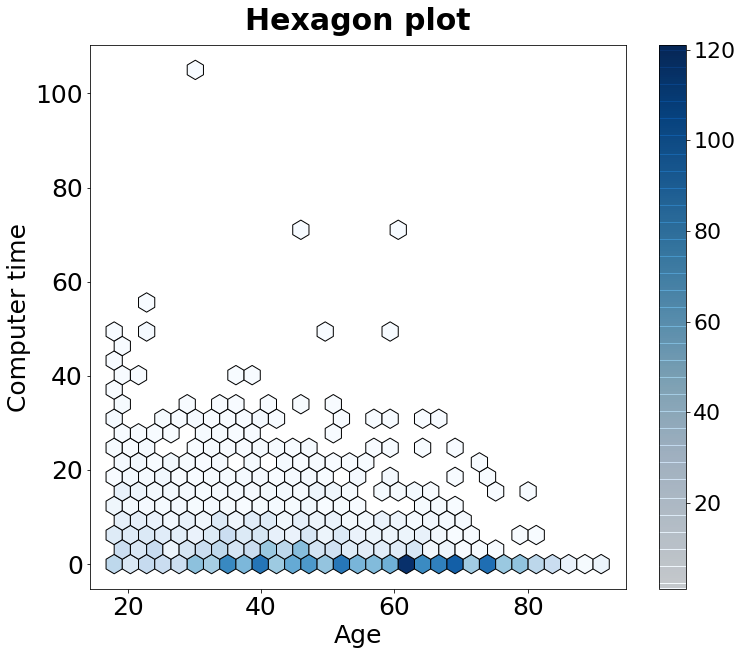

[](http://quantlet.de/)

## [](http://quantlet.de/) **MVAageCom** [](http://quantlet.de/)

```yaml

Name of QuantLet: MVAageCom

Published in: Applied Multivariate Statistical Analysis

Description: Hexagon plot between Age and Time for computer per week.

Keywords: plot, graphical representation, hexagon-plot, data visualization, financial, sas

See also: MVAincomeLi, MVAageIncome

Author: Vinh Hanh Lieu
Author[SAS]: Svetlana Bykovskaya
Author[Python]: Matthias Fengler, Tim Dass

Submitted: Tue, September 09 2014 by Awdesch Melzer
Submitted[SAS]: Wen, April 6 2016 by Svetlana Bykovskaya
Submitted[Python]: Tue, April 16 2024 by Tim Dass

Datafile: allbus.csv

```




### R Code
```r


# clear all variables
rm(list = ls(all = TRUE))
graphics.off()

# install and load packages
libraries = c("hexbin")
lapply(libraries, function(x) if (!(x %in% installed.packages())) {
    install.packages(x)
})
lapply(libraries, library, quietly = TRUE, character.only = TRUE)

# load data
allbus  = read.csv2("allbus.csv")
allbus4 = allbus[, c(2, 6)]

# Exclude unvalid observations
allbus4  = allbus4[(allbus4$ALTER = 100) & (allbus4$COMPUTER < 999), ]
ages4    = allbus4[, 1]
computer = allbus4[, 2]

# Hexagon plot
hexbinplot(computer ~ ages4, main="Hexagon plot", xlab = "Age", ylab = "Computer time", 
           style = "colorscale", aspect = 1, trans = sqrt, inv = function(ages4) ages4 ^ 2)

```

automatically created on 2024-04-25

### SAS Code
```sas


* Import the data;
data allbus;
  infile '/folders/myfolders/Sas-work/data/allbus.csv' dlm=';' dsd firstobs=2;
  input t1 $ t2 $ t3 $ t4 $ t5 $ t6 $ t7 $ t8 $ t9 $ t10 $ ;
  t6 = input(t6, commax10.);
  drop t1 t3-t5 t7-t10;
run;

proc iml;
  * Read data into a matrix;
  use allbus;
    read all var _ALL_ into x; 
  close allbus;
  
  x = num(x);
  
  create datax from x[colname={"alter" "computer"}];
    append from x;
  close datax;
quit;

* Exclude unvalid observations;
data new;
  set datax;
  if computer < 999;
run;

%macro HexBin(dsName, xName, yName, nBins=36, colorramp=TwoColorRamp);
  ods select none;
  ods output fitplot=_HexMap;  /* write graph data to a data set */
  proc surveyreg data=&dsname plots(nbins=&nBins weight=heatmap)=fit(shape=hex);
    model &yName = &xName;
  run;
  ods select all;
 
  proc sgplot data=_HexMap;
    polygon x=XVar y=YVar ID=hID / colorresponse=WVar fill 
                                    colormodel=&colorramp;
  run;
%mend;

title 'Hexagon plot';
%HexBin(new, alter, computer);


```

automatically created on 2024-04-25

### PYTHON Code
```python

#works on pandas 1.5.2 and matplotlib 3.6.2
import pandas as pd
import matplotlib.pyplot as plt

# Load data
allbus = pd.read_csv("allbus.csv", sep=";", decimal=",")
allbus1 = allbus.iloc[:, [1,5]]

# Exclude invalid observations
allbus1 = allbus1[(allbus1['ALTER'] <= 100) & (allbus1['COMPUTER'] < 999)]

# Get ages and net income
ages = allbus1.iloc[:, 0]
computer = allbus1.iloc[:, 1]

#create plot
fig, ax = plt.subplots(figsize=(12,10))
hb = ax.hexbin(ages, computer, gridsize=30, cmap='Blues',
                edgecolors = 'black', mincnt = 1)
ax.set_title("Hexagon plot", fontweight = 'bold', fontsize = 30, pad = 15)
ax.set_xlabel("Age", fontsize = 25)
ax.set_ylabel("Computer time", fontsize = 25)
ax.tick_params(axis='both', labelsize=25)
cbar = fig.colorbar(hb, drawedges = True) 
cbar.ax.tick_params(labelsize=22)

plt.show()
```

automatically created on 2024-04-25