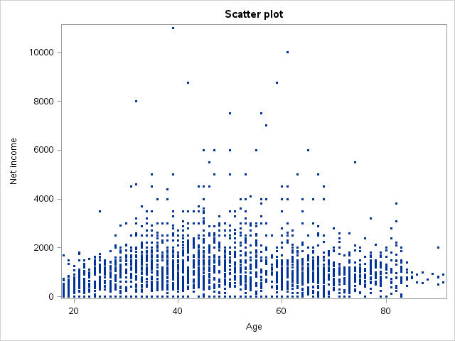
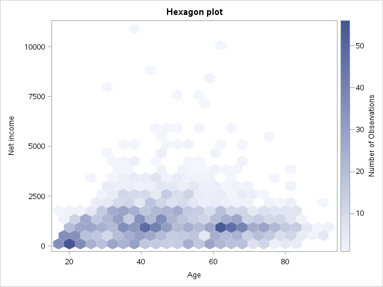
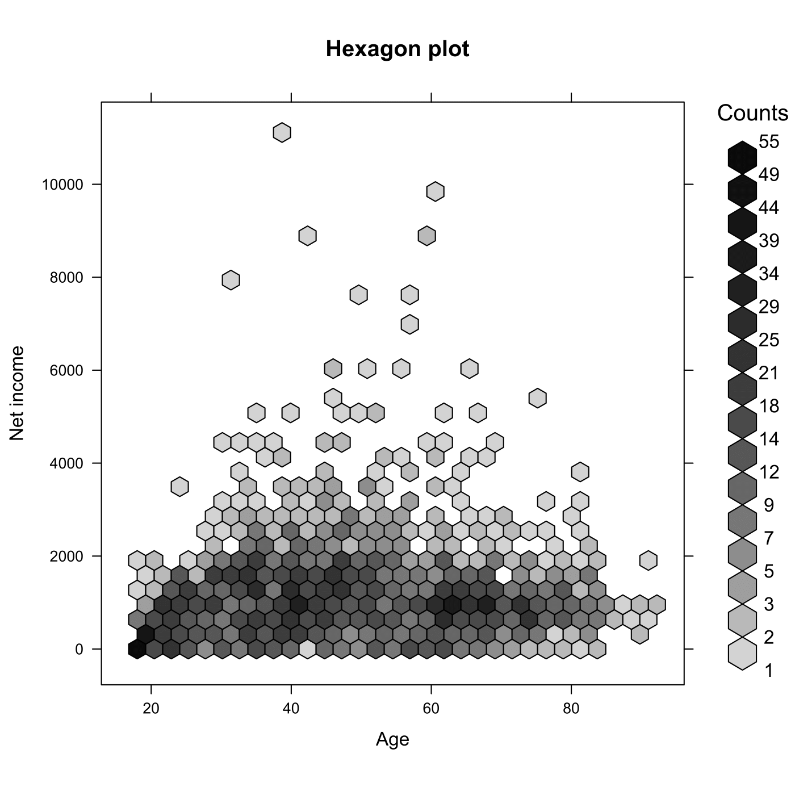

[](http://quantlet.de/)

## [](http://quantlet.de/) **MVAageIncome** [](http://quantlet.de/)

```yaml

Name of QuantLet : MVAageIncome

Published in : Applied Multivariate Statistical Analysis

Description : Produces a hexagon and a scatter plot between Age and Net income.

Keywords : 'plot, graphical representation, hexagon-plot, data visualization, financial,
scatterplot, sas'

See also : MVAincomeLi, MVAageCom

Author : Vinh Hanh Lieu

Author[SAS] : Svetlana Bykovskaya

Submitted : Tue, September 09 2014 by Awdesch Melzer

Submitted[SAS] : Wen, April 6 2016 by Svetlana Bykovskaya

Datafile : allbus.csv

```








### R Code:
```r

# clear all variables
rm(list = ls(all = TRUE))
graphics.off()

# install and load packages
libraries = c("hexbin")
lapply(libraries, function(x) if (!(x %in% installed.packages())) {
    install.packages(x)
})
lapply(libraries, library, quietly = TRUE, character.only = TRUE)

# load data
allbus     = read.csv2("allbus.csv")
allbus1    = allbus[, 2:3]

# exclude unvalid observations
allbus1    = allbus1[(allbus1$ALTER <= 100) & (allbus1$NETTOEIN < 99997), ]
ages       = allbus1[, 1]                   # Ages
netincome  = allbus1[, 2]                   # Net income

# Scatter plot
dev.new()
plot(ages, netincome, main = "Scatter plot", xaxt = "n", xlab = "Age", ylab = "Net income", 
    cex = 0.1)
axis(1, at = c(20, 30, 40, 50, 60, 70, 80, 90))

# Hexagon plot
dev.new()
hexbinplot(netincome ~ ages, main = "Hexagon plot", xlab = "Age", ylab = "Net income", 
    style = "colorscale", border = TRUE, aspect = 1, trans = sqrt, inv = function(ages) ages^2)

```

### SAS Code:
```sas

* Import the data;
data allbus;
  infile '/folders/myfolders/Sas-work/data/allbus.csv' dlm=';' dsd firstobs=2;
  input t1 $ t2 $ t3 $ t4 $ t5 $ t6 $ t7 $ t8 $ t9 $ t10 $ ;
  drop t1 t4-t10;
run;

proc iml;
  * Read data into a matrix;
  use allbus;
    read all var _ALL_ into x; 
  close allbus;
  
  x = num(x);
  
  create datax from x[colname={"age" "netincome"}];
    append from x;
  close datax;
quit;

* Exclude unvalid observations;
data new;
  set datax;
  if (age <= 100 & netincome < 99997);
run;

proc sgplot data = new
    noautolegend;
  title 'Scatter plot';
  scatter x = age y = netincome / 
    markerattrs = (size = 3 symbol = circlefilled);
  xaxis label = 'Age';
  yaxis label = 'Net income';
run;

%macro HexBin(dsName, xName, yName, xlab, ylab, nBins=36, colorramp=TwoColorRamp);
  ods select none;
  ods output fitplot=_HexMap;  /* write graph data to a data set */
  proc surveyreg data=&dsname plots(nbins=&nBins weight=heatmap)=fit(shape=hex);
    model &yName = &xName;
  run;
  ods select all;
 
  proc sgplot data=_HexMap;
    polygon x=XVar y=YVar ID=hID / colorresponse=WVar fill 
                                    colormodel=&colorramp;
    xaxis label = &xlab;
    yaxis label = &ylab;
  run;
%mend;

title 'Hexagon plot';
%HexBin(new, age, netincome, 'Age', 'Net income');


```
