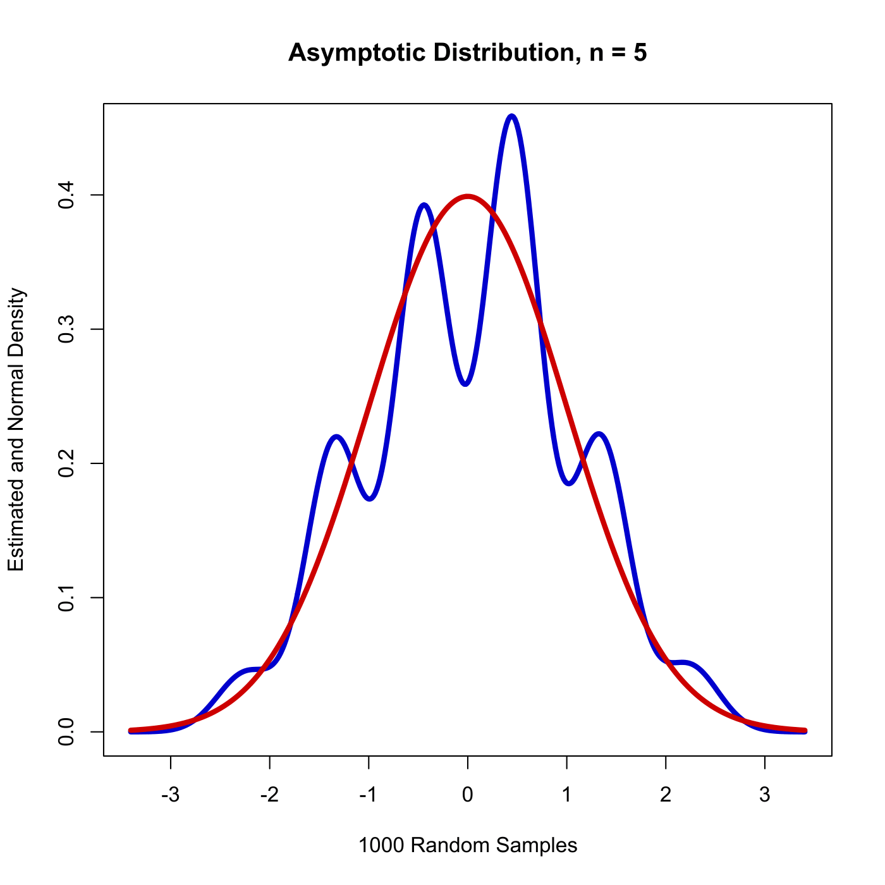
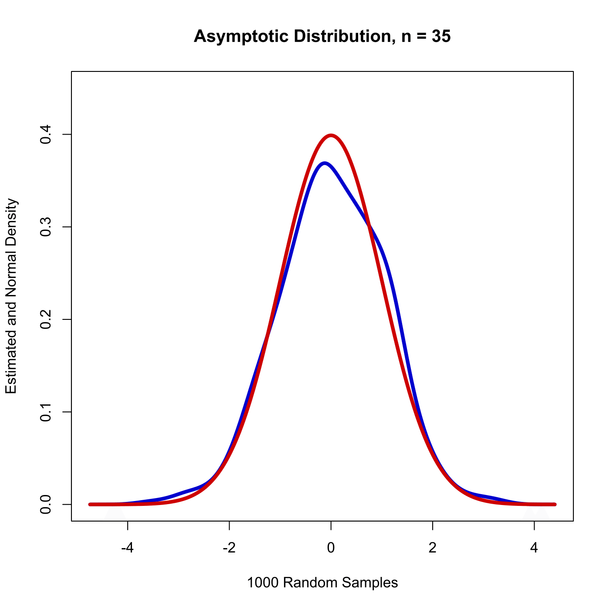
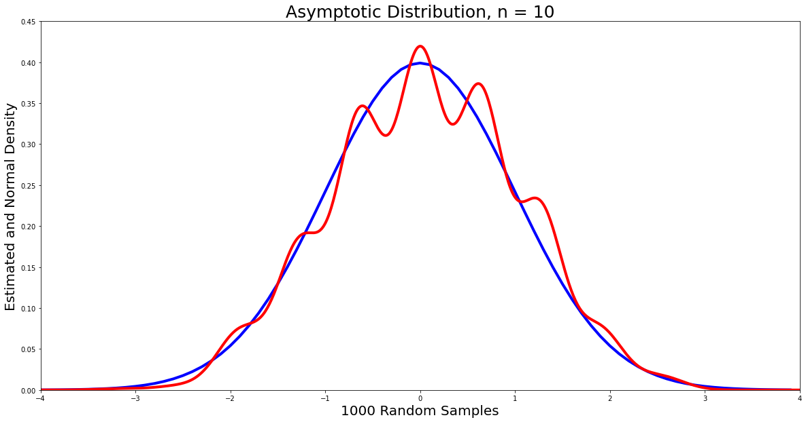
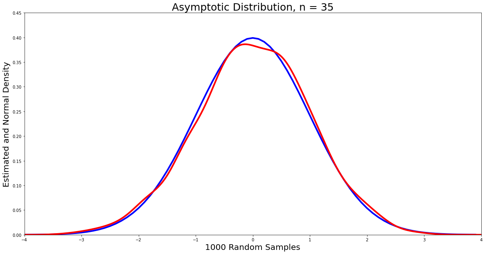

[](http://quantlet.de/)

## [](http://quantlet.de/) **MVAcltbern** [](http://quantlet.de/)

```yaml

Name of QuantLet : MVAcltbern

Published in : Applied Multivariate Statistical Analysis

Description : 'Illustrates the (univariate) Central Limit Theorem (CLT). n*1000 sets of
n-dimensional Bernoulli samples are generated and used to approximate the distribution of t =
sqrt(n)*(mean(x)-mu)/sigma -> N(0,1). The estimated density (blue) of t is shown together with the
standard normal (red).'

Keywords : 'plot, graphical representation, bernoulli, normal, CLT, density, distribution,
standard-normal, asymptotic'

See also : MVAgausscauchy, MVAcltbern2, MVAcauchy, MVAtdis

Author : Wolfgang K. Haerdle
Author [Python]: Gonzalo Garcia

Submitted : Wed, December 07 2011 by Dedy Dwi Prastyo
Submitted [Python]: Wed, January 20 2021 by Gonzalo Garcia

Example: 
- 1: n=5
- 2: n=35

```






### R Code:
```r

# clear all variables
rm(list = ls(all = TRUE))
graphics.off()

# install and load packages
libraries = c("KernSmooth")
lapply(libraries, function(x) if (!(x %in% installed.packages())) {
    install.packages(x)
})
lapply(libraries, library, quietly = TRUE, character.only = TRUE)

p = 0.5
n = 35
bsample  = rbinom(n * 1000, 1, 0.5)       # Random generation of the binomial distribution with parameters 1000*n and 0.5
bsamplem = matrix(bsample, n, 1000)       # Create a matrix of binomial random variables
bden     = bkde((colMeans(bsamplem) - p)/sqrt(p * (1 - p)/n))  # Compute kernel density estimate

# Plot
plot(bden, col = "blue3", type = "l", lty = 1, lwd = 4, xlab = "1000 Random Samples", 
    ylab = "Estimated and Normal Density", cex.lab = 1, cex.axis = 1, ylim = c(0, 
        0.45))
lines(bden$x, dnorm(bden$x), col = "red3", lty = 1, lwd = 4)  
title(paste("Asymptotic Distribution, n =", n)) 

```





### Python Code:
```python
from numpy import random
from math import sqrt
from sklearn.neighbors import KernelDensity
from scipy.stats import norm
import numpy as np
import matplotlib.pyplot as plt
import pandas as pd

p = 0.5
n = 35

# Random generation of the binomial distribution with parameters 1000*n and 0.5
bsample = random.binomial(1, p=0.5, size=1)
arr = np.array([random.binomial(1, p=0.5, size=1) for i in range(n*1000)]) # Create a matrix of binomial random variables
bsamplem = np.resize(arr,(n, 1000))
bsamplemstd = (np.mean(bsamplem, axis = 0) - p) / (sqrt(p * (1 - p)/n)) # Standardize

# Plot
plt.figure(figsize=(20,10))
plt.xlim([-4,4])
x = np.arange(-4, 4, 0.1)
plt.plot(x, norm.pdf(x,0,1), linewidth=4.0, c = "b")
pd.Series(bsamplemstd).plot(kind='density', linewidth=4.0, c = 'r')
plt.xlabel("1000 Random Samples", fontsize=20)
plt.ylabel("Estimated and Normal Density", fontsize=20)
plt.ylim(0, 0.45)
plt.title("Asymptotic Distribution, n = {}".format(n), fontsize=25)
plt.show()
```
