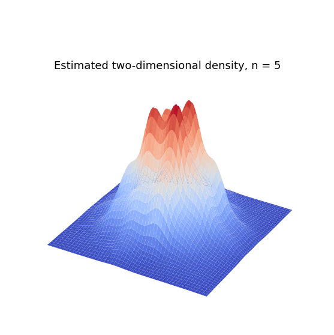
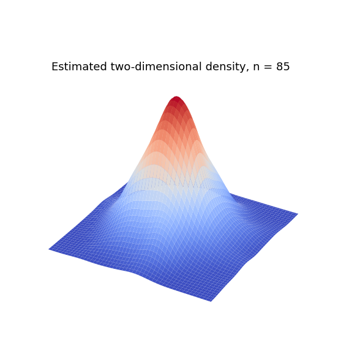
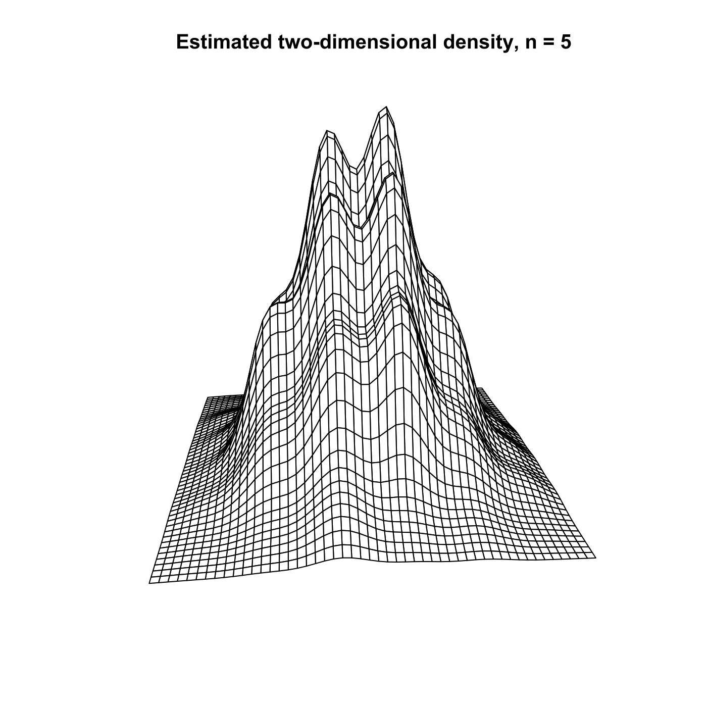
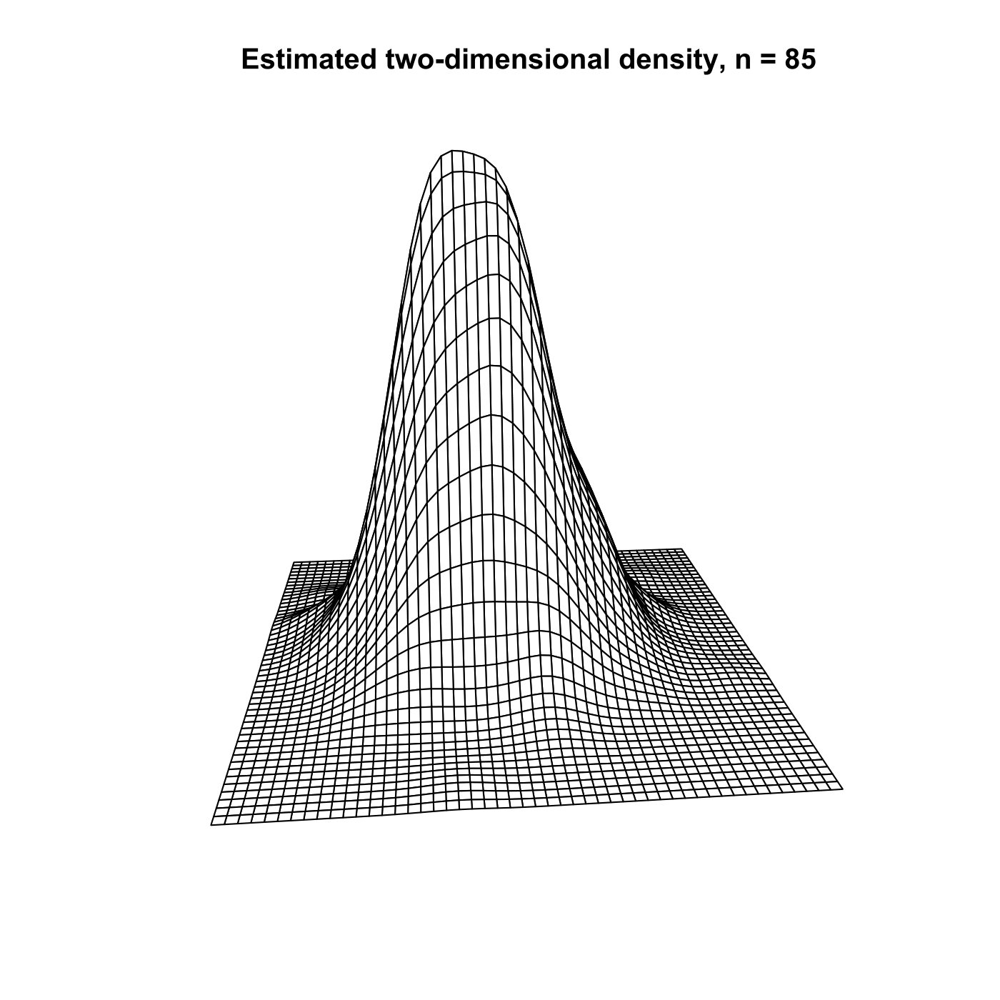

[](http://quantlet.de/)

## [](http://quantlet.de/) **MVAcltbern2** [](http://quantlet.de/)

```yaml

Name of QuantLet: MVAcltbern2

Published in: Applied Multivariate Statistical Analysis

Description: Illustrates the 2D Central Limit Theorem (CLT). n*2000 sets of n-dimensional Bernoulli samples are generated and used to approximate the distribution of t = sqrt(n)*(mean(x)-mu)/sigma -> N(0,1). The estimated joint density is shown.

Keywords: plot, graphical representation, bernoulli, normal, CLT, density, distribution, standard-normal, asymptotic

See also: MVAgausscauchy, MVAcltbern, MVAcauchy, MVAtdis

Author: Wolfgang K. Haerdle
Author[Python]: Matthias Fengler, Tim Dass

Submitted: Wed, August 03 2011 by Awdesch Melzer
Submitted[Python]: Tue, April 16 2024 by Tim Dass

Example: 
- 1: n=5
- 2: n=85

```









### PYTHON Code
```python

# works on numpy 1.23.5, scipy 1.10.0 and matplotlib 3.6.2
import numpy as np
from scipy.stats import binom
from scipy.stats import gaussian_kde
import matplotlib.pyplot as plt
from matplotlib import cm

p = 0.5
n = [5,85]

for n in n:
    
    fig, axs = plt.subplots(1,1, figsize=(10,10), subplot_kw={'projection': '3d'})
    bsample = binom.rvs(1, p, size=n*2000)
    bsamplem = bsample.reshape((n, 2000))
    bsamplemstd = (np.mean(bsamplem, axis=0) - p) / np.sqrt(p * (1 - p) / n)
    bsamplemstd = bsamplemstd.reshape((1000,2))

    dj = gaussian_kde(bsamplemstd.T, bw_method=1.06 * np.std(bsamplemstd) * 200**(-1/5))

    X, Y = np.mgrid[-3:3:100j, -3:3:100j]
    Z = dj(np.vstack([X.ravel(), Y.ravel()])).reshape(X.shape)

    axs.plot_surface(X, Y, Z, cmap=cm.coolwarm)
    axs.set_title(f"Estimated two-dimensional density, n = {n}", fontsize = 18, y = 0.86)
    axs.axis('off')

    plt.show()

```

automatically created on 2024-04-25

### R Code
```r


# clear all variables
rm(list = ls(all = TRUE))
graphics.off()

# install and load packages
libraries = c("KernSmooth")
lapply(libraries, function(x) if (!(x %in% installed.packages())) {
    install.packages(x)
})
lapply(libraries, library, quietly = TRUE, character.only = TRUE)

p = 0.5
n = 5
bsample     = rbinom(n * 2000, 1, 0.5)      # Random generation of the binomial distribution with parameters 2000*n and 0.5
bsamplem    = matrix(bsample, n, 2000)      # Create a matrix of binomial random variables
bsamplemstd = matrix((colMeans(bsamplem) - p)/sqrt(p * (1 - p)/n), 1000, 2)

dj = bkde2D(bsamplemstd, bandwidth = 1.06 * c(sd(bsamplemstd[, 1]), sd(bsamplemstd[, 
    2])) * 200^(-1/5))                      # Compute 2 dimensional kernel density estimate

persp(dj$x1, dj$x2, dj$fhat, box = FALSE, theta = 265, phi = 15, r = sqrt(3), d = 1, 
    ltheta = -135, lphi = 0, shade = NA) 
title(paste("Estimated two-dimensional density, n =",n ))

```

automatically created on 2024-04-25