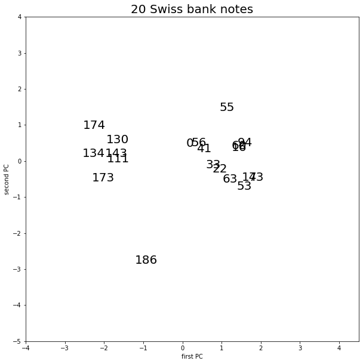
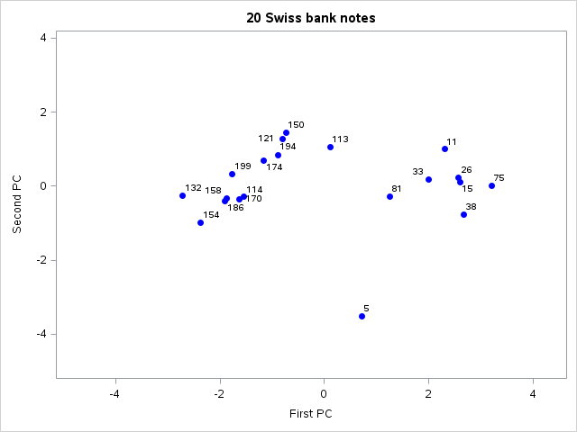
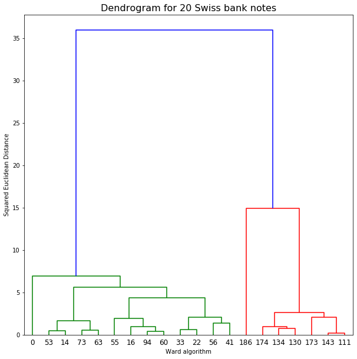
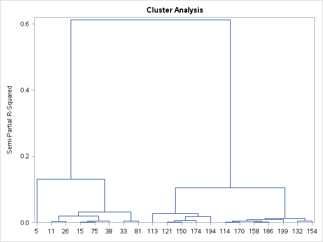
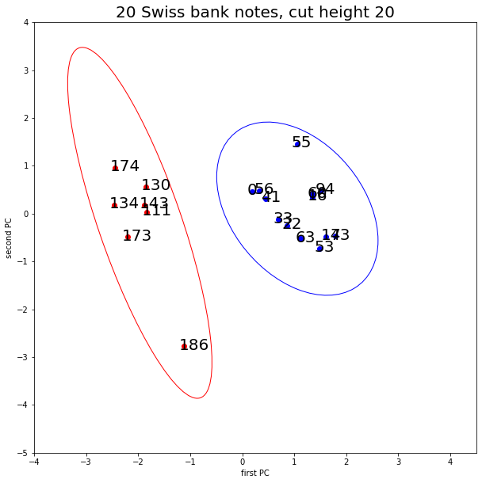
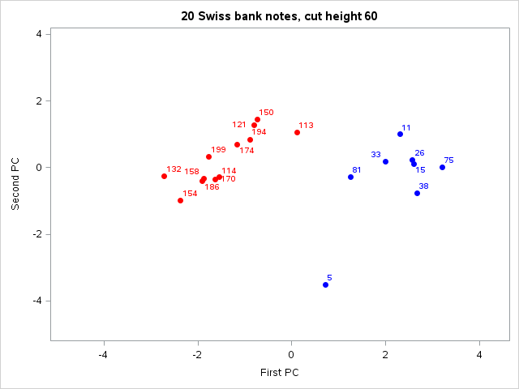
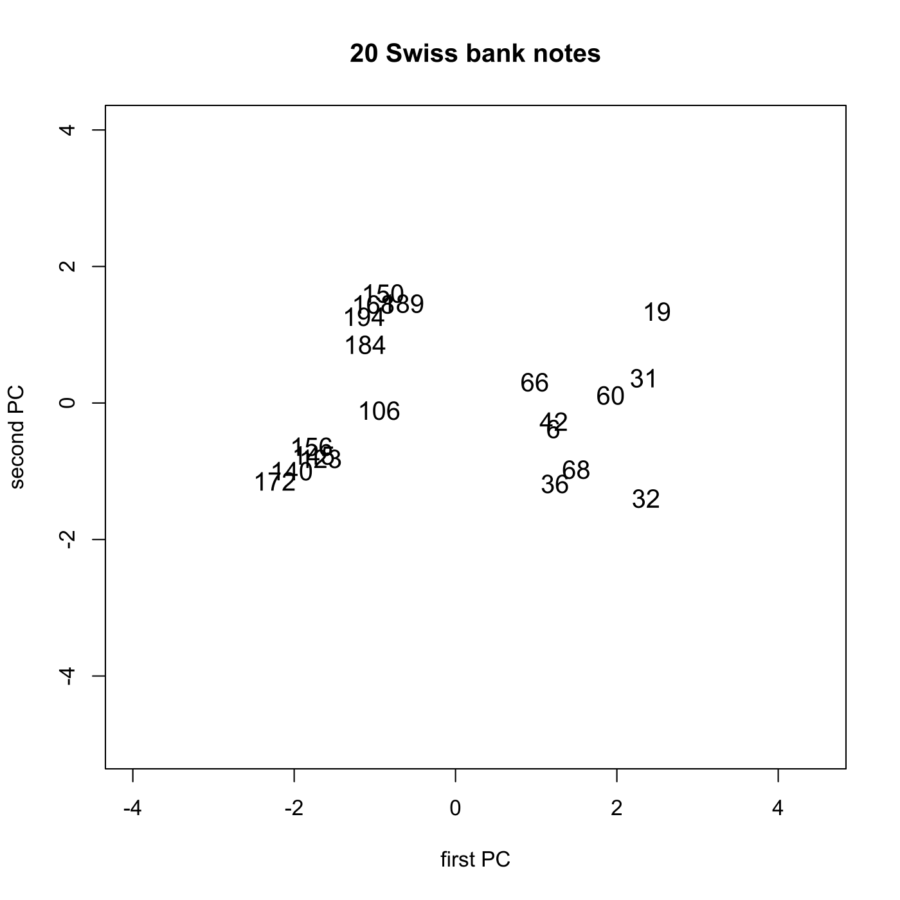
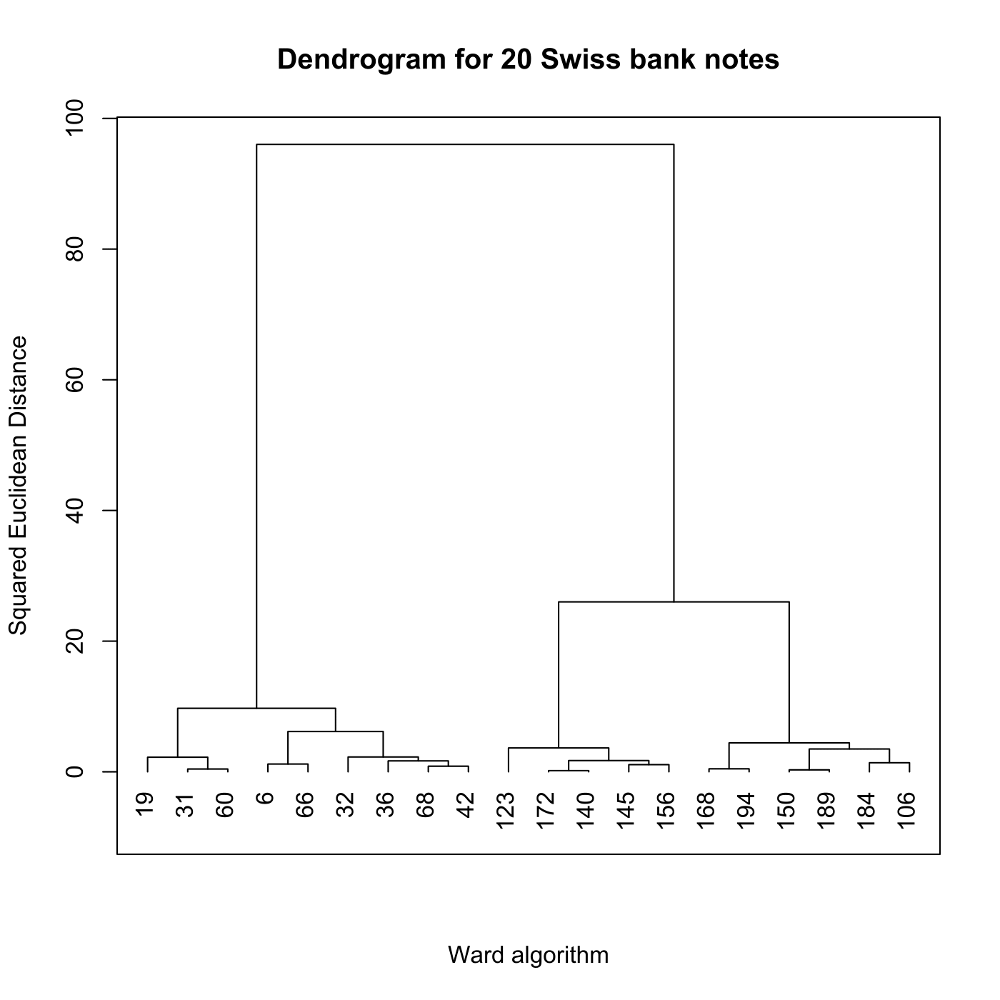
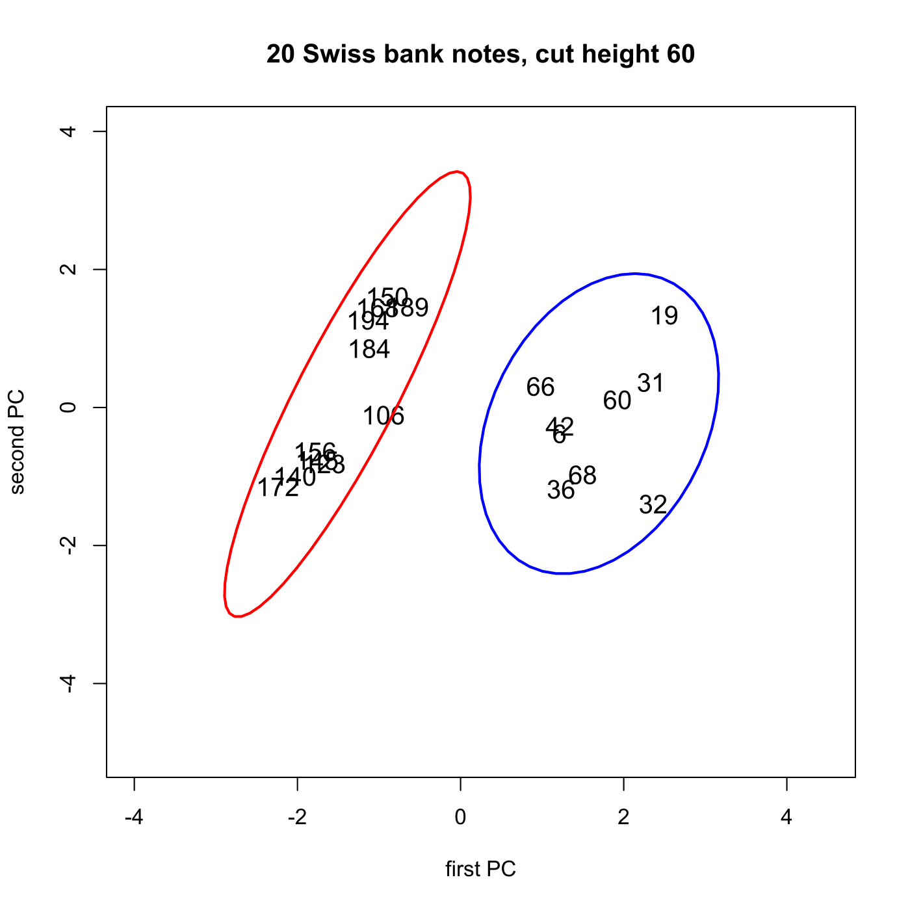

[](http://quantlet.de/)

## [](http://quantlet.de/) **MVAclusbank** [](http://quantlet.de/)

```yaml

Name of QuantLet: MVAclusbank

Published in: Applied Multivariate Statistical Analysis

Description: Performs a PCA and a cluster analysis for 20 randomly chosen bank notes from the swiss bank notes dataset.

Keywords: cluster-analysis, plot, graphical representation, distance, euclidean, data visualization, dendrogram, principal-components, pca, sas

See also: MVAclus8p, MVAclusfood, MVAspecclust, MVAclusbh, MVAclususcrime, SMSclus8p, SMSclus8pd, SMSclus8pmst2, SMSclusbank, SMScluscomp, SMScluscrime, SMScluscrimechi2, SMSclushealth

Author: Zografia Anastasiadou, Simon Trimborn
Author[SAS]: Svetlana Bykovskaya
Author[Python]: Matthias Fengler, Liudmila Gorkun-Voevoda

Submitted: Thu, August 21 2014 by Petra Burdejova
Submitted[SAS]: Wen, April 6 2016 by Svetlana Bykovskaya
Submitted[Python]: Wed, September 9 2020 by Liudmila Gorkun-Voevoda

Datafile: bank2.dat

Example : 
- 1: PCA for 20 randomly chosen bank notes. 
- 2: The dendrogram for the 20 bank notes after applying the Ward algorithm.
- 3: PCA with clusters

```



















### PYTHON Code
```python

import pandas as pd
import numpy as np
import matplotlib.pyplot as plt
from matplotlib.patches import Ellipse
from scipy import cluster


data = pd.read_csv("bank2.dat", sep = "\s+", header=None)

xx = data.sample(n = 20, random_state = 11, replace=False)

mean = np.mean(xx)
m = np.array([mean]*len(xx))
x = xx - m
eva = np.linalg.eig(np.cov(x.T))[0]
eve = np.linalg.eig(np.cov(x.T))[1]
y = x @ eve
ym = y.iloc[:, 0:2]


fig, ax = plt.subplots(figsize = (10, 10))
ax.scatter(ym[0], ym[1], c = "w")
for i in range(0, len(ym)):
    ax.text(ym.iloc[i,0]-0.1, ym.iloc[i,1]-0.07, xx.index[i], fontsize = 20)
ax.set_xlabel("first PC")
ax.set_ylabel("second PC")
ax.set_ylim(-5, 4)
ax.set_xlim(-4, 4.5)
ax.set_title("20 Swiss bank notes", fontsize = 20)

plt.show()

d = np.zeros([len(xx),len(xx)])

for i in range(0, len(xx)):
    for j in range(0, len(xx)):
        d[i, j] = np.linalg.norm(xx.iloc[i, :] - xx.iloc[j, :])

dd = (d**2)

ddd  = dd[1:, :-1][:, 0]
for i in range(1, len(xx)-1):
    ddd = np.concatenate((ddd, dd[1:, :-1][i:, i]))
    
w = cluster.hierarchy.linkage(ddd, 'ward')


fig, ax = plt.subplots(figsize = (10, 10))
h = cluster.hierarchy.dendrogram(w, labels=xx.index)
plt.title("Dendrogram for 20 Swiss bank notes", fontsize = 16)
plt.ylabel("Squared Euclidean Distance")
plt.xlabel("Ward algorithm")

plt.show()


groups = cluster.hierarchy.cut_tree(w, height=20)

merg = np.concatenate((ym, groups), axis = 1)

merg = pd.DataFrame(merg).sort_values(by = 2)

merg1 = merg.iloc[:len(merg[merg.iloc[:, 2] == 0]), :2]
merg2 = merg.iloc[len(merg[merg.iloc[:, 2] == 0]):, :2]

covm = np.cov(merg1.iloc[:, 0], merg1.iloc[:, 1])
covm1 = np.cov(merg2.iloc[:, 0], merg2.iloc[:, 1])

eigva = np.sqrt(np.linalg.eig(covm)[0])
eigve = np.linalg.eig(covm)[1]
eigva1 = np.sqrt(np.linalg.eig(covm1)[0])
eigve1 = np.linalg.eig(covm1)[1]


fig, ax = plt.subplots(figsize = (10, 10))
ax.scatter(ym[0], ym[1], c = "w")
for i in range(0, len(ym)):
    ax.text(ym.iloc[i,0]-0.1, ym.iloc[i,1]-0.07, xx.index[i], fontsize = 20)

ax.add_patch(Ellipse(xy = (np.mean(merg1.iloc[:, 0]), np.mean(merg1.iloc[:, 1])),
                     width = eigva[0]*3*2, height = eigva[1]*3*2,
                     angle = -np.rad2deg(np.arccos(eigve[0, 0])), facecolor = "w", edgecolor = "r", zorder = 0))

ax.add_patch(Ellipse(xy = (np.mean(merg2.iloc[:, 0]), np.mean(merg2.iloc[:, 1])),
                     width = eigva1[0]*3*2, height = eigva1[1]*3*2,
                     angle = -np.rad2deg(np.arccos(eigve1[0, 0])), facecolor = "w", edgecolor = "b", zorder = 0))

ax.scatter(merg1.iloc[:, 0], merg1.iloc[:, 1], c = "r")
ax.scatter(merg2.iloc[:, 0], merg2.iloc[:, 1], c = "b")

ax.set_xlabel("first PC")
ax.set_ylabel("second PC")
ax.set_ylim(-5, 4)
ax.set_xlim(-4, 4.5)
ax.set_title("20 Swiss bank notes, cut height 20", fontsize = 20)

plt.show()


```

automatically created on 2020-09-10

### R Code
```r


# clear all variables
rm(list = ls(all = TRUE))
graphics.off()

# install and load packages
libraries = c("car")
lapply(libraries, function(x) if (!(x %in% installed.packages())) {
    install.packages(x)
})
lapply(libraries, library, quietly = TRUE, character.only = TRUE)

# load data
data = read.table("bank2.dat")
xx   = data[sample(1:nrow(data), 20, replace = F), ]  # sample of 20 randomly chosen bank notes from data  

# PCA
set.seed(3)
mean = as.vector(colMeans(xx))
m    = matrix(mean, nrow(xx), NROW(mean), byrow = T)
x    = xx - m
eig  = eigen(cov(x))  # spectral decomposition  
eva  = eig$values
eve  = eig$vectors
xm   = as.matrix(x)
y    = xm %*% eve
ym   = y[, 1:2]       # first two eigenvectors

# Plot 1: PCA
plot(ym, type = "n", xlab = "first PC", ylab = "second PC", main = "20 Swiss bank notes", 
    ylim = c(-5, 4), xlim = c(-4, 4.5))
text(ym[, 1], ym[, 2], rownames(xx), cex = 1.2)
d  = dist(xx, method = "euclidean", p = 2)  # euclidean distance matrix
dd = d^2                                    # squared euclidean distance matrix                        
w  = hclust(dd, method = "ward.D")          # cluster analysis with ward algorithm

# Plot 2: Dendrogram for the 20 bank notes after applying the Ward algorithm
dev.new()
plot(w, hang = -0.1, frame.plot = TRUE, ann = FALSE)
title(main = "Dendrogram for 20 Swiss bank notes", ylab = "Squared Euclidean Distance", 
    xlab = "Ward algorithm")

# Plot 3: PCA with clusters
dev.new()
groups = cutree(w, h = 60)
merg   = matrix(c(ym, as.matrix(groups)), nrow = 20, ncol = 3)
merg   = merg[sort.list(merg[, 3]), ]
merg1  = merg[1:11, 1:2]
merg2  = merg[12:20, 1:2]
plot(ym, type = "n", xlab = "first PC", ylab = "second PC", main = "20 Swiss bank notes, cut height 60", 
    ylim = c(-5, 4), xlim = c(-4, 4.5))
text(ym[, 1], ym[, 2], rownames(xx), cex = 1.2)
dataEllipse(x = merg1[, 1], y = merg1[, 2], center.pch = 0, col = "red", plot.points = F, 
    add = T, levels = 0.95)
dataEllipse(x = merg2[, 1], y = merg2[, 2], center.pch = 0, col = "blue", plot.points = F, 
    add = T, levels = 0.9) 

```

automatically created on 2020-09-10

### SAS Code
```sas


* Import the data;
data b2;
  count + 1;
  infile '/folders/myfolders/data/bank2.dat';
  input t1-t6;
run;

* sample of 20 randomly chosen bank notes from data;
proc surveyselect data = b2 method = SRS 
  sampsize = 20 out = bank2 noprint;
  id _all_;
run;

proc iml;
  * Read data into a matrix;
  use bank2;
    read all var _ALL_ into xx; 
  close bank2;
  
  num = xx[,1];
  xx = xx[,2:7];
  
  * PCA;
  x = xx - repeat(xx(|:,|), nrow(xx), 1);
  e  = cov(x);         * spectral decomposition;
  eva = eigval(e);
  eve = eigvec(e);
  y = (x * eve)[, 1:2]; * first two eigenvectors;
  
  x1 = y[,1];
  x2 = -y[,2];
  
  create plot var {"x1" "x2" "num"};
    append;
  close plot;
quit;

* Plot 1: PCA;
proc sgplot data = plot    
    noautolegend;
  title '20 Swiss bank notes';
  scatter x = x1 y = x2 / markerattrs = (color = blue symbol = circlefilled)
    datalabel = num;
  xaxis min = -5 max = 4.5 label = 'First PC';
  yaxis min = -5 max = 4 label = 'Second PC';
run;

* Plot 2: Dendrogram for the 20 bank notes after applying the Ward algorithm;
proc distance data = bank2 out = dist method = euclid nostd;
  var interval(t1 t2 t3 t4 t5 t6);
run;

data newdist;
  set dist;
  set plot;
  drop x1 x2;
run;

ods graphics on;
proc cluster data = newdist(type = distance)
    method = ward 
    plots(only) = (Pseudo Dendrogram(vertical))
    print = 0
    outtree = stat;
  id num;
  title 'Ward Dendrogram for 20 Swiss bank notes';
run;
ods graphics off;

* Plot 3: PCA with clusters;
proc tree data = stat noprint out = sol level= 0.4;
  id num;
run;

proc sort data = sol;
  by num;
run;

proc sort data = plot;
  by num;
run;

data plot2;
  set plot;
  set sol;
run;

proc sgplot data = plot2
    noautolegend;
  title '20 Swiss bank notes, cut height 60';
  scatter x = x1 y = x2 / colorresponse = CLUSTER colormodel = (red blue)
    markerattrs = (symbol = circlefilled)
    datalabel = num;
  xaxis min = -5 max = 4.5 label = 'First PC';
  yaxis min = -5 max = 4 label = 'Second PC';
run;
```

automatically created on 2020-09-10