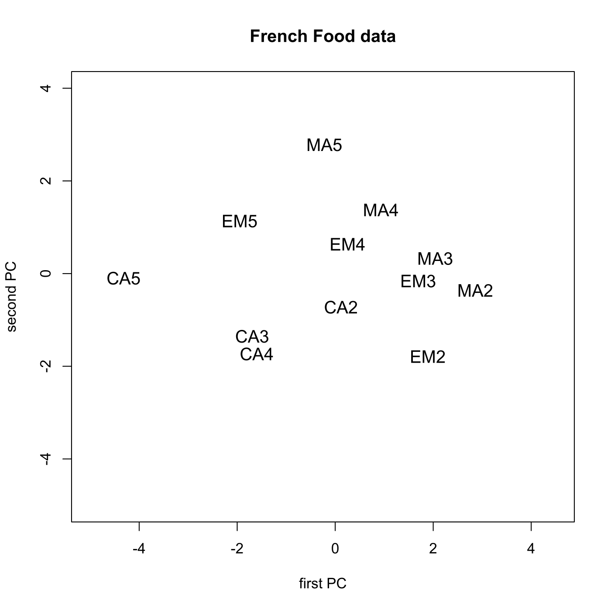
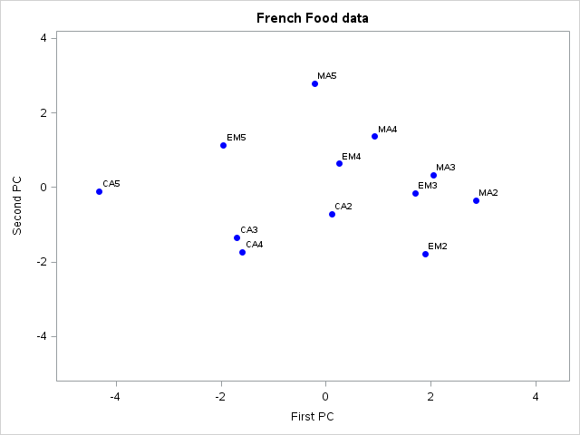
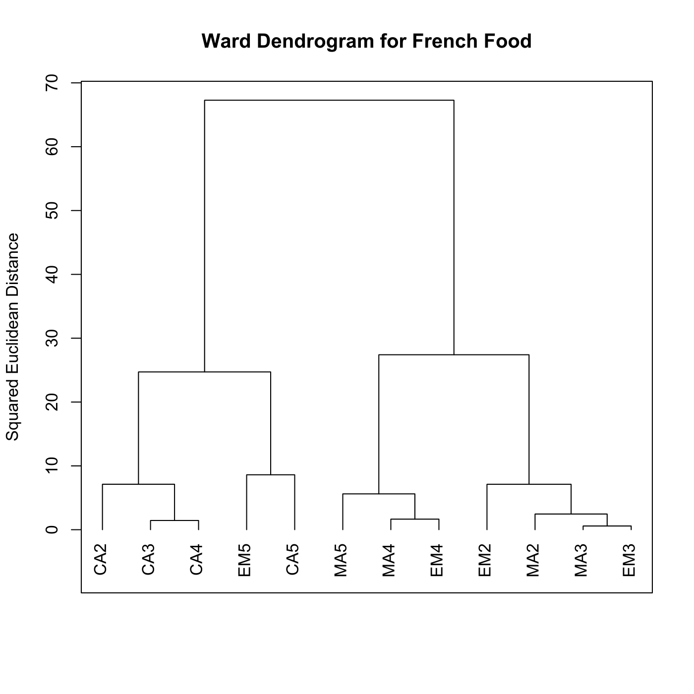
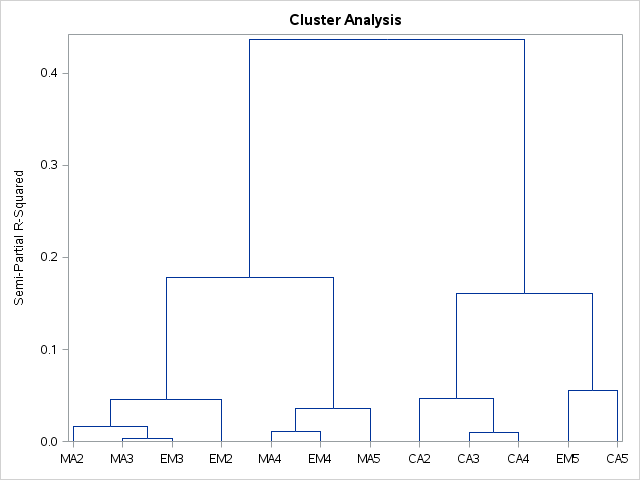
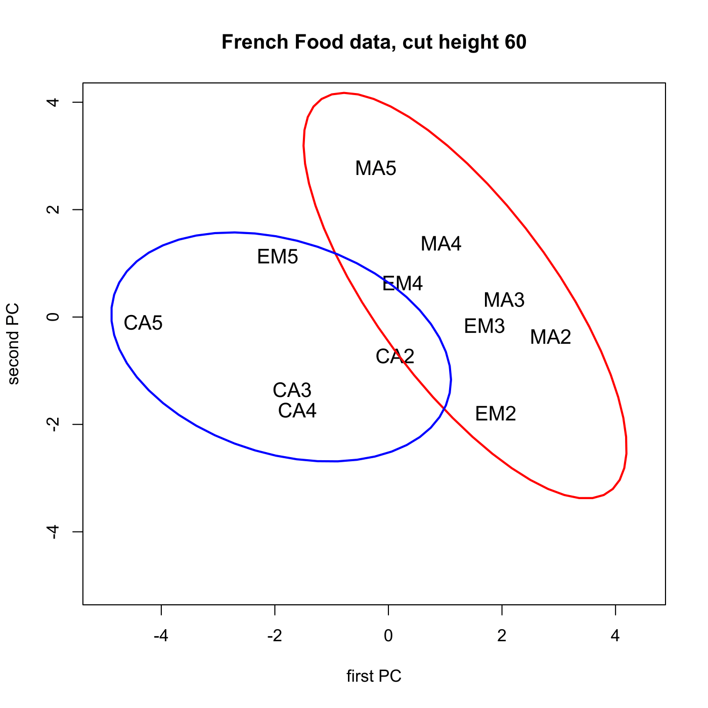
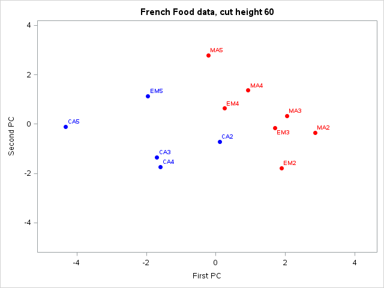

[](http://quantlet.de/)

## [](http://quantlet.de/) **MVAclusfood** [](http://quantlet.de/)

```yaml

Name of QuantLet : MVAclusfood

Published in : Applied Multivariate Statistical Analysis

Description : 'Performs cluster analysis for the french food data after standardization of the
variables.'

Keywords : 'cluster-analysis, plot, graphical representation, distance, euclidean, data
visualization, dendrogram, principal-components, pca, standardization, sas'

See also : 'MVAclus8p, MVAclusbank, MVAspecclust, MVAclusbh, MVAclususcrime, SMSclus8p, SMSclus8pd,
SMSclus8pmst2, SMSclusbank, SMScluscomp, SMScluscrime, SMScluscrimechi2, SMSclushealth'

Author : Zografia Anastasiadou, Simon Trimborn

Author[SAS] : Svetlana Bykovskaya

Submitted : Sun, September 07 2014 by Awdesch Melzer

Submitted[SAS] : Mon, March 14 2016 by Svetlana Bykovskaya

Datafile : food.dat

Example: 
- 1: First vs second PC
- 2: The dendrogram for the French food expenditures after applying the Ward algorithm
- 3: First vs second PC with clusters

```














### R Code:
```r

# clear all variables
rm(list = ls(all = TRUE))
graphics.off()

# install and load packages
libraries = c("car")
lapply(libraries, function(x) if (!(x %in% installed.packages())) {
    install.packages(x)
})
lapply(libraries, library, quietly = TRUE, character.only = TRUE)

# load data
fooddat = read.table("food.dat")
food    = fooddat[, -1]                         # delete the first column (types of families)
rownames(food) = c("MA2", "EM2", "CA2", "MA3", "EM3", "CA3", "MA4", "EM4", "CA4", 
    "MA5", "EM5", "CA5")                        # define types of families
f       = scale(food)                           # standardize variables

# PCA
mean = as.vector(colMeans(f))
m    = matrix(mean, nrow(f), NROW(mean), byrow = T)
x    = f - m
eig  = eigen(cov(x))  # spectral decomposition  
eva  = eig$values
eve  = eig$vectors
xm   = as.matrix(x)
y    = xm %*% eve
ym   = y[, 1:2]       # first two eigenvectors

# Plot 1: PCA
dev.new()
plot(ym, type = "n", xlab = "first PC", ylab = "second PC", main = "French Food data", 
    ylim = c(-5, 4), xlim = c(-5, 4.5))
text(ym[, 1], ym[, 2], rownames(f), cex = 1.2)

d  = dist(f, "euclidean", p = 2)      # euclidean distance matrix
dd = d^2                              # squared euclidean distance matrix                                  
w  = hclust(dd, method = "ward.D")    # cluster analysis with ward algorithm

# Plot 2: Dendrogram for the standardized food.dat after Ward algorithm
dev.new()
plot(w, hang = -0.1, frame.plot = TRUE, ann = FALSE)
title(main = "Ward Dendrogram for French Food", ylab = "Squared Euclidean Distance")

groups = cutree(w, h = 60)
merg   = matrix(c(ym, as.matrix(groups)), nrow = 12, ncol = 3)
merg   = merg[sort.list(merg[, 3]), ]
merg1  = merg[1:7, 1:2]
merg2  = merg[8:12, 1:2]

# Plot 3: PCA with clusters
dev.new()
plot(ym, type = "n", xlab = "first PC", ylab = "second PC", main = "French Food data, cut height 60", 
    ylim = c(-5, 4), xlim = c(-5, 4.5))
text(ym[, 1], ym[, 2], rownames(f), cex = 1.2)
dataEllipse(x = merg1[, 1], y = merg1[, 2], center.pch = 0, col = "red", plot.points = F, 
    add = T, levels = 0.9)
dataEllipse(x = merg2[, 1], y = merg2[, 2], center.pch = 0, col = "blue", plot.points = F, 
    add = T, levels = 0.72) 

```

### SAS Code:
```sas

* Import the data;
data food;
  infile 'food.dat';
  input t1 $ t2-t8;
  drop t1;
run;

* standardize the data matrix;
proc standard data = food mean = 0 std = 1 out = y;
  var t2-t8;
run;

proc iml;
  * Read data into a matrix;
  use y;
    read all var _ALL_ into f; 
  close y;
  
  names = {"MA2", "EM2", "CA2", "MA3", "EM3", "CA3", "MA4", "EM4", "CA4", 
    "MA5", "EM5", "CA5"};
  
  * PCA;
  x = f - repeat(f(|:,|), nrow(f), 1);
  e  = cov(x);         * spectral decomposition;
  eva = eigval(e);
  eve = eigvec(e);
  y = (x * eve)[, 1:2]; * first two eigenvectors;
  
  x1 = y[,1];
  x2 = -y[,2];
  
  create plot var {"x1" "x2" "names"};
    append;
  close plot;
quit;

* Plot 1: PCA;
proc sgplot data = plot    
    noautolegend;
  title 'French Food data';
  scatter x = x1 y = x2 / markerattrs = (color = blue symbol = circlefilled)
    datalabel = names;
  xaxis min = -5 max = 4.5 label = 'First PC';
  yaxis min = -5 max = 4 label = 'Second PC';
run;

* Plot 2: Dendrogram for the standardized food.dat after Ward algorithm;
proc distance data = y out = dist method = euclid nostd;
  var interval(t2 t3 t4 t5 t6 t7 t8);
run;

data newdist;
  set dist;
  set plot;
  drop x1 x2;
run;

ods graphics on;
proc cluster data = newdist(type = distance)
    method = ward 
    plots(only) = (Pseudo Dendrogram(vertical))
    print = 0
    outtree = stat;
  id names;
  title 'Ward Dendrogram for French Food';
run;
ods graphics off;

* Plot 3: PCA with clusters;
proc tree data = stat noprint out = sol level= 0.4;
  id names;
run;

proc sort data = sol;
  by names;
run;

proc sort data = plot;
  by names;
run;

data plot2;
  set plot;
  set sol;
run;

proc sgplot data = plot2
    noautolegend;
  title 'French Food data, cut height 60';
  scatter x = x1 y = x2 / colorresponse = CLUSTER colormodel = (red blue)
    markerattrs = (symbol = circlefilled)
    datalabel = names;
  xaxis min = -5 max = 4.5 label = 'First PC';
  yaxis min = -5 max = 4 label = 'Second PC';
run;

```
