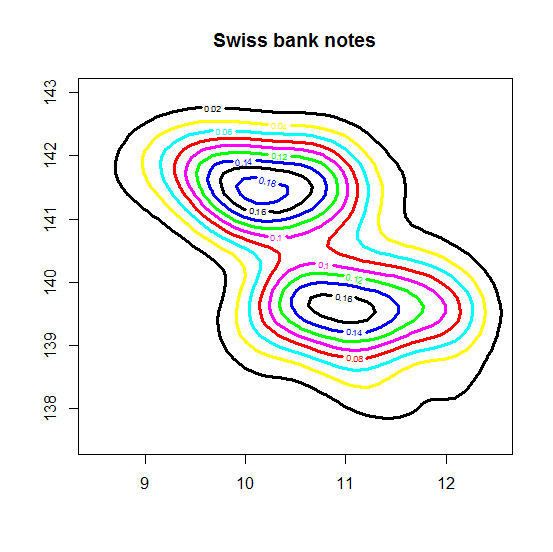
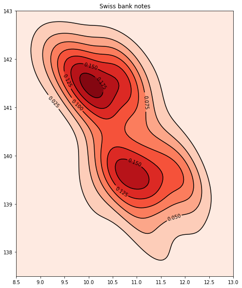

[](http://quantlet.de/)

## [](http://quantlet.de/) **MVAcontbank2** [](http://quantlet.de/)

```yaml


Name of QuantLet: MVAcontbank2

Published in: Applied Multivariate Statistical Analysis

Description: 'Gives a contour plot of the kernel density estimate of variables X5 and X6 of the Swiss bank notes.'

Keywords: contour, data visualization, plot, graphical representation, financial, density, descriptive, descriptive-statistics, empirical, kde, kernel, smoothing, visualization

See also: MVAboxbank6, MVAdraftbank4, MVAscabank45, MVAscabank456, SPMdenepatri, SPMkdeconstruct, SPMkernel

Author: Song Song

Author[Python]: 'Matthias Fengler, Liudmila Gorkun-Voevoda'

Submitted: Tue, September 09 2014 by Awdesch Melzer

Submitted[Python]: 'Wed, April 22 2020 by Liudmila Gorkun-Voevoda'

Datafiles: bank2.dat

Example: 'Contours of the density of X5 and X6 of genuine and counterfeit bank notes.'

```





### R Code
```r


# clear variables and close windows
rm(list = ls(all = TRUE))
graphics.off()

# install and load packages
libraries = c("KernSmooth", "graphics")
lapply(libraries, function(x) if (!(x %in% installed.packages())) {
install.packages(x)
})
lapply(libraries, library, quietly = TRUE, character.only = TRUE)

# load data
xx = read.table("bank2.dat")

d  = bkde2D(xx[, 5:6], bandwidth = 1.06 * c(sd(xx[, 5]), sd(xx[, 6])) * 200^(-1/5))

# plot
contour(d$x1, d$x2, d$fhat, xlim = c(8.5, 12.5), ylim = c(137.5, 143), col = c("blue", 
    "black", "yellow", "cyan", "red", "magenta", "green", "blue", "black"), lwd = 3, 
    cex.axis = 1, main = "Swiss bank notes")
	
```

automatically created on 2020-04-22

### PYTHON Code
```python

import pandas as pd
import numpy as np
import matplotlib.pyplot as plt
import scipy.stats as st

# load data
xx = pd.read_csv("bank2.dat", sep = "\s+", header=None)

xx = xx.iloc[:,4:]

x_min=8.5
x_max=13
y_min=137.5
y_max=143

x_grid = np.mgrid[x_min:x_max:100j, y_min:y_max:100j][0]
y_grid = np.mgrid[x_min:x_max:100j, y_min:y_max:100j][1]

positions = np.array([x_grid.ravel(), y_grid.ravel()])
kernel = st.gaussian_kde(np.array([xx.iloc[:,0], xx.iloc[:,1]]), bw_method=1.06 * np.std(xx.iloc[:, 1]) * 200**(-1/5))
f = np.reshape(kernel(positions).T, x_grid.shape)

fig, ax = plt.subplots(figsize=(10,10))
ax.contourf(x_grid, y_grid, f, cmap="jet")
ax.imshow(np.rot90(f), cmap='jet', extent=[x_min, x_max, y_min, y_max])
g = ax.contour(x_grid, y_grid, f, colors='k')
ax.clabel(g, colors="black")
plt.title('Swiss bank notes')

plt.show()


```

automatically created on 2020-04-22