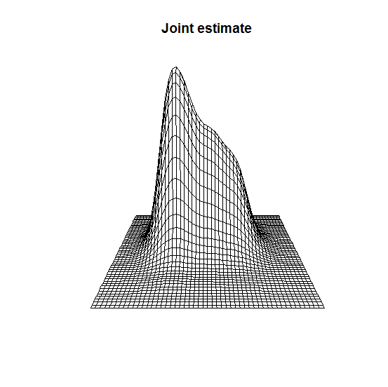
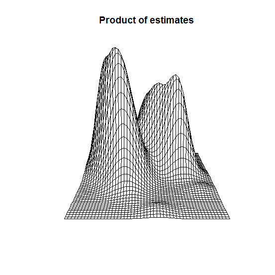
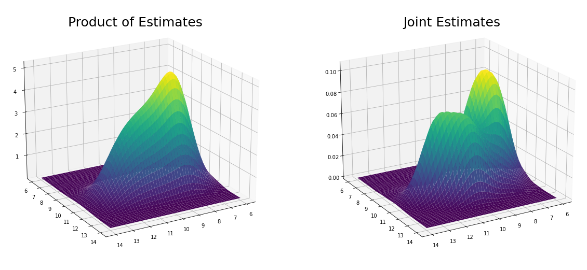

[](http://quantlet.de/)

## [](http://quantlet.de/) **MVAdenbank3** [](http://quantlet.de/)

```yaml


Name of QuantLet: MVAdenbank3

Published in: Applied Multivariate Statistical Analysis

Description: 'Gives plots of the product of univariate and joint kernel density estimates of variables X4 and X5 of the Swiss bank notes.'

Keywords: 3D, data visualization, plot, graphical representation, financial, density, descriptive, descriptive-statistics, empirical, gaussian, kde, kernel, smoothing, univariate, visualization, joint distribution

See also: MVAdenbank, MVAdenbank2, MVAdraftbank4, MVAscabank45, MVAscabank456, SPMdenepatri, SPMkdeconstruct, SPMkernel

Author: Song Song
Author[Python]: Matthias Fengler, Tim Dass

Submitted: Tue, September 09 2014 by Awdesch Melzer
Submitted[Python]: Tue, April 16 2024 by Tim Dass

Datafiles: bank2.dat

Example: 
- 1: Joint density estimate for X4 and X5 of the bank notes.
- 2: The product of univariate density estimates for X4 and X5 of the bank notes.

```







### R Code
```r


# clear variables and close windows
rm(list = ls(all = TRUE))
graphics.off()

# install and load packages
libraries = c("KernSmooth", "graphics")
lapply(libraries, function(x) if (!(x %in% installed.packages())) {
install.packages(x)
})
lapply(libraries, library, quietly = TRUE, character.only = TRUE)

# load data
xx = read.table("bank2.dat")

# Compute a kernel density estimates
dj = bkde2D(xx[, 4:5], bandwidth = 1.06 * c(sd(xx[, 4]), sd(xx[, 5])) * 200^(-1/5))
d1 = bkde(xx[, 4], gridsize = 51)
d2 = bkde(xx[, 5], gridsize = 51)
dp = (d1$y) %*% t(d2$y)

# plot
persp(d1$x, d2$x, dp, box = FALSE, main = "Joint estimate")
persp(dj$x1, dj$x2, dj$fhat, box = FALSE, main = "Product of estimates")

```

automatically created on 2024-04-25

### PYTHON Code
```python

# works on numpy 1.23.5, pandas 1.5.2, scipy 1.10.0 and matplotlib 3.6.2
import pandas as pd
import numpy as np
from scipy import stats
import matplotlib.pyplot as plt

x = pd.read_csv("bank2.dat", sep = "\s+", header=None)

x1 = x.iloc[:, 3]
y1 = x.iloc[:, 4]

n = len(x1)
bandwidth = 1.06 * x1.std() * n ** (-1 / 5)

kde1 = stats.gaussian_kde(np.array(x1).T, bw_method=bandwidth)
kde2 = stats.gaussian_kde(np.array(y1).T, bw_method=bandwidth)
kdejoint = stats.gaussian_kde(x.iloc[:, [3, 4]].T, bw_method=bandwidth)

xs, ys = np.mgrid[6:14:50j, 6:14:50j]
positions = np.vstack([xs.ravel(), ys.ravel()])

zs1 = kde1(xs.ravel()).reshape(xs.shape)
zs2 = kde2(ys.ravel()).reshape(ys.shape)
zs4 = zs1 @ zs2

zs3 = kdejoint(positions).reshape(xs.shape)

fig, axs = plt.subplots(1, 2, figsize=(20, 10), subplot_kw={'projection': '3d'})

axs[0].plot_surface(xs, ys, zs4, cmap='viridis')
axs[0].view_init(elev=20, azim=60)
axs[0].set_title('Product of Estimates', fontsize=25, y=0.98)

axs[1].plot_surface(xs, ys, zs3, cmap='viridis')
axs[1].view_init(elev=20, azim=60)
axs[1].set_title('Joint Estimates', fontsize=25, y=0.98)

plt.show()

```

automatically created on 2024-04-25