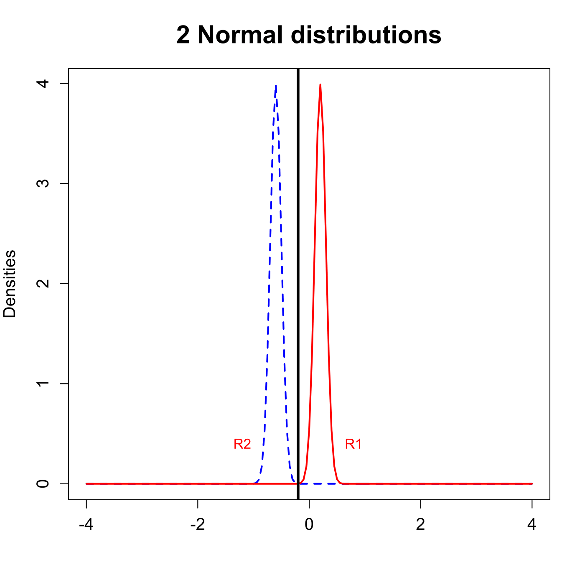
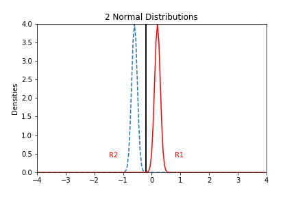

[](http://quantlet.de/)

## [](http://quantlet.de/) **MVAdisnorm** [](http://quantlet.de/)

```yaml

Name of QuantLet: MVAdisnorm

Published in: Applied Multivariate Statistical Analysis

Description: Displays graphically maximum likelihood discrimination rule (ML rule) for 2 normal distributed samples. The inner interval is the allocation set for N(1,0.25), the outer intervals are for observations from N(0,1).

Keywords: discrimination, estimation, discriminant-analysis, maximum-likelihood, normal, normal-distribution, plot, graphical representation

See also: MVAaer, MVAaper, MVAaerbh, MVAdisfbank, MVAdiscbh

Author: Zografia Anastasiadou, Awdesch Melzer
Author[Python]: Matthias Fengler, Liudmila Gorkun-Voevoda

Submitted: Thu, May 10 2012 by Dedy Dwi Prastyo
Submitted[Python]: Wed, September 9 2020 by Liudmila Gorkun-Voevoda

Example: Maximum likelihood rule for 2 normal distributed samples.

```





### PYTHON Code
```python

import numpy as np
import matplotlib.pyplot as plt
from scipy.stats import norm

x = np.arange(-4, 4, 0.05)
s1 	= 0.1  # standard deviation for y1
mu1 	= 0.2  # mean for y1
s2 	= 0.1  # square root of variance for y2
mu2 	= -0.6 # mean for y2

y1 = np.vstack((x, norm.pdf(x = x, loc = mu1, scale = s1))).T
y2 = np.vstack((x, norm.pdf(x = x, loc = mu2, scale = s2))).T

if (mu1 != mu2) and (s1 != s2):
    c1 = -(mu2 * s1**2 - mu1 * s2**2)/(s2**2 - s1**2) + np.sqrt(((mu2 * s1**2 - mu1 * s2**2)/(s2**2 - s1**2))**2 - ((mu1**2 * s2**2 - mu2**2 * s1**2 - 2 * np.log(s2/s1) * s1**2 * s2**2)/(s2**2 - s1**2)))
    c2 = -(mu2 * s1**2 - mu1 * s2**2)/(s2**2 - s1**2) - np.sqrt(((mu2 * s1**2 - mu1 * s2**2)/(s2**2 - s1**2))**2 - ((mu1**2 * s2**2 - mu2**2 * s1**2 - 2 * np.log(s2/s1) * s1**2 * s2**2)/(s2**2 - s1**2)))

elif (mu1 != mu2) and (s1 == s2):
    if (mu2 < 0) and (mu1 < 0):
        c1 = mu2 = (mu2 - mu1)/2
        c2 = c1
    elif (mu2 < 0) and (mu1 >= 0):
        c1 = mu2 - (mu2 - mu1)/2
        c2 = c1
    elif (mu2 == 0) and (mu1 < 0):
        c1 = - np.abs(mu2 - mu1)/2
        c2 = c1
    elif (mu2 > 0) and (mu1 < 0):
        c1 = mu2 - np.abs(mu2 - mu1)/2
        c2 = c1
    elif (mu2 >= 0) and (mu1 >= 0):
        c1 = np.abs(mu2 - mu1)/2
        c2 = c1

elif (mu1 == mu2) and (s1 == s2):
    c1 = np.inf
    c2 = -np.inf

elif (mu1 == mu2) and (s1 != s2):
    c1 = -(mu2 * s1**2 - mu1 * s2**2)/(s2**2 - s1**2) + np.sqrt(((mu2 * s1**2 - mu1 * s2**2)/(s2**2 - s1**2))**2 - ((mu1**2 * s2**2 - mu2**2 * s1**2 - 2 * np.log(s2/s1) * s1**2 * s2**2)/(s2**2 - s1**2)))
    c2 = -(mu2 * s1**2 - mu1 * s2**2)/(s2**2 - s1**2) - np.sqrt(((mu2 * s1**2 - mu1 * s2**2)/(s2**2 - s1**2))**2 - ((mu1**2 * s2**2 - mu2**2 * s1**2 - 2 * np.log(s2/s1) * s1**2 * s2**2)/(s2**2 - s1**2)))
      
limy = [0, max(list(y1[:, 1]) + list(y1[:, 1]))]
if limy[1] < 0.4:
    limy = [0, 0.41]

fig, ax = plt.subplots()
ax.plot(y2[:,0], y2[:, 1], linestyle = "dashed")
ax.plot(y1[:,0], y1[:, 1], c = "r")
ax.vlines(c1, 0, 4.1)
ax.vlines(c2, 0, 4.1)
ax.set_xlim(-4, 4)
ax.set_ylim(0, 4)
ax.set_ylabel("Densities")
plt.title("2 Normal Distributions")

if (c1 == c2) and (s1 == s2):
    if mu2 < 0:
        ax.text(c1 - 1.3, 0.4, "R2", color = "red")
        ax.text(c1 + 1, 0.4, "R1", color = "red")
    else:
        ax.text(c1 - 1.3, 0.4, "R1", color = "red")
        ax.text(c1 + 1, 0.4, "R2", color = "red")
elif (c1 != c2) and (s2 > s1):
    if mu1 > mu2:
        if s1 >= 1:
            ax.text(c1 - 1.3, 0.4, "R2", color = "red")
            ax.text(c1 + 0.8, 0.4, "R1", color = "red")
            ax.text(c1 - 1.1, 0.4, "R1", color = "red")
        elif (s1 >= 0) and (s1 < 0.5):
            ax.text(c1 - s1 - 0.45, 0.4, "R2", color = "red")
            ax.text(c1 + 0.5, 0.4, "R1", color = "red")
            ax.text(c2 - 0.7, 0.4, "R1", color = "red")
        elif (s1 >= 0.5) and (s1 < 1):
            ax.text(c1 - 1.3, 0.4, "R2", color = "red")
            ax.text(c1 + 0.5, 0.4, "R1", color = "red")
            ax.text(c2 - 0.7, 0.4, "R1", color = "red")
    elif mu1 < mu2:
        ax.text(c1 - 1.3, 0.4, "R1", color = "red")
        ax.text(c1 + 1, 0.4, "R2", color = "red")
        ax.text(c2 - 0.7, 0.4, "R2", color = "red")
    elif mu1 == mu2:
        ax.text(c1 - s1 - 0.4, 0.4, "R1", color = "red")
        ax.text(c1 + 1, 0.4, "R2", color = "red")
        ax.text(c2 - 0.7, 0.4, "R2", color = "red")
elif (c1 != c2) and (s2 < s1):
    if mu1 > mu2:
        ax.text(c1 - 1.3, 0.4, "R2", color = "red")
        ax.text(c1 + 1.3, 0.4, "R1", color = "red")
        ax.text(c2 - 0.9, 0.4, "R1", color = "red")
    elif mu1 < mu2:
        if s2 >= 1:
            ax.text(c1 - 1.3, 0.4, "R2", color = "red")
            ax.text(c1 + 0.8, 0.4, "R1", color = "red")
            ax.text(c2 - 1.1, 0.4, "R1", color = "red")
        elif (s2 >= 0) and (s2 < 0.5):
            ax.text(c1 - s2 - 0.45, 0.4, "R2", color = "red")
            ax.text(c1 + 0.5, 0.4, "R1", color = "red")
            ax.text(c2 - 0.7, 0.4, "R1", color = "red")
        elif (s2 >= 0.5) and (s2 < 1):
            ax.text(c1 - 1.3, 0.4, "R2", color = "red")
            ax.text(c1 + 0.5, 0.4, "R1", color = "red")
            ax.text(c2 - 0.7, 0.4, "R1", color = "red")
    elif mu1 == mu2:
        ax.text(c1 - 1.3, 0.4, "R2", color = "red")
        ax.text(c1 + 1, 0.4, "R1", color = "red")
        ax.text(c2 - 0.7, 0.4, "R1", color = "red")
elif (c1 != c2) and (mu1 == mu2):
    ax.text(c1 - 1.3, 0.4, "R1", color = "red")
    ax.text(c1 + 1, 0.4, "R2", color = "red")
    ax.text(c2 - 0.7, 0.4, "R2", color = "red")

plt.show()

```

automatically created on 2020-09-10

### R Code
```r


# clear all variables
rm(list = ls(all = TRUE))
graphics.off()

x 	= seq(-4, 4, 0.05)  	# generates a sequence on real axis
s1 	= 0.1  			# standard deviation for y1
mu1 	= 0.2  			# mean for y1
s2 	= 0.1  			# square root of variance for y2
mu2 	= -0.6  		# mean for y2

y1 = cbind(x, dnorm(x, mean = mu1, sd = s1))  # density y1
y2 = cbind(x, dnorm(x, mean = mu2, sd = s2))  # density y2

if (mu1 != mu2 & s1 != s2) {
    
    # first discrimination point
    c1 = -(mu2 * s1^2 - mu1 * s2^2)/(s2^2 - s1^2) + sqrt(((mu2 * s1^2 - mu1 * s2^2)/(s2^2 - 
        s1^2))^2 - ((mu1^2 * s2^2 - mu2^2 * s1^2 - 2 * log(s2/s1) * s1^2 * s2^2)/(s2^2 - 
        s1^2)))
    
    # second discrimination point
    c2 = -(mu2 * s1^2 - mu1 * s2^2)/(s2^2 - s1^2) - sqrt(((mu2 * s1^2 - mu1 * s2^2)/(s2^2 - 
        s1^2))^2 - ((mu1^2 * s2^2 - mu2^2 * s1^2 - 2 * log(s2/s1) * s1^2 * s2^2)/(s2^2 - 
        s1^2)))
} else if (mu1 != mu2 & s1 == s2) {
    if (mu2 < 0 & mu1 < 0) {
        c1 = mu2 - (mu2 - mu1)/2
        c2 = c1
    } else if (mu2 < 0 & mu1 >= 0) {
        c1 = mu2 - (mu2 - mu1)/2
        c2 = c1
    } else if (mu2 == 0 & mu1 < 0) {
        c1 = -abs(mu2 - mu1)/2
        c2 = c1
    } else if (mu2 > 0 & mu1 < 0) {
        c1 = mu2 - abs(mu2 - mu1)/2
        c2 = c1
    } else if (mu2 >= 0 & mu1 >= 0) {
        c1 = abs(mu2 - mu1)/2
        c2 = c1
    }
} else if (mu1 == mu2 & s1 == s2) {
    c1 = Inf
    c2 = -Inf
} else if (mu1 == mu2 & s1 != s2) {

    # first discrimination point
    c1 = -(mu2 * s1^2 - mu1 * s2^2)/(s2^2 - s1^2) + sqrt(((mu2 * s1^2 - mu1 * s2^2)/(s2^2 - 
        s1^2))^2 - ((mu1^2 * s2^2 - mu2^2 * s1^2 - 2 * log(s2/s1) * s1^2 * s2^2)/(s2^2 - 
        s1^2)))
    
    # second discrimination point
    c2 = -(mu2 * s1^2 - mu1 * s2^2)/(s2^2 - s1^2) - sqrt(((mu2 * s1^2 - mu1 * s2^2)/(s2^2 - 
        s1^2))^2 - ((mu1^2 * s2^2 - mu2^2 * s1^2 - 2 * log(s2/s1) * s1^2 * s2^2)/(s2^2 - 
        s1^2)))
}

limy = c(0, max(y1[, 2], y2[, 2]))
if (limy[2] < 0.4) {
    limy = c(0, 0.41)
}

# Plot
plot(y2, type = "l", lwd = 2, lty = 2, col = "blue", xlab = "", ylab = "Densities", 
    cex.lab = 1.2, cex.axis = 1.2, ylim = limy)
lines(y1, type = "l", lwd = 2, col = "red")
abline(v = c1, lwd = 3)
abline(v = c2, lwd = 3)

if (c1 == c2 & s1 == s2) {
    if (mu2 < 0) {
        text(c1 - 1, 0.4, "R2", col = "red")
        text(c1 + 1, 0.4, "R1", col = "red")
    } else {
        text(c1 - 1, 0.4, "R1", col = "red")
        text(c1 + 1, 0.4, "R2", col = "red")
    }
} else if (c1 != c2 & s2 > s1) {
    if (mu1 > mu2) {
        if (s1 >= 1) {
            text(c1 - 1, 0.4, "R2", col = "red")
            text(c1 + 0.8, 0.4, "R1", col = "red")
            text(c2 - 0.8, 0.4, "R1", col = "red")
        } else if (s1 >= 0 & s1 < 0.5) {
            text(c1 - s1 - 0.15, 0.4, "R2", col = "red")
            text(c1 + 0.5, 0.4, "R1", col = "red")
            text(c2 - 0.4, 0.4, "R1", col = "red")
        } else if (s1 >= 0.5 & s1 < 1) {
            text(c1 - 1, 0.4, "R2", col = "red")
            text(c1 + 0.5, 0.4, "R1", col = "red")
            text(c2 - 0.4, 0.4, "R1", col = "red")
        }
        
        # text(c1-1,0.4,'R1',col='red') text(c1+1,0.4,'R2',col='red')
        # text(c2-0.4,0.4,'R2',col='red')
    } else if (mu1 < mu2) {
        text(c1 - 1, 0.4, "R1", col = "red")
        text(c1 + 1, 0.4, "R2", col = "red")
        text(c2 - 0.4, 0.4, "R2", col = "red")
    } else if (mu1 == mu2) {
        text(c1 - s1 - 0.1, 0.4, "R1", col = "red")
        text(c1 + 1, 0.4, "R2", col = "red")
        text(c2 - 0.4, 0.4, "R2", col = "red")
    }
} else if (c1 != c2 & s2 < s1) {
    if (mu1 > mu2) {
        text(c1 - 1, 0.4, "R2", col = "red")
        text(c1 + 1, 0.4, "R1", col = "red")
        text(c2 - 0.6, 0.4, "R1", col = "red")
    } else if (mu1 < mu2) {
        if (s2 >= 1) {
            text(c1 - 1, 0.4, "R2", col = "red")
            text(c1 + 0.8, 0.4, "R1", col = "red")
            text(c2 - 0.8, 0.4, "R1", col = "red")
        } else if (s2 >= 0 & s2 < 0.5) {
            text(c1 - s2 - 0.15, 0.4, "R2", col = "red")
            text(c1 + 0.5, 0.4, "R1", col = "red")
            text(c2 - 0.4, 0.4, "R1", col = "red")
        } else if (s2 >= 0.5 & s2 < 1) {
            text(c1 - 1, 0.4, "R2", col = "red")
            text(c1 + 0.5, 0.4, "R1", col = "red")
            text(c2 - 0.4, 0.4, "R1", col = "red")
        }
    } else if (mu1 == mu2) {
        text(c1 - 1, 0.4, "R2", col = "red")
        text(c1 + 1, 0.4, "R1", col = "red")
        text(c2 - 0.4, 0.4, "R1", col = "red")
    }
} else if (c1 != c2 & mu1 == mu2) {
    text(c1 - 1, 0.4, "R1", col = "red")
    text(c1 + 1, 0.4, "R2", col = "red")
    text(c2 - 0.4, 0.4, "R2", col = "red")
}

title("2 Normal distributions", cex.main = 1.8) 

```

automatically created on 2020-09-10