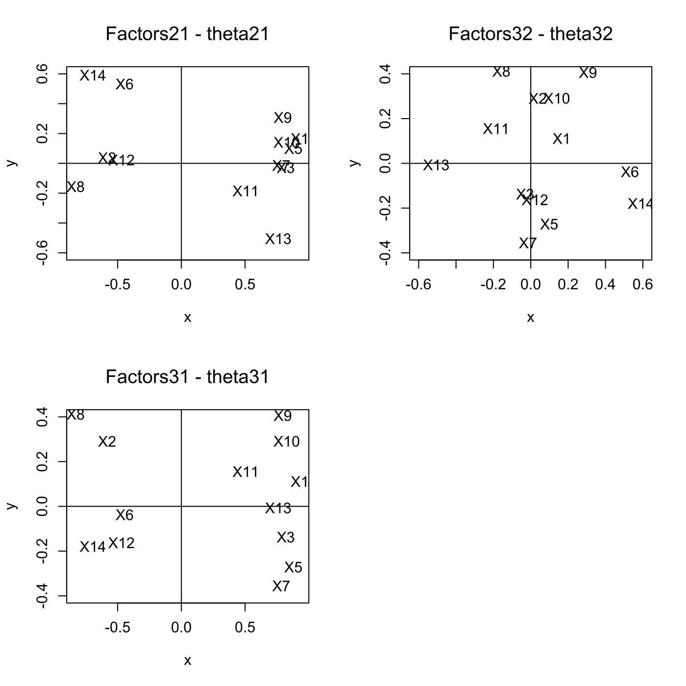
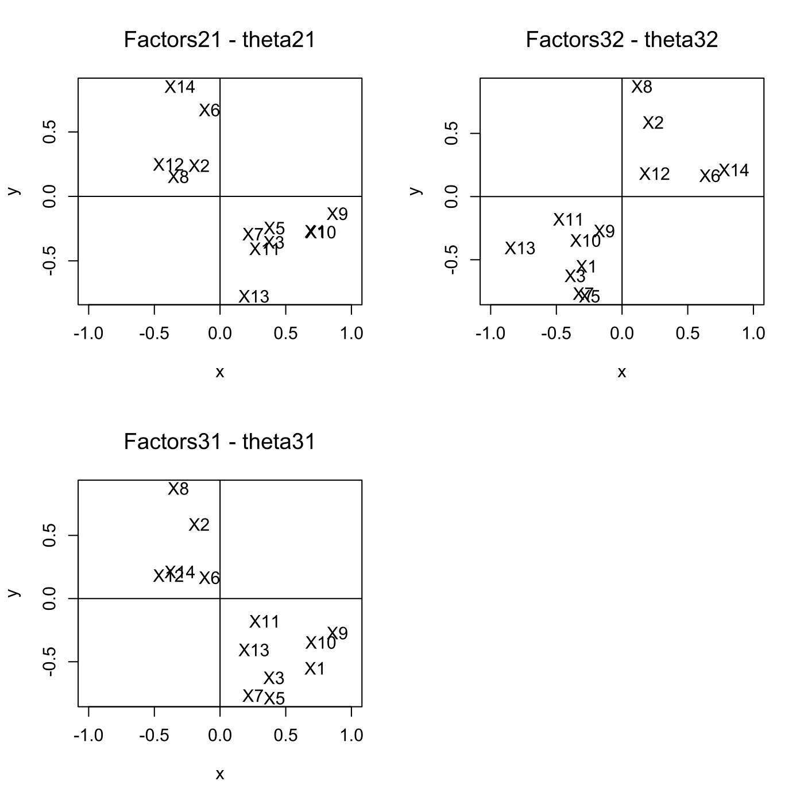
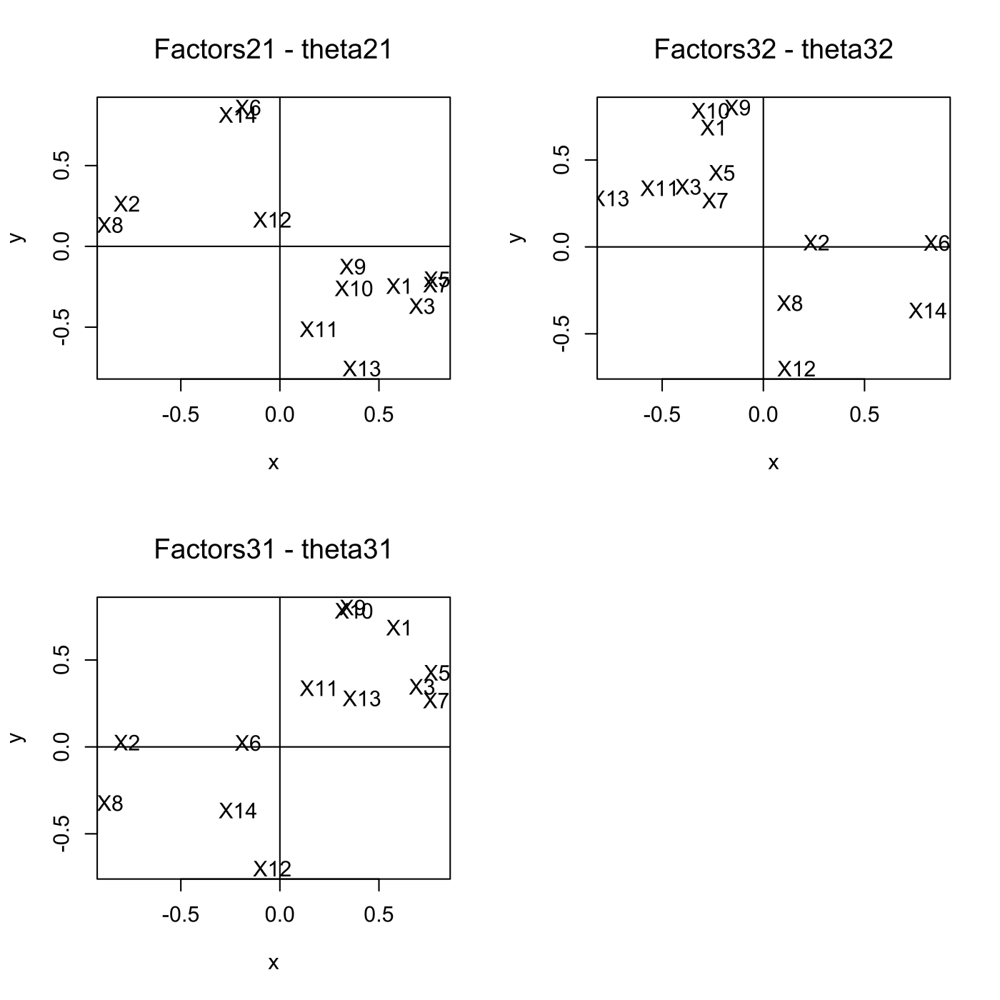
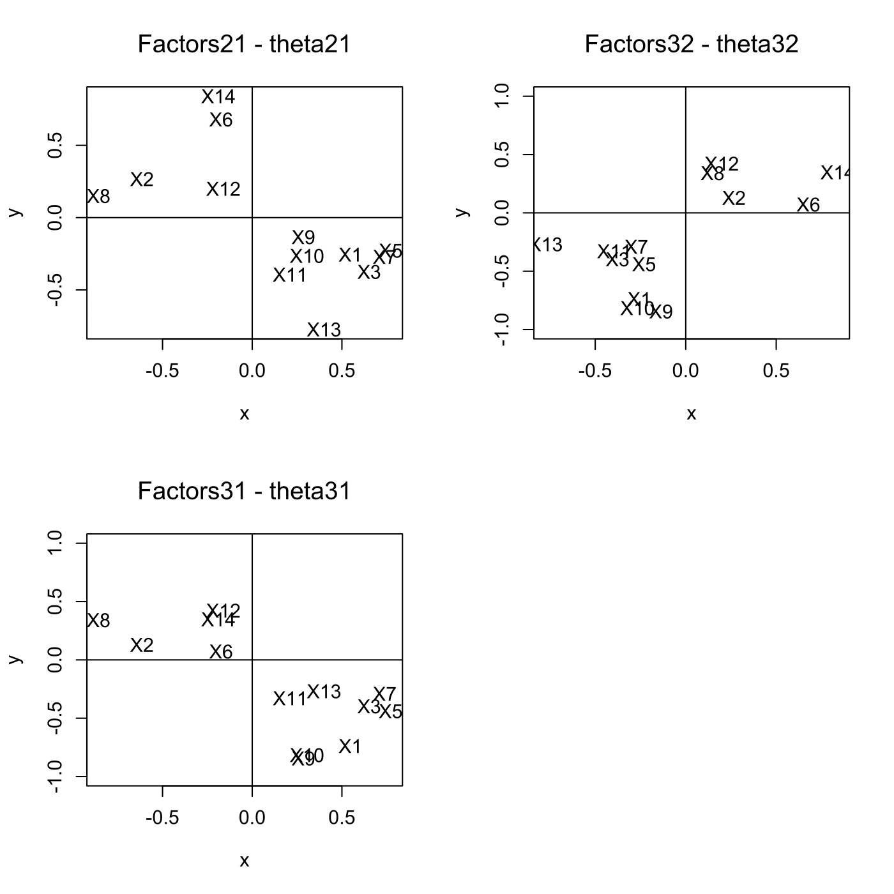
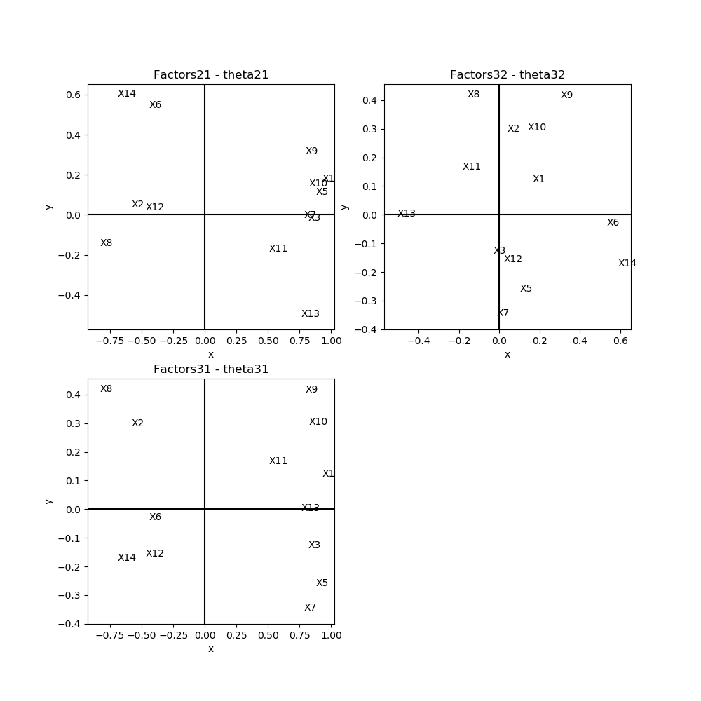
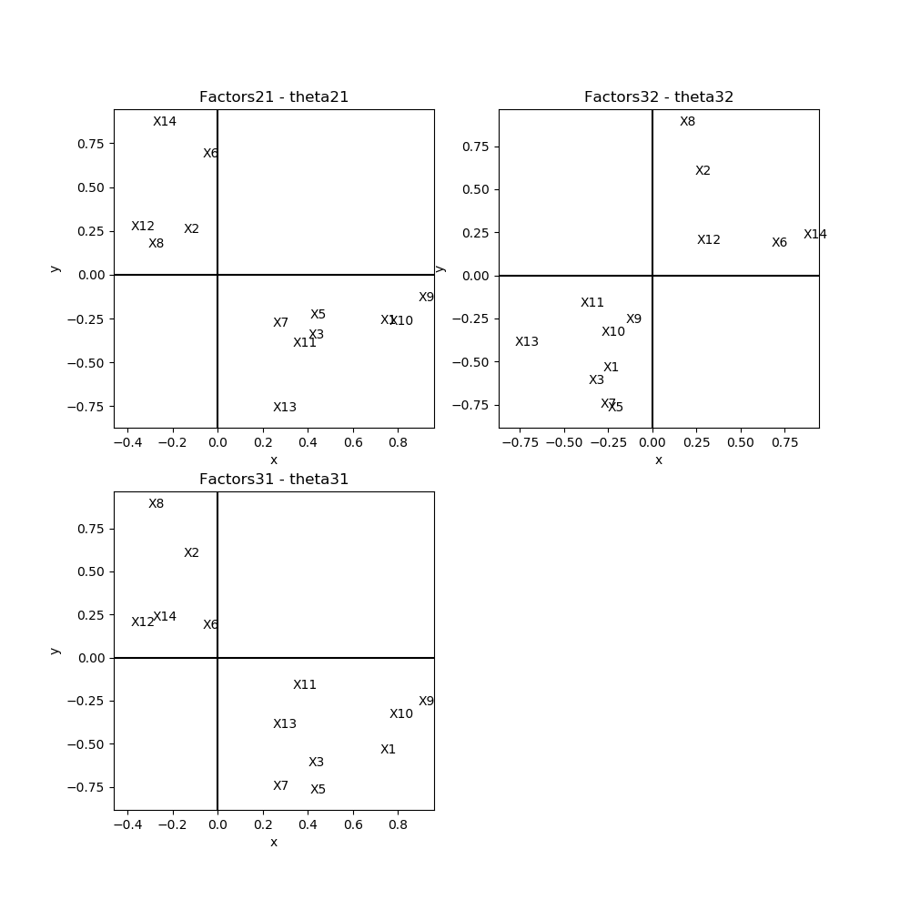
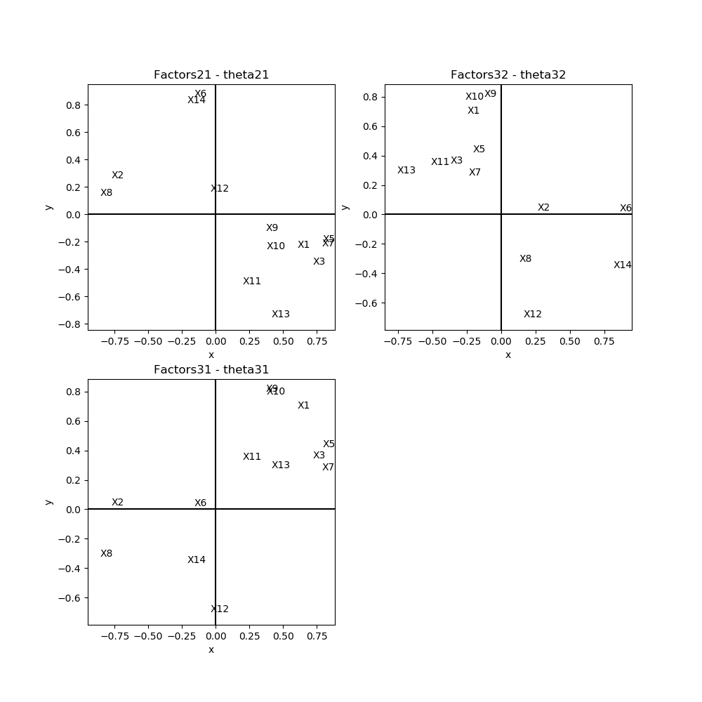
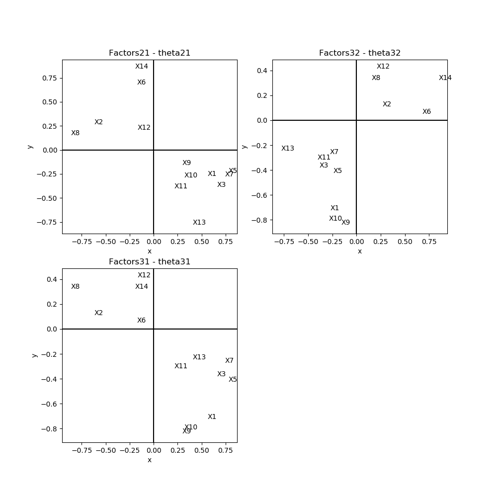

[](http://quantlet.de/)

## [](http://quantlet.de/) **MVAfacthous** [](http://quantlet.de/)

```yaml

Name of QuantLet: MVAfacthous

Published in: Applied Multivariate Statistical Analysis

Description: Performs factor analysis based on 3 factors for the transformed Boston housing data using three different methods.

Keywords: eigenvalues, factor analysis, likelihood, principal-components, spectral-decomposition, standardize, varimax, plot, graphical representation

Author: Zografia Anastasiadou

Author[Python]: 'Matthias Fengler, Liudmila Gorkun-Voevoda'

Submitted: Fri, October 10 2014 by Sergey Nasekin

Submitted[Python]: 'Wed, April 22 2020 by Liudmila Gorkun-Voevoda'

Datafiles: bostonh.dat

Example: 
- 1: Factor analysis for Boston housing data, Maximum Likelihood Method (MLM) without varimax rotation.
- 2: Factor analysis for Boston housing data, Maximum Likelihood Method (MLM) after varimax rotation.
- 3: Factor analysis for Boston housing data, Principal Factor Method (PFM) after varimax rotation.
- 4: Factor analysis for Boston housing data, Principal Component Method (PCM) after varimax rotation.

```

















### R Code
```r


# clear variables and close windows
rm(list = ls(all = TRUE))
graphics.off()

# load data
data = read.table("bostonh.dat")

# transform data
xt = data
xt[, 1]  = log(data[, 1])
xt[, 2]  = data[, 2]/10
xt[, 3]  = log(data[, 3])
xt[, 5]  = log(data[, 5])
xt[, 6]  = log(data[, 6])
xt[, 7]  = (data[, 7]^(2.5))/10000
xt[, 8]  = log(data[, 8])
xt[, 9]  = log(data[, 9])
xt[, 10] = log(data[, 10])
xt[, 11] = exp(0.4 * data[, 11])/1000
xt[, 12] = data[, 12]/100
xt[, 13] = sqrt(data[, 13])
xt[, 14] = log(data[, 14])
data = xt[, -4]

colnames(data) = c("X1", "X2", "X3", "X5", "X6", "X7", "X8", "X9", "X10", "X11", "X12", 
    "X13", "X14") # rename variables
da  = scale(data) # standardize variables
dat = cor(da)     # correlation matrix

# Maximum Likelihood Factor Analysis without varimax rotation factanal performs
mlm  = factanal(da, 3, rotation = "none", covmat = dat)
load = mlm$loadings                           # estimated factor loadings
ld   = cbind(load[, 1], load[, 2], load[, 3]) # the estimated factor loadings matrix
com  = diag(ld %*% t(ld))                     # communalities are calculated
psi  = diag(dat) - diag(ld %*% t(ld))         # specific variances are calculated
tbl  = cbind(load[, 1], load[, 2], load[, 3], com, psi)

dev.new()
par(mfcol = c(2, 2))

# plot first factor against second
plot(load[, 1], load[, 2], type = "n", xlab = "x", ylab = "y", main = "Factors21 - theta21", 
    font.main = 1, cex.lab = 1.1, cex.axis = 1.1, cex.main = 1.4, ylim = c(-0.6, 0.6))
text(load[, 1], load[, 2], colnames(data), cex = 1.1)
abline(h = 0, v = 0)

# plot first factor against third
plot(load[, 1], load[, 3], type = "n", xlab = "x", ylab = "y", main = "Factors31 - theta31", 
    font.main = 1, cex.lab = 1.1, cex.axis = 1.1, cex.main = 1.4, ylim = c(-0.4, 0.4))
text(load[, 1], load[, 3], colnames(data), cex = 1.1)
abline(h = 0, v = 0)

# plot second factor against third
plot(load[, 2], load[, 3], type = "n", xlab = "x", ylab = "y", main = "Factors32 - theta32", 
    font.main = 1, cex.lab = 1.1, cex.axis = 1.1, cex.main = 1.4, xlim = c(-0.6, 0.6), 
    ylim = c(-0.4, 0.4))
text(load[, 2], load[, 3], colnames(data), cex = 1.1)
abline(h = 0, v = 0)

# Maximum Likelihood Factor Analysis after varimax rotation
var  = varimax(ld)                            # rotates the factor loadings matrix
load = var$loadings                           # estimated factor loadings after varimax
vl   = cbind(load[, 1], load[, 2], load[, 3])
com  = diag(vl %*% t(vl))                     # communalities are calculated
psi  = diag(dat) - diag(vl %*% t(vl))         # specific variances are calculated
tbl  = cbind(load[, 1], load[, 2], load[, 3], com, psi)

dev.new()
par(mfcol = c(2, 2))

# plot first factor against second
plot(load[, 1], load[, 2], type = "n", xlab = "x", ylab = "y", main = "Factors21 - theta21", 
    font.main = 1, cex.lab = 1.1, cex.axis = 1.1, cex.main = 1.4, xlim = c(-1, 1))
text(load[, 1], load[, 2], colnames(data), cex = 1.1)
abline(h = 0, v = 0)

# plot first factor against third
plot(load[, 1], load[, 3], type = "n", xlab = "x", ylab = "y", main = "Factors31 - theta31", 
    font.main = 1, cex.lab = 1.1, cex.axis = 1.1, cex.main = 1.4, xlim = c(-1, 1))
text(load[, 1], load[, 3], colnames(data), cex = 1.1)
abline(h = 0, v = 0)

# plot second factor against third
plot(load[, 2], load[, 3], type = "n", xlab = "x", ylab = "y", main = "Factors32 - theta32", 
    font.main = 1, cex.lab = 1.1, cex.axis = 1.1, cex.main = 1.4, xlim = c(-1, 1))
text(load[, 2], load[, 3], colnames(data), cex = 1.1)
abline(h = 0, v = 0)

# Principal Component Method after varimax rotation spectral decomposition
e      = eigen(dat)
eigval = e$values[1:3]
eigvec = e$vectors[, 1:3]
E      = matrix(eigval, nrow(dat), ncol = 3, byrow = T)
Q      = sqrt(E) * eigvec                     # the estimated factor loadings matrix
pcm    = varimax(Q)                           # rotates the factor loadings matrix
load   = pcm$loadings                         # estimated factor loadings after varimax
ld     = cbind(load[, 1], load[, 2], load[, 3])
com    = diag(ld %*% t(ld))                   # communalities are calculated
psi    = diag(dat) - diag(ld %*% t(ld))       # specific variances are calculated
tbl    = cbind(load[, 1], load[, 2], load[, 3], com, psi)

dev.new()
par(mfcol = c(2, 2))

# plot first factor against second
plot(load[, 1], load[, 2], type = "n", xlab = "x", ylab = "y", main = "Factors21 - theta21", 
    font.main = 1, cex.lab = 1.1, cex.axis = 1.1, cex.main = 1.4)
text(load[, 1], load[, 2], colnames(data), cex = 1.1)
abline(h = 0, v = 0)

# plot first factor against third
plot(load[, 1], load[, 3], type = "n", xlab = "x", ylab = "y", main = "Factors31 - theta31", 
    font.main = 1, cex.lab = 1.1, cex.axis = 1.1, cex.main = 1.4)
text(load[, 1], load[, 3], colnames(data), cex = 1.1)
abline(h = 0, v = 0)

# plot second factor against third
plot(load[, 2], load[, 3], type = "n", xlab = "x", ylab = "y", main = "Factors32 - theta32", 
    font.main = 1, cex.lab = 1.1, cex.axis = 1.1, cex.main = 1.4)
text(load[, 2], load[, 3], colnames(data), cex = 1.1)
abline(h = 0, v = 0)

# Principal Factor Method after varimax rotation inverse of the correlation matrix
f      = solve(dat)
psiini = diag(1/f[row(f) == col(f)]) # preliminary estimate of psi
psi    = psiini
for (i in 1:10) {
    ee     = eigen(dat - psi)
    eigval = ee$values[1:3]
    eigvec = ee$vectors[, 1:3]
    EE     = matrix(eigval, nrow(dat), ncol = 3, byrow = T)
    QQ     = sqrt(EE) * eigvec
    psiold = psi
    psi    = diag(as.vector(1 - t(colSums(t(QQ * QQ)))))
    i      = i + 1
    z      = psi - psiold
    convergence = z[row(z) == col(z)]
}
pfm  = varimax(QQ)                             # rotates the factor loadings matrix
load = pfm$loadings                            # estimated factor loadings after varimax
ld   = cbind(load[, 1], load[, 2], load[, 3])
com  = diag(ld %*% t(ld))                      # communalities are calculated
psi  = diag(dat) - diag(ld %*% t(ld))          # specific variances are calculated
tbl  = cbind(load[, 1], load[, 2], load[, 3], com, psi)

dev.new()
par(mfcol = c(2, 2))

# plot first factor against second
plot(load[, 1], load[, 2], type = "n", xlab = "x", ylab = "y", main = "Factors21 - theta21", 
    font.main = 1, cex.lab = 1.1, cex.axis = 1.1, cex.main = 1.4)
text(load[, 1], load[, 2], colnames(data), cex = 1.1)
abline(h = 0, v = 0)

# plot first factor against third
plot(load[, 1], load[, 3], type = "n", xlab = "x", ylab = "y", main = "Factors31 - theta31", 
    font.main = 1, cex.lab = 1.1, cex.axis = 1.1, cex.main = 1.4, ylim = c(-1, 1))
text(load[, 1], load[, 3], colnames(data), cex = 1.1)
abline(h = 0, v = 0)

# plot second factor against third
plot(load[, 2], load[, 3], type = "n", xlab = "x", ylab = "y", main = "Factors32 - theta32", 
    font.main = 1, cex.lab = 1.1, cex.axis = 1.1, cex.main = 1.4, ylim = c(-1, 1))
text(load[, 2], load[, 3], colnames(data), cex = 1.1)
abline(h = 0, v = 0)
```

automatically created on 2020-04-22

### PYTHON Code
```python

import pandas as pd
import numpy as np
import matplotlib.pyplot as plt
from sklearn.decomposition import FactorAnalysis

data = pd.read_csv("bostonh.dat", sep = "\s+", header=None)

xt = data.copy()

for i in [0, 2, 4, 5, 7, 8, 9, 13]:
    xt.iloc[:, i] = np.log(data.iloc[:, i])
    
xt.iloc[:, 1] = data.iloc[:, 1]/10
xt.iloc[:, 6] = (data.iloc[:, 6]**2.5)/10000
xt.iloc[:, 10] = np.exp(0.4 * data.iloc[:, 10])/1000
xt.iloc[:, 11] = (data.iloc[:, 11])/100
xt.iloc[:, 12] = np.sqrt(data.iloc[:, 12])

data = xt.drop(3, axis=1)

cols = []
for i in [1, 2, 3] + list(range(5, 15)):
    cols.append("X" + str(i))

data.columns = cols

da  = (data - np.mean(data))/np.std(data) 
dat = da.corr()


# Maximum Likelihood Factor Analysis without varimax rotation factanal performs
mlm = FactorAnalysis(n_components=3).fit(da)
ld = mlm.components_
com = np.diag(np.dot(ld.T, ld))
psi = np.diag(dat) - com
tbl = pd.DataFrame({"ld1": ld[0], "ld2": ld[1], "ld3": ld[2], "com": com, "psi": psi}, 
                   columns = ["ld1", "ld2", "ld3", "com", "psi"])


fig, axes = plt.subplots(2, 2, figsize = (10, 10))

# plot first factor against second
axes[0, 0].scatter(ld[0], ld[1], c = "w")
for i in range(0, len(cols)):
    axes[0, 0].text(ld[0][i], ld[1][i], cols[i])
axes[0, 0].set_ylim(axes[0, 0].get_ylim()[0], axes[0, 0].get_ylim()[1])
axes[0, 0].set_xlim(axes[0, 0].get_xlim()[0], axes[0, 0].get_xlim()[1])
axes[0, 0].vlines(0, axes[0, 0].get_ylim()[0], axes[0, 0].get_ylim()[1])
axes[0, 0].hlines(0, axes[0, 0].get_xlim()[0], axes[0, 0].get_xlim()[1])
axes[0, 0].set_xlabel("x")
axes[0, 0].set_ylabel("y")
axes[0, 0].set_title("Factors21 - theta21")

# plot second factor against third
axes[0, 1].scatter(ld[1], -ld[2], c = "w")
for i in range(0, len(cols)):
    axes[0, 1].text(ld[1][i], -ld[2][i], cols[i])
axes[0, 1].set_ylim(axes[0, 1].get_ylim()[0], axes[0, 1].get_ylim()[1])
axes[0, 1].set_xlim(axes[0, 1].get_xlim()[0], axes[0, 1].get_xlim()[1])
axes[0, 1].vlines(0, axes[0, 1].get_ylim()[0], axes[0, 1].get_ylim()[1])
axes[0, 1].hlines(0, axes[0, 1].get_xlim()[0], axes[0, 1].get_xlim()[1])
axes[0, 1].set_xlabel("x")
axes[0, 1].set_ylabel("y")
axes[0, 1].set_title("Factors32 - theta32")

# plot first factor against third
axes[1, 0].scatter(ld[0], -ld[2], c = "w")
for i in range(0, len(cols)):
    axes[1, 0].text(ld[0][i], -ld[2][i], cols[i])
axes[1, 0].set_ylim(axes[1, 0].get_ylim()[0], axes[1, 0].get_ylim()[1])
axes[1, 0].set_xlim(axes[1, 0].get_xlim()[0], axes[1, 0].get_xlim()[1])
axes[1, 0].vlines(0, axes[1, 0].get_ylim()[0], axes[1, 0].get_ylim()[1])
axes[1, 0].hlines(0, axes[1, 0].get_xlim()[0], axes[1, 0].get_xlim()[1])
axes[1, 0].set_xlabel("x")
axes[1, 0].set_ylabel("y")
axes[1, 0].set_title("Factors31 - theta31")

fig.delaxes(axes[1,1])

plt.show()


def varimax(Phi, gamma = 1.0, q = 20, tol = 1e-6):
    p,k = Phi.shape
    R = np.eye(k)
    d=0
    for i in range(q):
        d_old = d
        Lambda = np.dot(Phi, R)
        u,s,vh = np.linalg.svd(np.dot(Phi.T,np.asarray(Lambda)**3 - (gamma/p) * np.dot(Lambda, np.diag(np.diag(np.dot(Lambda.T,Lambda))))))
        R = np.dot(u,vh)
        d = sum(s)
        if d_old!=0 and d/d_old < 1 + tol: break
    return np.dot(Phi, R)


# Maximum Likelihood Factor Analysis after varimax rotation

load = varimax(ld.T)

vl = pd.DataFrame({"0": -load[:,2], "1": load[:,1], "2": -load[:,0]})

com = np.diag(np.dot(vl, vl.T))

psi = np.diag(dat) - com

tbl = pd.DataFrame({"ld1": -load[:,2], "ld2": load[:,1], "ld3": -load[:,0], "com": com, "psi": psi}, 
                   columns = ["ld1", "ld2", "ld3", "com", "psi"])


fig, axes = plt.subplots(2, 2, figsize = (10, 10))

# plot first factor against second
axes[0, 0].scatter(vl.iloc[:, 0], vl.iloc[:, 1], c = "w")
for i in range(0, len(cols)):
    axes[0, 0].text(vl.iloc[:, 0][i], vl.iloc[:, 1][i], cols[i])
axes[0, 0].set_ylim(axes[0, 0].get_ylim()[0], axes[0, 0].get_ylim()[1])
axes[0, 0].set_xlim(axes[0, 0].get_xlim()[0], axes[0, 0].get_xlim()[1])
axes[0, 0].vlines(0, axes[0, 0].get_ylim()[0], axes[0, 0].get_ylim()[1])
axes[0, 0].hlines(0, axes[0, 0].get_xlim()[0], axes[0, 0].get_xlim()[1])
axes[0, 0].set_xlabel("x")
axes[0, 0].set_ylabel("y")
axes[0, 0].set_title("Factors21 - theta21")

# plot second factor against third
axes[0, 1].scatter(vl.iloc[:, 1], vl.iloc[:, 2], c = "w")
for i in range(0, len(cols)):
    axes[0, 1].text(vl.iloc[:, 1][i], vl.iloc[:, 2][i], cols[i])
axes[0, 1].set_ylim(axes[0, 1].get_ylim()[0], axes[0, 1].get_ylim()[1])
axes[0, 1].set_xlim(axes[0, 1].get_xlim()[0], axes[0, 1].get_xlim()[1])
axes[0, 1].vlines(0, axes[0, 1].get_ylim()[0], axes[0, 1].get_ylim()[1])
axes[0, 1].hlines(0, axes[0, 1].get_xlim()[0], axes[0, 1].get_xlim()[1])
axes[0, 1].set_xlabel("x")
axes[0, 1].set_ylabel("y")
axes[0, 1].set_title("Factors32 - theta32")

# plot first factor against third
axes[1, 0].scatter(vl.iloc[:, 0], vl.iloc[:, 2], c = "w")
for i in range(0, len(cols)):
    axes[1, 0].text(vl.iloc[:, 0][i], vl.iloc[:, 2][i], cols[i])
axes[1, 0].set_ylim(axes[1, 0].get_ylim()[0], axes[1, 0].get_ylim()[1])
axes[1, 0].set_xlim(axes[1, 0].get_xlim()[0], axes[1, 0].get_xlim()[1])
axes[1, 0].vlines(0, axes[1, 0].get_ylim()[0], axes[1, 0].get_ylim()[1])
axes[1, 0].hlines(0, axes[1, 0].get_xlim()[0], axes[1, 0].get_xlim()[1])
axes[1, 0].set_xlabel("x")
axes[1, 0].set_ylabel("y")
axes[1, 0].set_title("Factors31 - theta31")

fig.delaxes(axes[1,1])

plt.show()


# Principal Component Method after varimax rotation spectral decomposition

e = np.linalg.eig(dat)
eigval = e[0][:3]
eigvec = e[1][:,:3].T
E = np.tile(np.array(eigval), (len(dat), 1))
Q = np.sqrt(E) * eigvec.T
load = varimax(Q)
ld = pd.DataFrame({"0": load[:,0], "1": -load[:,1], "2": load[:,2]})
com = np.diag(np.dot(ld, ld.T))
psi = np.diag(dat) - com
tbl = pd.DataFrame({"ld1": load[:,0], "ld2": -load[:,1], "ld3": load[:,2], "com": com, "psi": psi}, 
                   columns = ["ld1", "ld2", "ld3", "com", "psi"])


fig, axes = plt.subplots(2, 2, figsize = (10, 10))

# plot first factor against second
axes[0, 0].scatter(ld.iloc[:, 0], ld.iloc[:, 1], c = "w")
for i in range(0, len(cols)):
    axes[0, 0].text(ld.iloc[:, 0][i], ld.iloc[:, 1][i], cols[i])
axes[0, 0].set_ylim(axes[0, 0].get_ylim()[0], axes[0, 0].get_ylim()[1])
axes[0, 0].set_xlim(axes[0, 0].get_xlim()[0], axes[0, 0].get_xlim()[1])
axes[0, 0].vlines(0, axes[0, 0].get_ylim()[0], axes[0, 0].get_ylim()[1])
axes[0, 0].hlines(0, axes[0, 0].get_xlim()[0], axes[0, 0].get_xlim()[1])
axes[0, 0].set_xlabel("x")
axes[0, 0].set_ylabel("y")
axes[0, 0].set_title("Factors21 - theta21")

# plot second factor against third
axes[0, 1].scatter(ld.iloc[:, 1], ld.iloc[:, 2], c = "w")
for i in range(0, len(cols)):
    axes[0, 1].text(ld.iloc[:, 1][i], ld.iloc[:, 2][i], cols[i])
axes[0, 1].set_ylim(axes[0, 1].get_ylim()[0], axes[0, 1].get_ylim()[1])
axes[0, 1].set_xlim(axes[0, 1].get_xlim()[0], axes[0, 1].get_xlim()[1])
axes[0, 1].vlines(0, axes[0, 1].get_ylim()[0], axes[0, 1].get_ylim()[1])
axes[0, 1].hlines(0, axes[0, 1].get_xlim()[0], axes[0, 1].get_xlim()[1])
axes[0, 1].set_xlabel("x")
axes[0, 1].set_ylabel("y")
axes[0, 1].set_title("Factors32 - theta32")

# plot first factor against third
axes[1, 0].scatter(ld.iloc[:, 0], ld.iloc[:, 2], c = "w")
for i in range(0, len(cols)):
    axes[1, 0].text(ld.iloc[:, 0][i], ld.iloc[:, 2][i], cols[i])
axes[1, 0].set_ylim(axes[1, 0].get_ylim()[0], axes[1, 0].get_ylim()[1])
axes[1, 0].set_xlim(axes[1, 0].get_xlim()[0], axes[1, 0].get_xlim()[1])
axes[1, 0].vlines(0, axes[1, 0].get_ylim()[0], axes[1, 0].get_ylim()[1])
axes[1, 0].hlines(0, axes[1, 0].get_xlim()[0], axes[1, 0].get_xlim()[1])
axes[1, 0].set_xlabel("x")
axes[1, 0].set_ylabel("y")
axes[1, 0].set_title("Factors31 - theta31")

fig.delaxes(axes[1,1])

plt.show()


# Principal Factor Method after varimax rotation inverse of the correlation matrix

f = np.linalg.inv(dat)
psiini = np.diag(1/np.diagonal(f)) # preliminary estimate of psi
psi = psiini.copy()

for i in range(1, 11):
    ee = np.linalg.eig(dat - psi)
    eigval = ee[0][:3]
    eigvec = ee[1][:,:3].T
    EE = np.tile(np.array(eigval), (len(dat), 1))
    QQ = np.sqrt(EE) * eigvec.T
    psiold = psi.copy()
    psi = np.diag(1 - sum((QQ * QQ).T))
    i += 1
    z = psi - psiold
    convergence = np.diagonal(z)

load = varimax(QQ)
ld = pd.DataFrame({"0": -load[:,0], "1": load[:,1], "2": load[:,2]})
com = np.diag(np.dot(ld, ld.T))
psi = np.diag(dat) - com
tbl = pd.DataFrame({"ld1": -load[:,0], "ld2": load[:,1], "ld3": load[:,2], "com": com, "psi": psi}, 
                   columns = ["ld1", "ld2", "ld3", "com", "psi"])


fig, axes = plt.subplots(2, 2, figsize = (10, 10))

# plot first factor against second
axes[0, 0].scatter(ld.iloc[:, 0], ld.iloc[:, 1], c = "w")
for i in range(0, len(cols)):
    axes[0, 0].text(ld.iloc[:, 0][i], ld.iloc[:, 1][i], cols[i])
axes[0, 0].set_ylim(axes[0, 0].get_ylim()[0], axes[0, 0].get_ylim()[1])
axes[0, 0].set_xlim(axes[0, 0].get_xlim()[0], axes[0, 0].get_xlim()[1])
axes[0, 0].vlines(0, axes[0, 0].get_ylim()[0], axes[0, 0].get_ylim()[1])
axes[0, 0].hlines(0, axes[0, 0].get_xlim()[0], axes[0, 0].get_xlim()[1])
axes[0, 0].set_xlabel("x")
axes[0, 0].set_ylabel("y")
axes[0, 0].set_title("Factors21 - theta21")

# plot second factor against third
axes[0, 1].scatter(ld.iloc[:, 1], ld.iloc[:, 2], c = "w")
for i in range(0, len(cols)):
    axes[0, 1].text(ld.iloc[:, 1][i], ld.iloc[:, 2][i], cols[i])
axes[0, 1].set_ylim(axes[0, 1].get_ylim()[0], axes[0, 1].get_ylim()[1])
axes[0, 1].set_xlim(axes[0, 1].get_xlim()[0], axes[0, 1].get_xlim()[1])
axes[0, 1].vlines(0, axes[0, 1].get_ylim()[0], axes[0, 1].get_ylim()[1])
axes[0, 1].hlines(0, axes[0, 1].get_xlim()[0], axes[0, 1].get_xlim()[1])
axes[0, 1].set_xlabel("x")
axes[0, 1].set_ylabel("y")
axes[0, 1].set_title("Factors32 - theta32")

# plot first factor against third
axes[1, 0].scatter(ld.iloc[:, 0], ld.iloc[:, 2], c = "w")
for i in range(0, len(cols)):
    axes[1, 0].text(ld.iloc[:, 0][i], ld.iloc[:, 2][i], cols[i])
axes[1, 0].set_ylim(axes[1, 0].get_ylim()[0], axes[1, 0].get_ylim()[1])
axes[1, 0].set_xlim(axes[1, 0].get_xlim()[0], axes[1, 0].get_xlim()[1])
axes[1, 0].vlines(0, axes[1, 0].get_ylim()[0], axes[1, 0].get_ylim()[1])
axes[1, 0].hlines(0, axes[1, 0].get_xlim()[0], axes[1, 0].get_xlim()[1])
axes[1, 0].set_xlabel("x")
axes[1, 0].set_ylabel("y")
axes[1, 0].set_title("Factors31 - theta31")

fig.delaxes(axes[1,1])

plt.show()


```

automatically created on 2020-04-22