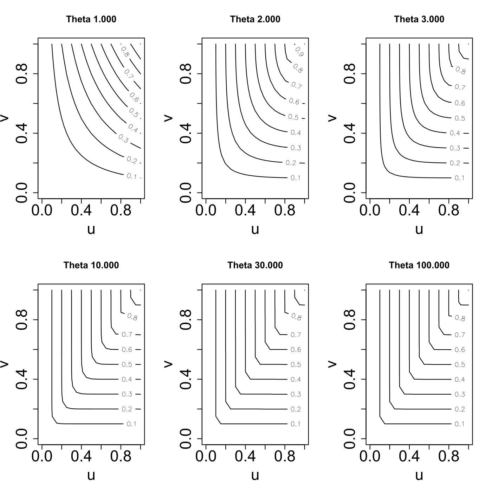
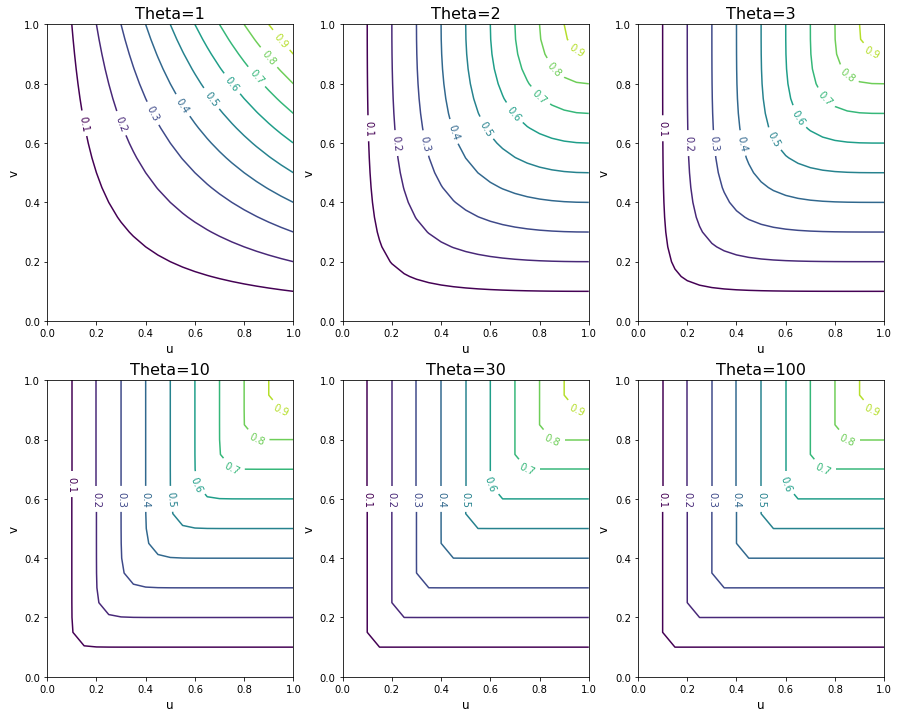

[](http://quantlet.de/)

## [](http://quantlet.de/) **MVAghcontour** [](http://quantlet.de/)

```yaml

Name of QuantLet: MVAghcontour

Published in: Applied Multivariate Statistical Analysis

Description: Gives contour plots of Gumbel-Hougard copula for different theta values (1, 2, 3, 10, 30 and 100).

Keywords: contour, copula, gumbel, plot, graphical representation

See also: MVAsample1000

Author: Song Song
Author[Python]: Matthias Fengler, Tim Dass

Submitted: Thu, August 04 2011 by Awdesch Melzer
Submitted[Python]: Tue, April 16 2024 by Tim Dass

```





### R Code
```r


# clear variables and close windows
rm(list = ls(all = TRUE))
graphics.off()

# Gumbel H Copula is defined as: C(u,v) = exp - ( (-log u)^theta + (-log
# v)^theta )^(1/theta)

f = function(u, v, theta) {
    exp(-((-log(u))^theta + (-log(v))^theta)^(1/theta))
}

N = 21
v = u = seq(0, 1, by = 0.05)
uu = rep(u, N)
vv = rep(v, each = N)
op = par(mfrow = c(2, 3))
theta = 1

# Contour plots with different theta parameters
w = matrix(f(uu, vv, theta), nr = N)
contour(w, cex.axis = 2, cex.lab = 2, main = "Theta 1.000", xlab = "u", ylab = "v", 
    xlim = c(0, 1), ylim = c(0, 1))
theta = 2

w = matrix(f(uu, vv, theta), nr = N)
contour(w, cex.axis = 2, cex.lab = 2, main = "Theta 2.000", xlab = "u", ylab = "v", 
    xlim = c(0, 1), ylim = c(0, 1))
theta = 3

w = matrix(f(uu, vv, theta), nr = N)
contour(w, cex.axis = 2, cex.lab = 2, main = "Theta 3.000", xlab = "u", ylab = "v", 
    xlim = c(0, 1), ylim = c(0, 1))
theta = 10

w = matrix(f(uu, vv, theta), nr = N)
contour(w, cex.axis = 2, cex.lab = 2, main = "Theta 10.000", xlab = "u", ylab = "v", 
    xlim = c(0, 1), ylim = c(0, 1))
theta = 30

w = matrix(f(uu, vv, theta), nr = N)
contour(w, cex.axis = 2, cex.lab = 2, main = "Theta 30.000", xlab = "u", ylab = "v", 
    xlim = c(0, 1), ylim = c(0, 1))
theta = 100

w = matrix(f(uu, vv, theta), nr = N)
contour(w, cex.axis = 2, cex.lab = 2, main = "Theta 100.000", xlab = "u", ylab = "v", 
    xlim = c(0, 1), ylim = c(0, 1))

par(op)
```

automatically created on 2024-04-25

### PYTHON Code
```python

# works on numpy 1.23.5 and matplotlib 3.6.2
import numpy as np
import matplotlib.pyplot as plt

contours = np.arange(0.1,1.01,0.1)
theta = [1,2,3,10,30,100]
N = 21
fig, axs = plt.subplots(2,3, figsize=(15,12))

axs = axs.ravel()

for i,theta in enumerate(theta):

    v = u = np.arange(0, 1.01, 0.05)
    uu = np.tile(u,N)
    vv = np.repeat(v,N)
    w = np.exp(-((-np.log(uu))**theta + (-np.log(vv))**theta)**(1/theta))
    ww = w.reshape(N,N)
    xx,yy = np.meshgrid(u,v)
    
    CS = axs[i].contour(xx,yy,ww, contours)
    axs[i].set_title("Theta=%d" % theta, fontsize = 16)
    axs[i].set_xlabel("u", fontsize = 12)
    axs[i].set_ylabel("v", fontsize = 12)
    axs[i].clabel(CS, contours)

plt.show()
```

automatically created on 2024-04-25