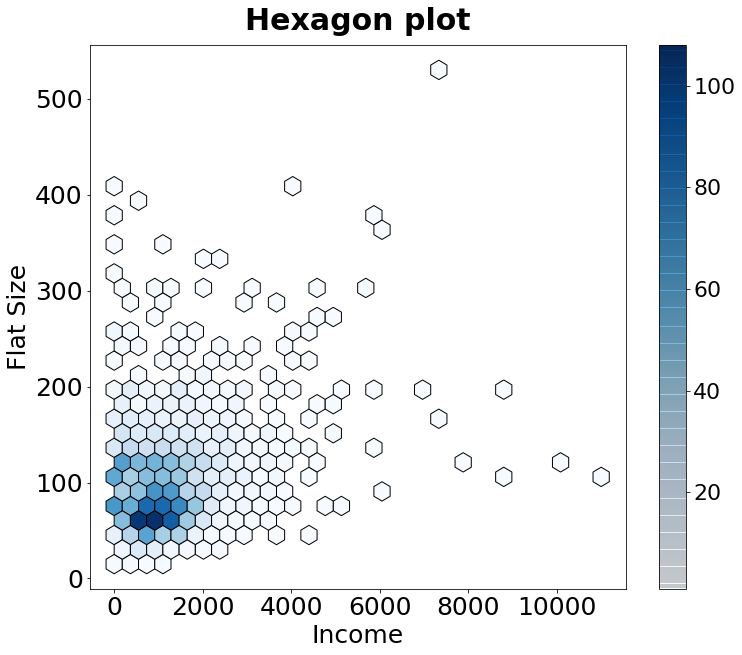

[](http://quantlet.de/)

## [](http://quantlet.de/) **MVAincomeLi** [](http://quantlet.de/)

```yaml

Name of QuantLet: MVAincomeLi

Published in: Applied Multivariate Statistical Analysis

Description: Hexagon plot between Income and Flat size.

Keywords: plot, graphical representation, hexagon-plot, data visualization, financial, sas

See also: MVAageCom, MVAageIncome

Author: Vinh Hanh Lieu
Author[SAS]: Svetlana Bykovskaya
Author[Python]: Matthias Fengler, Tim Dass

Submitted: Thu, August 04 2011 by Awdesch Melzer
Submitted[SAS]: Wen, April 6 2016 by Svetlana Bykovskaya
Submitted[Python]: Tue, April 16 2024 by Tim Dass

Datafile: allbus.csv

```





### PYTHON Code
```python

#works on pandas 1.5.2 and matplotlib 3.6.2
import pandas as pd
import matplotlib.pyplot as plt

# Load data
allbus = pd.read_csv("allbus.csv", sep=";", decimal=",")
allbus1 = allbus.iloc[:, [2,7]]

# Exclude invalid observations
allbus1 = allbus1[(allbus1['NETTOEIN'] < 99997) & (allbus1['WOHNFLAE'] < 998)]

# Get ages and net income
netincome = allbus1.iloc[:, 0]
living_space = allbus1.iloc[:, 1]

#create plot
fig, ax = plt.subplots(figsize=(12,10))
hb = ax.hexbin(netincome, living_space, gridsize=30, cmap='Blues',
                edgecolors = 'black', mincnt = 1)
ax.set_title("Hexagon plot", fontweight = 'bold', fontsize = 30, pad = 15)
ax.set_xlabel("Income", fontsize = 25)
ax.set_ylabel("Flat Size", fontsize = 25)
ax.tick_params(axis='both', labelsize=25)
cbar = fig.colorbar(hb, drawedges = True) 
cbar.ax.tick_params(labelsize=22)

plt.show()
```

automatically created on 2024-04-25

### R Code
```r


# clear all variables
rm(list = ls(all = TRUE))
graphics.off()

# install and load packages
libraries = c("hexbin")
lapply(libraries, function(x) if (!(x %in% installed.packages())) {
    install.packages(x)
})
lapply(libraries, library, quietly = TRUE, character.only = TRUE)

# load data
allbus  = read.csv2("allbus.csv")
allbus7 = allbus[, c(3, 8)]

# exclude unvalid observations
allbus7       = allbus7[(allbus7$NETTOEIN < 99997) & (allbus7$WOHNFLAE < 998), ]
living_space  = allbus7[, 2]
netincome     = allbus7[, 1]

# hexagon plot
hexbinplot(living_space ~ netincome, main="Hexagon plot", xlab = "Income", ylab = "Flat Size", style = "colorscale", 
    border = TRUE, aspect = 1, trans = sqrt, inv = function(netincome) netincome^2)

```

automatically created on 2024-04-25

### SAS Code
```sas


* Import the data;
data allbus;
  infile '/folders/myfolders/Sas-work/data/allbus.csv' dlm=';' dsd firstobs=2;
  input t1 $ t2 $ t3 $ t4 $ t5 $ t6 $ t7 $ t8 $ t9 $ t10 $ ;
  drop t1-t2 t4-t7 t9-t10;
  
run;

proc iml;
  * Read data into a matrix;
  use allbus;
    read all var _ALL_ into x; 
  close allbus;
  
  x = num(x);
  
  create datax from x[colname={"netincome" "living_space"}];
    append from x;
  close datax;
quit;

* Exclude unvalid observations;
data new;
  set datax;
  if (netincome < 99997 & living_space < 998);
run;

%macro HexBin(dsName, xName, yName, xlab, ylab, nBins=36, colorramp=TwoColorRamp);
  ods select none;
  ods output fitplot=_HexMap;  /* write graph data to a data set */
  proc surveyreg data=&dsname plots(nbins=&nBins weight=heatmap)=fit(shape=hex);
    model &yName = &xName;
  run;
  ods select all;
 
  proc sgplot data=_HexMap;
    polygon x=XVar y=YVar ID=hID / colorresponse=WVar fill 
                                    colormodel=&colorramp;
    xaxis label = &xlab;
    yaxis label = &ylab;
  run;
%mend;

title 'Hexagon plot';
%HexBin(new, netincome, living_space, 'Income', 'Flat Size');

```

automatically created on 2024-04-25