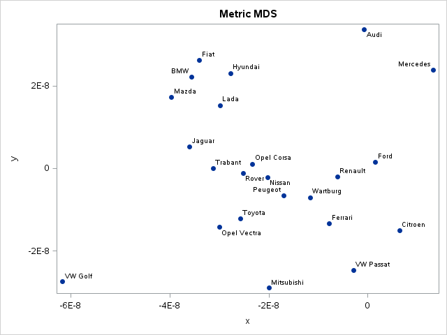
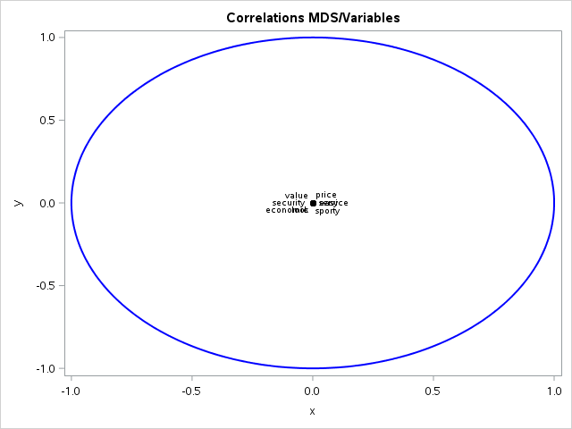
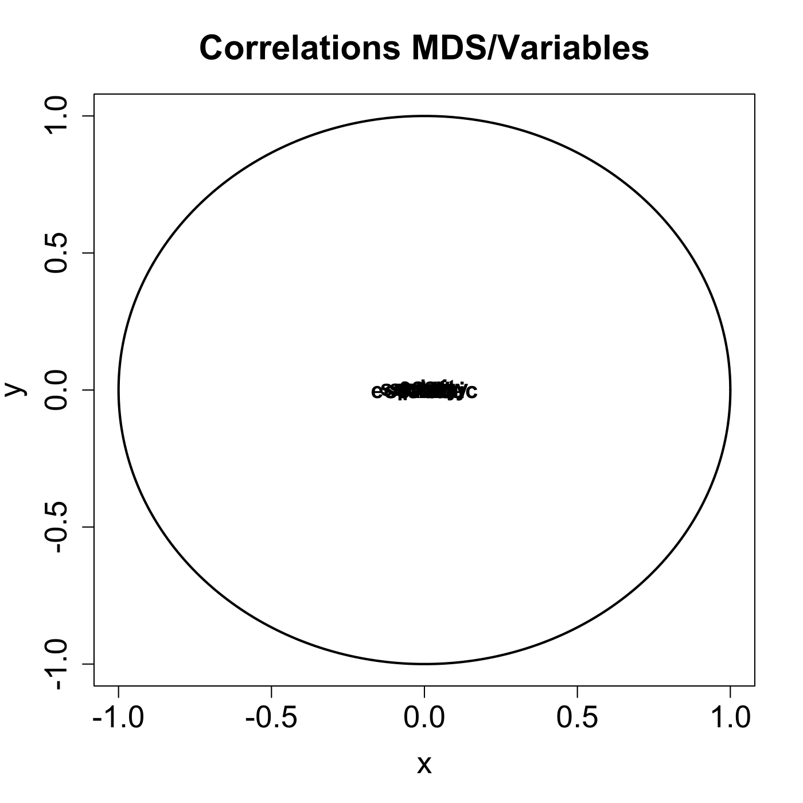
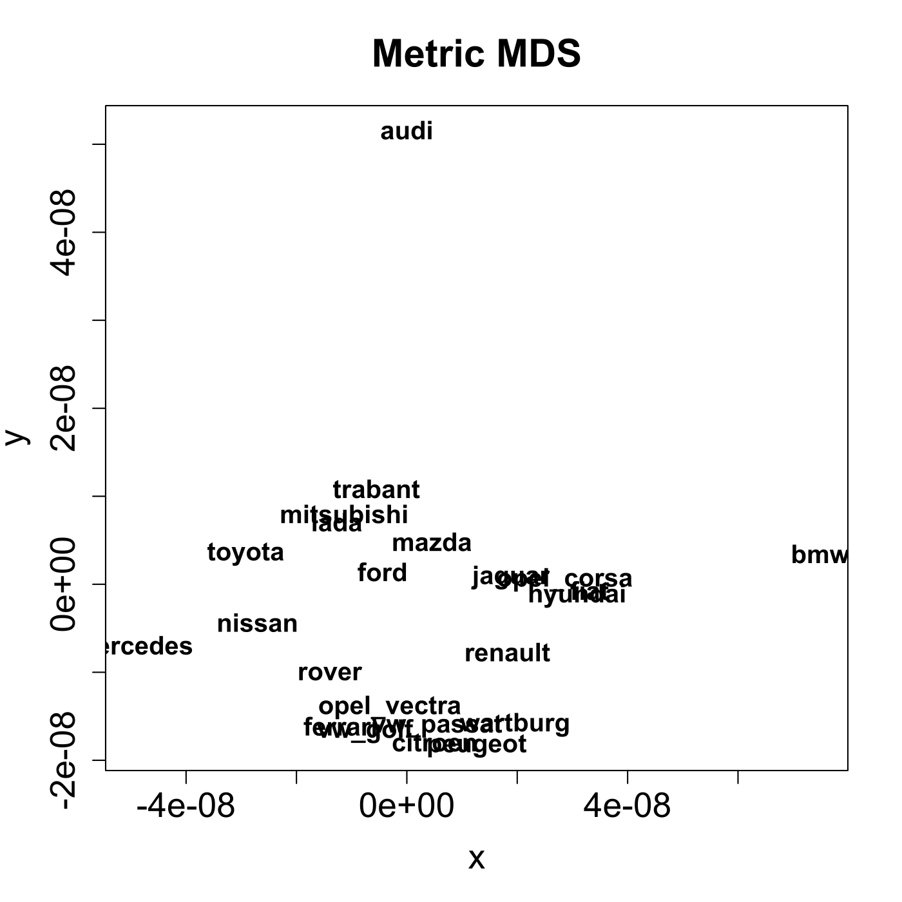

[](http://quantlet.de/)

## [](http://quantlet.de/) **MVAmdscarm** [](http://quantlet.de/)

```yaml

Name of QuantLet : MVAmdscarm

Published in : Applied Multivariate Statistical Analysis

Description : 'Performs a multidimensional scaling (MDS) for the car marks data and shows the plots
for the MDS and for the MDS/variables correlations.'

Keywords : 'MDS, multi-dimensional, scaling, principal-components, correlation, plot, graphical
representation, data visualization, sas'

See also : 'MVAMDScity1, MVAMDScity2, MVAMDSnonmstart, MVAMDSpooladj, MVAnmdscar2, MVAnmdscar3,
MVAcancarm, SMScancarm, SMScancarm1, SMScancarm2'

Author : Zografia Anastasiadou

Author[SAS] : Svetlana Bykovskaya

Submitted : Thu, November 06 2014 by Sergey Nasekin

Submitted[SAS] : Wen, April 6 2016 by Svetlana Bykovskaya

Datafile : carmean2.dat, carmean2_sas.dat

```










### R Code:
```r

# clear all variables
rm(list = ls(all = TRUE))
graphics.off()

# load data
cardat = read.table("carmean2.dat")
car    = cardat[, -1]                             # delete the first column (names of the car marks)

# define variable names
colnames(car) = c("economic", "service", "value", "price", "look", "sporty", "security", 
    "easy")                             

# define car marks
rownames(car) = c("audi", "bmw", "citroen", "ferrari", "fiat", "ford", "hyundai", 
    "jaguar", "lada", "mazda", "mercedes", "mitsubishi", "nissan", "opel_corsa", 
    "opel_vectra", "peugeot", "renault", "rover", "toyota", "trabant", "vw_golf", 
    "vw_passat", "wartburg")            

dist  = dist(car, method = "euclidean", p = 2)      # euclidean distance matrix
dist2 = dist^2                                      # squared euclidean distance matrix
dista = as.matrix(dist2)                            # distance matrix
d     = as.vector(rowMeans(dista))                  # compute mean for every row of the distance matrix
B     = 0.5 * (t(dista - d) - d + mean(d))          # inner product matrix

# spectral decomposition
eig   = eigen(B)
eva   = eig$values
eve   = eig$vectors[, 1:2]
sq    = matrix(sqrt(eva[1:2]), NROW(eva), NCOL(eve), byrow = T)

# the coordinate matrix which contains the point configuration
q     = eve * sq
corr  = cor(cbind(q, car))
r     = matrix(corr, nrow(corr), ncol(corr))

# extract the first two principal components
r     = r[3:ncol(r), 1:2]

# Plot for the MDS solution on the car data
dev.new()
plot(q, type = "n", xlab = "x", ylab = "y", main = "Metric MDS", cex.lab = 1.6, cex.axis = 1.6, 
    cex.main = 1.8)
text(q, rownames(car), cex = 1.2, font = 2)

# Plot for the correlation between the MDS direction and the variables
dev.new()
ucircle = cbind(cos((0:360)/180 * pi), sin((0:360)/180 * pi))
plot(ucircle, type = "l", lty = "solid", main = "Correlations MDS/Variables", xlab = "x", 
    ylab = "y", cex.lab = 1.6, cex.axis = 1.6, cex.main = 1.8, lwd = 2)
text(r, colnames(car), cex = 1.2, font = 2) 

```

### SAS Code:
```sas

* Import the data;
data carmean2;
  infile '/folders/myfolders/data/carmean2_sas.dat';
  input t0 $ t1-t8;
run;
  
proc distance data = carmean2 out = dist method = sqeuclid nostd;
   var interval(t1--t8);
run;

proc iml;
  * Read data into a matrix;
  use carmean2;
    read all var _ALL_ into x; 
  close carmean2;
  
  use dist;
    read all var _ALL_ into y; 
  close dist;
  
  colnames = {"economic", "service", "value", "price", "look", "sporty", "security", 
    "easy"}; 
  rownames = {"Audi", "BMW", "Citroen", "Ferrari", "Fiat", "Ford", "Hyundai", 
    "Jaguar", "Lada", "Mazda", "Mercedes", "Mitsubishi", "Nissan", "Opel Corsa", 
    "Opel Vectra", "Peugeot", "Renault", "Rover", "Toyota", "Trabant", "VW Golf", 
    "VW Passat", "Wartburg"};
  
  n = nrow(y);
  do i = 1 to n;
    do j = i + 1 to n;
      y[i,j] = y[j,i];
    end;
  end;
  
  d = y[:,];                            * mean for every row of the distance matrix;
  B = 0.5 * ((y - d)` - d + d[:,:]);    * inner product matrix;
  
  * spectral decomposition;
  eva = eigval(B);
  eve = eigvec(B)[, 1:2];
  sq = repeat (sqrt(eva[1:2])`, nrow(eva), 1);
  
  * the coordinate matrix which contains the point configuration;
  q = eve # sq;
  corr = corr(q || x);
  
  r = corr[3:ncol(corr), 1:2];          * extract the first two principal components;
  
  x1 = q[,1];
  x2 = q[,2];
  y1 = r[,1];
  y2 = r[,2];
  
  pi = constant("pi");
  uc = (cos((0:360)/180 * pi) // sin((0:360)/180 * pi))`;
  u1 = uc[,1];
  u2 = uc[,2];
  
  create plot var {"x1" "x2" "u1" "u2" "y1" "y2" "rownames" "colnames"};
    append;
  close plot;
quit;
    
* Plot for the MDS solution on the car data;
proc sgplot data = plot
    noautolegend;
  title 'Metric MDS';
  scatter x = x1 y = x2 / markerattrs = (symbol = circlefilled)
    datalabel = rownames;
  xaxis label = 'x';
  yaxis label = 'y';
run;

* Plot for the correlation between the MDS direction and the variables;
proc sgplot data = plot
    noautolegend;
  title 'Correlations MDS/Variables';
  series  x = u1 y = u2 / lineattrs = (color = blue THICKNESS = 2);
  scatter x = y1 y = y2 / markerattrs = (color = black symbol = circlefilled)
    datalabel = colnames;
  xaxis label = 'x';
  yaxis label = 'y';
run;


```
