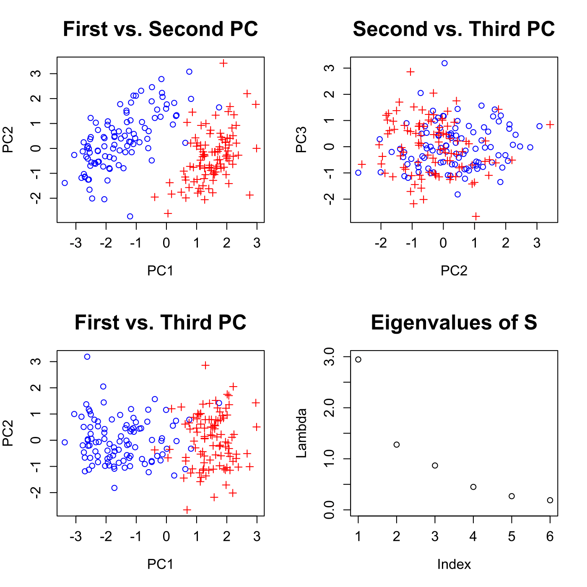
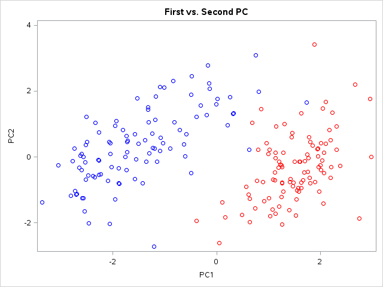
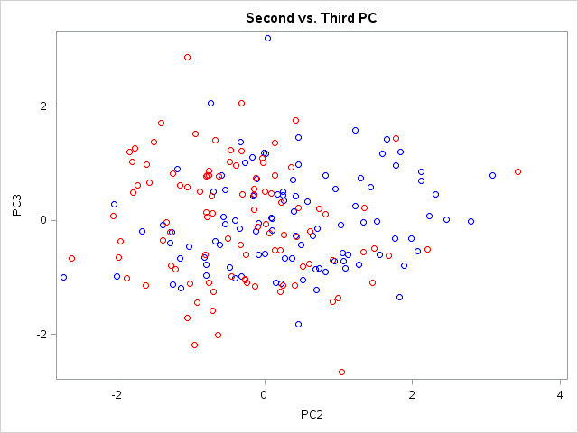
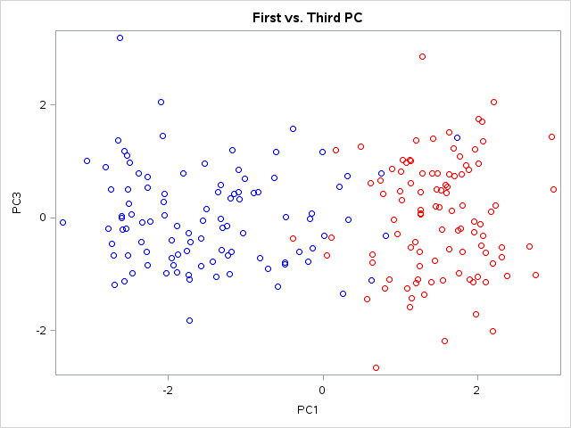
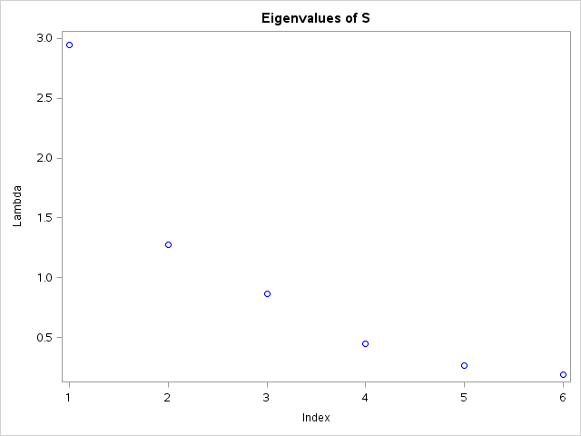

[](http://quantlet.de/)

## [](http://quantlet.de/) **MVAnpcabank** [](http://quantlet.de/)

```yaml

Name of QuantLet : MVAnpcabank

Published in : Applied Multivariate Statistical Analysis

Description : 'Performs a PCA for the standardized Swiss bank notes and shows the first three
principal components in two-dimensional scatterplots. Additionally, a screeplot of the eigenvalues
is displayed.'

Keywords : 'principal-components, pca, npca, eigenvalues, standardization, scatterplot, screeplot,
plot, graphical representation, data visualization, sas'

See also : 'MVAnpcabanki, MVAnpcahous, MVAnpcahousi, MVAnpcatime, MVAnpcafood, MVAnpcausco,
MVAnpcausco2, MVAnpcausco2i, MVAcpcaiv, MVApcabank, MVApcabanki, MVApcabankr, MVApcasimu'

Author : Zografia Anastasiadou

Author[SAS] : Svetlana Bykovskaya

Submitted : Thu, August 04 2011 by Awdesch Melzer

Submitted[SAS] : Wen, April 6 2016 by Svetlana Bykovskaya

Datafile : bank2.dat

Example : Principal components of the standardized bank data.

```












### R Code:
```r

# clear all variables
rm(list = ls(all = TRUE))
graphics.off()

# load data
x  = read.table("bank2.dat")
x  = scale(x)                    # standardizes the data matrix
e  = eigen(cov(x))               # calculates eigenvalues and eigenvectors and sorts them by size
e1 = e$values
x  = as.matrix(x) %*% e$vectors  # data multiplied by eigenvectors

# plot of the first vs. second PC
par(mfrow = c(2, 2))
plot(x[, 1], x[, 2], pch = c(rep(1, 100), rep(3, 100)), col = c(rep("blue", 100), 
    rep("red", 100)), xlab = "PC1", ylab = "PC2", main = "First vs. Second PC", cex.lab = 1.2, 
    cex.axis = 1.2, cex.main = 1.8)

# plot of the second vs. third PC
plot(x[, 2], x[, 3], pch = c(rep(1, 100), rep(3, 100)), col = c(rep("blue", 100), 
    rep("red", 100)), xlab = "PC2", ylab = "PC3", main = "Second vs. Third PC", cex.lab = 1.2, 
    cex.axis = 1.2, cex.main = 1.8)

# plot of the first vs. third PC
plot(x[, 1], x[, 3], pch = c(rep(1, 100), rep(3, 100)), col = c(rep("blue", 100), 
    rep("red", 100)), xlab = "PC1", ylab = "PC2", main = "First vs. Third PC", cex.lab = 1.2, 
    cex.axis = 1.2, cex.main = 1.8)

# plot of the eigenvalues
plot(e1, ylim = c(0, 3), xlab = "Index", ylab = "Lambda", main = "Eigenvalues of S", 
    cex.lab = 1.2, cex.axis = 1.2, cex.main = 1.8) 

```

### SAS Code:
```sas

* Import the data;
data b2;
  infile '/folders/myfolders/Sas-work/data/bank2.dat';
  input x1-x6;
run;

* standardize the data matrix;
proc standard data = b2 mean = 0 std = 1 out = y;
  var x1 x2 x3 x4 x5 x6;
run;

proc iml;
  * Read data into a matrix;
  use y;
    read all var _ALL_ into x; 
  close y;
  
  e2 = eigval(cov(x));
  x  = x * eigvec(cov(x));
  id = (repeat ({1}, 1, 100) || repeat ({2}, 1, 100))`;
  
  x1 = -x[,1];
  x2 = x[,2];
  x3 = x[,3];
  e1 = 1:nrow(e2);
  create plot var {"x1" "x2" "x3" "e1" "e2" "id"};
    append;
  close plot;
quit;

* plot of the first vs. second PC;
proc sgplot data = plot
    noautolegend;
  title 'First vs. Second PC';
  scatter x = x1 y = x2 / colorresponse = id colormodel = (blue red);
  xaxis label = 'PC1';
  yaxis label = 'PC2';
run;

* plot of the second vs. third PC;
proc sgplot data = plot
    noautolegend;
  title 'Second vs. Third PC';
  scatter x = x2 y = x3 / colorresponse = id colormodel = (blue red);
  xaxis label = 'PC2';
  yaxis label = 'PC3';
run;

* plot of the first vs. third PC;
proc sgplot data = plot
    noautolegend;
  title 'First vs. Third PC';
  scatter x = x1 y = x3 / colorresponse = id colormodel = (blue red);
  xaxis label = 'PC1';
  yaxis label = 'PC3';
run;

* plot of the eigenvalues;
proc sgplot data = plot
    noautolegend;
  title 'Eigenvalues of S';
  scatter x = e1 y = e2 / markerattrs = (color = blue);
  xaxis label = 'Index';
  yaxis label = 'Lambda';
run;


   

```
