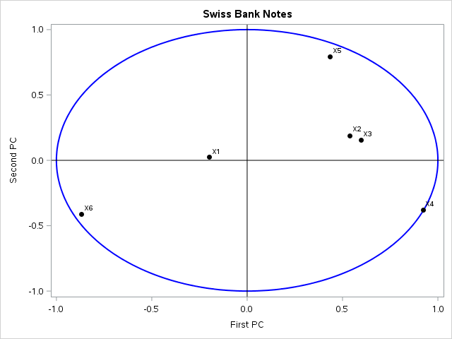
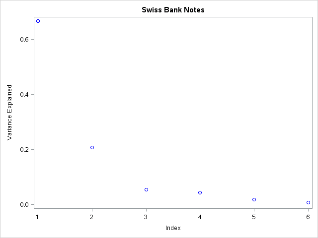
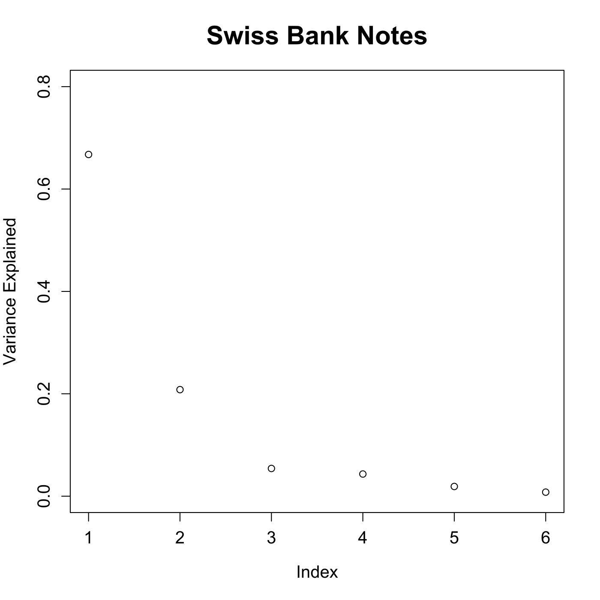
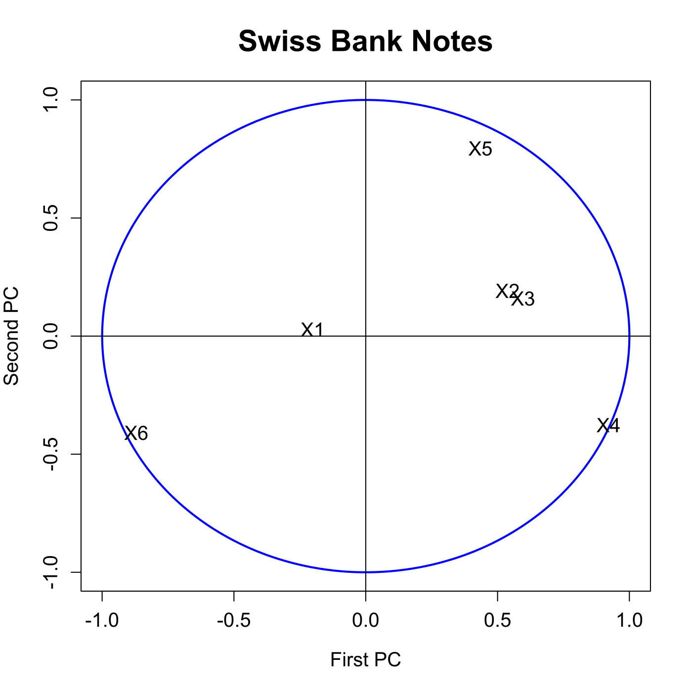

[](http://quantlet.de/)

## [](http://quantlet.de/) **MVApcabanki** [](http://quantlet.de/)

```yaml

Name of QuantLet : MVApcabanki

Published in : Applied Multivariate Statistical Analysis

Description : 'Shows a screeplot of the eigenvalues for the PCA of the Swiss bank notes. It
computes the correlations between the variables and the principal components and displays the first
two of them.'

Keywords : 'principal-components, pca, eigenvalues, screeplot, plot, graphical representation, data
visualization, correlation, sas'

See also : 'MVAnpcabanki, MVAnpcabank, MVAnpcahousi, MVAnpcatime, MVAnpcafood, MVAnpcausco,
MVAnpcausco2, MVAnpcausco2i, MVAcpcaiv, MVAnpcahous, MVApcabank, MVApcabankr, MVApcasimu'

Author : Zografia Anastasiadou

Author[SAS] : Svetlana Bykovskaya

Submitted : Mon, June 30 2014 by Franziska Schulz

Submitted[SAS] : Wen, April 6 2016 by Svetlana Bykovskaya

Datafile : bank2.dat

Example: 
- 1: Relative proportion of variance explained by PCs.
- 2: First vs Second PC.

```










### R Code:
```r

# clear all variables
rm(list = ls(all = TRUE))
graphics.off()

# load data
x  = read.table("bank2.dat")
n  = nrow(x)
e  = eigen((n - 1) * cov(x)/n)  # calculates eigenvalues and eigenvectors and sorts them by size
e1 = e$values/sum(e$values)

# plot for the relative proportion of variance explained by PCs
dev.new()
plot(e1, ylim = c(0, 0.8), xlab = "Index", ylab = "Variance Explained", main = "Swiss Bank Notes", 
    cex.lab = 1.2, cex.axis = 1.2, cex.main = 1.8)

m    = apply(as.matrix(x), 2, mean)
temp = as.matrix(x - matrix(m, n, ncol(x), byrow = T))
r    = temp %*% e$vectors
r    = cor(cbind(r, x))  # correlation between PCs and variables
r1   = r[7:12, 1:2]      # correlation of the two most important PCs and variables

# plot for the correlation of the original variables with the PCs
dev.new()
ucircle = cbind(cos((0:360)/180 * pi), sin((0:360)/180 * pi))
plot(ucircle, type = "l", lty = "solid", col = "blue", xlab = "First PC", ylab = "Second PC", 
    main = "Swiss Bank Notes", cex.lab = 1.2, cex.axis = 1.2, cex.main = 1.8, lwd = 2)
abline(h = 0, v = 0)
label = c("X1", "X2", "X3", "X4", "X5", "X6")
text(r1, label, cex = 1.2) 

```

### SAS Code:
```sas

* Import the data;
data b2;
  infile '/folders/myfolders/Sas-work/data/bank2.dat';
  input x1-x6;
run;

proc iml;
  * Read standardized data into a matrix;
  use b2;
    read all var _ALL_ into x; 
  close b2;
  
  n  = nrow(x);
  e  = (n - 1) * cov(x) / n; * spectral decomposition;
  e1 = 1:6;
  e2 = eigval(e)/sum(eigval(e));

  m  = x[:];
  t  = x - repeat(m, n, ncol(x));
  r  = t * eigvec(e);
  r  = corr(r || x);    * correlation between PCs and variables;
  r  = r[7:12, 1:2];    * correlation of the two most important PCs and variables;
  r1 = -r[,1];
  r2 = -r[,2];
  
  pi = constant("pi");
  uc = (cos((0:360)/180 * pi) // sin((0:360)/180 * pi))`;
  u1 = uc[,1];
  u2 = uc[,2];
  names = {"X1", "X2", "X3", "X4", "X5", "X6"};

  create plot var {"e1" "e2" "u1" "u2" "r1" "r2" "names"};
    append;
  close plot;
quit;

* plot for the relative proportion of variance explained by PCs;
proc sgplot data = plot
    noautolegend;
  title 'Swiss Bank Notes';
  series  x = u1 y = u2 / lineattrs = (color = blue THICKNESS = 2);
  scatter x = r1 y = r2 / markerattrs = (color = black symbol = circlefilled)
    datalabel = names;
  refline 0 / lineattrs = (color = black);
  refline 0 / axis = x lineattrs = (color = black);
  xaxis label = 'First PC';
  yaxis label = 'Second PC';
run;

* plot for the correlation of the original variables with the PCs;
proc sgplot data = plot
    noautolegend;
  title 'Swiss Bank Notes';
  scatter x = e1 y = e2 / markerattrs = (color = blue);
  xaxis label = 'Index';
  yaxis label = 'Variance Explained';
run;


```
