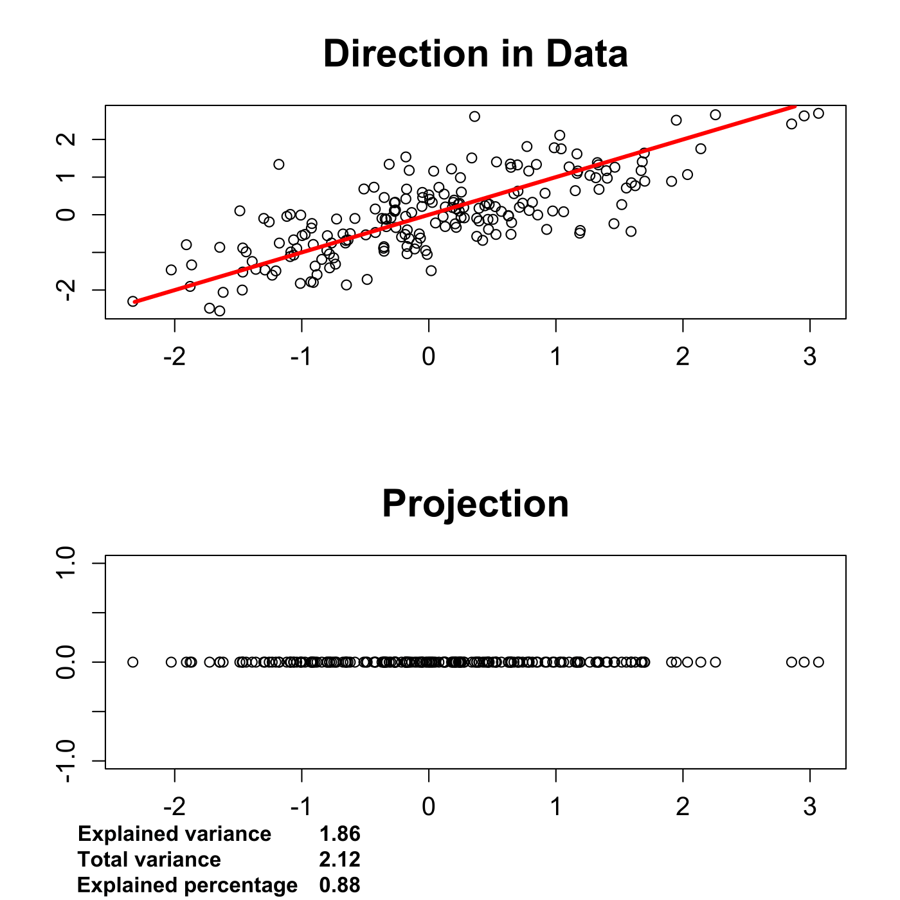
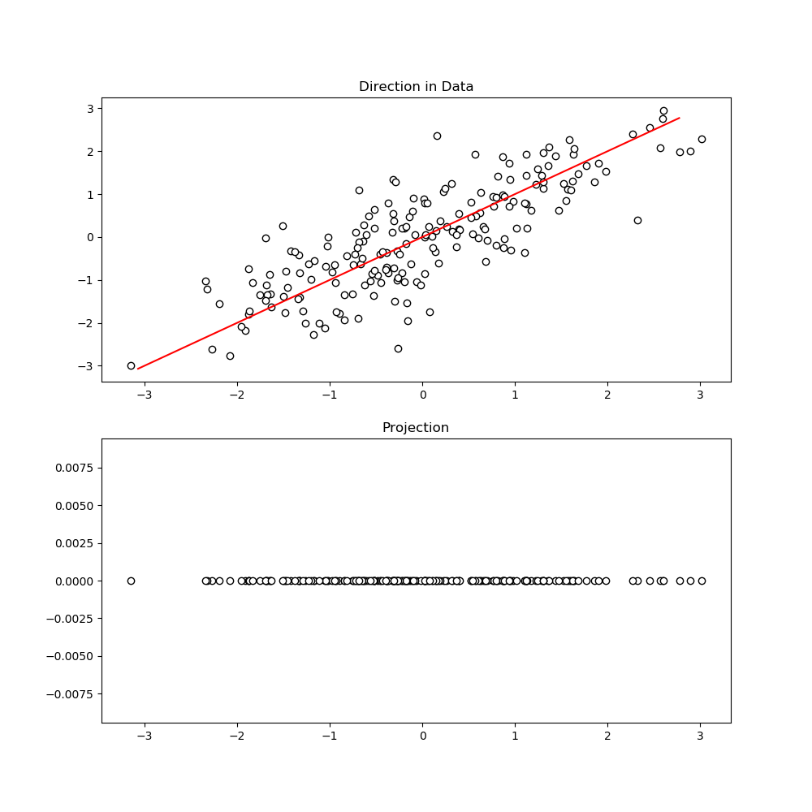
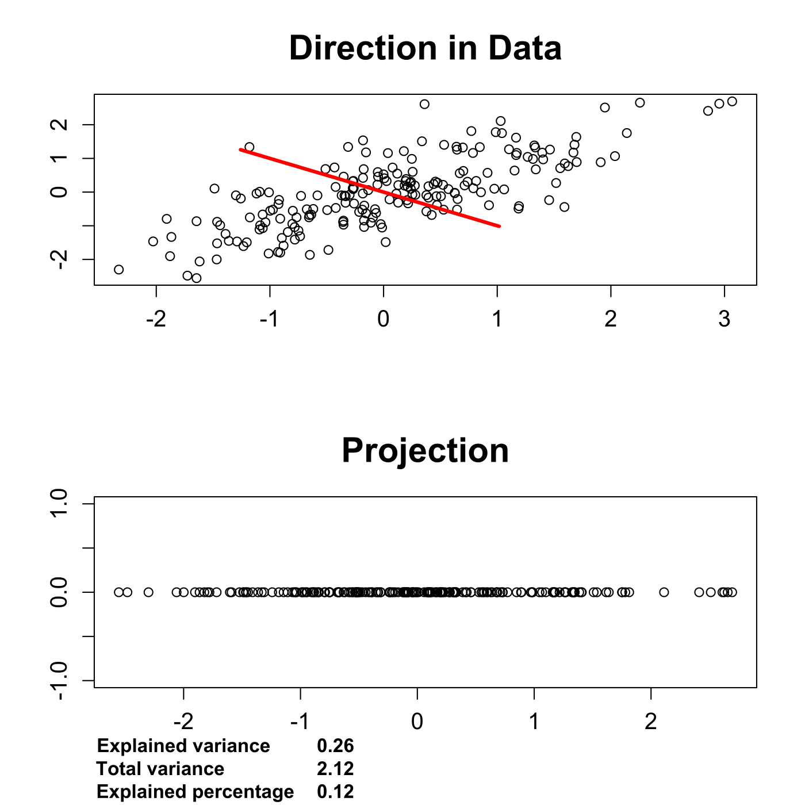
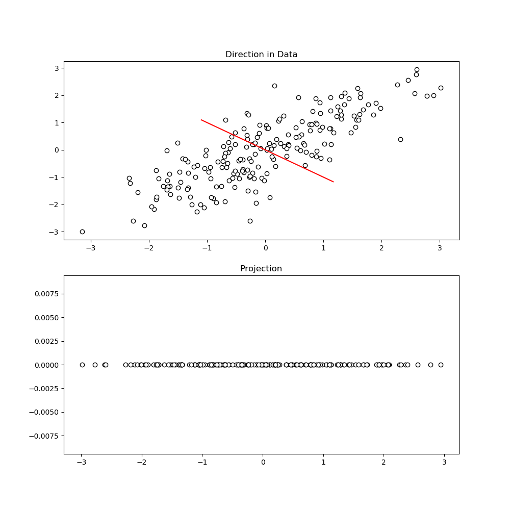

[](http://quantlet.de/)

## [](http://quantlet.de/) **MVApcasimu** [](http://quantlet.de/)

```yaml

Name of QuantLet: MVApcasimu

Published in: Applied Multivariate Statistical Analysis

Description: Simulates a projection of a (normal) point cloud which may capture different proportions of the variance. 

Keywords: principal-components, pca, eigenvalues, projection, screeplot, scatterplot, plot, graphical representation, simulation

See also: MVAnpcabanki, MVAnpcabank, MVAnpcahousi, MVAnpcatime, MVAnpcafood, MVAnpcausco, MVAnpcausco2, MVAnpcausco2i, MVAcpcaiv, MVAnpcahous, MVApcabanki, MVApcabankr, MVApcabank

Author: Zografia Anastasiadou, Maria Osipenko

Author[Python]: 'Matthias Fengler, Liudmila Gorkun-Voevoda'

Submitted: Tue, July 01 2014 by Petra Burdejova

Submitted[Python]: 'Sun, April 5 2020 by Liudmila Gorkun-Voevoda'

Example: 
- 1: Direction of first component for simulated data.
- 2: Direction of second component for simulated data.

```









### PYTHON Code
```python

import pandas as pd
import numpy as np
import matplotlib.pyplot as plt
import random

random.seed(123)

n   = 200
rho = 0.5
mu  = [0, 0]
sig = np.array([[1, rho], [rho, 1]])

nr = np.random.multivariate_normal(mu, sig, n)
l, g = np.linalg.eig(sig)
sh = np.dot(g, np.dot(np.diag(np.sqrt(l)), g.T))
x = np.dot(nr, sh.T)

direction1 = [g[0][0], g[1][0]]
direction2 = [g[0][1], g[1][1]]
norm = [round(np.dot(np.array(direction1), np.array(direction1))), 
        round(np.dot(np.array(direction2), np.array(direction2)))]
direction1 = direction1 / np.sqrt(norm[0])
direction2 = direction2 / np.sqrt(norm[1])

pd1 = np.sort(np.dot(x, direction1))
d31 = np.array([np.multiply(pd1, direction1[0]), np.multiply(pd1, direction1[1])])
pd2 = np.sort(np.dot(x, direction2))
d32 = np.array([np.multiply(pd2, direction2[0]), np.multiply(pd2, direction2[1])])
d4 = pd.DataFrame([x[:,0], [0]*n]).T
d5 = pd.DataFrame([x[:,1], [0]*n]).T

varexp1 = np.var(pd1)
r11 = round(varexp1, 2)

varexp2 = np.var(pd2)
r12 = round(varexp2, 2)

varsum = sum(np.array([np.var(x[:,0]), np.var(x[:,1])]))
r2 = round(varsum, 2)
varperc1 = varexp1 / varsum

r31 = round(varperc1, 2)
varperc2 = varexp2 / varsum

r32 = round(varperc2, 2)


fig, axes = plt.subplots(2, 1, figsize = (10, 10))
axes[0].scatter(x[:,0], x[:,1], c = "w", edgecolors = "black")
axes[0].plot(d31[0], d31[1], c = "r")
axes[0].set_title("Direction in Data")

axes[1].scatter(d4[0], d4[1], c = "w", edgecolors = "black")
axes[1].set_title("Projection")

h = -0.018
for i, j in zip(["Explained variance", "Total variance", "Explained percentage"], [r11, r2, r31]):
    plt.text(-3.5, h, i, fontsize=12)
    plt.text(-1.5, h, str(j), fontsize=12)
    h -= 0.002

plt.show()


fig, axes = plt.subplots(2, 1, figsize = (10, 10))
axes[0].scatter(x[:,0], x[:,1], c = "w", edgecolors = "black")
axes[0].plot(d32[0], d32[1], c = "r")
axes[0].set_title("Direction in Data")

axes[1].scatter(d5[0], d5[1], c = "w", edgecolors = "black")
axes[1].set_title("Projection")

h = -0.018
for i, j in zip(["Explained variance", "Total variance", "Explained percentage"], [r12, r2, r32]):
    plt.text(-3.5, h, i, fontsize=12)
    plt.text(-1.5, h, str(j), fontsize=12)
    h -= 0.002

plt.show()


```

automatically created on 2020-04-22

### R Code
```r


# clear all variables
rm(list = ls(all = TRUE))
graphics.off()

# install and load packages
libraries = c("mvtnorm")
lapply(libraries, function(x) if (!(x %in% installed.packages())) {
    install.packages(x)
})
lapply(libraries, library, quietly = TRUE, character.only = TRUE)

# parameter settings
set.seed(123)
n   = 200
rho = 0.5
mu  = c(0, 0)
sig = matrix(c(1, rho, rho, 1), nrow = 2)

nr  = rmvnorm(n, mu, sig)
eig = eigen(sig)
l   = eig$values
g   = eig$vectors
sh  = g %*% diag(sqrt(l)) %*% t(g)
x   = nr %*% t(sh)

direction1 = g[, 1]
direction2 = g[, 2]
norm       = c(t(direction1) %*% direction1, t(direction2) %*% direction2)
direction1 = direction1 / sqrt(norm[1])
direction2 = direction2 / sqrt(norm[2])

pd1 = sort(x %*% direction1)
d31 = pd1 %*% t(direction1)
pd2 = sort(x %*% direction2)
d32 = pd2 %*% t(direction2)
d4  = cbind(x[, 1], matrix(0, nrow = n))
d5  = cbind(x[, 2], matrix(0, nrow = n))

# plots of diection in simulated data and data projection with explained variance
dev.new()
par(mfrow = c(2, 1))
plot(x[, 1], x[, 2], , xlab = "", ylab="", main = "Direction in Data",
     cex.axis = 1.2, cex.main = 1.8)
lines(d31[, 1], d31[, 2], col = "red", lwd = 3)
plot(d4[, 1], d4[, 2], xlab = "", ylab = "", main = "Projection",
     cex.axis = 1.2, cex.main = 1.8)

varexp1  = var(pd1)
r1       = round(varexp1, 2)
w11      = toString(r1)
varexp2  = var(pd2)
r2       = round(varexp2,2)
w12      = toString(r2)
varsum   = sum(t(c(var(x[, 1]), var(x[, 2]))))
r2       = round(varsum, 2)
w2       = toString(r2)
varperc1 = varexp1 / varsum
r31      = round(varperc1, 2)
w31      = toString(r31)
varperc2 = varexp2 / varsum
r32      = round(varperc2, 2)
w32      = toString(r32)

mtext("Explained variance", side = 1, line = 2, at = -2, font = 2)
mtext(w11, side = 1, line = 2, at = -0.7, font = 2)
mtext("Total variance", side = 1, line = 3, at = -2.2, font = 2)
mtext(w2, side = 1, line = 3, at = -0.7, font = 2)
mtext("Explained percentage", side = 1, line = 4, at = -1.9, font = 2)
mtext(w31, side = 1, line = 4, at = -0.7, font = 2)

dev.new()
par(mfrow = c(2, 1))
plot(x[, 1], x[, 2], , xlab = "", ylab = "", main = "Direction in Data",
     cex.axis = 1.2, cex.main = 1.8)
lines(d32[, 1], d32[, 2], col = "red", lwd = 3)
plot(d5[, 1], d5[, 2], xlab = "", ylab = "", main = "Projection",
     cex.axis = 1.2, cex.main = 1.8)
mtext("Explained variance", side = 1, line = 2, at = -2, font = 2)
mtext(w12, side = 1, line = 2, at = -0.7, font = 2)
mtext("Total variance", side = 1, line = 3, at = -2.2, font = 2)
mtext(w2, side = 1, line = 3, at = -0.7, font = 2)
mtext("Explained percentage", side = 1, line = 4, at = -1.9, font = 2)
mtext(w32, side = 1, line = 4, at = -0.7, font = 2)

```

automatically created on 2020-04-22