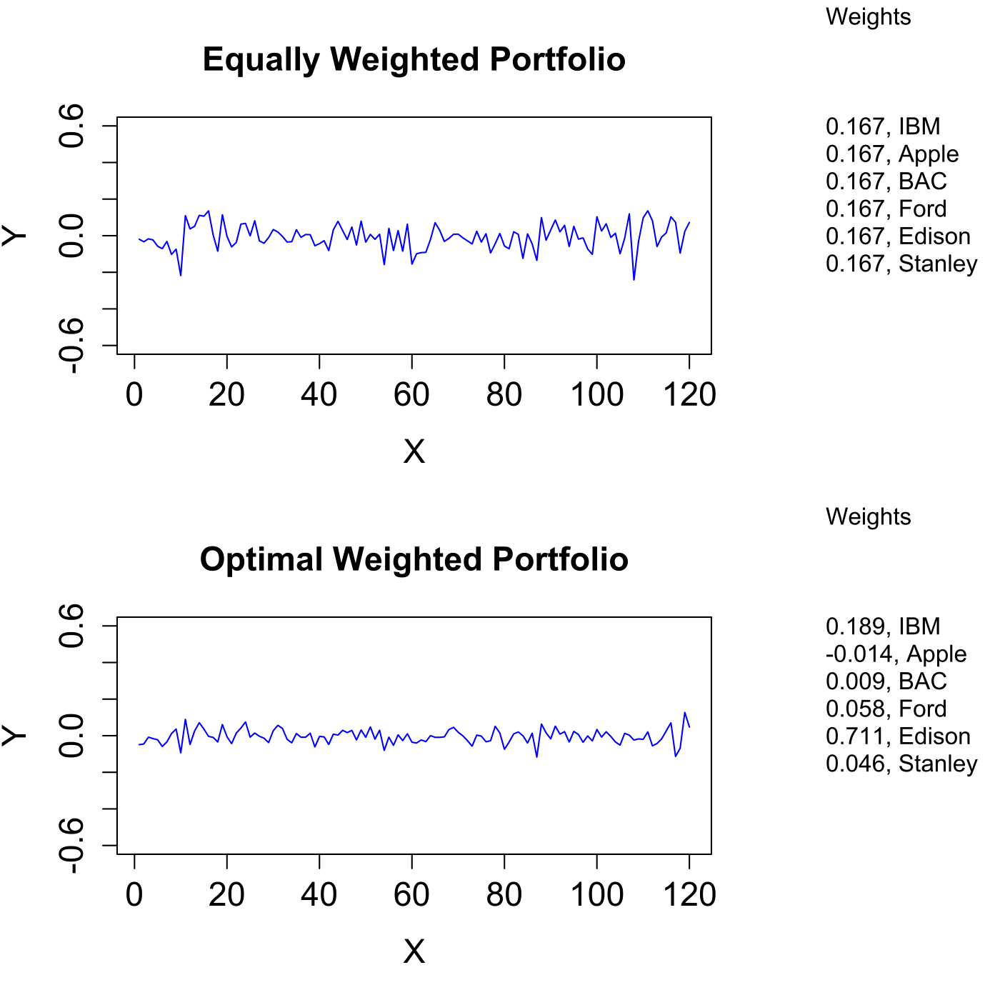

[](http://quantlet.de/)

## [](http://quantlet.de/) **MVAportfol** [](http://quantlet.de/)

```yaml

Name of QuantLet : MVAportfol

Published in : Applied Multivariate Statistical Analysis

Description : 'Computes the optimal portfolio weights with monthly returns of six US firms from Jan
2000 to Dec 2009. The optimal portfolio is compared with an equally weighted one.'

Keywords : 'financial, portfolio, returns, asset, time-series, data visualization, plot, graphical
representation'

See also : MVAportfol_IBM_Ford, MVAportfol_IBM_PanAm, MVAreturns

Author : Zografia Anastasiadou

Submitted : Fri, August 05 2011 by Awdesch Melzer

Datafile : apple.csv, bac.csv, ed.csv, ford.csv, ibm.csv, ms.csv

Example : Portfolio of all six assets, equal and efficient weights.

```




### R Code:
```r

# clear all variables
rm(list = ls(all = TRUE))
graphics.off()

# load data
ibm   = read.csv("ibm.csv")
apple = read.csv("apple.csv")
bac   = read.csv("bac.csv")
ford  = read.csv("ford.csv")
ed    = read.csv("ed.csv")
ms    = read.csv("ms.csv")

# compute returns for IBM
y1 = ibm[, 5]
a  = 0
i  = 1
while (i <= 120) {
    i    = i + 1
    a[i] = (y1[i] - y1[i - 1])/y1[i]
}
x1 = a[2:121] 	

# compute returns for Apple
y2 = apple[, 5]
b  = 0
i  = 1
while (i <= 120) {
    i    = i + 1
    b[i] = (y2[i] - y2[i - 1])/y2[i]
}
x2 = b[2:121] 	

# compute returns for Bank of America Corporation
y3 = bac[, 5]
d  = 0
i  = 1
while (i <= 120) {
    i    = i + 1
    d[i] = (y3[i] - y3[i - 1])/y3[i]
}
x3 = d[2:121]

# compute returns for Forward Industries
y4 = ford[, 5]
f  = 0
i  = 1
while (i <= 120) {
    i    = i + 1
    f[i] = (y4[i] - y4[i - 1])/y4[i]
}
x4 = f[2:121]

# compute returns for Consolidated Edison
y5 = ed[, 5]
g  = 0
i  = 1
while (i <= 120) {
    i    = i + 1
    g[i] = (y5[i] - y5[i - 1])/y5[i]
}
x5 = g[2:121]

# compute returns for Morgan Stanley
y6 = ms[, 5]
h  = 0
i  = 1
while (i <= 120) {
    i    = i + 1
    h[i] = (y6[i] - y6[i - 1])/y6[i]
}
x6 = h[2:121]

ix  = c(1:6)                                # choose assets to use
x   = cbind(x1, x2, x3, x4, x5, x6)         # MVAportfolio of all assets
s1  = solve(cov(x))                         # inverse of empirical variance
one = rep(1, length(ix))                    # vector of ones
c2  = (s1 %*% one)/rep(t(one) %*% s1 %*% one, length(s1 %*% one))    # c2 weight
c1  = one/rep(sum(one), length(one))        # c1 weight
q1  = x %*% c1                              # Optimal MVAportfol returns 
q2  = x %*% c2                              # Nonoptimal MVAportfol returns 

t  = c(1:120)
d1 = cbind(t, q1)
d2 = cbind(t, q2)

# plot
par(mfrow = c(2, 1))
par(oma = c(0, 0, 0, 8))
plot(d1, type = "l", col = "blue", ylab = "Y", xlab = "X", main = "Equally Weighted Portfolio", 
    ylim = c(-0.6, 0.6), cex.lab = 1.4, cex.axis = 1.4, cex.main = 1.4)
mtext("Weights", side = 4, line = 4, at = 1.2, las = 2, font = 1)
mtext(toString(c(sprintf("%.3f", c1[1]), "IBM")), side = 4, line = 4, at = 0.6, las = 2)
mtext(toString(c(sprintf("%.3f", c1[2]), "Apple")), side = 4, line = 4, at = 0.45, 
    las = 2)
mtext(toString(c(sprintf("%.3f", c1[3]), "BAC")), side = 4, line = 4, at = 0.3, las = 2)
mtext(toString(c(sprintf("%.3f", c1[4]), "Ford")), side = 4, line = 4, at = 0.15, 
    las = 2)
mtext(toString(c(sprintf("%.3f", c1[5]), "Edison")), side = 4, line = 4, at = 0, 
    las = 2)
mtext(toString(c(sprintf("%.3f", c1[6]), "Stanley")), side = 4, line = 4, at = -0.15, 
    las = 2)
plot(d2, type = "l", col = "blue", ylab = "Y", xlab = "X", main = "Optimal Weighted Portfolio", 
    ylim = c(-0.6, 0.6), cex.lab = 1.4, cex.axis = 1.4, cex.main = 1.4)
mtext("Weights", side = 4, line = 4, at = 1.2, las = 2, font = 1)
mtext(toString(c(sprintf("%.3f", c2[1]), "IBM")), side = 4, line = 4, at = 0.6, las = 2)
mtext(toString(c(sprintf("%.3f", c2[2]), "Apple")), side = 4, line = 4, at = 0.45, 
    las = 2)
mtext(toString(c(sprintf("%.3f", c2[3]), "BAC")), side = 4, line = 4, at = 0.3, las = 2)
mtext(toString(c(sprintf("%.3f", c2[4]), "Ford")), side = 4, line = 4, at = 0.15, 
    las = 2)
mtext(toString(c(sprintf("%.3f", c2[5]), "Edison")), side = 4, line = 4, at = 0, 
    las = 2)
mtext(toString(c(sprintf("%.3f", c2[6]), "Stanley")), side = 4, line = 4, at = -0.15, 
    las = 2) 

```
