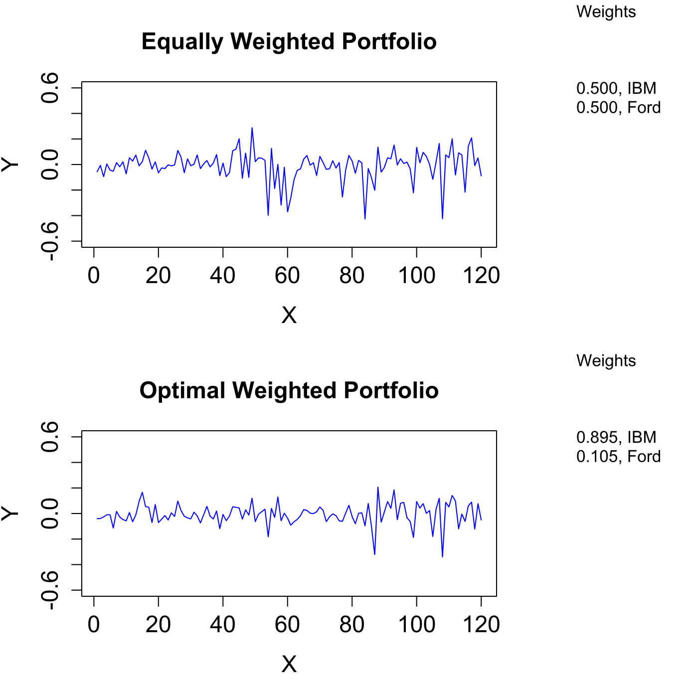

[](http://quantlet.de/)

## [](http://quantlet.de/) **MVAportfol_IBM_Ford** [](http://quantlet.de/)

```yaml

Name of QuantLet : MVAportfol_IBM_Ford

Published in : Applied Multivariate Statistical Analysis

Description : 'Computes the optimal portfolio weights with monthly returns of IBM and Forward
Industries from Jan 2000 to Dec 2009. The optimal portfolio is compared with an equally weighted
one.'

Keywords : 'financial, portfolio, returns, asset, time-series, data visualization, plot, graphical
representation'

See also : MVAportfol, MVAportfol_IBM_PanAm, MVAreturns

Author : Zografia Anastasiadou

Submitted : Fri, August 05 2011 by Awdesch Melzer

Datafile : ford.csv, ibm.csv

Example : Portfolio of IBM and Forward Industries assets, equal and efficient weights.

```




### R Code:
```r

# clear all variables
rm(list = ls(all = TRUE))
graphics.off()

# load data
ibm  = read.csv("ibm.csv")
ford = read.csv("ford.csv")

# compute returns for IBM
y1 = ibm[, 5]
a  = 0
i  = 1
while (i <= 120) {
    i    = i + 1
    a[i] = (y1[i] - y1[i - 1])/y1[i]
}
x1 = a[2:121]

# compute returns for Forward Industries
y2 = ford[, 5]
f  = 0
i  = 1
while (i <= 120) {
    i    = i + 1
    f[i] = (y2[i] - y2[i - 1])/y2[i]
}
x2 = f[2:121]

x   = cbind(x1, x2)                         # MVAportfolio of assets
s1  = solve(cov(x))                         # inverse of empirical variance
one = c(1, 1)                               # vector of ones
c2  = (s1 %*% one)/rep(t(one) %*% s1 %*% one, length(s1 %*% one)) 	# c2 weight
c1  = one/rep(sum(one), length(one))        # c1 weight
q1  = x %*% c1                              # Optimal MVAportfol_IBM_Ford returns 
q2  = x %*% c2                              # Nonoptimal MVAport_IBM_Ford returns 

t   = c(1:120)
d1  = cbind(t, q1)
d2  = cbind(t, q2)

# plot
par(mfrow = c(2, 1))
par(oma = c(0, 0, 0, 8))
plot(d1, type = "l", col = "blue", ylab = "Y", xlab = "X", main = "Equally Weighted Portfolio", 
    ylim = c(-0.6, 0.6), cex.lab = 1.4, cex.axis = 1.4, cex.main = 1.4)
mtext("Weights", side = 4, line = 4, at = 1.2, las = 2, font = 1)
mtext(toString(c(sprintf("%.3f", c1[1]), "IBM")), side = 4, line = 4, at = 0.6, las = 2)
mtext(toString(c(sprintf("%.3f", c1[2]), "Ford")), side = 4, line = 4, at = 0.45, 
    las = 2)
plot(d2, type = "l", col = "blue", ylab = "Y", xlab = "X", main = "Optimal Weighted Portfolio", 
    ylim = c(-0.6, 0.6), cex.lab = 1.4, cex.axis = 1.4, cex.main = 1.4)
mtext("Weights", side = 4, line = 4, at = 1.2, las = 2)
mtext(toString(c(sprintf("%.3f", c2[1]), "IBM")), side = 4, line = 4, at = 0.6, las = 2)
mtext(toString(c(sprintf("%.3f", c2[2]), "Ford")), side = 4, line = 4, at = 0.45, 
    las = 2) 

```
