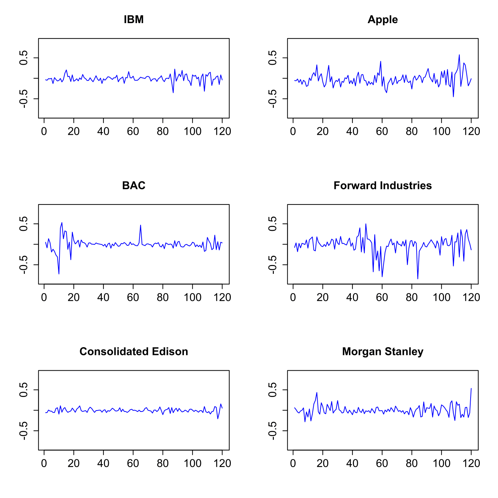

[](http://quantlet.de/)

## [](http://quantlet.de/) **MVAreturns** [](http://quantlet.de/)

```yaml

Name of QuantLet : MVAreturns

Published in : Applied Multivariate Statistical Analysis

Description : Shows monthly returns of six US firms from Jan 2000 to Dec 2009.

Keywords : 'financial, portfolio, returns, asset, time-series, data visualization, plot, graphical
representation'

See also : MVAportfol_IBM_Ford, MVAportfol_IBM_PanAm

Author : Zografia Anastasiadou

Submitted : Fri, August 05 2011 by Awdesch Melzer

Datafile : apple.csv, bac.csv, ed.csv, ford.csv, ibm.csv, ms.csv

```




### R Code:
```r

# clear all variables
rm(list = ls(all = TRUE))
graphics.off()

# load data
ibm   = read.csv("ibm.csv")
apple = read.csv("apple.csv")
bac   = read.csv("bac.csv")
ford  = read.csv("ford.csv")
ed    = read.csv("ed.csv")
ms    = read.csv("ms.csv")

# compute returns for IBM
y1 = ibm[, 5]
a  = 0
i  = 1
while (i <= 120) {
    i 	 = i + 1
    a[i] = (y1[i] - y1[i - 1])/y1[i]
}
x1 = a[2:121] 	

# compute returns for Apple
y2 = apple[, 5]
b  = 0
i  = 1
while (i <= 120) {
    i	 = i + 1
    b[i] = (y2[i] - y2[i - 1])/y2[i]
}
x2 = b[2:121] 	

# compute returns for Bank of America Corporation
y3 = bac[, 5]
d  = 0
i  = 1
while (i <= 120) {
    i 	 = i + 1
    d[i] = (y3[i] - y3[i - 1])/y3[i]
}
x3 = d[2:121]

# compute returns for Forward Industries
y4 = ford[, 5]
f  = 0
i  = 1
while (i <= 120) {
    i 	 = i + 1
    f[i] = (y4[i] - y4[i - 1])/y4[i]
}
x4 = f[2:121]

# compute returns for Consolidated Edison
y5 = ed[, 5]
g  = 0
i  = 1
while (i <= 120) {
    i 	 = i + 1
    g[i] = (y5[i] - y5[i - 1])/y5[i]
}
x5 = g[2:121]

# compute returns for Morgan Stanley
y6 = ms[, 5]
h  = 0
i  = 1
while (i <= 120) {
    i 	 = i + 1
    h[i] = (y6[i] - y6[i - 1])/y6[i]
}
x6 = h[2:121]

t  = c(1:120)

d1 = cbind(t, x1)   # time series for IBM
d2 = cbind(t, x2)   # time series for Apple
d3 = cbind(t, x3)   # time series for Bank of America Corporation
d4 = cbind(t, x4)   # time series for Forward Industries
d5 = cbind(t, x5)   # time series for Consolidated Edison
d6 = cbind(t, x6)   # time series for Morgan Stanley

# plot
par(mfrow = c(3, 2))
plot(d1, type = "l", col = "blue", ylim = c(-0.9, 0.9), ylab = "", xlab = "", main = "IBM", 
    cex.lab = 1.4, cex.axis = 1.4, cex.main = 1.4)
plot(d2, type = "l", col = "blue", ylim = c(-0.9, 0.9), ylab = "", xlab = "", main = "Apple", 
    cex.lab = 1.4, cex.axis = 1.4, cex.main = 1.4)
plot(d3, type = "l", col = "blue", ylim = c(-0.9, 0.9), ylab = "", xlab = "", main = "BAC", 
    cex.lab = 1.4, cex.axis = 1.4, cex.main = 1.4)
plot(d4, type = "l", col = "blue", ylim = c(-0.9, 0.9), ylab = "", xlab = "", main = "Forward Industries", 
    cex.lab = 1.4, cex.axis = 1.4, cex.main = 1.4)
plot(d5, type = "l", col = "blue", ylim = c(-0.9, 0.9), ylab = "", xlab = "", main = "Consolidated Edison", 
    cex.lab = 1.4, cex.axis = 1.4, cex.main = 1.4)
plot(d6, type = "l", col = "blue", ylim = c(-0.9, 0.9), ylab = "", xlab = "", main = "Morgan Stanley", 
    cex.lab = 1.4, cex.axis = 1.4, cex.main = 1.4) 

```
