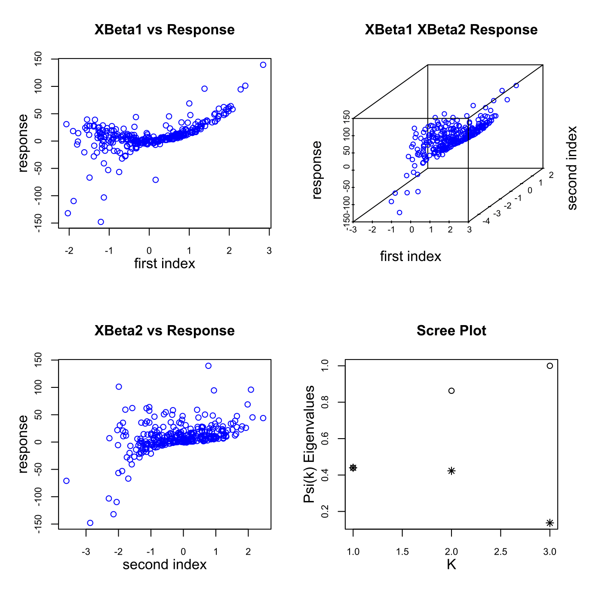

[](http://quantlet.de/)

## [](http://quantlet.de/) **MVAsir2data** [](http://quantlet.de/)

```yaml

Name of QuantLet : MVAsir2data

Published in : Applied Multivariate Statistical Analysis

Description : 'Generates a data set and applies the sliced inverse regression algorithm (SIR II)
for dimension reduction.'

Keywords : 'EDR-directions, dimension-reduction, estimation, SIR II, regression, 3D, plot,
graphical representation'

See also : MVAppsib, MVAsimdep1, MVAsirdata, MVAsimdepex, MVAppexample, ppsib, ppsibexample

Author : Zografia Anastasiadou

Submitted : Fri, August 05 2011 by Awdesch Melzer

Example : 'SIR II mainly sees the second direction. The left plots show the response versus the
estimated effective dimension reduction directions (EDR-directions). The upper right plot is a
three-dimensional plot of the first two directions and the response. The lower right plot shows the
eigenvalues (*) and the cumulative sum (o).'

```




### R Code:
```r

# clear all variables
rm(list = ls(all = TRUE))
graphics.off()

# install and load packages
libraries = c("MASS", "dr", "scatterplot3d")
lapply(libraries, function(x) if (!(x %in% installed.packages())) {
    install.packages(x)
})
lapply(libraries, library, quietly = TRUE, character.only = TRUE)

# parameter settings
set.seed(2010)
n   = 300                                     # number of observations
ns  = 20                                      # number of elements in each slice
h   = floor(n/ns)                             # number of slices
x   = cbind(rnorm(n), rnorm(n), rnorm(n))     # n x 3 matrix, the explanatory variable
e   = rnorm(n)                                # n vector, the noise variable
b2  = c(1, -1, -1)                            # projection vector
b1  = c(1, 1, 1)                              # projection vector

y   = x %*% b1 + ((x %*% b1)^3) + 4 * ((x %*% b2)^2) + e  # n vector, the response variable

edr = dr(y ~ x, method = "save", nslices = h) # effective dimension reduction space
f   = edr$evectors                            # matrix of the estimated EDR-directions
g   = edr$evalues                             # vector of eigenvalues

# matrices for the true indices and the true responses
m1  = cbind(x %*% b1, y)
m2  = cbind(x %*% b2, y)
m1  = m1[order(m1[, 1]), ]
m2  = m2[order(m2[, 1]), ]

sg  = sum(g)
g   = g/sg
psi = c(g[1], g[1] + g[2], g[1] + g[2] + g[3]) # ratio of the sum of the 3 eigenvalues and the sum of all eigenvalues
par(mfcol = c(2, 2), mgp = c(2, 1, 0))

# plot of the response versus the first estimated EDR-direction
p11 = cbind(x %*% f[, 1], y)
plot(p11, col = "blue", xlab = "first index", ylab = "response", main = "XBeta1 vs Response", 
    cex.lab = 1.2, cex.main = 1.2, cex.axis = 0.8)

# plot of the response versus the second estimated EDR-direction
p21 = cbind(x %*% f[, 2], y)
plot(p21, col = "blue", xlab = "second index", ylab = "response", main = "XBeta2 vs Response", 
    cex.lab = 1.2, cex.main = 1.2, cex.axis = 0.8)

# three-dimensional plot of the first two directions and the response
p12 = cbind(x %*% f[, 1], x %*% f[, 2], y)
scatterplot3d(p12, xlab = "first index", ylab = "second index", zlab = "response", 
    box = TRUE, axis = TRUE, color = "blue", main = "XBeta1 XBeta2 Response", grid = FALSE, 
    cex.axis = 0.6)

i     = c(1, 2, 3)
ig    = cbind(i, g)
psii  = cbind(i, psi)
p22   = rbind(ig, psii)
# plot of the eigenvalues and the cumulative sum
plot(p22, xlab = "K", ylab = "Psi(k) Eigenvalues", main = "Scree Plot", pch = c(8, 
    8, 8, 1, 1, 1), cex.lab = 1.2, cex.main = 1.2, cex.axis = 0.8)

```
