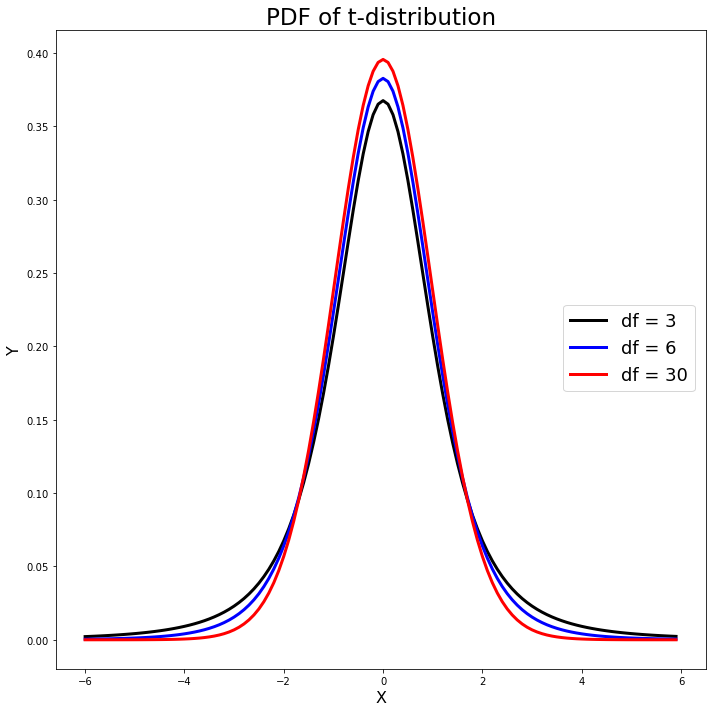
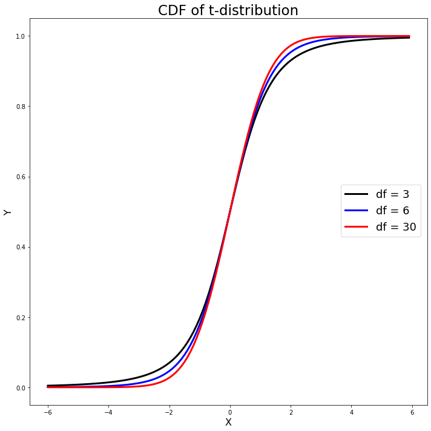

[](http://quantlet.de/)

## [](http://quantlet.de/) **MVAtdis** [](http://quantlet.de/)

```yaml

Name of QuantLet: MVAtdis

Published in: Applied Multivariate Statistical Analysis

Description: Plots three probability density functions and three cumulative density functions of the t-distribution with different degrees of freedom (t3 stands for t-distribution with degree of freedom 3, etc.)

Keywords: plot, graphical representation, t-distribution, cdf, pdf, density, distribution

See also: MVAcltbern, MVAcltbern2, MVAgausscauchy, MVAcauchy

Author: Wolfgang K. Haerdle
Author[Python]: Matthias Fengler, Tim Dass

Submitted: Mon, August 08 2011 by Awdesch Melzer
Submitted[Python]: Tue, April 16 2024 by Tim Dass

```






### PYTHON Code
```python

# works on numpy 1.23.5, matplotlib 3.6.2 and scipy 1.10.0
import numpy as np
from scipy.stats import t
import matplotlib.pyplot as plt

# PDF of t-distribution
xx = np.arange(-6, 6, 0.1)
pdf3 = t.pdf(xx, df = 3)
pdf6 = t.pdf(xx, df = 6)
pdf30 = t.pdf(xx, df = 30)

fig1, ax1 = plt.subplots(1,1,figsize=(10, 10))

ax1.plot(xx, pdf3, 'k-', linewidth=3, label='df = 3')
ax1.plot(xx, pdf6, 'b-', linewidth=3, label='df = 6')
ax1.plot(xx, pdf30, 'r-', linewidth=3, label='df = 30')
ax1.set_xlabel('X', fontsize=16)
ax1.set_ylabel('Y', fontsize=16)
ax1.set_title('PDF of t-distribution', fontsize=23)
fig1.legend(fontsize=18, loc =(0.79, 0.45))

plt.tight_layout()
plt.show()

# CDF of t-distribution
cdf3 = t.cdf(xx, df = 3)
cdf6 = t.cdf(xx, df = 6)
cdf30 = t.cdf(xx, df = 30)

fig2, ax2 = plt.subplots(1,1,figsize=(10, 10))

ax2.plot(xx, cdf3, 'k-', linewidth=3, label='df = 3')
ax2.plot(xx, cdf6, 'b-', linewidth=3, label='df = 6')
ax2.plot(xx, cdf30, 'r-', linewidth=3, label='df = 30')
ax2.set_xlabel('X', fontsize=16)
ax2.set_ylabel('Y', fontsize=16)
ax2.set_title('CDF of t-distribution', fontsize=23)
fig2.legend(fontsize=18, loc =(0.79, 0.45))

plt.tight_layout()
plt.show()
```

automatically created on 2024-04-25

### R Code
```r


# clear all variables
rm(list = ls(all = TRUE))
graphics.off()

xx = seq(-5, 5, by = 0.1)

# Pdf of t-distribution with df=3, df=6, df=30 
plot(xx, dt(xx, df = 3), type = "l", ylim = c(0, 0.4), ylab = "Y", xlab = "X", col = "green", 
    lwd = 3, cex.lab = 2, cex.axis = 2)  
lines(xx, dt(xx, df = 6), type = "l", col = "blue", lwd = 3)
lines(xx, dt(xx, df = 30), type = "l", col = "red", lwd = 3) 
legend(x = 2, y = 0.3, legend = c("t3", "t6", "t30"), pch = c(20, 20, 20), col = c("green", 
    "blue", "red"), bty = "n")
title("PDF of t-distribution")

# Cdf of t-distribution with df=3, df=6, df=30 
dev.new()
plot(xx, pt(xx, df = 3), type = "l", ylab = "Y", xlab = "X", col = "green", lwd = 3, 
    cex.lab = 2, cex.axis = 2) 
lines(xx, pt(xx, df = 6), type = "l", col = "blue", lwd = 3) 
lines(xx, pt(xx, df = 30), type = "l", col = "red", lwd = 3)  
legend(x = -5, y = 0.74, legend = c("t3", "t6", "t30"), pch = c(20, 20, 20), col = c("green", 
    "blue", "red"), bty = "n")
title("CDF of t-distribution") 

```

automatically created on 2024-04-25