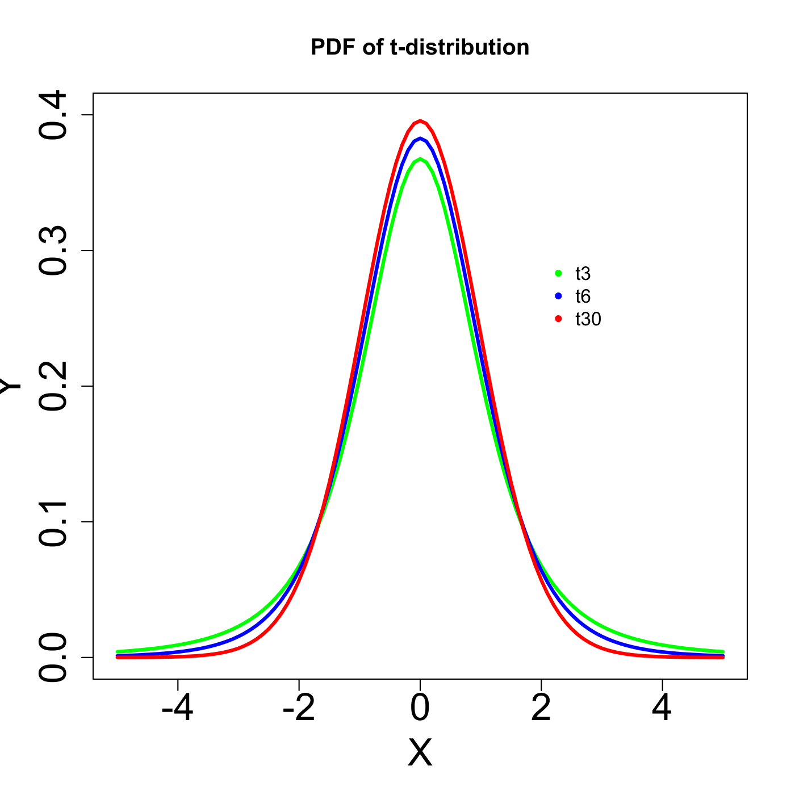
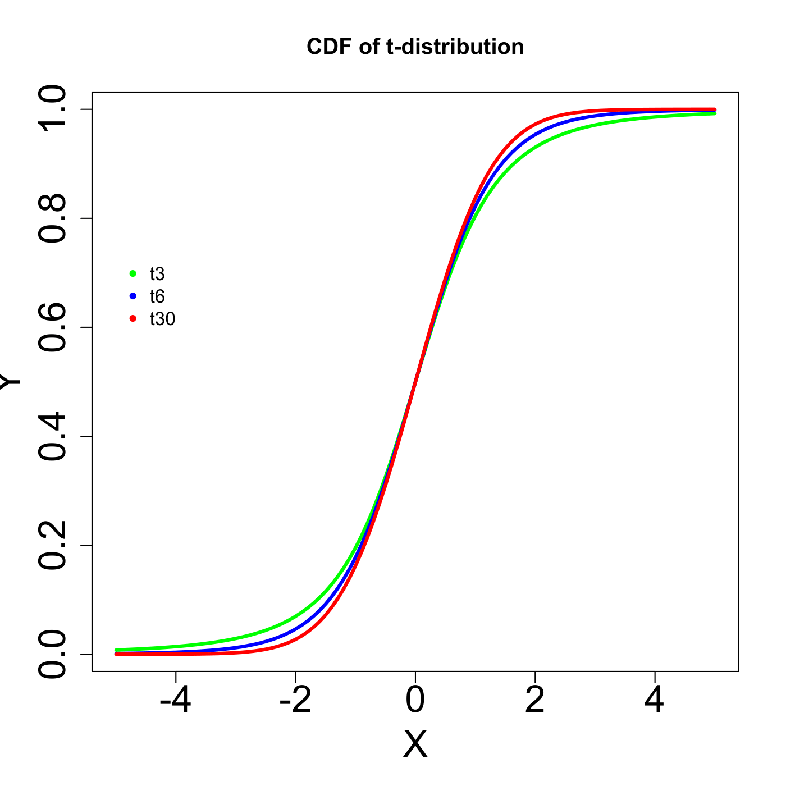

[](http://quantlet.de/)

## [](http://quantlet.de/) **MVAtdis** [](http://quantlet.de/)

```yaml

Name of QuantLet : MVAtdis

Published in : Applied Multivariate Statistical Analysis

Description : 'Plots three probability density functions and three cumulative density functions of
the t-distribution with different degrees of freedom (t3 stands for t-distribution with degree of
freedom 3, etc.)'

Keywords : plot, graphical representation, t-distribution, cdf, pdf, density, distribution

See also : MVAcltbern, MVAcltbern2, MVAgausscauchy, MVAcauchy

Author : Wolfgang K. Haerdle

Submitted : Mon, August 08 2011 by Awdesch Melzer

```






### R Code:
```r

# clear all variables
rm(list = ls(all = TRUE))
graphics.off()

xx = seq(-5, 5, by = 0.1)

# Pdf of t-distribution with df=3, df=6, df=30 
plot(xx, dt(xx, df = 3), type = "l", ylim = c(0, 0.4), ylab = "Y", xlab = "X", col = "green", 
    lwd = 3, cex.lab = 2, cex.axis = 2)  
lines(xx, dt(xx, df = 6), type = "l", col = "blue", lwd = 3)
lines(xx, dt(xx, df = 30), type = "l", col = "red", lwd = 3) 
legend(x = 2, y = 0.3, legend = c("t3", "t6", "t30"), pch = c(20, 20, 20), col = c("green", 
    "blue", "red"), bty = "n")
title("PDF of t-distribution")

# Cdf of t-distribution with df=3, df=6, df=30 
dev.new()
plot(xx, pt(xx, df = 3), type = "l", ylab = "Y", xlab = "X", col = "green", lwd = 3, 
    cex.lab = 2, cex.axis = 2) 
lines(xx, pt(xx, df = 6), type = "l", col = "blue", lwd = 3) 
lines(xx, pt(xx, df = 30), type = "l", col = "red", lwd = 3)  
legend(x = -5, y = 0.74, legend = c("t3", "t6", "t30"), pch = c(20, 20, 20), col = c("green", 
    "blue", "red"), bty = "n")
title("CDF of t-distribution") 

```
