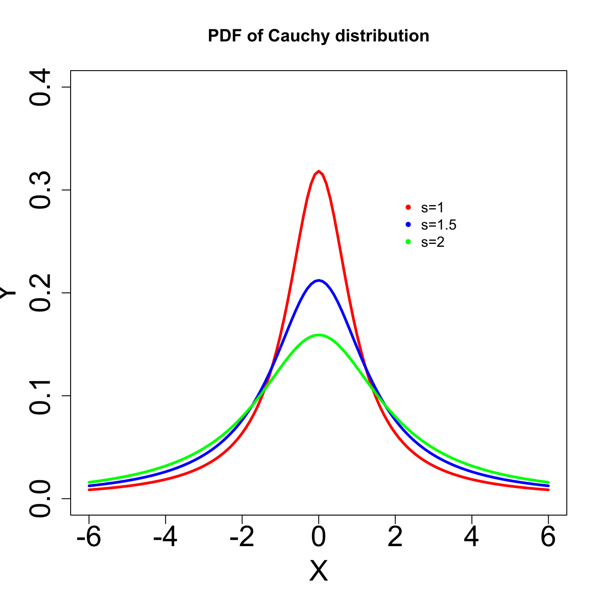
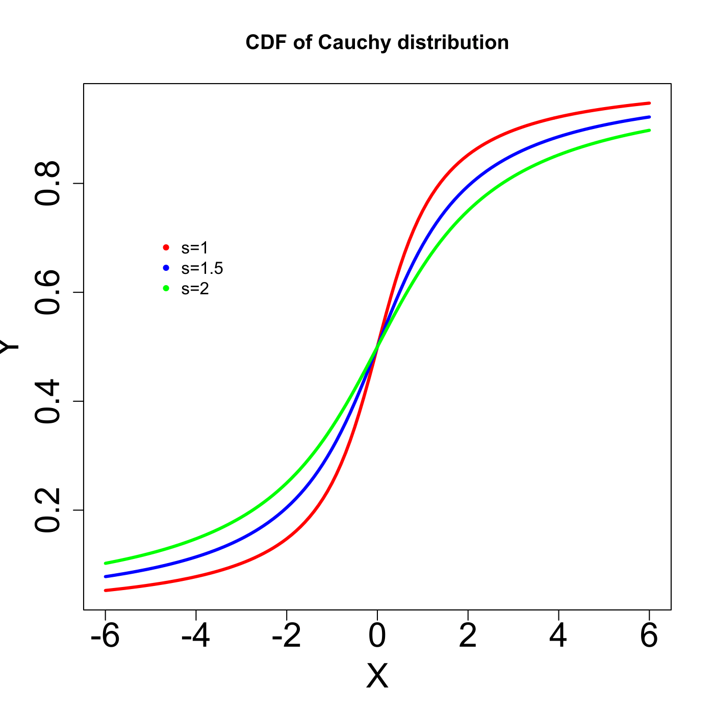

[](http://quantlet.de/)

## [](http://quantlet.de/) **MVAcauchy** [](http://quantlet.de/)

```yaml

Name of QuantLet : MVAcauchy

Published in : Applied Multivariate Statistical Analysis

Description : 'Plots three probability density functions and three cumulative density functions of
the Cauchy distribution with m = 0 and different scale parameters (s=1, s=1.5, s=2).'

Keywords : plot, graphical representation, cauchy, cdf, pdf, density, distribution

See also : MVAcltbern, MVAcltbern2, MVAgausscauchy, MVAtdis

Author : Wolfgang K. Haerdle

Submitted : Wed, September 07 2011 by Awdesch Melzer

```






### R Code:
```r

# clear all variables
rm(list = ls(all = TRUE))
graphics.off()

xx = seq(-6, 6, by = 0.1)

# Pdf of Cauchy distribution with s=1, s=1.5, s=2 
plot(xx, dcauchy(xx, 0, 1), type = "l", ylim = c(0, 0.4), ylab = "Y", xlab = "X", 
    col = "red", lwd = 3, cex.lab = 2, cex.axis = 2)  
lines(xx, dcauchy(xx, 0, 1.5), type = "l", col = "blue", lwd = 3) 
lines(xx, dcauchy(xx, 0, 2), type = "l", col = "green", lwd = 3)  
legend(x = 2, y = 0.3, legend = c("s=1", "s=1.5", "s=2"), pch = c(20, 20, 20), col = c("red", 
    "blue", "green"), bty = "n")
title("PDF of Cauchy distribution")

# Cdf of Cauchy distribution with s=1, s=1.5, s=2 
dev.new()
plot(xx, pcauchy(xx, 0, 1), type = "l", ylab = "Y", xlab = "X", col = "red", lwd = 3, 
    cex.lab = 2, cex.axis = 2)  
lines(xx, pcauchy(xx, 0, 1.5), type = "l", col = "blue", lwd = 3)
lines(xx, pcauchy(xx, 0, 2), type = "l", col = "green", lwd = 3)  
legend(x = -5, y = 0.72, legend = c("s=1", "s=1.5", "s=2"), pch = c(20, 20, 20), col = c("red", 
    "blue", "green"), bty = "n")
title("CDF of Cauchy distribution") 

```
