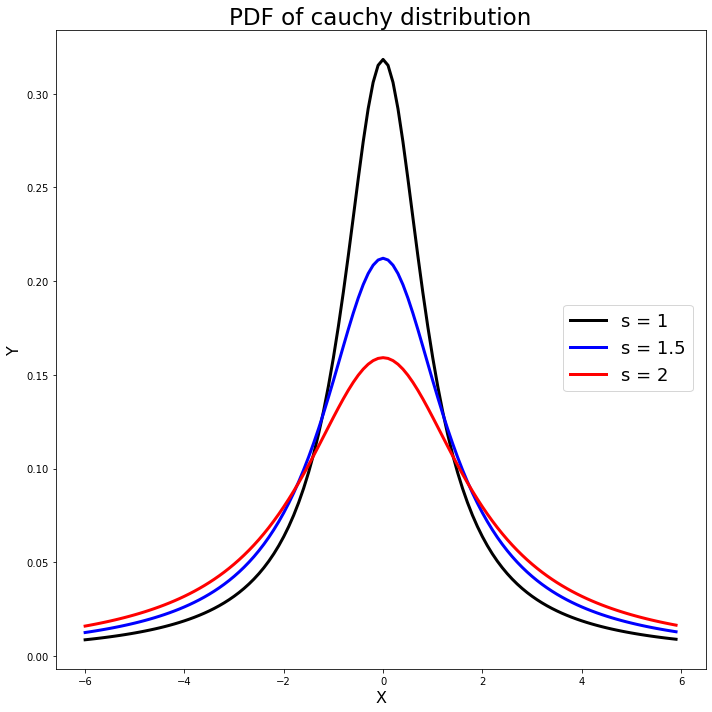
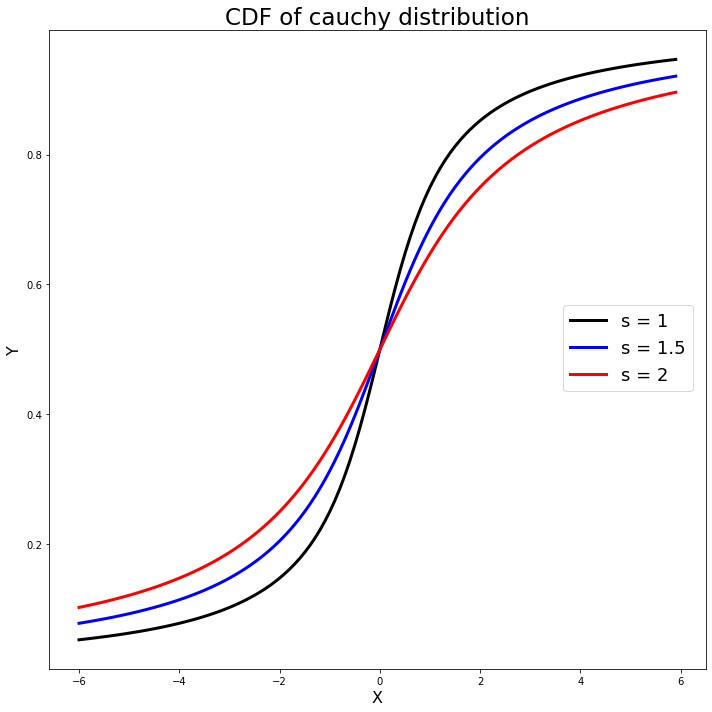

[](http://quantlet.de/)

## [](http://quantlet.de/) **MVAcauchy** [](http://quantlet.de/)

```yaml

Name of QuantLet: MVAcauchy

Published in: Applied Multivariate Statistical Analysis

Description: Plots three probability density functions and three cumulative density functions of the Cauchy distribution with m = 0 and different scale parameters (s=1, s=1.5, s=2).

Keywords: plot, graphical representation, cauchy, cdf, pdf, density, distribution

See also: MVAcltbern, MVAcltbern2, MVAgausscauchy, MVAtdis

Author: Wolfgang K. Haerdle
Author[Python]: Matthias Fengler, Tim Dass

Submitted: Wed, September 07 2011 by Awdesch Melzer
Submitted[Python]: Tue, April 16 2024 by Tim Dass

```






### PYTHON Code
```python

# works on numpy 1.23.5, matplotlib 3.6.2 and scipy 1.10.0
import numpy as np
from scipy.stats import cauchy
import matplotlib.pyplot as plt

# PDF of cauchy distribution
xx = np.arange(-6, 6, 0.1)
pdf1 = cauchy.pdf(xx, scale = 1)
pdf1_5 = cauchy.pdf(xx, scale = 1.5)
pdf2 = cauchy.pdf(xx, scale = 2)

fig1, ax1 = plt.subplots(1,1,figsize=(10, 10))

ax1.plot(xx, pdf1, 'k-', linewidth=3, label='s = 1')
ax1.plot(xx, pdf1_5, 'b-', linewidth=3, label='s = 1.5')
ax1.plot(xx, pdf2, 'r-', linewidth=3, label='s = 2')
ax1.set_xlabel('X', fontsize=16)
ax1.set_ylabel('Y', fontsize=16)
ax1.set_title('PDF of Cauchy distribution', fontsize=23)
fig1.legend(fontsize=18, loc =(0.79, 0.45))

plt.tight_layout()
plt.show()

# CDF of cauchy distribution
cdf1 = cauchy.cdf(xx, scale = 1)
cdf1_5 = cauchy.cdf(xx, scale = 1.5)
cdf2 = cauchy.cdf(xx, scale = 2)

fig2, ax2 = plt.subplots(1,1,figsize=(10, 10))

ax2.plot(xx, cdf1, 'k-', linewidth=3, label='s = 1')
ax2.plot(xx, cdf1_5, 'b-', linewidth=3, label='s = 1.5')
ax2.plot(xx, cdf2, 'r-', linewidth=3, label='s = 2')
ax2.set_xlabel('X', fontsize=16)
ax2.set_ylabel('Y', fontsize=16)
ax2.set_title('CDF of Cauchy distribution', fontsize=23)
fig2.legend(fontsize=18, loc =(0.79, 0.45))

plt.tight_layout()
plt.show()

```

automatically created on 2024-04-25

### R Code
```r


# clear all variables
rm(list = ls(all = TRUE))
graphics.off()

xx = seq(-6, 6, by = 0.1)

# Pdf of Cauchy distribution with s=1, s=1.5, s=2 
plot(xx, dcauchy(xx, 0, 1), type = "l", ylim = c(0, 0.4), ylab = "Y", xlab = "X", 
    col = "red", lwd = 3, cex.lab = 2, cex.axis = 2)  
lines(xx, dcauchy(xx, 0, 1.5), type = "l", col = "blue", lwd = 3) 
lines(xx, dcauchy(xx, 0, 2), type = "l", col = "green", lwd = 3)  
legend(x = 2, y = 0.3, legend = c("s=1", "s=1.5", "s=2"), pch = c(20, 20, 20), col = c("red", 
    "blue", "green"), bty = "n")
title("PDF of Cauchy distribution")

# Cdf of Cauchy distribution with s=1, s=1.5, s=2 
dev.new()
plot(xx, pcauchy(xx, 0, 1), type = "l", ylab = "Y", xlab = "X", col = "red", lwd = 3, 
    cex.lab = 2, cex.axis = 2)  
lines(xx, pcauchy(xx, 0, 1.5), type = "l", col = "blue", lwd = 3)
lines(xx, pcauchy(xx, 0, 2), type = "l", col = "green", lwd = 3)  
legend(x = -5, y = 0.72, legend = c("s=1", "s=1.5", "s=2"), pch = c(20, 20, 20), col = c("red", 
    "blue", "green"), bty = "n")
title("CDF of Cauchy distribution") 

```

automatically created on 2024-04-25