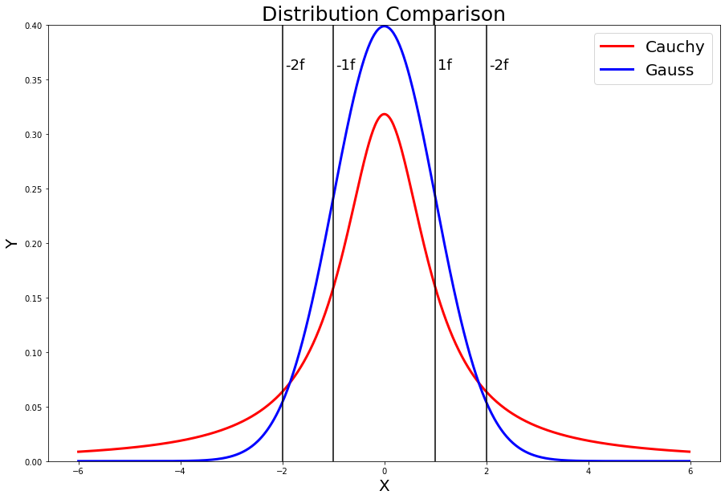

[](http://quantlet.de/)

## [](http://quantlet.de/) **MVAgausscauchy** [](http://quantlet.de/)

```yaml

Name of QuantLet: MVAgausscauchy

Published in: Applied Multivariate Statistical Analysis

Description: Demonstrates the differences of the pdf curves of a standard Gaussian distribution and a Cauchy distribution with location parameter mu = 0 and scale parameter sigma = 1.

Keywords: plot, graphical representation, cauchy, normal, pdf, density, distribution, standard-normal, gaussian

See also: MVAcltbern, MVAcltbern2, MVAcauchy, MVAtdis

Author: Wolfgang K. Haerdle
Author[Python]: Matthias Fengler, Tim Dass

Submitted: Wed, September 07 2011 by Awdesch Melzer
Submitted[Python]: Tue, April 16 2024 by Tim Dass

```




### PYTHON Code
```python

# works on numpy 1.23.5, matplotlib 3.6.2 and scipy 1.10.0
import matplotlib.pyplot as plt
import numpy as np
from scipy.stats import cauchy, norm

fig, ax = plt.subplots(figsize=(15,10))

# Plot the Cauchy density
x = np.arange(-6, 6, 0.02)
y_cauchy = cauchy.pdf(x, 0, 1)
ax.plot(x, y_cauchy, 'r-', linewidth=3)

# Plot the standard normal density
y_norm = norm.pdf(x)
ax.plot(x, y_norm, 'b-', linewidth=3)

ax.axvline(x=-2, color='black')
ax.axvline(x=-1, color='black')
ax.axvline(x=1, color='black')
ax.axvline(x=2, color='black')
ax.text(-1.95, 0.36, '-2f', fontsize = 18)
ax.text(-0.95, 0.36, '-1f', fontsize = 18)
ax.text(1.05, 0.36, '1f', fontsize = 18)
ax.text(2.05, 0.36, '2f', fontsize = 18)

ax.legend(['Cauchy', 'Gauss'], loc='upper right', fontsize=20)
ax.set_title('Distribution Comparison', fontsize=25)

ax.set_xlabel('X', fontsize=20)
ax.set_ylabel('Y', fontsize=20)
ax.set_ylim(0, 0.4)

plt.show()

```

automatically created on 2024-04-25

### R Code
```r


# clear all variables
rm(list = ls(all = TRUE))
graphics.off()

# Plot the Cauchy density
plot(seq(-6, 6, 0.02), dcauchy(seq(-6, 6, 0.02), 0, 1), type = "l", ylim = c(0, 0.4), 
    ylab = "Y", xlab = "X", col = "red", lwd = 3, cex.lab = 2, cex.axis = 2)

# Plot the standard normal density
lines(seq(-6, 6, 0.02), dnorm(seq(-6, 6, 0.02)), type = "l", ylim = c(0, 0.4), col = "blue", 
    lwd = 3)

abline(v = -2)
abline(v = -1)
abline(v = 1)
abline(v = 2)

text(-2, 0.4, label = "-2f")
text(-1, 0.4, label = "-1f")
text(1, 0.4, label = "1f")
text(2, 0.4, pos = 4, label = "2f")

legend(x = 4, y = 0.3, legend = c("Gauss", "Cauchy"), pch = c(20, 20), col = c("blue", 
    "red"), bty = "n")

title("Distribution Comparison")

```

automatically created on 2024-04-25