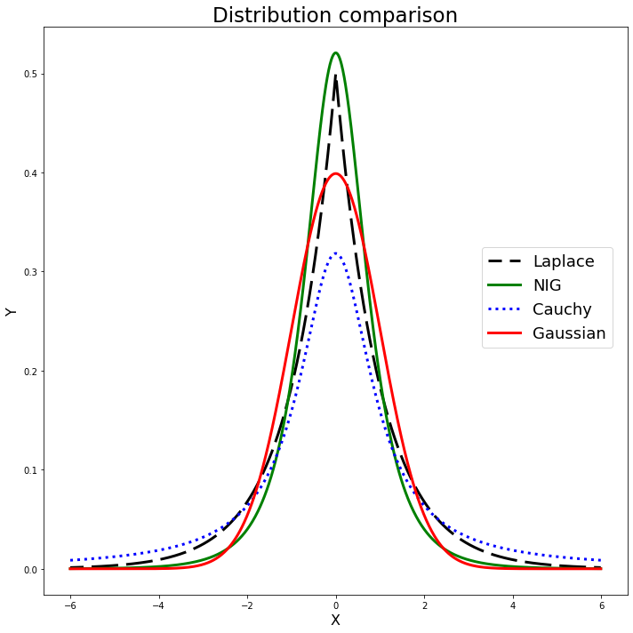
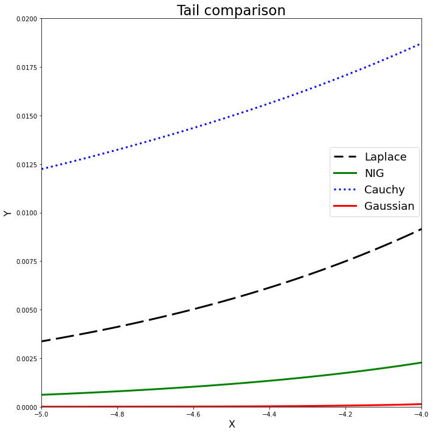
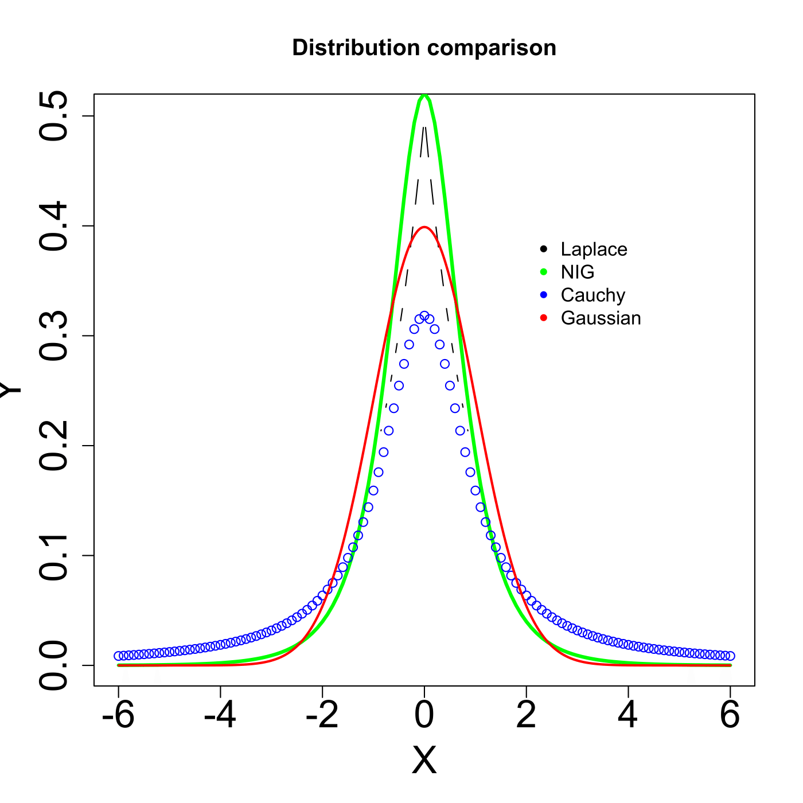

[](http://quantlet.de/)

## [](http://quantlet.de/) **MVAghadatail** [](http://quantlet.de/)

```yaml

Name of QuantLet: MVAghadatail

Published in: Applied Multivariate Statistical Analysis

Description: Plots four probability density functions and four tails in comparison of the NIG, the Laplace, the Cauchy and the Gauss distribution.

Keywords: pdf, cauchy, gaussian, laplace, distribution, tail, heavy-tailed, multivariate, probability, density, plot, graphical representation

See also: MVAghdis, MVAghdistail

Author: Wolfgang K. Haerdle
Author[Python]: Matthias Fengler, Tim Dass

Submitted: Sun, January 29 2012 by Dedy Dwi Prastyo
Submitted[Python]: Tue, April 16 2024 by Tim Dass

```








### PYTHON Code
```python

# works on numpy 1.23.5, matplotlib 3.6.2 and scipy 1.10.0
import numpy as np
import scipy.stats as stats
import matplotlib.pyplot as plt

xx = np.arange(-6, 6, 0.01)
nig_pdf = stats.genhyperbolic.pdf(xx, -0.5, 1, 0, 0, 1)
lap_pdf = stats.laplace.pdf(xx)
cau_pdf = stats.cauchy.pdf(xx)
gau_pdf = stats.norm.pdf(xx)

fig1, ax1 = plt.subplots(1,1,figsize=(10, 10))

ax1.plot(xx, lap_pdf, 'black', linestyle=(5, (10, 3)), lw=3, label='Laplace')
ax1.plot(xx, nig_pdf, 'green', lw=3, label='NIG')
ax1.plot(xx, cau_pdf, 'blue', linestyle=':', lw=3, label='Cauchy')
ax1.plot(xx, gau_pdf, 'red', lw=3, label='Gaussian')
ax1.set_xlabel('X', fontsize=16)
ax1.set_ylabel('Y', fontsize=16)
ax1.set_title('Distribution comparison', fontsize=23)
fig1.legend(fontsize=18, loc =(0.76, 0.45))

plt.tight_layout()
plt.show()

fig2, ax2 = plt.subplots(1,1,figsize=(10, 10))

ax2.plot(xx, lap_pdf, 'black', linestyle=(5, (10, 3)), lw=3, label='Laplace')
ax2.plot(xx, nig_pdf, 'green', lw=3, label='NIG')
ax2.plot(xx, cau_pdf, 'blue', linestyle=':', lw=3, label='Cauchy')
ax2.plot(xx, gau_pdf, 'red', lw=3, label='Gaussian')
ax2.set_xlabel('X', fontsize=16)
ax2.set_ylabel('Y', fontsize=16)
ax2.set_title('Tail comparison', fontsize=23)
ax2.set_xlim([-5, -4])
ax2.set_ylim([0, 0.02])
fig2.legend(fontsize=18, loc =(0.76, 0.5))

plt.tight_layout()
plt.show()
```

automatically created on 2024-04-25

### R Code
```r


# clear variables and close windows
rm(list = ls(all = TRUE))
graphics.off()

# install and load packages
libraries = c("VGAM", "fBasics")
lapply(libraries, function(x) if (!(x %in% installed.packages())) {
    install.packages(x)
})
lapply(libraries, library, quietly = TRUE, character.only = TRUE)

# Graphical comparison of the NIG distribution and normal distribution
xx = seq(-6, 6, by = 0.1)
plot(xx, dlaplace(xx, location = 0, scale = 1), type = "c", ylab = "Y", xlab = "X", 
    col = "black", lwd = 1, cex.lab = 2, cex.axis = 2)
lines(xx, dnig(xx, alpha = 1, beta = 0, delta = 1, mu = 0), type = "l", col = "green", 
    lwd = 3)
lines(xx, dcauchy(xx, 0, 1), type = "p", ylim = c(0, 0.4), ylab = "Y", xlab = "X", 
    col = "blue", lwd = 1)
lines(seq(-6, 6, 0.01), dnorm(seq(-6, 6, 0.01)), type = "l", col = "red", lwd = 2)
legend(x = 2, y = 0.4, legend = c("Laplace", "NIG", "Cauchy", "Gaussian"), pch = c(20, 
    20, 20, 20), col = c("black", "green", "blue", "red"), bty = "n")
title("Distribution comparison")

dev.new()
plot(xx, dnig(xx, alpha = 1, beta = 0, delta = 1, mu = 0), ylim = c(0, 0.02), xlim = c(-5, 
    -4), type = "l", ylab = "Y", xlab = "X", col = "green", lwd = 3, cex.lab = 2, 
    cex.axis = 2)
lines(xx, dlaplace(xx, location = 0, scale = 1), type = "c", col = "black", lwd = 1)
lines(xx, dcauchy(xx, 0, 1), type = "p", col = "blue", lwd = 1)
lines(seq(-6, 6, 0.02), dnorm(seq(-6, 6, 0.02)), type = "l", col = "red", lwd = 3)
legend(x = -4.5, y = 0.014, legend = c("NIG", "Laplace", "Cauchy", "Gaussian"), pch = c(20, 
    20, 20, 20), col = c("green", "black", "blue", "red"), bty = "n")
title("Tail comparison")

```

automatically created on 2024-04-25