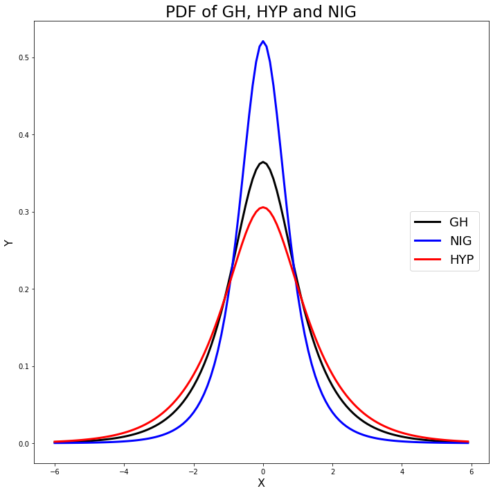
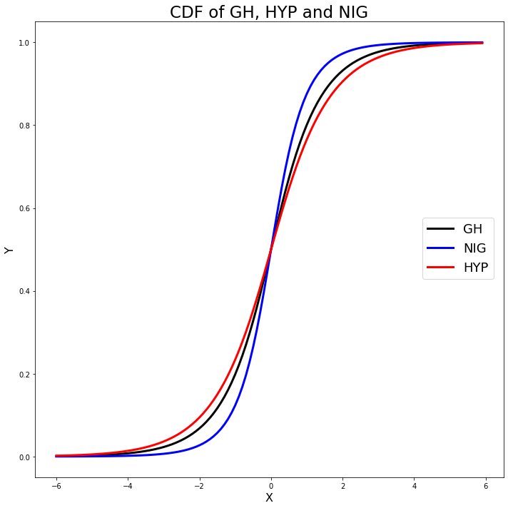

[](http://quantlet.de/)

## [](http://quantlet.de/) **MVAghdis** [](http://quantlet.de/)

```yaml

Name of QuantLet: MVAghdis

Published in: Applied Multivariate Statistical Analysis

Description: Plots three probability density functions and three cumulative density functions of the GH, Hyperbolic and NIG distributions.

Keywords: pdf, cdf, hyperbolic, plot, graphical representation, multivariate, density, probability, distribution, heavy-tailed

See also: MVAghdistail, MVAghadatail

Author: Wolfgang K. Haerdle
Author[Python]: Matthias Fengler, Tim Dass

Submitted: Sun, January 29 2012 by Dedy Dwi Prastyo
Submitted[Python]: Tue, April 16 2024 by Tim Dass

```






### PYTHON Code
```python

# works on numpy 1.23.5, matplotlib 3.6.2 and scipy 1.10.0
import numpy as np
import scipy.stats as stats
import matplotlib.pyplot as plt

# PDF of Generalised Hyperbolic Distribution
xx = np.arange(-6, 6, 0.1)
gh_pdf = stats.genhyperbolic.pdf(xx, 0.5, 1, 0, 0, 1)
nig_pdf = stats.genhyperbolic.pdf(xx, -0.5, 1, 0, 0, 1)
hyp_pdf = stats.genhyperbolic.pdf(xx, 1, 1, 0, 0, 1)

fig1, ax1 = plt.subplots(1,1,figsize=(10, 10))

ax1.plot(xx, gh_pdf, 'k-', linewidth=3, label='GH')
ax1.plot(xx, nig_pdf, 'b-', linewidth=3, label='NIG')
ax1.plot(xx, hyp_pdf, 'r-', linewidth=3, label='HYP')
ax1.set_xlabel('X', fontsize=16)
ax1.set_ylabel('Y', fontsize=16)
ax1.set_title('PDF of GH, HYP and NIG', fontsize=23)
fig1.legend(fontsize=18, loc =(0.83, 0.45))

plt.tight_layout()
plt.show()

# CDF of Generalised Hyperbolic Distribution
gh_cdf = stats.genhyperbolic.cdf(xx, 0.5, 1, 0, 0, 1)
nig_cdf = stats.genhyperbolic.cdf(xx, -0.5, 1, 0, 0, 1)
hyp_cdf = stats.genhyperbolic.cdf(xx, 1, 1, 0, 0, 1)

fig2, ax2 = plt.subplots(1,1,figsize=(10, 10))

ax2.plot(xx, gh_cdf, 'k-', linewidth=3, label='GH')
ax2.plot(xx, nig_cdf, 'b-', linewidth=3, label='NIG')
ax2.plot(xx, hyp_cdf, 'r-', linewidth=3, label='HYP')
ax2.set_xlabel('X', fontsize=16)
ax2.set_ylabel('Y', fontsize=16)
ax2.set_title('CDF of GH, HYP and NIG', fontsize=23)
fig2.legend(fontsize=18, loc =(0.83, 0.45))

plt.tight_layout()
plt.show()
```

automatically created on 2024-04-25

### R Code
```r


# clear variables and close windows
rm(list = ls(all = TRUE))
graphics.off()

# install and load packages
libraries = c("VGAM", "fBasics")
lapply(libraries, function(x) if (!(x %in% installed.packages())) {
    install.packages(x)
})
lapply(libraries, library, quietly = TRUE, character.only = TRUE)

# PDF of Generalised Hyperbolic Distribution
xx = seq(-6, 6, by = 0.1)
plot(xx, dgh(xx, alpha = 1, beta = 0, delta = 1, mu = 0, lambda = 0.5), type = "l", 
    ylim = c(0, 0.5), ylab = "Y", xlab = "X", col = "black", lwd = 3, cex.lab = 2, 
    cex.axis = 2)
lines(xx, dnig(xx, alpha = 1, beta = 0, delta = 1, mu = 0), type = "l", col = "blue", 
    lwd = 3)
lines(xx, dhyp(xx, alpha = 1, beta = 0, delta = 1, mu = 0, pm = c("1", "2", "3", 
    "4")), type = "l", col = "red", lwd = 3)
legend(x = 8, y = 0.3, legend = c("GH", "NIG", "HYP"), pch = c(20, 20), col = c("black", 
    "blue", "red"), bty = "n")
title("PDF of GH, HYP and NIG")

# CDF of Generalised Hyperbolic Distribution
dev.new()
plot(xx, pgh(xx, alpha = 1, beta = 0, delta = 1, mu = 0, lambda = 0.5), type = "l", 
    ylab = "Y", xlab = "X", col = "black", lwd = 3, cex.lab = 2, cex.axis = 2)
lines(xx, pnig(xx, alpha = 1, beta = 0, delta = 1, mu = 0), type = "l", col = "blue", 
    lwd = 3)
lines(xx, phyp(xx, alpha = 1, beta = 0, delta = 1, mu = 0, pm = c("1", "2", "3", 
    "4")), type = "l", col = "red", lwd = 3)
legend(x = 8, y = 0.6, legend = c("GH", "NIG", "HYP"), pch = c(20, 20), col = c("black", 
    "blue", "red"), bty = "n")
title("CDF of GH, HYP and NIG") 

```

automatically created on 2024-04-25