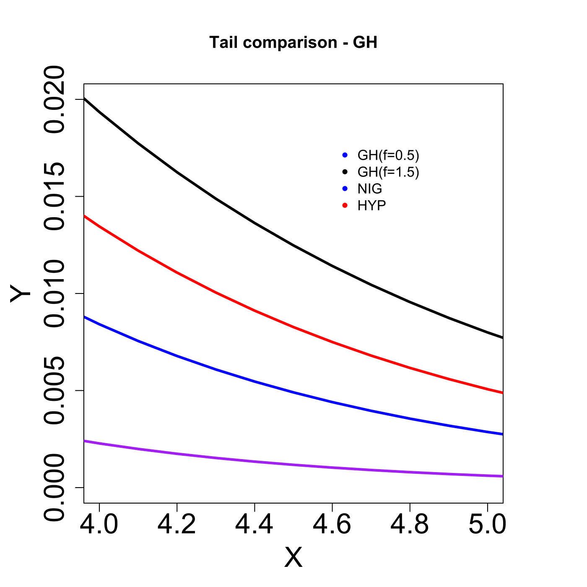

[](http://quantlet.de/)

## [](http://quantlet.de/) **MVAghdistail** [](http://quantlet.de/)

```yaml

Name of QuantLet : MVAghdistail

Published in : Applied Multivariate Statistical Analysis

Description : 'Plots four tails of probability density functions of the GH distribution with
different lambda, NIG and the Hyperbolic distributions (f=0.5 stands for GH-distribution with
lambda=0.5, etc).'

Keywords : 'pdf, distribution, tail, heavy-tailed, multivariate, probability, density, plot,
graphical representation, hyperbolic'

See also : MVAghdis, MVAghadatail

Author : Wolfgang K. Haerdle

Submitted : Sun, January 29 2012 by Dedy Dwi Prastyo

```




### R Code:
```r

# clear all variables
rm(list = ls(all = TRUE))
graphics.off()

# install and load packages
libraries = c("fBasics", "VGAM")
lapply(libraries, function(x) if (!(x %in% installed.packages())) {
    install.packages(x)
})
lapply(libraries, library, quietly = TRUE, character.only = TRUE)

# Tail Comparison of GH distribution
par(mar = c(5, 5, 5, 5))
par(mfrow = c(1, 1))
xx = seq(-6, 6, by = 0.1)
plot(xx, dgh(xx, alpha = 1, beta = 0, delta = 1, mu = 0, lambda = 0.5), type = "l", 
    xlim = c(4, 5), ylim = c(0, 0.02), ylab = "Y", xlab = "X", col = "blue", lwd = 3, 
    cex.lab = 2, cex.axis = 2)
lines(xx, dgh(xx, alpha = 1, beta = 0, delta = 1, mu = 0, lambda = 1.5), type = "l", 
    ylab = "Y", xlab = "X", col = "black", lwd = 3, cex.lab = 2, cex.axis = 2)
lines(xx, dnig(xx, alpha = 1, beta = 0, delta = 1, mu = 0), type = "l", col = "purple", 
    lwd = 3)
lines(xx, dhyp(xx, alpha = 1, beta = 0, delta = 1, mu = 0, pm = c("1", "2", "3", 
    "4")), type = "l", col = "red", lwd = 3)
legend(x = 4.6, y = 0.018, legend = c("GH(f=0.5)", "GH(f=1.5)", "NIG", "HYP"), pch = c(20, 
    20, 20, 20), col = c("blue", "black", "blue", "red"), bty = "n")
title("Tail comparison - GH")

```
