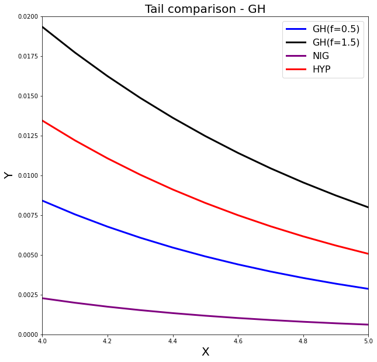

[](http://quantlet.de/)

## [](http://quantlet.de/) **MVAghdistail** [](http://quantlet.de/)

```yaml

Name of QuantLet: MVAghdistail

Published in: Applied Multivariate Statistical Analysis

Description: Plots four tails of probability density functions of the GH distribution with different lambda, NIG and the Hyperbolic distributions (f=0.5 stands for GH-distribution with lambda=0.5, etc).

Keywords: pdf, distribution, tail, heavy-tailed, multivariate, probability, density, plot, graphical representation, hyperbolic

See also: MVAghdis, MVAghadatail

Author: Wolfgang K. Haerdle
Author[Python]: Matthias Fengler, Tim Dass

Submitted: Sun, January 29 2012 by Dedy Dwi Prastyo
Submitted[Python]: Tue, April 16 2024 by Tim Dass

```




### PYTHON Code
```python

# works on numpy 1.23.5, matplotlib 3.6.2 and scipy 1.10.0
import numpy as np
import matplotlib.pyplot as plt
from scipy.stats import genhyperbolic

xx = np.arange(4, 5.1, 0.1)

fig, ax = plt.subplots(1,1,figsize=(10,10))

gh1_pdf = genhyperbolic.pdf(xx, 0.5, 1, 0, 0, 1)
gh2_pdf = genhyperbolic.pdf(xx, 1.5, 1, 0, 0, 1)
nig_pdf = genhyperbolic.pdf(xx, -0.5, 1, 0, 0, 1)
hyp_pdf = genhyperbolic.pdf(xx, 1, 1, 0, 0, 1)

ax.plot(xx, gh1_pdf, 'blue', lw=3, label='GH(f=0.5)')
ax.plot(xx, gh2_pdf, 'black', lw=3, label='GH(f=1.5)')
ax.plot(xx, nig_pdf, 'purple', lw=3, label='NIG')
ax.plot(xx, hyp_pdf, 'red', lw=3, label='HYP')

ax.set_xlim([4, 5])
ax.set_ylim([0, 0.02])
ax.set_xlabel('X', fontsize=20)
ax.set_ylabel('Y', fontsize=20)
ax.set_title('Tail comparison - GH', fontsize=20)
ax.legend(loc='upper right', fontsize=16)

plt.show()
```

automatically created on 2024-04-25

### R Code
```r


# clear all variables
rm(list = ls(all = TRUE))
graphics.off()

# install and load packages
libraries = c("fBasics", "VGAM")
lapply(libraries, function(x) if (!(x %in% installed.packages())) {
    install.packages(x)
})
lapply(libraries, library, quietly = TRUE, character.only = TRUE)

# Tail Comparison of GH distribution
par(mar = c(5, 5, 5, 5))
par(mfrow = c(1, 1))
xx = seq(-6, 6, by = 0.1)
plot(xx, dgh(xx, alpha = 1, beta = 0, delta = 1, mu = 0, lambda = 0.5), type = "l", 
    xlim = c(4, 5), ylim = c(0, 0.02), ylab = "Y", xlab = "X", col = "blue", lwd = 3, 
    cex.lab = 2, cex.axis = 2)
lines(xx, dgh(xx, alpha = 1, beta = 0, delta = 1, mu = 0, lambda = 1.5), type = "l", 
    ylab = "Y", xlab = "X", col = "black", lwd = 3, cex.lab = 2, cex.axis = 2)
lines(xx, dnig(xx, alpha = 1, beta = 0, delta = 1, mu = 0), type = "l", col = "purple", 
    lwd = 3)
lines(xx, dhyp(xx, alpha = 1, beta = 0, delta = 1, mu = 0, pm = c("1", "2", "3", 
    "4")), type = "l", col = "red", lwd = 3)
legend(x = 4.6, y = 0.018, legend = c("GH(f=0.5)", "GH(f=1.5)", "NIG", "HYP"), pch = c(20, 
    20, 20, 20), col = c("blue", "black", "blue", "red"), bty = "n")
title("Tail comparison - GH")

```

automatically created on 2024-04-25