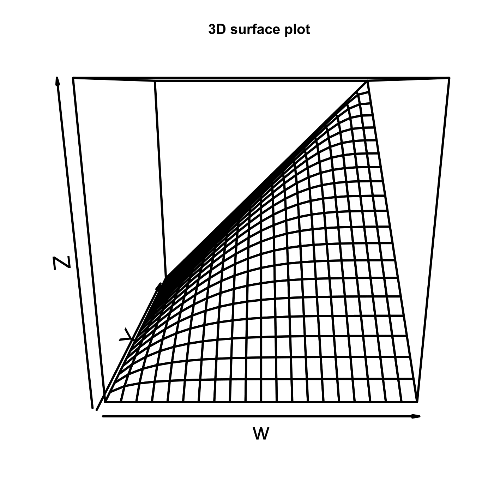
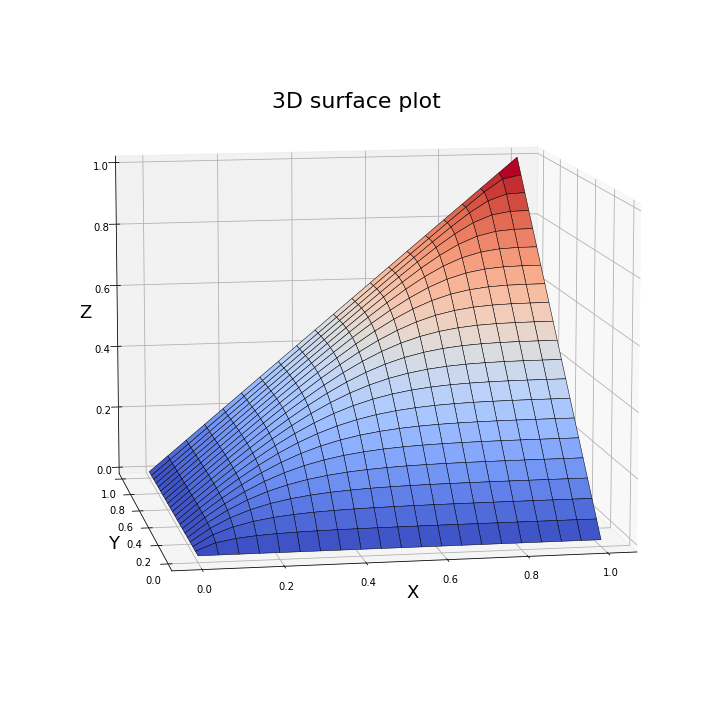

[](http://quantlet.de/)

## [](http://quantlet.de/) **MVAghsurface** [](http://quantlet.de/)

```yaml

Name of QuantLet: MVAghsurface

Published in: Applied Multivariate Statistical Analysis

Description: Generates a 3D surface plot of the Gumbel-Hougaard copula for theta = 3.

Keywords: 3D, plot, graphical representation, surface, gumbel, copula

See also: MVAgumbelclayton

Author: Song Song, Matthias Eckardt
Author[Python]: Matthias Fengler, Tim Dass

Submitted: Sun, January 29 2012 by Dedy Dwi Prastyo
Submitted[Python]: Tue, April 16 2024 by Tim Dass

```





### PYTHON Code
```python

# works on numpy 1.23.5 and matplotlib 3.6.2
import numpy as np
import matplotlib.pyplot as plt

N = 21
v = u = np.arange(0, 1.01, 0.05)
uu = np.tile(u,N)
vv = np.repeat(v,N)
theta = 3
w = np.exp(-((-np.log(uu))**theta + (-np.log(vv))**theta)**(1/theta))
ww = w.reshape(N,N)
xx,yy = np.meshgrid(u,v)

fig = plt.figure(figsize=(10, 10))
ax = fig.add_subplot(111, projection='3d')
ax.plot_surface(xx, yy, ww, cmap='coolwarm', linewidth=0.5, edgecolor='black')
ax.set_xlabel('W', fontsize=18)
ax.set_ylabel('Y', fontsize=18)
ax.set_zlabel('Z', fontsize=18)
ax.set_title('3D surface plot', fontsize=22, y = 0.92)
ax.view_init(elev=10, azim=260)
plt.tight_layout()
plt.show()

```

automatically created on 2024-04-25

### R Code
```r


# clear variables and close windows
rm(list = ls(all = TRUE))
graphics.off()

# install and load packages
libraries = c("grid", "lattice")
lapply(libraries, function(x) if (!(x %in% installed.packages())) {
    install.packages(x)
})
lapply(libraries, library, quietly = TRUE, character.only = TRUE)

# reproduction of matrix of coordinates Creating a function for reproduction of
# coordinates
f = function(u, v, theta) {
    exp(-((-log(u))^theta + (-log(v))^theta)^(1/theta))
}

N     = 21
v     = (u <- seq(0, 1, by = 0.05))
uu    = rep(u, N)
vv    = rep(v, each = N)
theta = 3
w     = matrix(f(uu, vv, theta), nr = N)

persp(w, lwd = 3, cex.axis = 2, cex.lab = 2, scale = T) 
title(paste("3D surface plot "))

```

automatically created on 2024-04-25