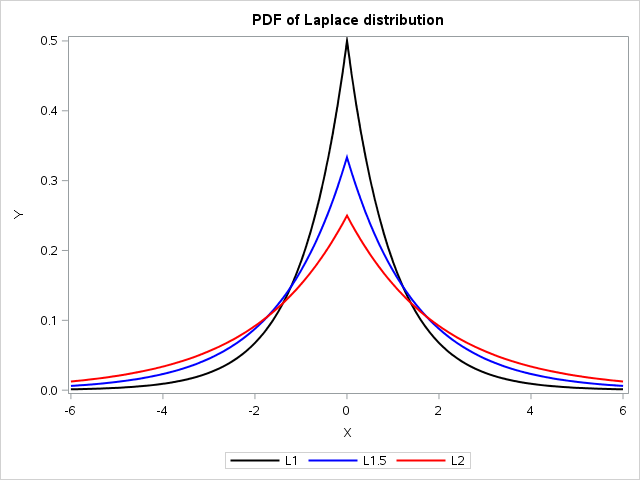
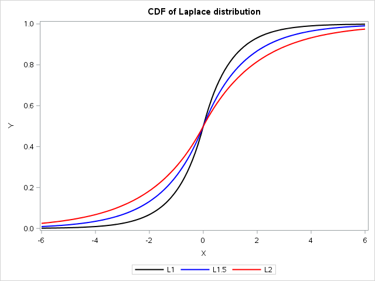
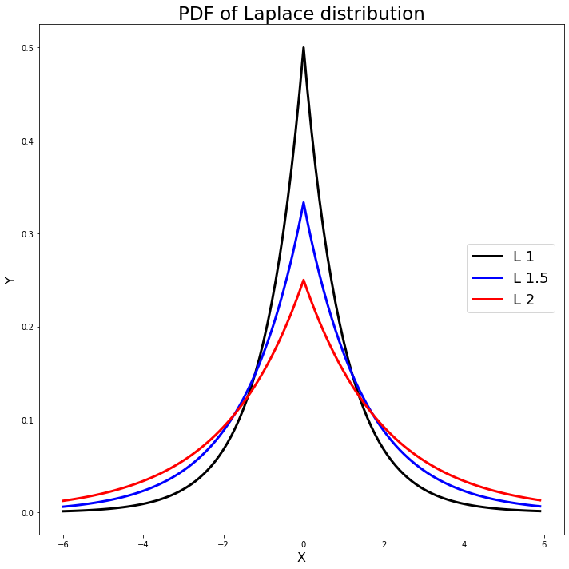
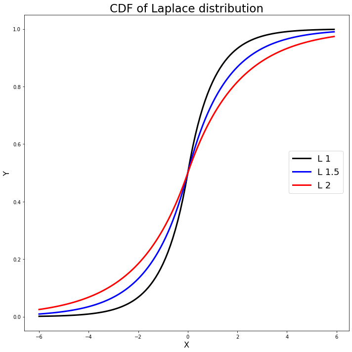
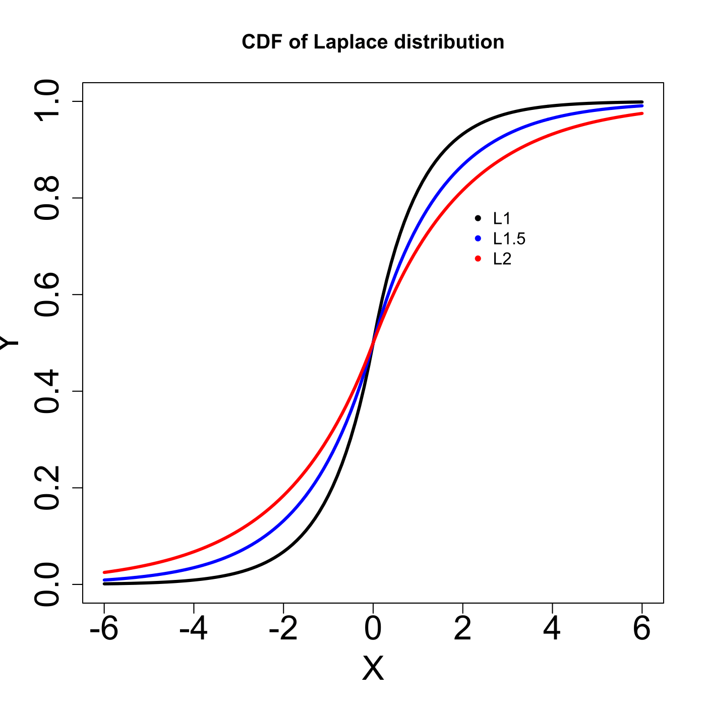

[](http://quantlet.de/)

## [](http://quantlet.de/) **MVAlaplacedis** [](http://quantlet.de/)

```yaml

Name of QuantLet: MVAlaplacedis

Published in: Applied Multivariate Statistical Analysis

Description: Plots three probability density functions and three cumulative density functions of the Laplace-distribution with different scale (L1 stands for Laplace-distribution with scale 1, etc).

Keywords: pdf, probability, density, cdf, multivariate, laplace, scale, plot, graphical representation, distribution, heavy-tailed, sas

Author: Wolfgang K. Haerdle
Author[SAS]: Svetlana Bykovskaya
Author[Python]: Matthias Fengler, Tim Dass

Submitted: Sun, January 29 2012 by Dedy Dwi Prastyo
Submitted[SAS]: Wen, April 6 2016 by Svetlana Bykovskaya
Submitted[Python]: Tue, April 16 2024 by Tim Dass

```












### PYTHON Code
```python

# works on numpy 1.23.5, matplotlib 3.6.2 and scipy 1.10.0
import numpy as np
from scipy.stats import laplace
import matplotlib.pyplot as plt

# PDF of Laplace distribution
xx = np.arange(-6, 6, 0.1)
pdf1 = laplace.pdf(xx, scale = 1)
pdf1_5 = laplace.pdf(xx, scale = 1.5)
pdf2 = laplace.pdf(xx, scale = 2)

fig1, ax1 = plt.subplots(1,1,figsize=(10, 10))

ax1.plot(xx, pdf1, 'k-', linewidth=3, label='L 1')
ax1.plot(xx, pdf1_5, 'b-', linewidth=3, label='L 1.5')
ax1.plot(xx, pdf2, 'r-', linewidth=3, label='L 2')
ax1.set_xlabel('X', fontsize=16)
ax1.set_ylabel('Y', fontsize=16)
ax1.set_title('PDF of Laplace distribution', fontsize=23)
fig1.legend(fontsize=18, loc =(0.82, 0.45))

plt.tight_layout()
plt.show()

# CDF of Laplace distribution
cdf1 = laplace.cdf(xx, scale = 1)
cdf1_5 = laplace.cdf(xx, scale = 1.5)
cdf2 = laplace.cdf(xx, scale = 2)

fig2, ax2 = plt.subplots(1,1,figsize=(10, 10))

ax2.plot(xx, cdf1, 'k-', linewidth=3, label='L 1')
ax2.plot(xx, cdf1_5, 'b-', linewidth=3, label='L 1.5')
ax2.plot(xx, cdf2, 'r-', linewidth=3, label='L 2')
ax2.set_xlabel('X', fontsize=16)
ax2.set_ylabel('Y', fontsize=16)
ax2.set_title('CDF of Laplace distribution', fontsize=23)
fig2.legend(fontsize=18, loc =(0.82, 0.45))

plt.tight_layout()
plt.show()
```

automatically created on 2024-04-25

### R Code
```r


# clear variables and close windows
rm(list = ls(all = TRUE))
graphics.off()

# install and load packages
libraries = c("VGAM")
lapply(libraries, function(x) if (!(x %in% installed.packages())) {
    install.packages(x)
})
lapply(libraries, library, quietly = TRUE, character.only = TRUE)

# PDF of Laplace Distribution
xx = seq(-6, 6, by = 0.1)
plot(xx, dlaplace(xx, location = 0, scale = 1), type = "l", ylab = "Y", xlab = "X", 
    col = "black", lwd = 3, cex.lab = 2, cex.axis = 2)
lines(xx, dlaplace(xx, location = 0, scale = 1.5), type = "l", col = "blue", lwd = 3)
lines(xx, dlaplace(xx, location = 0, scale = 2), type = "l", col = "red", lwd = 3)
legend(x = 2, y = 0.4, legend = c("L1", "L1.5", "L2"), pch = c(20, 20), col = c("black", 
    "blue", "red"), bty = "n")
title("PDF of Laplace distribution")

# CDF of Laplace Distribution
dev.new()
plot(xx, plaplace(xx, location = 0, scale = 1), type = "l", ylab = "Y", xlab = "X", 
    col = "black", lwd = 3, cex.lab = 2, cex.axis = 2)
lines(xx, plaplace(xx, location = 0, scale = 1.5), type = "l", col = "blue", lwd = 3)
lines(xx, plaplace(xx, location = 0, scale = 2), type = "l", col = "red", lwd = 3)
legend(x = 2, y = 0.8, legend = c("L1", "L1.5", "L2"), pch = c(20, 20), col = c("black", 
    "blue", "red"), bty = "n")
title("CDF of Laplace distribution") 

```

automatically created on 2024-04-25

### SAS Code
```sas

data pdf;
  do x = -6 to 6 by 0.1;
    p1 = pdf("Laplace", x, 0, 1);
    p2 = pdf("Laplace", x, 0, 1.5);
    p3 = pdf("Laplace", x, 0, 2);
    c1 = cdf("Laplace", x, 0, 1);
    c2 = cdf("Laplace", x, 0, 1.5);
    c3 = cdf("Laplace", x, 0, 2);
    output;
  end;
run;
 
* PDF of Laplace Distribution;
proc sgplot data = pdf;
  title 'PDF of Laplace distribution';
  series x = x y = p1 / legendlabel = 'L1' lineattrs = (color = black thickness = 2);
  series x = x y = p2 / legendlabel = 'L1.5'  lineattrs = (color = blue thickness = 2);
  series x = x y = p3 / legendlabel = 'L2'  lineattrs = (color = red thickness = 2);
  xaxis label = "X"; 
  yaxis label = "Y";
run;

* CDF of Laplace Distribution;
proc sgplot data = pdf;
  title 'CDF of Laplace distribution';
  series x = x y = c1 / legendlabel = 'L1' lineattrs = (color = black thickness = 2);
  series x = x y = c2 / legendlabel = 'L1.5'  lineattrs = (color = blue thickness = 2);
  series x = x y = c3 / legendlabel = 'L2'  lineattrs = (color = red thickness = 2);
  xaxis label = "X"; 
  yaxis label = "Y";
run;
```

automatically created on 2024-04-25