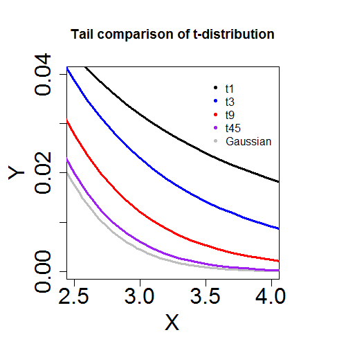
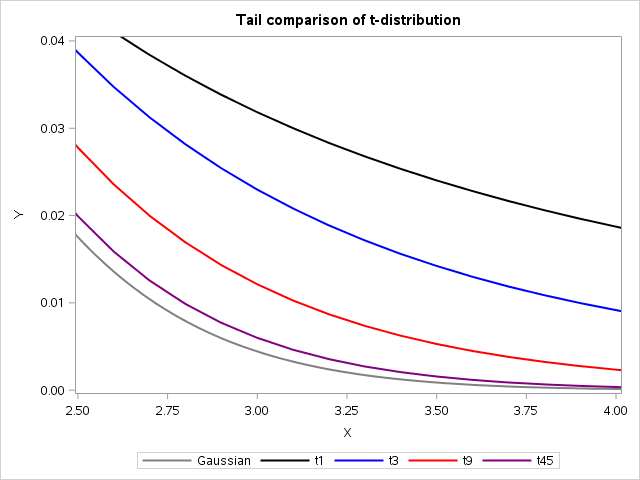

[](http://quantlet.de/)

## [](http://quantlet.de/) **MVAtdistail** [](http://quantlet.de/)

```yaml

Name of QuantLet : MVAtdistail

Published in : Applied Multivariate Statistical Analysis

Description : 'Plots four tails of probability density functions of the t-distribution and one tail
of the Gauss distribution with different degrees of freedom (t3 stands for t-distribution with 3
degrees of freedom, etc).'

Keywords : 'plot, graphical representation, multivariate, tail, heavy-tailed, pdf, probability,
density, t-distribution, distribution, gaussian, sas'

Author : Wolfgang K. Haerdle

Author[SAS] : Svetlana Bykovskaya

Submitted : Sun, January 29 2012 by Dedy Dwi Prastyo

Submitted[SAS] : Wen, April 6 2016 by Svetlana Bykovskaya

```






### R Code:
```r

# clear variables and close windows
rm(list = ls(all = TRUE))
graphics.off()

# Tail comparison of t-distribution
par(mar = c(5, 5, 5, 5))
par(mfrow = c(1, 1))
xx = seq(-6, 6, by = 0.1)
plot(seq(-6, 6, 0.02), dnorm(seq(-6, 6, 0.02)), type = "l", xlim = c(2.5, 4), ylim = c(0, 
    0.04), col = "grey", ylab = "Y", xlab = "X", lwd = 3, cex.lab = 2, cex.axis = 2)
lines(xx, dt(xx, df = 1), xlim = c(2.5, 4), type = "l", col = "black", lwd = 3)
lines(xx, dt(xx, df = 3), xlim = c(2.5, 4), type = "l", col = "blue", lwd = 3)
lines(xx, dt(xx, df = 9), xlim = c(2.5, 4), type = "l", col = "red", lwd = 3)
lines(xx, dt(xx, df = 45), xlim = c(2.5, 4), type = "l", col = "purple", lwd = 3)
legend(x = 3.5, y = 0.04, legend = c("t1", "t3", "t9", "t45", "Gaussian"), pch = c(20, 
    20, 20, 20, 20), col = c("black", "blue", "red", "purple", "grey"), bty = "n")
title("Tail comparison of t-distribution") 

```

### SAS Code:
```sas
data pdf;
  do x1 = -6 to 6 by 0.02;
    y1 = pdf("Normal", x1);
    output;
  end;
  
  do x2 = -6 to 6 by 0.1;
    y2 = pdf("T", x2, 1);
    y3 = pdf("T", x2, 3);
    y4 = pdf("T", x2, 9);
    y5 = pdf("T", x2, 45);
    output;
  end;
run;
 
proc sgplot data = pdf;
  title 'Tail comparison of t-distribution';
  series x = x1 y = y1 / legendlabel = 'Gaussian' lineattrs = (color = grey thickness = 2);
  series x = x2 y = y2 / legendlabel = 't1'  lineattrs = (color = black thickness = 2);
  series x = x2 y = y3 / legendlabel = 't3'  lineattrs = (color = blue thickness = 2);
  series x = x2 y = y4 / legendlabel = 't9'  lineattrs = (color = red thickness = 2);
  series x = x2 y = y5 / legendlabel = 't45' lineattrs = (color = purple thickness = 2);
  xaxis min = 2.5 max = 4    label = "X"; 
  yaxis min = 0   max = 0.04 label = "Y";
run;
```
