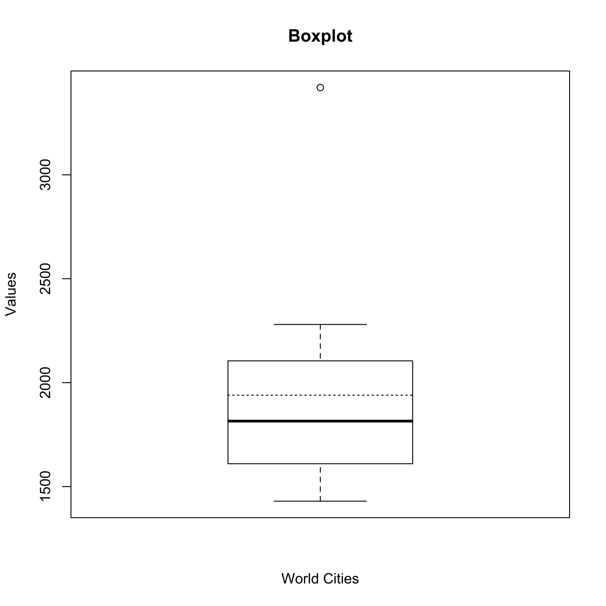

[](http://quantlet.de/)

## [](http://quantlet.de/) **MVAboxcity** [](http://quantlet.de/)

```yaml

Name of QuantLet : MVAboxcity

Published in : Applied Multivariate Statistical Analysis

Description : Computes the five-number summary and a boxplot for world cities.

Keywords : 'descriptive, descriptive-statistics, quantile, five number summary, financial, data
visualization, boxplot, plot, graphical representation, sas'

See also : MVAboxbank1, MVAboxbank6, MVAboxbhd, MVAboxcar

Author : Jorge Patron, Vladimir Georgescu, Song Song

Author[SAS] : Svetlana Bykovskaya

Submitted : Tue, September 09 2014 by Awdesch Melzer

Submitted[SAS] : Wen, April 6 2016 by Svetlana Bykovskaya

Datafiles : cities.txt

```




### R Code:
```r

# clear variables and close windows
rm(list = ls(all = TRUE))
graphics.off()

# load data
x  = read.table("cities.txt")
m1 = mean(as.matrix(x))

# Plot box plot
boxplot(x, xlab = "World Cities", ylab = "Values")
lines(c(0.8, 1.2), c(m1, m1), col = "black", lty = "dotted", lwd = 1.2)
title("Boxplot")

# Five Number Summary R 'quantile' function uses a different algorithm to
# calculate the sample quantiles than in the MVA book Therefore, the values
# using Matlab could differ from the Book values, but the difference is not
# great, and should not be significant.  Easiest way to calculate Five Number
# Summary is quantile(population,[.025 .25 .50 .75 .975])
five = quantile(x[, 1], c(0.025, 0.25, 0.5, 0.75, 0.975))

# Display results
print("Five number summary, in millions")
print(five/100)
```

### SAS Code:
```sas

* Import the data;
data cities;
  id + 1;
  infile '/folders/myfolders/Sas-work/data/cities.txt';
  input World_Cities;
run;

proc transpose data = cities out = cities_t;
  by id;
run;

data cities_t;
  set cities_t;
  label _name_ = "Variable";
  label col1 = "Value";
run;

title "Boxplot";
proc sgplot data = cities_t;
  vbox col1 / group = _name_ ;
run;

title 'Five number summary';
proc means data = cities p5 p25 p50 p75 p95;
  var World_Cities;
run;
```
