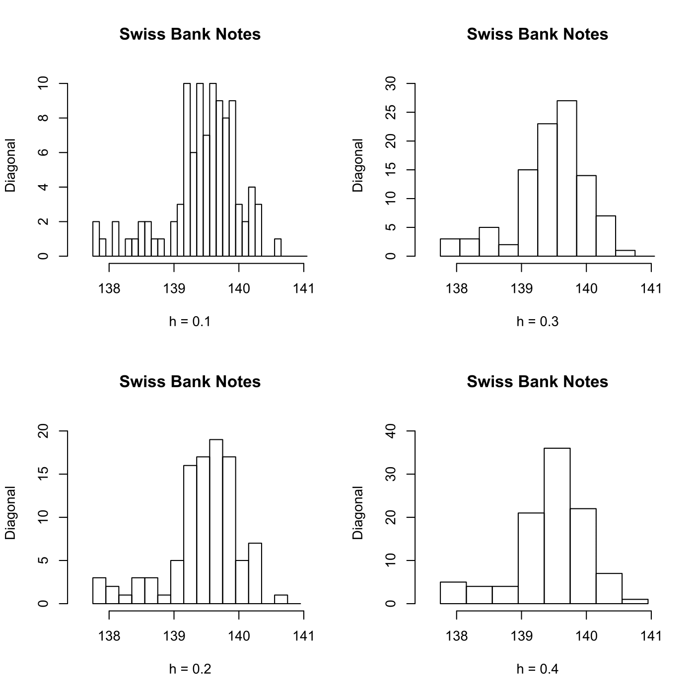
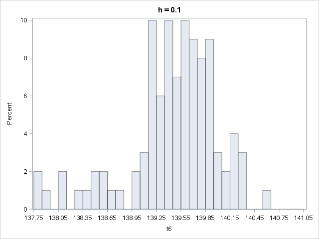
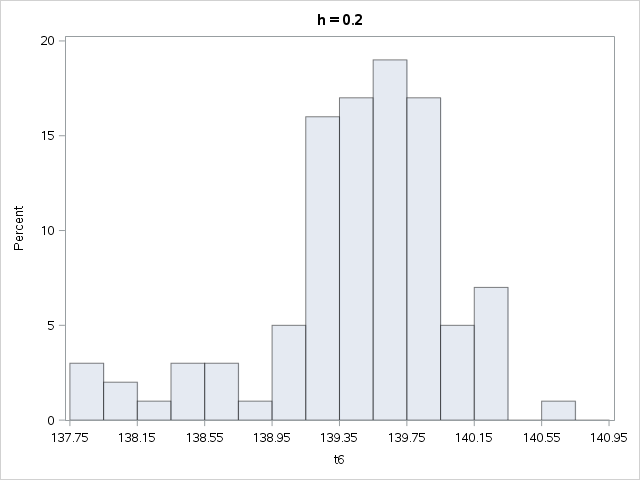
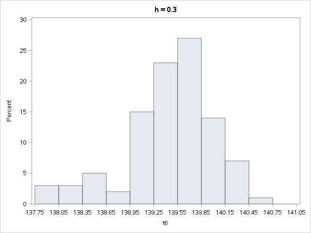
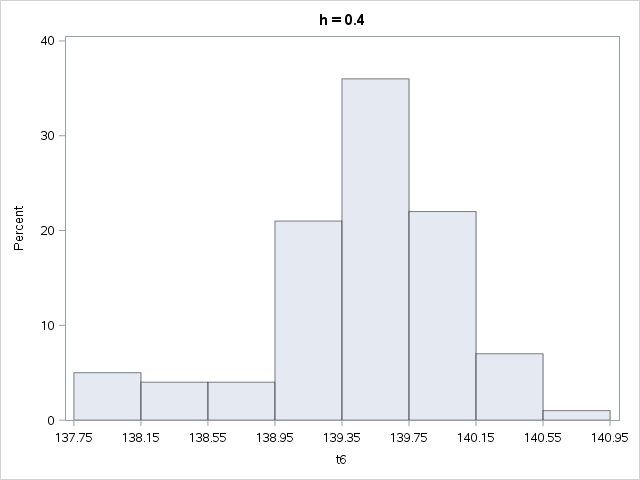

[](http://quantlet.de/)

## [](http://quantlet.de/) **MVAhisbank1** [](http://quantlet.de/)

```yaml

Name of QuantLet: MVAhisbank1

Published in: Applied Multivariate Statistical Analysis

Description: Computes 4 histograms for the diagonal of the forged Swiss bank notes. The histograms are different with respect to their binwidth.

Keywords: binwidth, density, descriptive, descriptive-statistics, distribution, empirical, histogram, origin, plot, graphical representation, financial, data visualization, sas

See also: MVAhisbank2

Author: Song Song, Vladimir Georgescu, Jorge Patron
Author[SAS]: Svetlana Bykovskaya
Author[Python]: 'Matthias Fengler, Liudmila Gorkun-Voevoda'

Submitted: Tue, September 09 2014 by Awdesch Melzer
Submitted[SAS]: Wen, April 6 2016 by Svetlana Bykovskaya
Submitted[Python]: 'Wed, April 22 2020 by Liudmila Gorkun-Voevoda'

Datafiles: bank2.dat

Example: Diagonal of counterfeit bank notes. Histograms with x0 = 137.8 and h = 0.1 (upper left), h = 0.2 (lower left), h = 0.3 (upper right), h = 0.4 (lower right).

```












### R Code
```r


# clear variables and close windows
rm(list = ls(all = TRUE))
graphics.off()

# load data
x = read.table("bank2.dat")
x = x[101:200, 6]
origin = 137.75

# Because origin<min(x), the histogram includes all values
y1 = seq(137.75, 141.05, 0.1)
y2 = seq(137.75, 141.05, 0.2)
y3 = seq(137.75, 141.05, 0.3)
y4 = seq(137.75, 141.05, 0.4)

par(mfrow = c(2, 2))

hist(x, y1, ylab = "Diagonal", xlab = "h = 0.1", xlim = c(137.5, 141), ylim = c(0, 
    10.5), main = "Swiss Bank Notes", axes = FALSE)
axis(side = 1, at = seq(138, 141), labels = seq(138, 141))
axis(side = 2, at = seq(0, 10, 2), labels = seq(0, 10, 2))

hist(x, y3, ylab = "Diagonal", xlab = "h = 0.3", xlim = c(137.5, 141), ylim = c(0, 
    31.5), main = "Swiss Bank Notes", axes = FALSE)
axis(side = 1, at = seq(138, 141), labels = seq(138, 141))
axis(side = 2, at = seq(0, 30, 5), labels = seq(0, 30, 5))

hist(x, y2, ylab = "Diagonal", xlab = "h = 0.2", xlim = c(137.5, 141), ylim = c(0, 
    21), main = "Swiss Bank Notes", axes = FALSE)
axis(side = 1, at = seq(138, 141), labels = seq(138, 141))
axis(side = 2, at = seq(0, 20, 5), labels = seq(0, 20, 5))

hist(x, y4, ylab = "Diagonal", xlab = "h = 0.4", xlim = c(137.5, 141), ylim = c(0, 
    42), main = "Swiss Bank Notes", axes = FALSE)
axis(side = 1, at = seq(138, 141), labels = seq(138, 141))
axis(side = 2, at = seq(0, 40, 10), labels = seq(0, 40, 10))
```

automatically created on 2020-04-22

### PYTHON Code
```python

import pandas as pd
import numpy as np
import matplotlib.pyplot as plt

# load data
x = pd.read_csv("bank2.dat", sep = "\s+", header=None)
x = x.iloc[100:200, 5]
origin = 137.75

# Because origin<min(x), the histogram includes all values
y1 = np.arange(137.75, 141.05, 0.1)
y2 = np.arange(137.75, 141.05, 0.2)
y3 = np.arange(137.75, 141.05, 0.3)
y4 = np.arange(137.75, 141.05, 0.4)

fig, axes = plt.subplots(2, 2, figsize = (10,10))
axes[0,0].hist(x, y1, edgecolor = "black", color = "white")
axes[0,0].set_xlabel("h = 0.1")
axes[0,0].set_ylabel("Diagonal")
axes[0,0].set_title("Swiss Bank Notes")
axes[0,0].set_xlim(137.5, 141)
axes[0,0].set_xticks(list(range(138, 142)))
axes[0,0].set_ylim(0, 10.5)
axes[0,0].set_yticks(list(range(0, 11, 2)))

axes[0,1].hist(x, y3, edgecolor = "black", color = "white")
axes[0,1].set_xlabel("h = 0.3")
axes[0,1].set_ylabel("Diagonal")
axes[0,1].set_title("Swiss Bank Notes")
axes[0,1].set_xlim(137.5, 141)
axes[0,1].set_xticks(list(range(138, 142)))
axes[0,1].set_ylim(0, 31.5)
axes[0,1].set_yticks(list(range(0, 31, 5)))

axes[1,0].hist(x, y2, edgecolor = "black", color = "white")
axes[1,0].set_xlabel("h = 0.2")
axes[1,0].set_ylabel("Diagonal")
axes[1,0].set_title("Swiss Bank Notes")
axes[1,0].set_xlim(137.5, 141)
axes[1,0].set_xticks(list(range(138, 142)))
axes[1,0].set_ylim(0, 21)
axes[1,0].set_yticks(list(range(0, 21, 5)))

axes[1,1].hist(x, y4, edgecolor = "black", color = "white")
axes[1,1].set_xlabel("h = 0.4")
axes[1,1].set_ylabel("Diagonal")
axes[1,1].set_title("Swiss Bank Notes")
axes[1,1].set_xlim(137.5, 141)
axes[1,1].set_xticks(list(range(138, 142)))
axes[1,1].set_ylim(0, 42)
axes[1,1].set_yticks(list(range(0, 41, 10)))

fig.tight_layout()

plt.show()


```

automatically created on 2020-04-22

### SAS Code
```sas


* Import the data;
data bank2;
  infile '/folders/myfolders/Sas-work/data/bank2.dat';
  input t1-t6;
  drop t1-t5;
run;

data b2;
  set bank2 (firstobs = 101 obs = 200);
run;

* Because origin=137.75<min(x), the histogram includes all values;
title 'Swiss Bank Notes';
proc univariate data = b2 noprint;
  histogram t6 / 
    odstitle = 'h = 0.1'
    endpoints = 137.75 to 141.05 by 0.1;
  histogram t6 / 
    odstitle = 'h = 0.2'
    endpoints = 137.75 to 141.05 by 0.2;
  histogram t6 / 
    odstitle = 'h = 0.3'
    endpoints = 137.75 to 141.05 by 0.3;
  histogram t6 / 
    odstitle = 'h = 0.4'
    endpoints = 137.75 to 141.05 by 0.4;
run;


```

automatically created on 2020-04-22