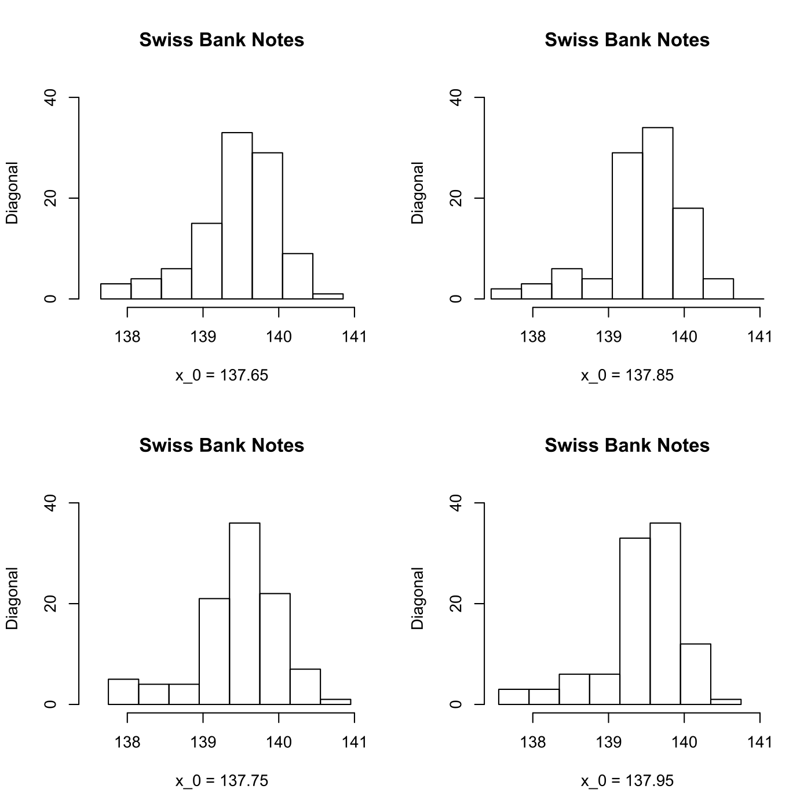
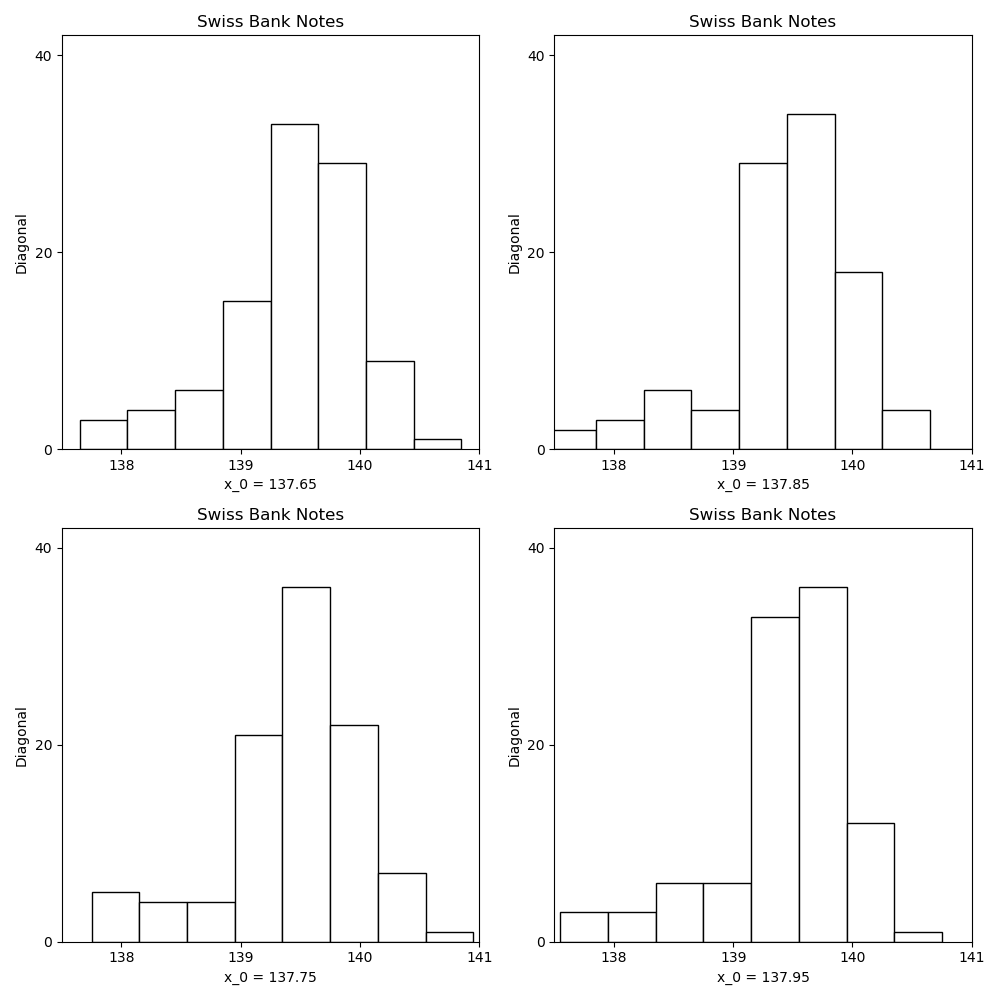
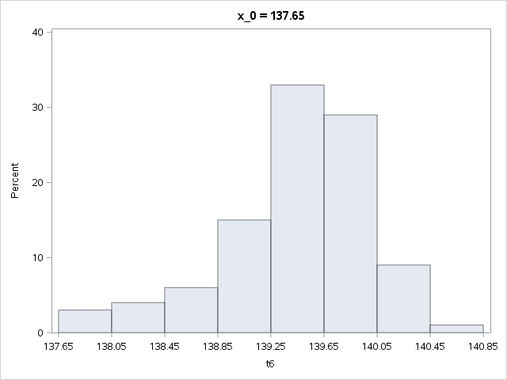
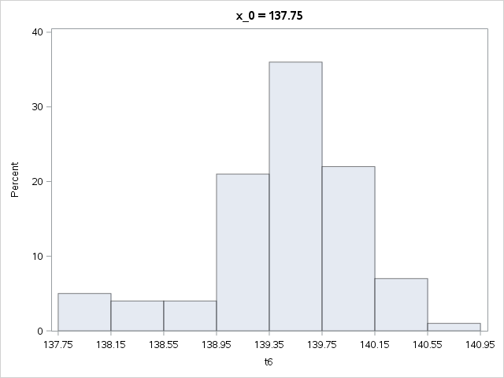
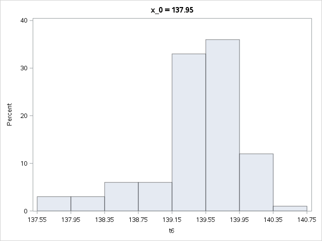

[](http://quantlet.de/)

## [](http://quantlet.de/) **MVAhisbank2** [](http://quantlet.de/)

```yaml

Name of QuantLet: MVAhisbank2

Published in: Applied Multivariate Statistical Analysis

Description: Computes 4 histograms for the diagonal of the forged Swiss bank notes. The histograms are different with respect to their origin.

Keywords: binwidth, data visualization, descriptive, descriptive-statistics, distribution, empirical, histogram, origin, plot, graphical representation, sas

See also: MVAhisbank1

Author: Song Song, Vladimir Georgescu, Jorge Patron, Awdesch Melzer
Author[SAS]: Svetlana Bykovskaya
Author[Python]: 'Matthias Fengler, Liudmila Gorkun-Voevoda'

Submitted: Tue, September 09 2014 by Awdesch Melzer
Submitted[SAS]: Wen, April 6 2016 by Svetlana Bykovskaya
Submitted[Python]: 'Wed, April 22 2020 by Liudmila Gorkun-Voevoda'

Datafiles: bank2.dat

Example: Diagonal of counterfeit bank notes. Histogram with h = 0.4 and origins x0 = 137.65 (upper left), x0 = 137.75 (lower left), x0 = 137.85 (upper right), x0 = 137.95 (lower right).

```












### R Code
```r


# clear variables and close windows
rm(list = ls(all = TRUE))
graphics.off()

# load data
x = read.table("bank2.dat")
x = x[101:200, 6]

origin1 = 137.65
origin2 = 137.75
origin3 = 137.85
origin4 = 137.95

y1 = seq(origin1, 141.05, 0.4)
y2 = seq(origin2, 141.05, 0.4)
y3 = seq(origin3 - 0.4, 141.05, 0.4)  # origin>min(x)
y4 = seq(origin4 - 0.4, 141.05, 0.4)  # origin>min(x)

par(mfrow = c(2, 2))
hist(x, y1, ylab = "Diagonal", xlab = "x_0 = 137.65", xlim = c(137.5, 141), ylim = c(0, 
    42), main = "Swiss Bank Notes", axes = FALSE)
axis(side = 1, at = seq(138, 141), labels = seq(138, 141))
axis(side = 2, at = seq(0, 40, 20), labels = seq(0, 40, 20))

hist(x, y3, ylab = "Diagonal", xlab = "x_0 = 137.85", xlim = c(137.5, 141), ylim = c(0, 
    42), main = "Swiss Bank Notes", axes = FALSE)
axis(side = 1, at = seq(138, 141), labels = seq(138, 141))
axis(side = 2, at = seq(0, 40, 20), labels = seq(0, 40, 20))

hist(x, y2, ylab = "Diagonal", xlab = "x_0 = 137.75", xlim = c(137.5, 141), ylim = c(0, 
    42), main = "Swiss Bank Notes", axes = FALSE)
axis(side = 1, at = seq(138, 141), labels = seq(138, 141))
axis(side = 2, at = seq(0, 40, 20), labels = seq(0, 40, 20))

hist(x, y4, ylab = "Diagonal", xlab = "x_0 = 137.95", xlim = c(137.5, 141), ylim = c(0, 
    42), main = "Swiss Bank Notes", axes = FALSE)
axis(side = 1, at = seq(138, 141), labels = seq(138, 141))
axis(side = 2, at = seq(0, 40, 20), labels = seq(0, 40, 20))
```

automatically created on 2020-04-22

### PYTHON Code
```python

import pandas as pd
import numpy as np
import matplotlib.pyplot as plt

# load data
x = pd.read_csv("bank2.dat", sep = "\s+", header=None)
x = x.iloc[100:200, 5]

origin1 = 137.65
origin2 = 137.75
origin3 = 137.85
origin4 = 137.95

y1 = np.arange(origin1, 141.05, 0.4)
y2 = np.arange(origin2, 141.05, 0.4)
y3 = np.arange(origin3 - 0.4, 141.05, 0.4)  # origin>min(x)
y4 = np.arange(origin4 - 0.4, 141.05, 0.4)  # origin>min(x)

fig, axes = plt.subplots(2, 2, figsize = (10,10))
axes[0,0].hist(x, y1, edgecolor = "black", color = "white")
axes[0,0].set_xlabel("x_0 = " + str(origin1))
axes[0,0].set_ylabel("Diagonal")
axes[0,0].set_title("Swiss Bank Notes")
axes[0,0].set_xlim(137.5, 141)
axes[0,0].set_xticks(list(range(138, 142)))
axes[0,0].set_ylim(0, 42)
axes[0,0].set_yticks(list(range(0, 41, 20)))

axes[0,1].hist(x, y3, edgecolor = "black", color = "white")
axes[0,1].set_xlabel("x_0 = " + str(origin3))
axes[0,1].set_ylabel("Diagonal")
axes[0,1].set_title("Swiss Bank Notes")
axes[0,1].set_xlim(137.5, 141)
axes[0,1].set_xticks(list(range(138, 142)))
axes[0,1].set_ylim(0, 42)
axes[0,1].set_yticks(list(range(0, 41, 20)))

axes[1,0].hist(x, y2, edgecolor = "black", color = "white")
axes[1,0].set_xlabel("x_0 = " + str(origin2))
axes[1,0].set_ylabel("Diagonal")
axes[1,0].set_title("Swiss Bank Notes")
axes[1,0].set_xlim(137.5, 141)
axes[1,0].set_xticks(list(range(138, 142)))
axes[1,0].set_ylim(0, 42)
axes[1,0].set_yticks(list(range(0, 41, 20)))

axes[1,1].hist(x, y4, edgecolor = "black", color = "white")
axes[1,1].set_xlabel("x_0 = " + str(origin4))
axes[1,1].set_ylabel("Diagonal")
axes[1,1].set_title("Swiss Bank Notes")
axes[1,1].set_xlim(137.5, 141)
axes[1,1].set_xticks(list(range(138, 142)))
axes[1,1].set_ylim(0, 42)
axes[1,1].set_yticks(list(range(0, 41, 20)))

fig.tight_layout()
plt.show()


```

automatically created on 2020-04-22

### SAS Code
```sas


* Import the data;
data bank2;
  infile '/folders/myfolders/Sas-work/data/bank2.dat';
  input t1-t6;
  drop t1-t5;
run;

data b2;
  set bank2 (firstobs = 101 obs = 200);
run;
  
title 'Swiss Bank Notes';
proc univariate data = b2 noprint;
  histogram t6 / 
    odstitle = 'x_0 = 137.65'
    endpoints = 137.65 to 141.05 by 0.4;
  histogram t6 / 
    odstitle = 'x_0 = 137.75'
    endpoints = 137.75 to 141.05 by 0.4;
  histogram t6 / 
    odstitle = 'x_0 = 137.85'
    endpoints = 137.45 to 141.05 by 0.4; * origin>min(x);
  histogram t6 / 
    odstitle = 'x_0 = 137.95'
    endpoints = 137.55 to 141.05 by 0.4; * origin>min(x);
run;

```

automatically created on 2020-04-22