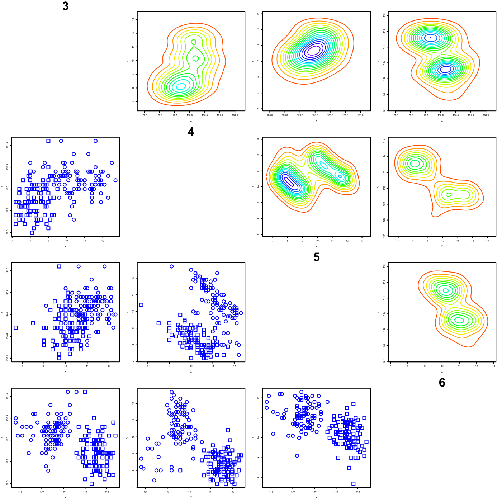

[](http://quantlet.de/)

## [](http://quantlet.de/) **MVAdraftbank4** [](http://quantlet.de/)

```yaml

Name of QuantLet: MVAdraftbank4

Published in: Applied Multivariate Statistical Analysis

Description: Computes a Draftman Plot for columns 3, 4, 5 and 6 of the Swiss bank notes data.

Keywords: contour, data visualization, density, empirical, graphical representation, plot, scatterplot

See also: MVAdrafthousing, MVAdrafthousingt

Author: Julia Wandke

Author[Python]: 'Matthias Fengler, Liudmila Gorkun-Voevoda'

Submitted: Tue, September 09 2014 by Awdesch Melzer

Submitted[Python]: 'Wed, April 22 2020 by Liudmila Gorkun-Voevoda'

Datafiles: bank2.dat

```




### R Code
```r


# clear variables and close windows
rm(list = ls(all = TRUE))
graphics.off()

# install and load packages
libraries = c("KernSmooth")
lapply(libraries, function(x) if (!(x %in% installed.packages())) {
install.packages(x)
})
lapply(libraries, library, quietly = TRUE, character.only = TRUE)

# load data
data = read.table("bank2.dat")
x = data

i = 2
op = par(mfrow = c(4, 4), cex = 0.2)
while (i < 6) {
    i = i + 1
    j = 2
    while (j < 6) {
        j = j + 1
        if (i == j) {
            plot(i, type = "n", axes = FALSE, xlab = "", ylab = "", main = i, cex.main = 5)
        }
        if (i < j) {
            xx = cbind(x[, i], x[, j], c(rep(0, 100), rep(1, 100)))
            zz = bkde2D(xx[, -3], 0.4)
            contour(zz$x1, zz$x2, zz$fhat, nlevels = 12, col = rainbow(20), drawlabels = FALSE, 
                xlab = "X", ylab = "Y")
        }
        if (i > j) {
            yy = cbind(x[, i], x[, j], c(rep(0, 100), rep(1, 100)))
            plot(yy[, -3], pch = as.numeric(yy[, 3]), xlab = "X", ylab = "Y", cex = 3, 
                col = "blue")
        }
    }
}
par(op)
```

automatically created on 2020-04-22

### PYTHON Code
```python

import pandas as pd
import numpy as np
import matplotlib.pyplot as plt
import scipy.stats as st

x = pd.read_csv("bank2.dat", sep = "\s+", header=None)


fig, axes = plt.subplots(4, 4, figsize = (15,15))

for i in range(0, 4):
    for j in range(0, 4):
        if i == j:
            axes[i,j].xaxis.set_visible(False)
            axes[i,j].yaxis.set_visible(False)
            plt.setp(axes[i,j].spines.values(), visible=False)
            axes[i, j].set_title(str(i+3), fontdict = {"fontsize": 16})
        if i < j:
            y_min, y_max, x_min, x_max = [min(x.iloc[:,j+2])-1, max(x.iloc[:,j+2])+1, 
                                          min(x.iloc[:,i+2])-1, max(x.iloc[:,i+2])+1]
            X, Y = np.mgrid[x_min:x_max:100j, y_min:y_max:100j]
            positions = np.array([X.ravel(), Y.ravel()])
            
            kernel = st.gaussian_kde(np.array([x.iloc[:,i+2], x.iloc[:,j+2]]), bw_method=0.4)
            Z = np.reshape(kernel(positions).T, X.shape)
            axes[i, j].contour(X, Y, Z, cmap="jet", levels = 15)
        if i > j:
            axes[i,j].scatter(x.iloc[:,i+2], x.iloc[:,j+2], c = "blue")

fig.tight_layout()
plt.show()


```

automatically created on 2020-04-22