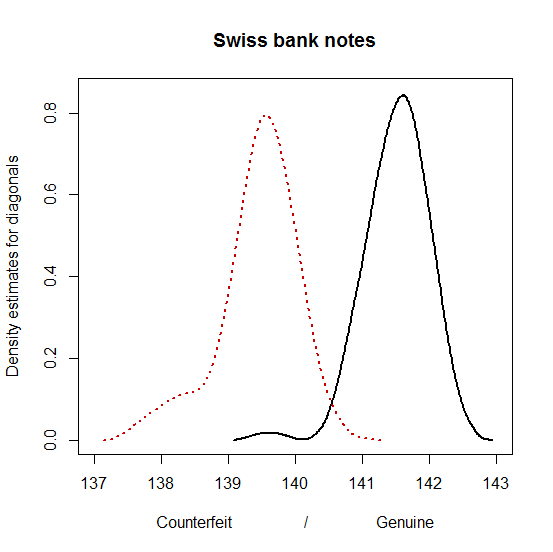
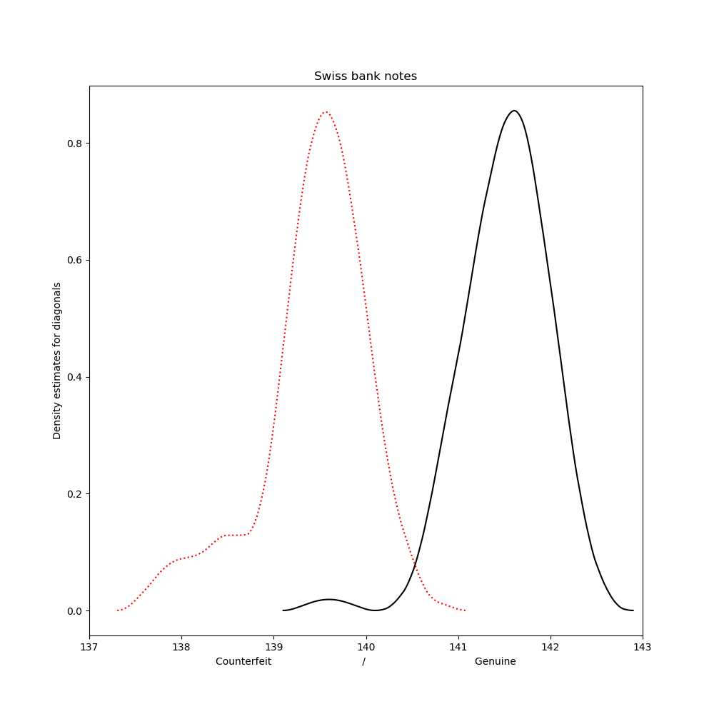
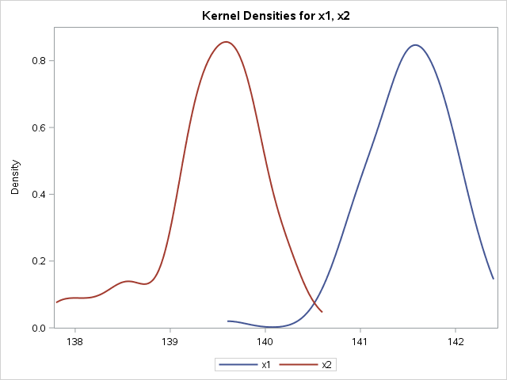

[](http://quantlet.de/)

## [](http://quantlet.de/) **MVAdenbank** [](http://quantlet.de/)

```yaml


Name of QuantLet: MVAdenbank

Published in: Applied Multivariate Statistical Analysis

Description: 'Computes kernel density estimates of the diagonal of the genuine and forged swiss bank notes. The bandwidth parameter are chosen by Silverman rule of thumb.'

Keywords: Epanechnikov, Silverman, data visualization, plot, graphical representation, financial, density, descriptive, descriptive-statistics, empirical, smoothing, gaussian, kde, kernel, visualization, sas

See also: MVAboxbank6, MVAcontbank3, MVAdenbank2, MVAdenbank3, MVAscabank456, SPMdenepatri, SPMkdeconstruct, SPMkernel

Author: Vladimir Georgescu, Jorge Patron, Song Song
Author[SAS]: Svetlana Bykovskaya
Author[Python]: 'Matthias Fengler, Liudmila Gorkun-Voevoda'

Submitted: Tue, September 09 2014 by Awdesch Melzer
Submitted[SAS]: Wen, April 6 2016 by Svetlana Bykovskaya
Submitted[Python]: 'Wed, April 22 2020 by Liudmila Gorkun-Voevoda'

Datafiles: bank2.dat

```







### R Code
```r


# clear variables and close windows
rm(list = ls(all = TRUE))
graphics.off()

# install and load packages
libraries = c("KernSmooth")
lapply(libraries, function(x) if (!(x %in% installed.packages())) {
install.packages(x)
})
lapply(libraries, library, quietly = TRUE, character.only = TRUE)

# load data
x  = read.table("bank2.dat")
x1 = x[1:100, 6]
x2 = x[101:200, 6]

# Compute kernel density estimate
fh1 = bkde(x1, kernel = "biweight")  
fh2 = bkde(x2, kernel = "biweight")  

# plot
plot(fh1, type = "l", lwd = 2, xlab = "Counterfeit                  /                 Genuine", 
    ylab = "Density estimates for diagonals", col = "black", main = "Swiss bank notes", 
    xlim = c(137, 143), ylim = c(0, 0.85)) 
lines(fh2, lty = "dotted", lwd = 2, col = "red3")

```

automatically created on 2020-04-22

### PYTHON Code
```python

import pandas as pd
import numpy as np
import matplotlib.pyplot as plt
import statsmodels.api as sm
from KDEpy import FFTKDE

# load data
x = pd.read_csv("bank2.dat", sep = "\s+", header=None)
x1 = x.iloc[0:100, 5]
x2 = x.iloc[100:200, 5]

# Compute kernel density estimate
fh1_x, fh1_y = FFTKDE(bw="silverman", kernel='biweight').fit(np.array(x1)).evaluate()
fh2_x, fh2_y = FFTKDE(bw="silverman", kernel='biweight').fit(np.array(x2)).evaluate()

fig, ax = plt.subplots(figsize=(10,10))
ax.plot(fh1_x, fh1_y, c="black")
ax.plot(fh2_x, fh2_y, c="red", ls=":")
plt.xlim(137, 143)
plt.xlabel("Counterfeit                             /                                   Genuine")
plt.ylabel("Density estimates for diagonals")
plt.title("Swiss bank notes")

plt.show()


```

automatically created on 2020-04-22

### SAS Code
```sas


* Import the data;
data bank2;
  infile '/folders/myfolders/Sas-work/data/bank2.dat';
  input t1-t6;
  drop t1-t5;
run;

proc iml;
  * Read data into a matrix;
  use bank2;
    read all var _ALL_ into x; 
  close bank2;
  
  x1 = x[1:100];
  x2 = x[101:200];
  
  create plot var {"x1" "x2"};
    append;
  close plot;
quit;

ods graphics on;

proc kde data = plot;
  title 'Swiss bank notes';
  univar x1 x2/ plots = (densityoverlay) noprint;
run;

ods graphics off;

```

automatically created on 2020-04-22