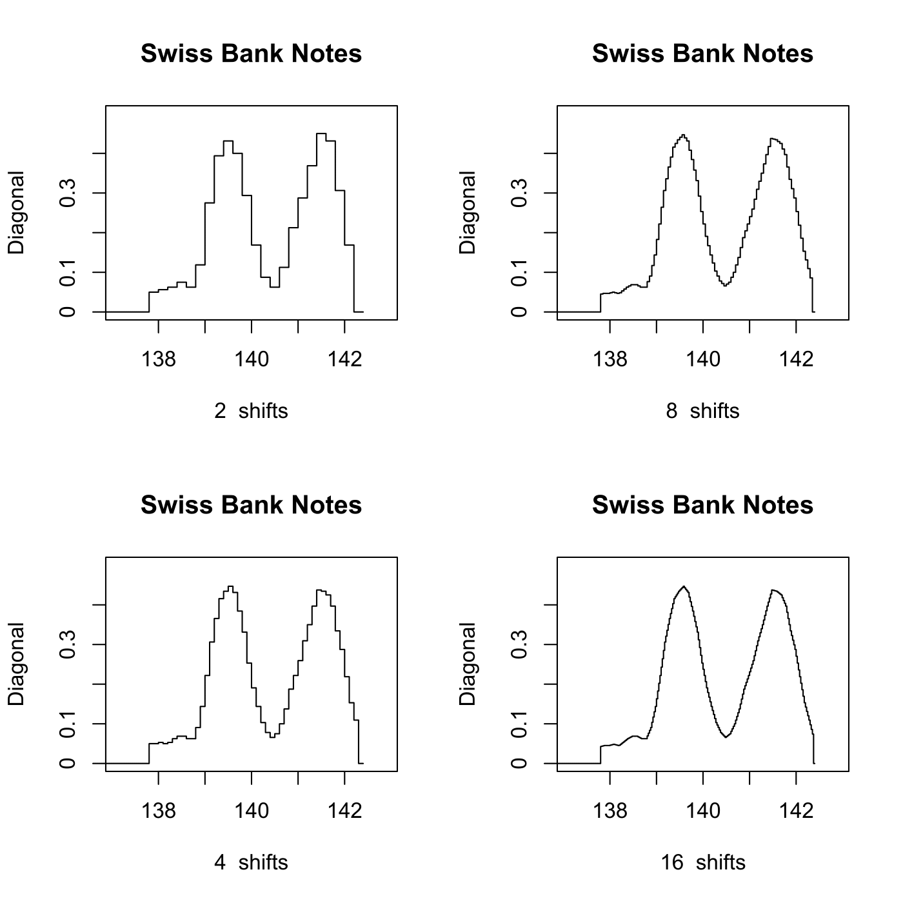

[](http://quantlet.de/)

## [](http://quantlet.de/) **MVAashbank** [](http://quantlet.de/)

```yaml

Name of QuantLet : MVAashbank

Published in : Applied Multivariate Statistical Analysis

Description : Computes the averaged shifted histogram for the diagonal of all Swiss bank notes.

Keywords : data visualization, graphical representation, plot, histogram, financial

See also : MVAandcur, MVAandcur2, MVAhisbank1, MVAhisbank2

Author : Till Grossmass, Jorge Patron, Vladimir Georgescu, Song Song

Submitted : Mon, September 15 2014 by Awdesch Melzer

Datafiles : bank2.dat

```




### R Code:
```r

# clear variables and close windows
rm(list = ls(all = TRUE))
graphics.off()

# load data
x = read.table("bank2.dat")
x = x[, 6]  # Only consider the diagonal

n = length(x)  # Number of observations.
step = c(2, 8, 4, 16)  # Define the number of shifts.

t0 = NULL
tf = NULL

for (l in 1:4) {
    h = 0.4
    t0 = h * (floor(min(x)/h) + 0.5)  # Min
    tf = h * (floor(max(x)/h) - 0.5)  # Max
    
    m = step[l]
    delta = h/m
    
    nbin = floor((max(x) - min(x))/delta)
    binedge = seq(min(x), max(x), delta)  # Define the bins of the histogram
    
    # ex=x[x<=142.2] vk = plot(apply(x,1,sort),type='l')
    
    vk = hist(x, binedge, plot = FALSE)$counts  # Count the number of elements in each bin
    fhat = c(rep(0, m - 1), vk, rep(0, m - 1))
    
    kern = function(s) 1 - abs(s)
    ind = (1 - m):(m - 1)
    den = sum(kern(ind/m))
    wm = m * (kern(ind/m))/den
    
    fhatk = matrix(0, 0, n + 1)
    
    for (k in 1:nbin) {
        ind = k:(2 * m + k - 2)
        fhatk[k] = sum(wm * fhat[ind])
    }
    
    fhatk = fhatk/(n * h)
    binedge = c(rep(0, 1), binedge)
    fhatk = c(rep(0, 1), fhatk, rep(0, 2))
    
    # Plot the different histograms
    split.screen(c(2, 2))
    screen(l)
    plot(binedge, fhatk, type = "s", ylim = c(0, 0.5), xlim = c(137.1, 142.9), 
        main = "Swiss Bank Notes", xlab = paste(step[l], " shifts"), ylab = "Diagonal", 
        axes = FALSE, frame = TRUE)
    axis(side = 1, at = seq(138, 142), labels = seq(138, 142))
    axis(side = 2, at = seq(0, 0.4, 0.1), labels = seq(0, 0.4, 0.1))
}

```
