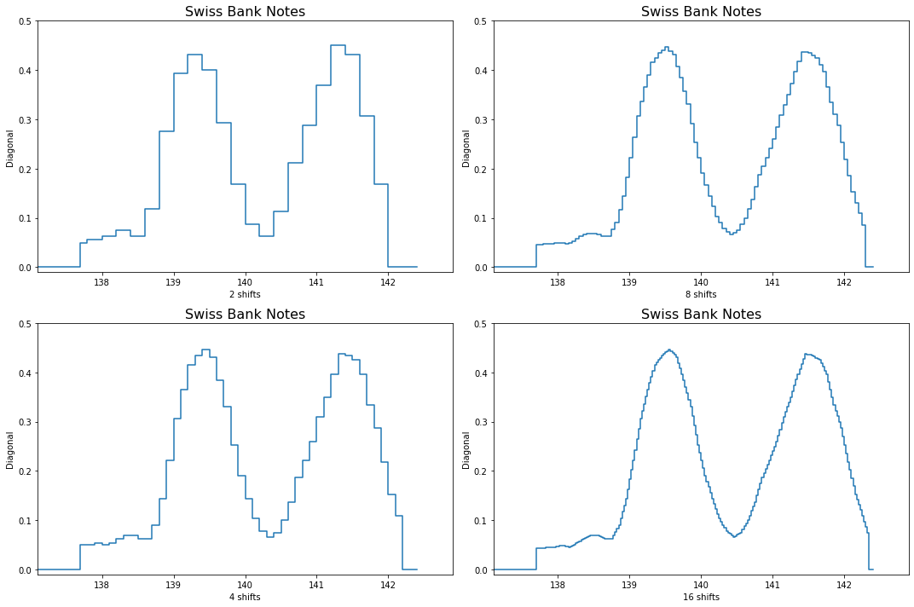

[](http://quantlet.de/)

## [](http://quantlet.de/) **MVAashbank** [](http://quantlet.de/)

```yaml

Name of QuantLet: MVAashbank

Published in: Applied Multivariate Statistical Analysis

Description: Computes the averaged shifted histogram for the diagonal of all Swiss bank notes.

Keywords: data visualization, graphical representation, plot, histogram, financial

See also: MVAandcur, MVAandcur2, MVAhisbank1, MVAhisbank2

Author: Till Grossmass, Jorge Patron, Vladimir Georgescu, Song Song

Author[Python]: 'Matthias Fengler, Liudmila Gorkun-Voevoda'

Submitted: Mon, September 15 2014 by Awdesch Melzer

Submitted[Python]: 'Fri, April 16 2021 by Liudmila Gorkun-Voevoda'

Datafiles: bank2.dat

```




### R Code
```r


# clear variables and close windows
rm(list = ls(all = TRUE))
graphics.off()

# load data
x = read.table("bank2.dat")
x = x[, 6]  # Only consider the diagonal

n = length(x)  # Number of observations.
step = c(2, 8, 4, 16)  # Define the number of shifts.

t0 = NULL
tf = NULL

for (l in 1:4) {
    h = 0.4
    t0 = h * (floor(min(x)/h) + 0.5)  # Min
    tf = h * (floor(max(x)/h) - 0.5)  # Max
    
    m = step[l]
    delta = h/m
    
    nbin = floor((max(x) - min(x))/delta)
    binedge = seq(min(x), max(x), delta)  # Define the bins of the histogram
    
    # ex=x[x<=142.2] vk = plot(apply(x,1,sort),type='l')
    
    vk = hist(x, binedge, plot = FALSE)$counts  # Count the number of elements in each bin
    fhat = c(rep(0, m - 1), vk, rep(0, m - 1))
    
    kern = function(s) 1 - abs(s)
    ind = (1 - m):(m - 1)
    den = sum(kern(ind/m))
    wm = m * (kern(ind/m))/den
    
    fhatk = matrix(0, 0, n + 1)
    
    for (k in 1:nbin) {
        ind = k:(2 * m + k - 2)
        fhatk[k] = sum(wm * fhat[ind])
    }
    
    fhatk = fhatk/(n * h)
    binedge = c(rep(0, 1), binedge)
    fhatk = c(rep(0, 1), fhatk, rep(0, 2))
    
    # Plot the different histograms
    split.screen(c(2, 2))
    screen(l)
    plot(binedge, fhatk, type = "s", ylim = c(0, 0.5), xlim = c(137.1, 142.9), 
        main = "Swiss Bank Notes", xlab = paste(step[l], " shifts"), ylab = "Diagonal", 
        axes = FALSE, frame = TRUE)
    axis(side = 1, at = seq(138, 142), labels = seq(138, 142))
    axis(side = 2, at = seq(0, 0.4, 0.1), labels = seq(0, 0.4, 0.1))
}

```

automatically created on 2021-12-15

### PYTHON Code
```python

import pandas as pd
import numpy as np
import matplotlib.pyplot as plt

x = pd.read_csv("bank2.dat", sep = "\s+", header=None)
x = x.iloc[:, 5]

n = len(x)
step = [2, 8, 4, 16]

h = 0.4
t0 = h * (np.floor(min(x)/h) + 0.5)  # Min
tf = h * (np.floor(max(x)/h) - 0.5)  # Max

fig, axes = plt.subplots(2,2, figsize = (15, 10))
for l in range(4):
    m = step[l]
    delta = h/m
    
    nbin = np.floor((max(x) - min(x))/delta)
    if l == 0 or l == 2: 
        binedge = [np.round(c, 1) for c in np.arange(min(x), max(x)+(delta*0.9), delta)]
    else:
        binedge = [c for c in np.arange(min(x), max(x)+(delta*0.9), delta)]
    binedge = [min(x)-0.01 if c == min(x) else c for c in binedge]
    
    vk = [0]*(len(binedge) - 1)
    for i in range(len(binedge) - 1):
        for point in x:
            if (point > binedge[i]) and (point <= binedge[i+1]):
                vk[i] += 1
                
    fhat = [0]*(m-1) + list(vk) + [0]*(m-1)
    
    ind = range(1 - m, m)
    den = sum([(1 - np.abs(c/m)) for c in ind])
    wm = [(m *(1 - np.abs(c/m))/den) for c in ind]
    
    fhatk = [0] * int(nbin)
    
    for k in range(int(nbin)):
        ind = range(k, (2 * m + k - 1))
        fhatk[k] = sum([(wm[a] * fhat[c]) for a, c in zip(range(len(wm)), ind)])
            
    fhatk = [c/(n * h) for c in fhatk]
    binedge = np.insert(binedge, 0, 0)
    binedge = np.insert(binedge, 1, 137.7)
    binedge = [137.8 if x==137.79 else x for x in binedge]
        
    fhatk = [0]*2 + fhatk + [0]*2
    
    axes.reshape(-1)[l].step(binedge, fhatk)
    axes.reshape(-1)[l].set_ylim(-0.01, 0.5)
    axes.reshape(-1)[l].set_xlim(137.1, 142.9)
    axes.reshape(-1)[l].set_xlabel("{} shifts".format(m))
    axes.reshape(-1)[l].set_ylabel("Diagonal")
    axes.reshape(-1)[l].set_title("Swiss Bank Notes", fontsize = 16)
    
fig.tight_layout()   
plt.show()
```

automatically created on 2021-12-15