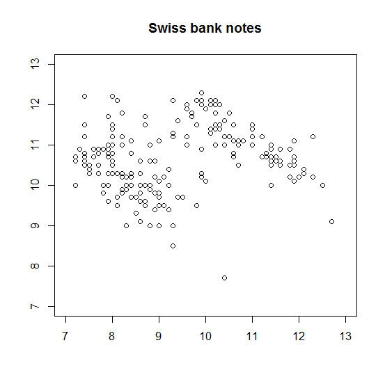
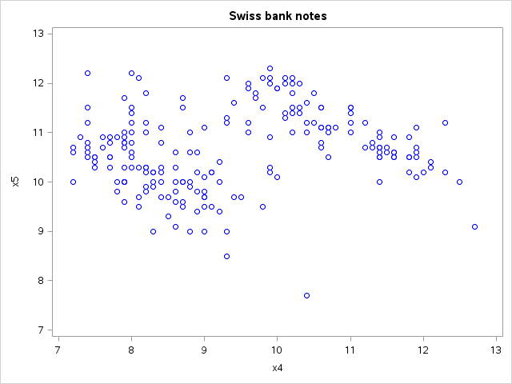

[](http://quantlet.de/)

## [](http://quantlet.de/) **MVAscabank45** [](http://quantlet.de/)

```yaml

Name of QuantLet : MVAscabank45

Published in : Applied Multivariate Statistical Analysis

Description : 'Computes a two dimensional scatterplot of X4 vs. X5 (upper inner frame vs. lower) of
the Swiss bank notes data.'

Keywords : data visualization, graphical representation, scatterplot, financial, plot, sas

See also : 'MVAcorrnorm, MVAregbank, MVAregpull, MVAscabank56, MVAscabank456, MVAscacar,
MVAscapull1, MVAscapull2, MVAdraftbank4, MVAdrafthousing, MVAdrafthousingt'

Author : Vladimir Georgescu, Jorge Patron, Song Song

Author[SAS] : Svetlana Bykovskaya

Submitted : Mon, September 15 2014 by Awdesch Melzer

Submitted[SAS] : Wen, April 6 2016 by Svetlana Bykovskaya

Datafile : bank2.dat

```






### R Code:
```r

# clear all variables
rm(list = ls(all = TRUE))
graphics.off()

# load data
x = read.table("bank2.dat")

# plot
plot(x[, 4], x[, 5], ylab = "", xlab = "", ylim = c(7, 13), xlim = c(7, 13))
title("Swiss bank notes")

```

### SAS Code:
```sas

* Import the data;
data bank2;
  infile '/folders/myfolders/Sas-work/data/bank2.dat';
  input x1-x6;
run;

proc sgplot data = bank2
    noautolegend;
  title 'Swiss bank notes';
  scatter x = x4 y = x5 / markerattrs = (color = blue);
  xaxis min = 7 max = 13;
  yaxis min = 7 max = 13;
run;
```
