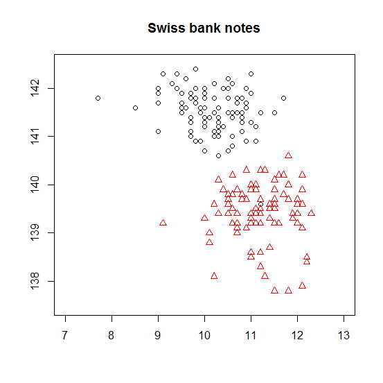
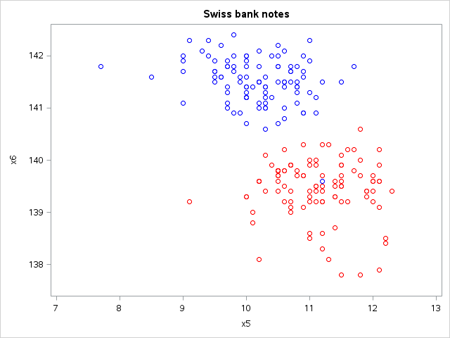

[](http://quantlet.de/)

## [](http://quantlet.de/) **MVAscabank56** [](http://quantlet.de/)

```yaml

Name of QuantLet : MVAscabank56

Published in : Applied Multivariate Statistical Analysis

Description : 'Computes a two dimensional scatterplot of X5 vs. X6 (upper inner frame vs. diagonal)
of the Swiss bank notes.'

Keywords : data visualization, graphical representation, scatterplot, plot, financial, sas

See also : 'MVAcorrnorm, MVAregbank, MVAregpull, MVAscabank45, MVAscabank456, MVAscacar,
MVAscapull1, MVAscapull2, MVAdraftbank4, MVAdrafthousing, MVAdrafthousingt'

Author : Vladimir Georgescu, Jorge Patron, Song Song

Author[SAS] : Svetlana Bykovskaya

Submitted : Tue, September 09 2014 by Awdesch Melzer

Submitted[SAS] : Wen, April 6 2016 by Svetlana Bykovskaya

Datafile : bank2.dat

```






### R Code:
```r

# clear all variables
rm(list = ls(all = TRUE))
graphics.off()

# load data
x   = read.table("bank2.dat")
x56 = x[, 5:6]
x1  = rep(1, 100)
x2  = rep(2, 100)
xx  = cbind(x56, c(x1, x2))

# plot
plot(xx[, 1], xx[, 2], pch = c(xx[, 3]), col = c(xx[, 3]), frame = TRUE, axes = FALSE, 
    ylab = "", xlab = "", ylim = c(137.5, 142.5), xlim = c(7, 13))
axis(side = 1, at = seq(7, 13, 1), labels = seq(7, 13, 1))
axis(side = 2, at = seq(138, 142, 1), labels = seq(138, 142, 1))
title("Swiss bank notes")

```

### SAS Code:
```sas

* Import the data;
data bank2;
  id + 1;
  infile '/folders/myfolders/Sas-work/data/bank2.dat';
  input x1-x6;
run;

data b2;
  set bank2;
   if id <= 100 then group = 1;
   else group = 2;
run;

proc sgplot data = b2
    noautolegend;
  title 'Swiss bank notes';
  scatter x = x5 y = x6 / colorresponse = group colormodel = (blue red);
  xaxis min = 7 max = 13;
  yaxis min = 137.5 max = 142.5;
run;
```
