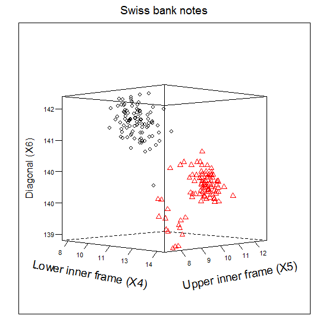
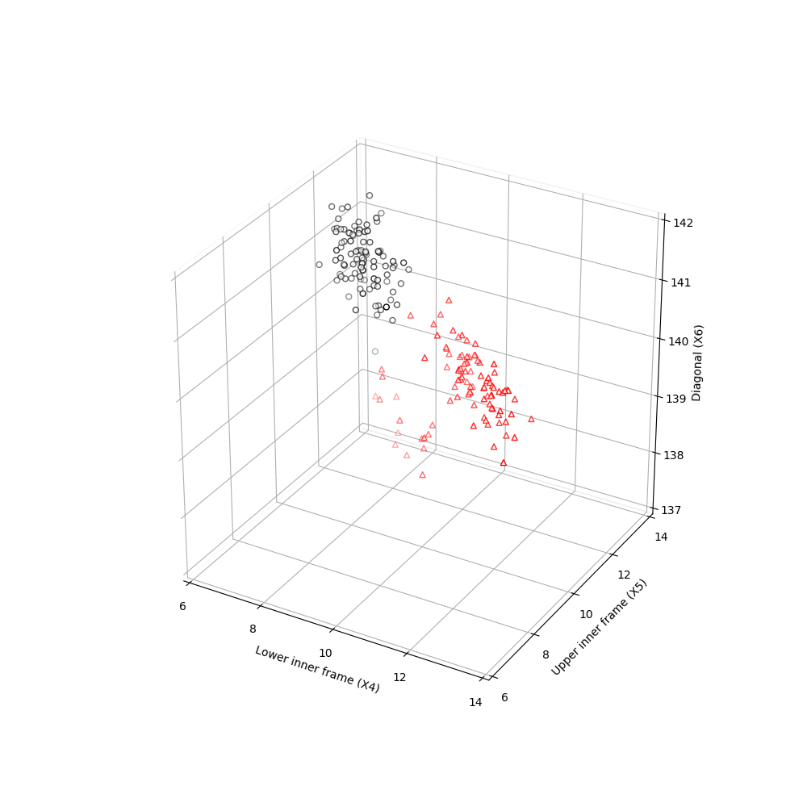

[](http://quantlet.de/)

## [](http://quantlet.de/) **MVAscabank456** [](http://quantlet.de/)

```yaml

Name of QuantLet: MVAscabank456

Published in: Applied Multivariate Statistical Analysis

Description: Computes a three dimensional scatterplot for X4 vs. X6 vs. X5 (lower inner frame vs. diagonal vs. upper inner frame) of the Swiss bank notes.

Keywords: 3D, data visualization, graphical representation, scatterplot, plot, financial

See also: MVAdenbank3, MVAdraftbank4, MVAdrafthousing, MVAdrafthousingt, MVAcorrnorm, MVAregbank, MVAregpull, MVAscabank45, MVAscabank56, MVAscacar, MVAscapull1, MVAscapull2

Author: Vladimir Georgescu, Jorge Patron, Song Song
Author[Python]: 'Matthias Fengler, Liudmila Gorkun-Voevoda'

Submitted: Tue, September 09 2014 by Awdesch Melzer
Submitted[Python]: 'Wed, April 22 2020 by Liudmila Gorkun-Voevoda'

Datafile: bank2.dat

```





### PYTHON Code
```python

#!/usr/bin/env python
# coding: utf-8

# In[1]:


import pandas as pd
import numpy as np
import matplotlib.pyplot as plt
from mpl_toolkits.mplot3d import Axes3D

x = pd.read_csv("bank2.dat", sep = "\s+", header=None)
x456 = x.iloc[:,3:]
x1 = [1] * 100
x2  = [2] * 100
x1.extend(x2)
xx = x1


# In[2]:


fig = plt.figure(figsize=(10, 10))
ax = fig.add_subplot(111, projection='3d')
ax.scatter(x456.iloc[:100, 0], x456.iloc[:100, 1], x456.iloc[:100, 2], c = "w", edgecolors = "black", s = 25)
ax.scatter(x456.iloc[100:, 0], x456.iloc[100:, 1], x456.iloc[100:, 2], c = "w", edgecolors = "r", marker = "^", s = 25)
ax.set_xlim(6, 14)
ax.set_ylim(6, 14)
ax.set_zlim(137, 142)

ax.set_xticks(list(range(6, 15, 2)))
ax.set_yticks(list(range(6, 15, 2)))

ax.set_xlabel("Lower inner frame (X4)")
ax.set_ylabel("Upper inner frame (X5)")
ax.set_zlabel("Diagonal (X6)")

ax.xaxis.pane.fill = False
ax.yaxis.pane.fill = False
ax.zaxis.pane.fill = False

plt.show()


```

automatically created on 2020-04-22

### R Code
```r


# clear all variables
rm(list = ls(all = TRUE))
graphics.off()

libraries = c("lattice")
lapply(libraries, function(x) if (!(x %in% installed.packages())) {
    install.packages(x)
})
lapply(libraries, library, quietly = TRUE, character.only = TRUE)

# load data
x    = read.table("bank2.dat")
x456 = x[, 4:6]
x1   = rep(1, 100)
x2   = rep(2, 100)
xx   = c(x1, x2)

# plot
cloud(x456[, 3] ~ x456[, 2] * x456[, 1], pch = c(xx), col = c(xx), ticktype = "detailed", 
    main = expression(paste("Swiss bank notes")), screen = list(z = -90, x = -90, 
        y = 45), scales = list(arrows = FALSE, col = "black", distance = 1, tick.number = c(4, 
        4, 5), cex = 0.7, z = list(labels = round(seq(138, 142, length = 6))), x = list(labels = round(seq(7, 
        14, length = 6))), y = list(labels = round(seq(7, 12, length = 6)))), xlab = list(expression(paste("Lower inner frame (X4)")), 
        rot = -10, cex = 1.2), ylab = list("Upper inner frame (X5)", rot = 10, cex = 1.2), 
    zlab = list("Diagonal (X6)", rot = 90, cex = 1.1))

```

automatically created on 2020-04-22