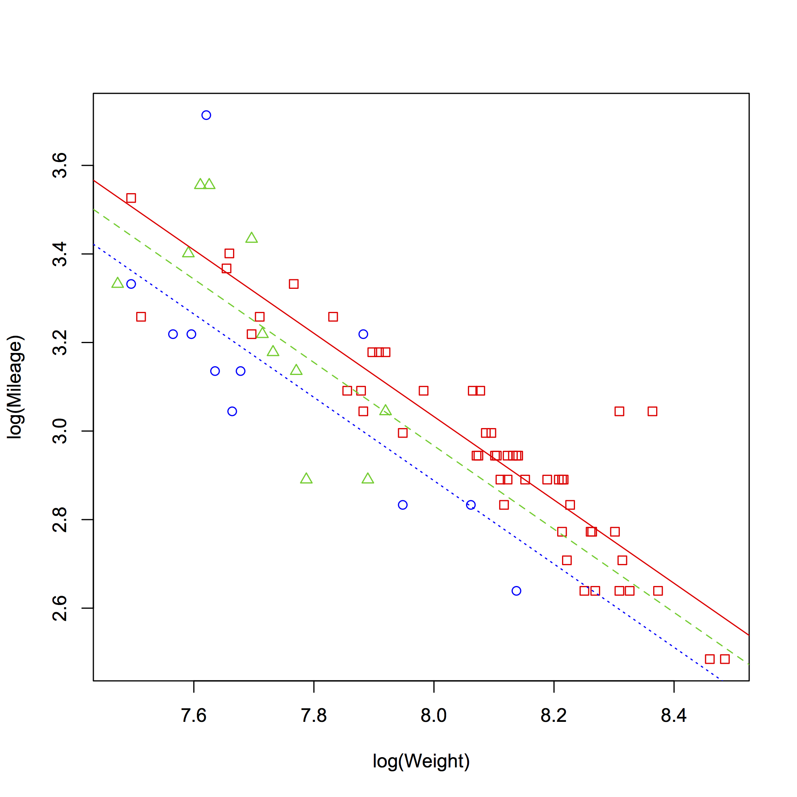
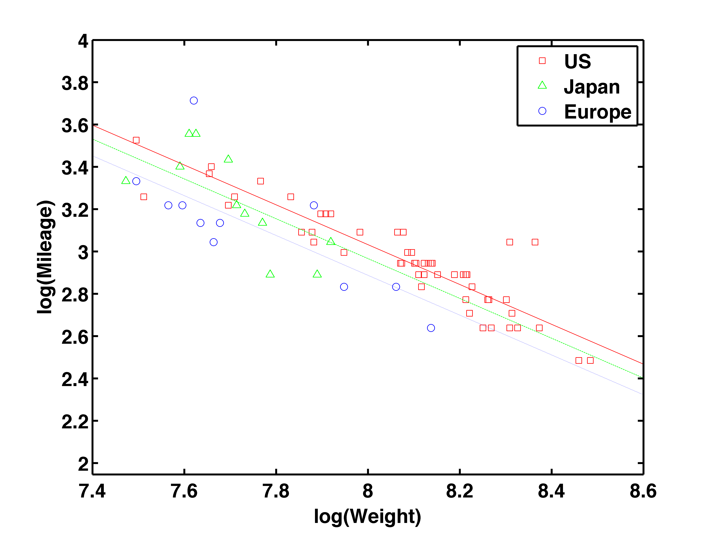
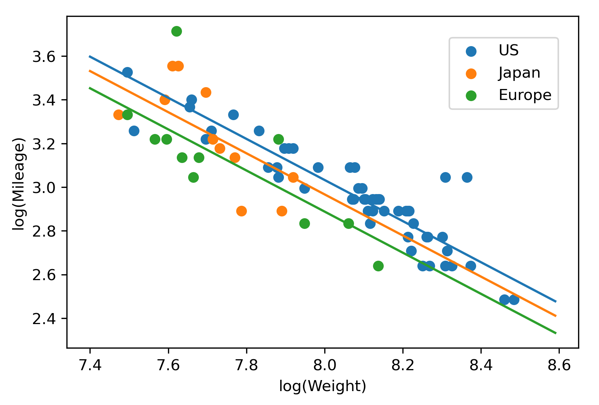

[](http://quantlet.de/)

## [](http://quantlet.de/) **MVAcareffect** [](http://quantlet.de/)

```yaml

Name of QuantLet: MVAcareffect

Published in: Applied Multivariate Statistical Analysis

Description: 'Computes a linear regression of mileage on weight and displacement for car data set'

Keywords: 'linear model, linear regression, least squares, R-squared, summary, F test, F-statistic, F-test, lm'

Author:   Zdenek Hlavka
Author[Matlab]:   Janek Berger
Author[Python]: Matthias Fengler, Tim Dass

Submitted: Wed, June 07 2017 by Petra Burdejova
Submitted[Python]: Tue, April 16 2024 by Tim Dass

Datafile[R]: carc.rda
Datafile[Matlab]: carc.txt

```







### MATLAB Code
```matlab

% Clear workspace
clear all
close all
clc

% Add path where your files are located
% addpath C:\Users\
% addpath /Users/

% Load data set
load carc.txt;
cardata = carc;
% ----------------------------------------------------------------------
% Define variables

mileage = cardata(:,2);
weight = cardata(:,8);
displacement = cardata(:,11);
origin = cardata(:,13);
price = cardata(:,1);

% ----------------------------------------------------------------------
% Descriptive plots I

figure(1)
s1 = subplot(2, 2, 1)
scatter(log(weight), log(mileage), 'k')
box on
xlabel('log(Weight)')
ylabel('log(Mileage)')

s2 = subplot(2, 2, 2)
scatter(log(displacement), log(mileage), 'k')
box on
xlabel('log(Displacement)')
ylabel('log(Mileage)')

s3 = subplot(2, 2, 3)
boxplot(log(mileage), origin, 'labels', {'US';'Japan';'Europe'})
box on
xlabel('Origin')
ylabel('log(Mileage)')

s4 = subplot(2, 2, 4)
scatter(log(weight), log(displacement), 'k')
box on
xlabel('log(Weight)')
ylabel('log(Displacement)')


% print -painters -dpdf -r600 SMSlinregcar01.pdf
% print -painters -dpng -r600 SMSlinregcar01.png
% ----------------------------------------------------------------------
% Plot of regression lines with group-specific means

[h, a, c, s] = aoctool(log(weight), log(mileage), origin, 0.05, '', '', '', 'off', 'parallel lines')
slope = cell2mat(c(6, 2));


figure(2)
plot(log(weight(find(origin==1))),log(mileage(find(origin==1))),'sr')
hold on
plot(log(weight(find(origin==2))),log(mileage(find(origin==2))),'^g')
plot(log(weight(find(origin==3))),log(mileage(find(origin==3))),'ob')
box on
us_line = refline(slope, s.intercepts(1));
ja_line = refline(slope, s.intercepts(2));
eu_line = refline(slope, s.intercepts(3));

set(us_line,'LineStyle','-', 'Color','r')
set(ja_line,'LineStyle','--','Color','g')
set(eu_line,'LineStyle',':','Color','b')
legend('US','Japan','Europe')
xlabel('log(Weight)','FontSize',16,'FontWeight','Bold')
ylabel('log(Mileage)','FontSize',16,'FontWeight','Bold')
set(gca,'LineWidth',1.6,'FontSize',16,'FontWeight','Bold')
xlim([7.4 8.6])
hold off
% print -painters -dpdf -r600 SMSlinregcar02.pdf
% print -painters -dpng -r600 SMSlinregcar02.png

```

automatically created on 2024-04-25

### PYTHON Code
```python

#works on pandas 2.0.3, numpy 1.25.0, matplotlib 3.7.2 and statsmodels 0.14.0
import pandas as pd
import numpy as np
import matplotlib.pyplot as plt
import statsmodels.api as sm
from statsmodels.formula.api import ols

carc = pd.read_table("carc.dat", header = None, sep = "\s+")
carc = carc.iloc[:,[2,8,11,13,1]]
carc.columns = ["Mileage", "Weight", "Displacement", "Origin", "Price"]

lm1 = ols(formula="np.log(Mileage) ~ np.log(Weight) + np.log(Displacement) + C(Origin)", data=carc).fit()
lm2 = ols(formula="np.log(Mileage) ~ np.log(Weight) + np.log(Displacement)", data=carc).fit()
anova_results = sm.stats.anova_lm(lm2, lm1)
print(anova_results)


fig, axs = plt.subplots(2,2, figsize=(9,7))
axs[0,0].scatter(np.log(carc["Weight"]),np.log(carc["Mileage"]))
axs[0,0].set_xlabel("log(Weight)")
axs[0,0].set_ylabel("log(Mileage)")
axs[0,1].scatter(np.log(carc["Displacement"]),np.log(carc["Mileage"]))
axs[0,1].set_xlabel("log(Displacement)")
axs[0,1].set_ylabel("log(Mileage)")
axs[1,0].boxplot([np.log(carc.loc[carc["Origin"] == 1, "Mileage"]), 
                  np.log(carc.loc[carc["Origin"] == 2, "Mileage"]),
                  np.log(carc.loc[carc["Origin"] == 3, "Mileage"])], labels = ["US", "Japan", "Europe"])
axs[1,1].scatter(np.log(carc["Weight"]),np.log(carc["Displacement"]))
axs[1,1].set_xlabel("log(Weight)")
axs[1,1].set_ylabel("log(Displacement)")
plt.show()


lm3 = ols(formula="np.log(Mileage) ~ np.log(Weight) + C(Origin)", data=carc).fit()
fig, ax = plt.subplots()
c3 = lm3.params
x = np.arange(7.4,8.6,0.01)

ax.scatter(np.log(carc.loc[carc["Origin"]==1, "Weight"]), np.log(carc.loc[carc["Origin"]==1, "Mileage"]), label = "US")
ax.scatter(np.log(carc.loc[carc["Origin"]==2, "Weight"]), np.log(carc.loc[carc["Origin"]==2, "Mileage"]), label = "Japan")
ax.scatter(np.log(carc.loc[carc["Origin"]==3, "Weight"]), np.log(carc.loc[carc["Origin"]==3, "Mileage"]), label = "Europe")
ax.plot(x, c3[0]+x*c3[3])
ax.plot(x, c3[0]+c3[1]+x*c3[3])
ax.plot(x, c3[0]+c3[2]+x*c3[3])
ax.set_xlabel("log(Weight)")
ax.set_ylabel("log(Mileage)")
fig.legend(loc=(0.75,0.73))
plt.show()
```

automatically created on 2024-04-25

### R Code
```r


# clear variables and close windows
rm(list=ls(all=TRUE))
graphics.off()

# load data
load("carc.rda")

carc=carc[,c("M","W","D","C","P")]
names(carc)=c("Mileage","Weight","Displacement","Origin","Price")

attach(carc)
opar=par(mfrow=c(2,2))
plot(log(Mileage)~log(Weight))
plot(log(Mileage)~log(Displacement))
plot(log(Mileage)~Origin)
plot(log(Displacement)~log(Weight))

# reasonable model
summary(lm1<-lm(log(Mileage)~log(Weight)+log(Displacement)+Origin))
# model without origin
lm2<-lm(log(Mileage)~log(Weight)+log(Displacement))
# test whether origin is significant
anova(lm1,lm2)

dev.new()
plot(lm1)

summary(lm3<-lm(log(Mileage)~log(Weight)+Origin))

dev.new()
par(mfrow=c(1,1))
plot(log(Mileage)~log(Weight),pch=as.numeric(Origin)-(Origin=="US")-2*(Origin=="Europe"),col=as.numeric(Origin)+1)
oo=order(carc$Weight)
c3=coef(lm3)
abline(c(c3[1],c3[2]),col=2) # US
abline(c(c3[1]+c3[3],c3[2]),col=3,lty=2) # Japan
abline(c(c3[1]+c3[4],c3[2]),col=4,lty=3) # Europe

par(opar)
detach(carc)

```

automatically created on 2024-04-25