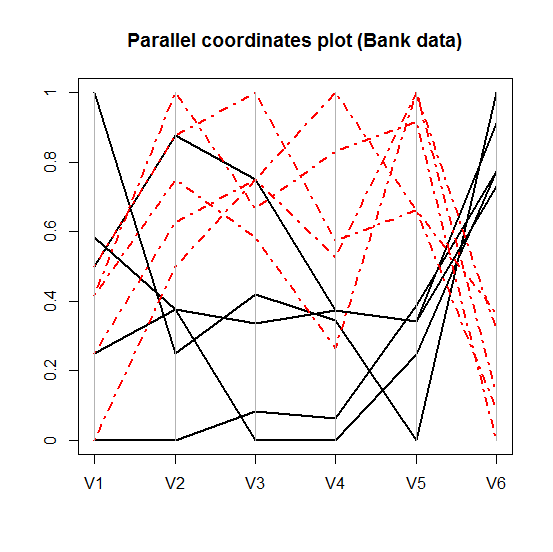

[](http://quantlet.de/)

## [](http://quantlet.de/) **MVAparcoo1** [](http://quantlet.de/)

```yaml

Name of Quantlet : MVAparcoo1

Published in : Applied Multivariate Statistical Analysis

Description : 'Computes a parallel coordinate plot for the observations 96-105 of the Swiss bank
notes data.'

Keywords : 'data visualization, graphical representation, plot, parallel-coordinates-plot, scaling,
financial'

See also : 'MVAandcur, MVAandcur2, MVAparcoo2, MVApcp1, MVApcp2, MVApcp3, MVApcp4, MVApcp5,
MVApcp7, MVApcphousing'

Author : Vladimir Georgescu, Jorge Patron, Song Song, Julia Wandke

Submitted : Tue, September 09 2014 by Awdesch Melzer

Datafile : bank2.dat

```




### R Code:
```r

# clear all variables
rm(list = ls(all = TRUE))
graphics.off()

# install and load packages
libraries = c("MASS")
lapply(libraries, function(x) if (!(x %in% installed.packages())) {
    install.packages(x)
})
lapply(libraries, library, quietly = TRUE, character.only = TRUE)

# load data
data = read.table("bank2.dat")
x    = data[96:105, ]

# plot
ir   = rbind(x[, , 1], x[, , 2], x[, , 3], x[, , 4], x[, , 4], x[, , 6])
parcoord(log(ir)[, c(1, 2, 3, 4, 5, 6)], lwd = 2, col = c(1, 1, 1, 1, 1, 2, 2, 2, 2, 2), lty = c(rep(1, 
    5), rep(4, 5)), main = "Parallel coordinates plot (Bank data)", frame = TRUE)
axis(side = 2, at = seq(0, 1, 0.2), labels = seq(0, 1, 0.2))

```
