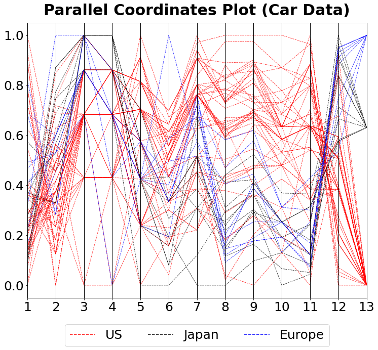

[](http://quantlet.de/)

## [](http://quantlet.de/) **MVApcp1** [](http://quantlet.de/)

```yaml

Name of QuantLet: MVApcp1

Published in: Applied Multivariate Statistical Analysis

Description: Computes parallel coordinates plot for car data.

Keywords: pcp, parallel-coordinates-plot, financial, data visualization, plot, graphical representation

See also: MVApcphousing, MVApcp2, MVApcp3, MVApcp4, MVApcp5, MVApcp6, MVApcp7, MVApcp8 

Author: Ji Cao, Song Song, Vladimir Georgescu, Awdesch Melzer
Author[Python]: Matthias Fengler, Tim Dass

Submitted: Tue, September 09 2014 by Awdesch Melzer
Submitted[Python]: Tue, April 16 2024 by Tim Dass

Datafile: carc.txt

```




### PYTHON Code
```python

#works on pandas 1.5.2, numpy 1.23.5 and matplotlib 3.7.0
import pandas as pd
import numpy as np
import matplotlib.pyplot as plt
import matplotlib.lines as mlines
from pandas.plotting import parallel_coordinates

colnames = np.arange(1,14,1)
df = pd.read_table("carc.txt", names= colnames, header=None)
df.dropna(inplace = True)
df["name"] = df[13]
df = df.astype({3:'int64'})
for i in df.columns:
    df[i] = np.log(df[i])
    df[i] = (df[i]-np.min(df[i])) / np.ptp(df[i])


fig, ax = plt.subplots(figsize = (12,10))

parallel_coordinates(df, "name", linewidth ="0.9", color = ("red","blue","black"),
                     linestyle= "dashed", alpha = 0.8)
ax.tick_params(axis='both', labelsize=25)
ax.grid(False)
plt.title(label = "Parallel Coordinates Plot(Car Data)", 
          fontsize = 30, fontweight = "bold", pad = 15)

plt.legend([mlines.Line2D([], [], color="red", label= "US", linestyle= "dashed"),
            mlines.Line2D([], [], color="black", label= "Japan", linestyle= "dashed"),
            mlines.Line2D([], [], color="blue", label= "Europe", linestyle= "dashed")],
           ["US","Japan","Europe"], loc="lower center", 
           ncol=3, bbox_to_anchor=(0.5, -0.2), fontsize=25)
plt.show()

```

automatically created on 2024-04-25

### R Code
```r


# clear all variables
rm(list = ls(all = TRUE))
graphics.off()

# install and load packages
libraries = c("MASS")
lapply(libraries, function(x) if (!(x %in% installed.packages())) {
    install.packages(x)
})
lapply(libraries, library, quietly = TRUE, character.only = TRUE)

# load data
x = read.table("carc.txt")

d = x[, 13]
s = x[, 13]
d[c(x[, 13] == 1)] = 3
d[c(x[, 13] == 2)] = 1
d[c(x[, 13] == 3)] = 2
s[c(x[, 13] == 1)] = 2
s[c(x[, 13] == 2)] = 1
s[c(x[, 13] == 3)] = 4

# Plot
ir = rbind(x[, , 1], x[, , 2], x[, , 3], x[, , 4], x[, , 5], x[, , 6], x[, , 7], 
    x[, , 8], x[, , 9], x[, , 10], x[, , 11], x[, , 12], x[, , 13])
parcoord(log(ir)[, seq(1, 13, 1)], lty = d, lwd = 1, col = s, main = "Parallel Coordinates Plot (Car Data)", 
    frame = TRUE)
axis(side = 2, at = seq(0, 1, 0.2), labels = seq(0, 1, 0.2))
legend("bottom", c("us", "japan", "europe"), col = c(2, 1, 4), lty = c(3, 1, 2), 
    horiz = TRUE, cex = 0.6) 


```

automatically created on 2024-04-25