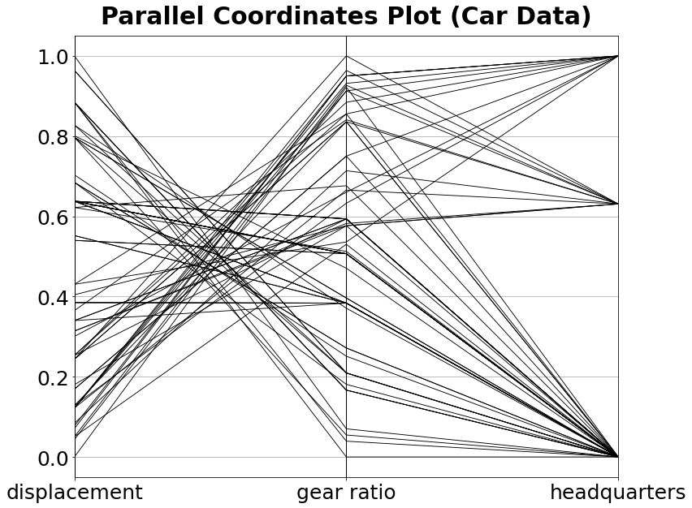

[](http://quantlet.de/)

## [](http://quantlet.de/) **MVApcp4** [](http://quantlet.de/)

```yaml

Name of QuantLet: MVApcp4

Published in: Applied Multivariate Statistical Analysis

Description: Computes parallel coordinates plot for variables displacement, gear ratio for high gear and company headquarters of the car data set.

Keywords: pcp, parallel-coordinates-plot, financial, data visualization, plot, graphical representation

See also: MVApcphousing, MVApcp1, MVApcp2, MVApcp3, MVApcp5, MVApcp6, MVApcp7, MVApcp8

Author: Ji Cao, Vladimir Georgescu, Awdesch Melzer, Song Song

Author[Python]: 'Matthias Fengler, Tim Dass'

Submitted: Tue, September 09 2014 by Awdesch Melzer

Submitted[Python]: 'Tue, April 16 2024 by Tim Dass'

Datafile: carc.txt

```




### PYTHON Code
```python

#works on pandas 1.5.2, numpy 1.23.5 and matplotlib 3.7.0
import pandas as pd
import numpy as np
import matplotlib.pyplot as plt
from pandas.plotting import parallel_coordinates

df = pd.read_table("carc.txt", header=None)
df = df.iloc[:,[10,11,12]]
for i in df.columns:
    df[i] = np.log(df[i])
    df[i] = (df[i]-np.min(df[i])) / np.ptp(df[i])

df.rename(columns={10:"displacement", 11:"gear ratio", 12:"headquarters"},
          inplace=True)
df["name"] = "Parallel Coordinates Plot(Car Data)"

fig, ax = plt.subplots(figsize = (12,10))

parallel_coordinates(df, "name", color=("black"), linewidth ="0.9")
plt.legend().set_visible(False)
ax.tick_params(axis='both', labelsize=25)
plt.title(label = "Parallel Coordinates Plot(Car Data)", 
          fontsize = 30, fontweight = "bold", pad = 15)
plt.show()


```

automatically created on 2024-04-25

### R Code
```r


# clear all variables
rm(list = ls(all = TRUE))
graphics.off()

# install and load packages
libraries = c("MASS")
lapply(libraries, function(x) if (!(x %in% installed.packages())) {
    install.packages(x)
})
lapply(libraries, library, quietly = TRUE, character.only = TRUE)

# load data
x = read.table("carc.txt")
frame = data.frame(x[, 11:13])
colnames(frame) = c("displacement", "gear ratio", "headquarters")

# Plot
parcoord(log(frame[, c(1, 2, 3)]), frame = TRUE, main = "Parallel Coordinates Plot (Car Data)")
axis(side = 2, at = seq(0, 1, 0.2), labels = seq(0, 1, 0.2)) 

```

automatically created on 2024-04-25